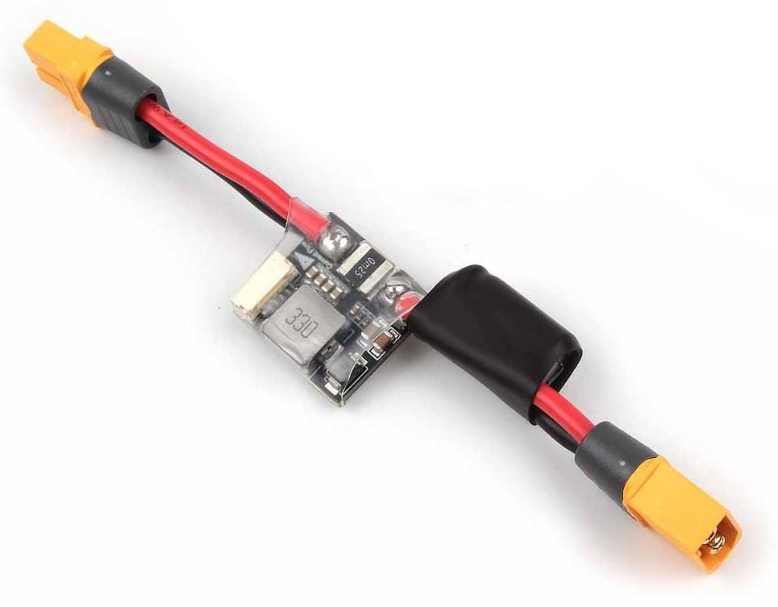

# Holybro PM02 (V3) Power Module

Цей аналоговий блок живлення забезпечує регульоване живлення для керуючого пристрою польоту та розподільчої плати живлення, а також надсилає інформацію автопілоту про напругу батареї та поточний струм, що подається на керуючий пристрій польоту та двигуни. It is commonly used with [Pixhawk 4](../assembly/quick_start_pixhawk4.md).

::: info The module can be used with other flight controllers that require an analog power module, including [Durandal](../flight_controller/durandal.md), [Pix32 v5](../flight_controller/holybro_pix32_v5.md), etc
:::

## Specifications

- **Rated current**: 60A
- **Max current**: 120A (<60 Sec)
- **Max current sensing**: 120A
- **Battery supported**: up to 12S battery
- **Communication protocol**: Analog
- **Switching regulator outputs**: 5.2V and 3A max
- **Weight**: 20g

Напруга та поточне вимірювання налаштоване для 3,3V АДС

## Вміст набору

- Power Module with XT60 Connector Board
- Electrolytic capacito: 220uF 63V (pre-installed)
- Molex 6 Position Connector 15 cm
- GH 6 Position Connector 15 cm

## Where to Buy

[Замовлення з Голібро](https://holybro.com/collections/power-modules-pdbs/products/pm02-v3-12s-power-module)

## Проведення/Підключення

Additional wiring and connection information can be found in: [Pixhawk 4 QuickStart](../assembly/quick_start_pixhawk4.md).
