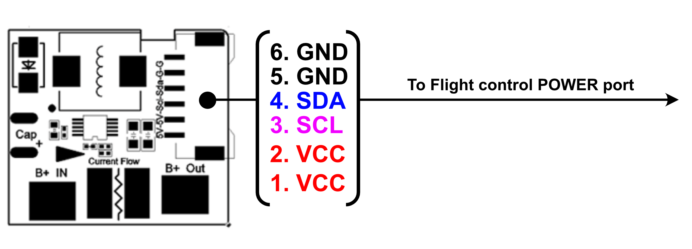

# Holybro PM02D Енергогенератор

Плата живлення Holybro PM02D забезпечує регульоване живлення для керуючого пристрою польоту та розподільної плати живлення, а також надсилає інформацію автопілоту про напругу батареї та поточний струм, що подається на керуючий пристрій польоту та двигуни.

Плата живлення підключається за допомогою протоколу I2C. Вона призначена для керуючих пристроїв польоту на основі відкритого стандарту Pixhawk FMUv5X та FMUv6X, включаючи [Pixhawk 5X](../flight_controller/pixhawk5x.md).

::: info The PM is **NOT** compatible with flight controllers that require an analog power module, including: [Pixhawk 4](../flight_controller/pixhawk4.md), [Durandal](../flight_controller/durandal.md), [Pix32 v5](../flight_controller/holybro_pix32_v5.md), etc.
:::

## Специфікації

- **Максимальна вхідна напруга**: 36V
- **Оцінений струм**: 60A
- **Макс поточний**: 120A (<60S)
- **Максимальне вимірювання поточного струму**: 164A
- **Підтримується заряд батареї**: до 6S акумулятора
- **Протокол зв'язку**: I2C
- **Вихід регулятора перемикача**: 5.2V та 3A макс
- **Вага**: 59g
- **Використано ІС**: TI INA226

## Вміст набору

- PM02D дошка з коннекторами XT60
- 6pin 2.00мм інтервал CLIK-Mate кабель до протиживлення контролера

## Де купити

[Замовляйте на Holybro](https://holybro.com/products/pm02d-power-module)

## Проведення/Підключення

Additional wiring and connection information can be found in: [Holybro Pixhawk 5x Wiring Quick Start](../assembly/quick_start_pixhawk5x.md).
