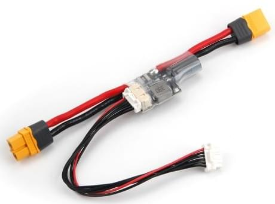

# Holybro PM02D Енергогенератор

Плата живлення Holybro PM02D забезпечує регульоване живлення для керуючого пристрою польоту та розподільної плати живлення, а також надсилає інформацію автопілоту про напругу батареї та поточний струм, що подається на керуючий пристрій польоту та двигуни.

Плата живлення підключається за допомогою протоколу I2C.
It is designed for flight controllers based on the Pixhawk FMUv5X and FMUv6X open standard, including the [Pixhawk 5X](../flight_controller/pixhawk5x.md).

:::info
The PM is **NOT** compatible with flight controllers that require an analog power module, including: [Pixhawk 4](../flight_controller/pixhawk4.md), [Durandal](../flight_controller/durandal.md), [Pix32 v5](../flight_controller/holybro_pix32_v5.md), etc.
:::

## Характеристики

- **Max input voltage**: 36V
- **Rated current**: 60A
- **Max current**: 120A (<60S)
- **Max current sensing**: 164A
- **Battery supported**: up to 6S battery
- **Communication protocol**: I2C
- **Switching regulator outputs**: 5.2V and 3A max
- **Weight**: 20g
- **IC Used**: TI INA226

## Вміст набору

- PM02D дошка з коннекторами XT60
- 6pin 2.00мм інтервал CLIK-Mate кабель до протиживлення контролера

## Де купити

[Order from Holybro Store](https://holybro.com/products/pm02d-power-module)

## Проведення/Підключення

Additional wiring and connection information can be found in: [Holybro Pixhawk 5x Wiring Quick Start](../assembly/quick_start_pixhawk5x.md).
