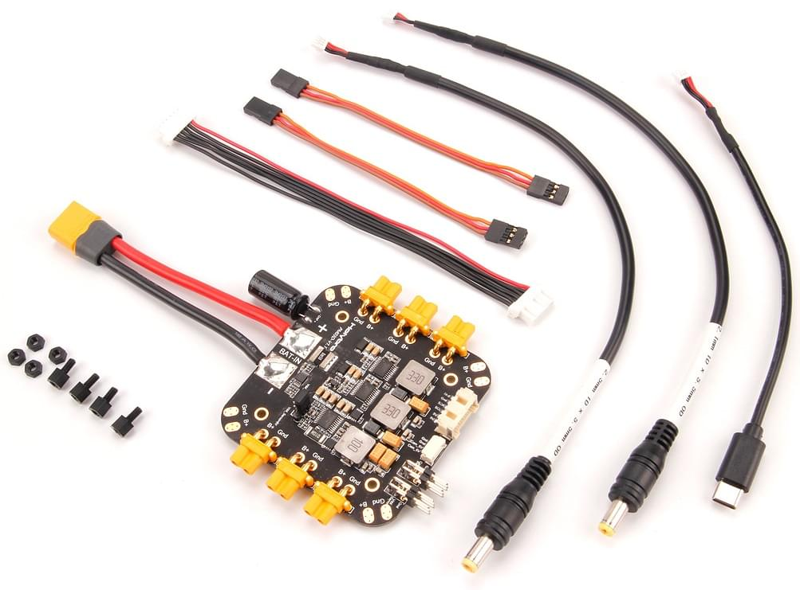

# Holybro PM03D Power Module

Плата живлення PM03D виступає як блок живлення (PM) та розподільча плата живлення (PDB). Крім надання регульованого живлення Pixhawk v5X та ESC, вона надсилає інформацію автопілоту про напругу батареї та поточний струм, який подається на керуючий пристрій польоту та двигуни.

Плата живлення підключається за допомогою протоколу I2C. Вона призначена для керуючих пристроїв польоту на основі відкритого стандарту Pixhawk FMUv5X та FMUv6X, включаючи [Pixhawk 5X](../flight_controller/pixhawk5x.md).

::: info The PM is **NOT** compatible with flight controllers that require an analog power module, including: [Pixhawk 4](../flight_controller/pixhawk4.md), [Durandal](../flight_controller/durandal.md), [Pix32 v5](../flight_controller/holybro_pix32_v5.md), etc.
:::

## Функції

- Підключи & використовуй, жодна додаткова настройка не потрібна для QGroundcontrol & Mission Planner
- Роз'єми XT-30 та паяльні площини для простого підключення моторів та ESC
- Вбудовані стабілізатори напруги: два 5.2V & один на вибір 8V/12V
- Порти 5V/A для живлення супутнього комп'ютера або периферійного пристрою
- На вибір 8V або 12V трирядний рядок контактів для живлення периферійного пристрою

## Специфікації

- **Максимальна вхідна напруга**: 6S заряд акумулятора
- **Rated current**: 60A
- **Максимальний струм:**: 120A (<60 сек)
- **Max current sensing**: 164A
- **Протокол зв'язку**: I2C
- **Dimension**: 84 x 78 x 12mm (excluding wires)
- **Монтування**: 45 х 45 мм
- **Вага**: 59g
- **Connections**:
 - XT-60 for battery
 - XT-30 for motor & peripheral device (battery voltage)
 - Solder pads in each corner (battery voltage)
 - CLIK-Mate 2.0mm for flight controller (5.2V/3A standalone BEC)
 - JST GH 4pin (5.2V/3A, BEC shared with 5.2V triple row pin header)
 - 2x Triple row pin header (5.2V/3A, BEC shared with JST GH 4pin)
 - 2x Triple row pin header (8V or 12V selectable by moving header jumper, 3A)

## Вміст набору

- 1x PM06 board
- 1x 80mm XT60 connector wire (pre-soldered)
- 1x Electrolytic capacitor: 220uF 63V (pre-soldered)
- 1x 2.0mm pitch CLIK-Mate 6pin cable (To power flight controller)
- 4pin JST GH to USB Type C
- 4pin JST GH to barrel plug (2.1*5.5mm)
- 4pin JST GH to barrel plug (2.5*5.5mm)
- 4pin Pin Dupont Cable (2pc)
- Nylon standoffs & nuts

## Де купити

[Order from Holybro Store](https://holybro.com/products/pm03d-power-module)

## Wiring/Connections

Additional wiring and connection information can be found in: [Holybro Pixhawk 5x Wiring Quick Start](../assembly/quick_start_pixhawk5x.md).
