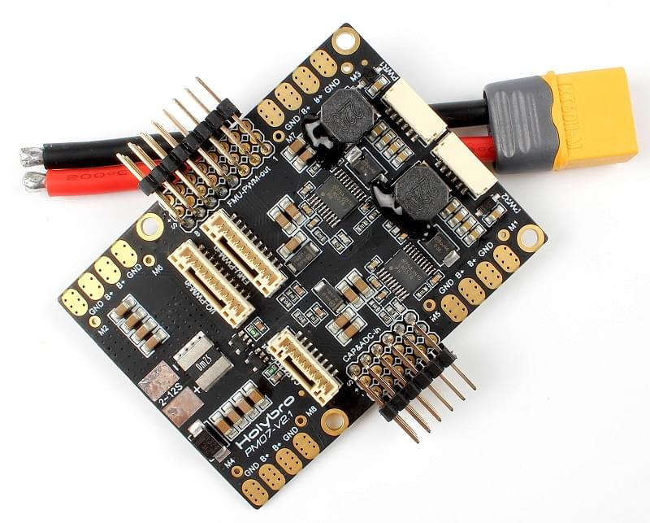

# Holybro Pixhawk 4 Power Module (PM07)

Плата управління живленням (PM Board) виконує функції блоку живлення та розподільчої плати живлення. Крім надання регульованого живлення для Pixhawk 4 та ESC, вона надсилає інформацію автопілоту про напругу батареї та поточний струм, що подається на керуючий пристрій польоту та двигуни.

::: info Цей модуль можна придбати як пакет за допомогою [Pixhawk 4](../assembly/quick_start_pixhawk4.md), а також може бути використаний з іншими контролерами польоту.
:::

## Характеристики

- **Поточний PCB:** загальна потужність виходів 120A (MAX)
- **UBEC вихідний струм 5В:** 3А
- **Напруга входу UBEC:** 2~12s LiPo
- **Dimensions:** 68 x 50 x 8 mm
- **Mounting Holes:** 45 x 45 mm
- **Weight:** 36g

## Вміст набору

- Плата PM07
- 80mm кабель з роз'ємом XT60 (встановлений)
- Електролітична ємність: 220uF 63V (встановлено)
- Кабель JST GH 10P 2x
- Кабель JST GH 8P
- Кабель JST GH 6P 2x

## Де купити

[Модуль живлення Pixhawk 4 (PM07)](https://holybro.com/collections/power-modules-pdbs/products/pixhawk-4-power-module-pm07)

## Проведення/Підключення

Інформацію про проводку та підключення можна знайти в: [Pixhawk 4 > Power](../assembly/quick_start_pixhawk4.md#power).

## Додаткова інформація

[Короткий посібник](https://docs.holybro.com/power-module-and-pdb/power-module/pm07-quick-start-guide) (Holybro)
