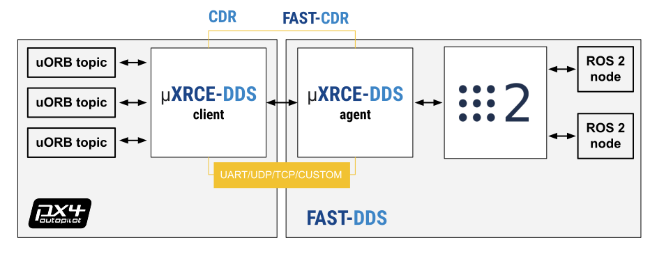

# ROS 2 Посібник користувача

Архітектура ROS 2-PX4 забезпечує глибоку інтеграцію між ROS 2 і PX4, дозволяючи підписникам ROS 2 або вузлам видавців безпосередньо взаємодіяти з темами uORB PX4.

Ця тема містить огляд архітектури та пайплайну додатків, а також пояснює, як налаштувати та використовувати ROS 2 з PX4.

:::info Починаючи з PX4 v1.14, ROS 2 використовує проміжне програмне забезпечення [uXRCE-DDS](../middleware/uxrce_dds.md), яке замінило проміжне програмне забезпечення _FastRTPS_, що використовувалося у версії 1.13 (версія 1.13 не підтримує uXRCE-DDS).

У [посібнику з міграції](../middleware/uxrce_dds.md#fast-rtps-to-uxrce-dds-migration-guidelines) пояснюється, що потрібно зробити, щоб перенести програми ROS 2 з PX4 v1.13 на PX4 v1.14.

Якщо ви досі працюєте на PX4 v1.13, дотримуйтесь інструкцій в [PX4 v1.13 Docs](https://docs.px4.io/v1.13/en/ros/ros2_comm.html).

<!-- remove this when there are PX4 v1.14 docs for some months -->

:::

## Загальний огляд

The application pipeline for ROS 2 is very straightforward, thanks to the use of the [uXRCE-DDS](../middleware/uxrce_dds.md) communications middleware.



<!-- doc source: https://docs.google.com/drawings/d/1WcJOU-EcVOZRPQwNzMEKJecShii2G4U3yhA3U6C4EhE/edit?usp=sharing -->

The uXRCE-DDS middleware consists of a client running on PX4 and an agent running on the companion computer, with bi-directional data exchange between them over a serial, UDP, TCP or custom link. The agent acts as a proxy for the client to publish and subscribe to topics in the global DDS data space.

The PX4 [uxrce_dds_client](../modules/modules_system.md#uxrce-dds-client) is generated at build time and included in PX4 firmware by default. It includes both the "generic" micro XRCE-DDS client code, and PX4-specific translation code that it uses to publish to/from uORB topics. The subset of uORB messages that are generated into the client are listed in [PX4-Autopilot/src/modules/uxrce_dds_client/dds_topics.yaml](https://github.com/PX4/PX4-Autopilot/blob/main/src/modules/uxrce_dds_client/dds_topics.yaml). The generator uses the uORB message definitions in the source tree: [PX4-Autopilot/msg](https://github.com/PX4/PX4-Autopilot/tree/main/msg) to create the code for sending ROS 2 messages.

ROS 2 applications need to be built in a workspace that has the _same_ message definitions that were used to create the uXRCE-DDS client module in the PX4 Firmware. You can include these by cloning the interface package [PX4/px4_msgs](https://github.com/PX4/px4_msgs) into your ROS 2 workspace (branches in the repo correspond to the messages for different PX4 releases).

Note that the micro XRCE-DDS _agent_ itself has no dependency on client-side code. It can be built from [source](https://github.com/eProsima/Micro-XRCE-DDS-Agent) either standalone or as part of a ROS build, or installed as a snap.

You will normally need to start both the client and agent when using ROS 2. Note that the uXRCE-DDS client is built into firmware by default but not started automatically except for simulator builds.

::: info In PX4v1.13 and earlier, ROS 2 was dependent on definitions in [px4_ros_com](https://github.com/PX4/px4_ros_com). This repo is no longer needed, but does contain useful examples.
:::

## Встановлення та налаштування

The supported ROS 2 platforms for PX4 development are ROS 2 "Humble" on Ubuntu 22.04, and ROS 2 "Foxy" on Ubuntu 20.04.

ROS 2 "Humble" is recommended because it is the current ROS 2 LTS distribution. ROS 2 "Foxy" reached end-of-life in May 2023, but is still stable and works with PX4.

::: info Ubuntu 20.04 and Foxy are needed if you want to use [Gazebo Classic](../sim_gazebo_classic/index.md).
:::

To setup ROS 2 for use with PX4:

- [Встановити PX4](#install-px4) (для використання симулятора PX4)
- [Встановіть ROS 2](#install-ros-2)
- [Налаштування агента та клієнта Micro XRCE-DDS](#setup-micro-xrce-dds-agent-client)
- [Створіть та запустіть робоче середовище ROS 2](#build-ros-2-workspace)

Other dependencies of the architecture that are installed automatically, such as _Fast DDS_, are not covered.

### Встановлення PX4

You need to install the PX4 development toolchain in order to use the simulator.

::: info The only dependency ROS 2 has on PX4 is the set of message definitions, which it gets from [px4_msgs](https://github.com/PX4/px4_msgs). You only need to install PX4 if you need the simulator (as we do in this guide), or if you are creating a build that publishes custom uORB topics.
:::

Set up a PX4 development environment on Ubuntu in the normal way:

```sh
cd
git clone https://github.com/PX4/PX4-Autopilot.git --recursive
bash ./PX4-Autopilot/Tools/setup/ubuntu.sh
cd PX4-Autopilot/
make px4_sitl
```

Note that the above commands will install the recommended simulator for your version of Ubuntu. If you want to install PX4 but keep your existing simulator installation, run `ubuntu.sh` above with the `--no-sim-tools` flag.

For more information and troubleshooting see: [Ubuntu Development Environment](../dev_setup/dev_env_linux_ubuntu.md) and [Download PX4 source](../dev_setup/building_px4.md).

### Встановлення ROS 2

To install ROS 2 and its dependencies:

1. Встановлення ROS 2.

   :::: tabs

   ::: tab humble To install ROS 2 "Humble" on Ubuntu 22.04:

   ```sh
   sudo apt update && sudo apt install locales
   sudo locale-gen en_US en_US.UTF-8
   sudo update-locale LC_ALL=en_US.UTF-8 LANG=en_US.UTF-8
   export LANG=en_US.UTF-8
   sudo apt install software-properties-common
   sudo add-apt-repository universe
   sudo apt update && sudo apt install curl -y
   sudo curl -sSL https://raw.githubusercontent.com/ros/rosdistro/master/ros.key -o /usr/share/keyrings/ros-archive-keyring.gpg
   echo "deb [arch=$(dpkg --print-architecture) signed-by=/usr/share/keyrings/ros-archive-keyring.gpg] http://packages.ros.org/ros2/ubuntu $(. /etc/os-release && echo $UBUNTU_CODENAME) main" | sudo tee /etc/apt/sources.list.d/ros2.list > /dev/null
   sudo apt update && sudo apt upgrade -y
   sudo apt install ros-humble-desktop
   sudo apt install ros-dev-tools
   source /opt/ros/humble/setup.bash && echo "source /opt/ros/humble/setup.bash" >> .bashrc
   ```

   Інструкції вище відтворено з офіційного посібника з установки: [Встановлення ROS 2 Humble](https://docs.ros.org/en/humble/Installation/Ubuntu-Install-Debians.html). You can install _either_ the desktop (`ros-humble-desktop`) _or_ bare-bones versions (`ros-humble-ros-base`), _and_ the development tools (`ros-dev-tools`).
:::

   :::tab foxy Щоб встановити ROS 2 "Foxy" на Ubuntu 20.04:

   - Follow the official installation guide: [Install ROS 2 Foxy](https://docs.ros.org/en/foxy/Installation/Ubuntu-Install-Debians.html).

   You can install _either_ the desktop (`ros-foxy-desktop`) _or_ bare-bones versions (`ros-foxy-ros-base`), _and_ the development tools (`ros-dev-tools`).
:::

   ::::

1. Деякі Python залежності також мають бути встановленні (використовуючи **`pip`** або **`apt`**):

   ```sh
   pip install --user -U empy==3.3.4 pyros-genmsg setuptools
   ```

### Налаштування агента та клієнта Micro XRCE-DDS

For ROS 2 to communicate with PX4, [uXRCE-DDS client](../modules/modules_system.md#uxrce-dds-client) must be running on PX4, connected to a micro XRCE-DDS agent running on the companion computer.

#### Налаштувати агента

The agent can be installed onto the companion computer in a [number of ways](../middleware/uxrce_dds.md#micro-xrce-dds-agent-installation). Below we show how to build the agent "standalone" from source and connect to a client running on the PX4 simulator.

To setup and start the agent:

1. Відкрийте термінал.
1. Введіть наступні команди для витягування та побудови агента з вихідного коду:

   ```sh
   git clone https://github.com/eProsima/Micro-XRCE-DDS-Agent.git
   cd Micro-XRCE-DDS-Agent
   mkdir build
   cd build
   cmake ..
   make
   sudo make install
   sudo ldconfig /usr/local/lib/
   ```

1. Запустіть агента з налаштуваннями для підключення до клієнта uXRCE-DDS, який працює на симуляторі:

   ```sh
   MicroXRCEAgent udp4 -p 8888
   ```

The agent is now running, but you won't see much until we start PX4 (in the next step).

::: info
You can leave the agent running in this terminal!
Note that only one agent is allowed per connection channel.
:::

#### Запустіть клієнта

The PX4 simulator starts the uXRCE-DDS client automatically, connecting to UDP port 8888 on the local host.

To start the simulator (and client):

1. Відкрийте новий термінал в корені репозиторію **PX4 Autopilot**, який був встановлений вище.

   :::: tabs

   ::: tab humble

   - Розпочніть симуляцію PX4 у [Gazebo](../sim_gazebo_gz/index.md) за допомогою:

     ```sh
     make px4_sitl gz_x500
     ```


:::

   ::: tab foxy

   - Почніть симуляцію PX4 [Симуляція Gazebo Classic](../sim_gazebo_classic/index.md) за допомогою:

     ```sh
     make px4_sitl gazebo-classic
     ```


:::

   ::::

The agent and client are now running they should connect.

The PX4 terminal displays the [NuttShell/PX4 System Console](../debug/system_console.md) output as PX4 boots and runs. As soon as the agent connects the output should include `INFO` messages showing creation of data writers:

```sh
...
INFO  [uxrce_dds_client] synchronized with time offset 1675929429203524us
INFO  [uxrce_dds_client] successfully created rt/fmu/out/failsafe_flags data writer, topic id: 83
INFO  [uxrce_dds_client] successfully created rt/fmu/out/sensor_combined data writer, topic id: 168
INFO  [uxrce_dds_client] successfully created rt/fmu/out/timesync_status data writer, topic id: 188
...
```

The micro XRCE-DDS agent terminal should also start to show output, as equivalent topics are created in the DDS network:

```sh
...
[1675929445.268957] info     | ProxyClient.cpp    | create_publisher         | publisher created      | client_key: 0x00000001, publisher_id: 0x0DA(3), participant_id: 0x001(1)
[1675929445.269521] info     | ProxyClient.cpp    | create_datawriter        | datawriter created     | client_key: 0x00000001, datawriter_id: 0x0DA(5), publisher_id: 0x0DA(3)
[1675929445.270412] info     | ProxyClient.cpp    | create_topic             | topic created          | client_key: 0x00000001, topic_id: 0x0DF(2), participant_id: 0x001(1)
...
```

### Створення робочого простору ROS 2

This section shows how create a ROS 2 workspace hosted in your home directory (modify the commands as needed to put the source code elsewhere).

The [px4_ros_com](https://github.com/PX4/px4_ros_com) and [px4_msgs](https://github.com/PX4/px4_msgs) packages are cloned to a workspace folder, and then the `colcon` tool is used to build the workspace. The example is run using `ros2 launch`.

::: info The example builds the [ROS 2 Listener](#ros-2-listener) example application, located in [px4_ros_com](https://github.com/PX4/px4_ros_com). [px4_msgs](https://github.com/PX4/px4_msgs) is needed too so that the example can interpret PX4 ROS 2 topics.
:::

#### Створення робочого простору

To create and build the workspace:

1. Відкрийте новий термінал.
1. Створіть новий каталог робочого простору та перейдіть до нього за допомогою:

   ```sh
   mkdir -p ~/ws_sensor_combined/src/
   cd ~/ws_sensor_combined/src/
   ```

   :::info
Узгодження імен для папок робочого простору може полегшити керування робочим простором.
:::

1. Скопіюйте репозиторій прикладів і [px4_msgs](https://github.com/PX4/px4_msgs) до каталогу `/src` (за замовчуванням клоновано гілку `main`, яка відповідає версії PX4, яку ми запускаємо):

   ```sh
   git clone https://github.com/PX4/px4_msgs.git
   git clone https://github.com/PX4/px4_ros_com.git
   ```

1. Створіть середовище розробки ROS 2 у поточному терміналі і скомпілюйте робочу область за допомогою `colcon`:

   :::: tabs

   ::: tab humble

   ```sh
   cd ..
   source /opt/ros/humble/setup.bash
   colcon build
   ```


:::

   ::: tab foxy

   ```sh
   cd ..
   source /opt/ros/foxy/setup.bash
   colcon build
   ```


:::

   ::::

   У результаті буде зібрано усі каталоги у `/src` за допомогою вихідного набору інструментів.

#### Запуск прикладу

To run the executables that you just built, you need to source `local_setup.bash`. This provides access to the "environment hooks" for the current workspace. In other words, it makes the executables that were just built available in the current terminal.

::: info The [ROS2 beginner tutorials](https://docs.ros.org/en/humble/Tutorials/Beginner-Client-Libraries/Creating-A-Workspace/Creating-A-Workspace.html#source-the-overlay) recommend that you _open a new terminal_ for running your executables.
:::

In a new terminal:

1. Перейдіть на верхній рівень каталогу вашого робочого простору та джерело середовища ROS 2 (у цьому випадку "Humble"):

   :::: tabs

   ::: tab humble

   ```sh
   cd ~/ws_sensor_combined/
   source /opt/ros/humble/setup.bash
   ```


:::

   ::: tab foxy

   ```sh
   cd ~/ws_sensor_combined/
   source /opt/ros/foxy/setup.bash
   ```


:::

   ::::

1. Джерело `local_setup.bash`.

   ```sh
   source install/local_setup.bash
   ```

1. Тепер запустіть приклад. Зверніть увагу, що тут ми використовуємо `ros2 launch`, який описано нижче.

   ```sh
   ros2 launch px4_ros_com sensor_combined_listener.launch.py
   ```

If this is working you should see data being printed on the terminal/console where you launched the ROS listener:

```sh
RECEIVED DATA FROM SENSOR COMBINED
================================
ts: 870938190
gyro_rad[0]: 0.00341645
gyro_rad[1]: 0.00626475
gyro_rad[2]: -0.000515705
gyro_integral_dt: 4739
accelerometer_timestamp_relative: 0
accelerometer_m_s2[0]: -0.273381
accelerometer_m_s2[1]: 0.0949186
accelerometer_m_s2[2]: -9.76044
accelerometer_integral_dt: 4739
```

## Керування Транспортним Засобом

To control applications, ROS 2 applications:

- підписатися на (слухати) тематичні теми, опубліковані PX4
- опублікувати у темах, які спонукають PX4 виконати певну дію.

The topics that you can use are defined in [dds_topics.yaml](https://github.com/PX4/PX4-Autopilot/blob/main/src/modules/uxrce_dds_client/dds_topics.yaml), and you can get more information about their data in the [uORB Message Reference](../msg_docs/index.md). For example, [VehicleGlobalPosition](../msg_docs/VehicleGlobalPosition.md) can be used to get the vehicle global position, while [VehicleCommand](../msg_docs/VehicleCommand.md) can be used to command actions such as takeoff and land.

The [ROS 2 Example applications](#ros-2-example-applications) examples below provide concrete examples of how to use these topics.

## Проблеми сумісності

This section contains information that may affect how you write your ROS code.

### Налаштування QoS підписника ROS 2

ROS 2 code that subscribes to topics published by PX4 _must_ specify a appropriate (compatible) QoS setting in order to listen to topics. Specifically, nodes should subscribe using the ROS 2 predefined QoS sensor data (from the [listener example source code](#ros-2-listener)):

```cpp
...
rmw_qos_profile_t qos_profile = rmw_qos_profile_sensor_data;
auto qos = rclcpp::QoS(rclcpp::QoSInitialization(qos_profile.history, 5), qos_profile);

subscription_ = this->create_subscription<px4_msgs::msg::SensorCombined>("/fmu/out/sensor_combined", qos,
...
```

This is needed because the ROS 2 default [Quality of Service (QoS) settings](https://docs.ros.org/en/humble/Concepts/About-Quality-of-Service-Settings.html#qos-profiles) are different from the settings used by PX4. Not all combinations of publisher-subscriber [Qos settings are possible](https://docs.ros.org/en/humble/Concepts/About-Quality-of-Service-Settings.html#qos-compatibilities), and it turns out that the default ROS 2 settings for subscribing are not! Note that ROS code does not have to set QoS settings when publishing (the PX4 settings are compatible with ROS defaults in this case).

<!-- From https://github.com/PX4/PX4-user_guide/pull/2259#discussion_r1099788316 -->

### Узгодження систем координат ROS 2 & PX4

The local/world and body frames used by ROS and PX4 are different.

| Frame | PX4                                              | ROS                                            |
| ----- | ------------------------------------------------ | ---------------------------------------------- |
| Body  | FRD (X **F**orward, Y **R**ight, Z **D**own)     | FLU (X **F**orward, Y **L**eft, Z **U**p)      |
| World | FRD or NED (X **N**orth, Y **E**ast, Z **D**own) | FLU or ENU (X **E**ast, Y **N**orth, Z **U**p) |

:::tip
Дивіться [REP105: Системи координат для мобільних платформ](http://www.ros.org/reps/rep-0105.html) для отримання додаткової інформації про системи координат ROS.
:::

Обидві системи координат показані на зображенні нижче (FRD зліва / FLU справа).


The FRD (NED) conventions are adopted on **all** PX4 topics unless explicitly specified in the associated message definition. Therefore, ROS 2 nodes that want to interface with PX4 must take care of the frames conventions.

- Для повороту вектора з ENU на NED потрібно виконати дві основні обертання:

  - спочатку обертання на кут pi/2 навколо вісі `Z` (вгору),
  - потім обертання на кут пі навколо вісі `X` (старий схід/новий північ).

- To rotate a vector from NED to ENU two basic rotations must be performed:
- - first a pi/2 rotation around the `Z`-axis (down),
  - then a pi rotation around the `X`-axis (old North/new East). Note that the two resulting operations are mathematically equivalent.
- Для обертання вектора з FLU на FRD достатньо обертання навколо вісі `X` (передньої) на пі.
- Для обертання вектора з FRD на FLU достатньо обертання на пі радіан навколо вісі `X` (передній).

Examples of vectors that require rotation are:

- усі поля в повідомленні [TrajectorySetpoint](../msg_docs/TrajectorySetpoint.md); конвертація ENU в NED необхідна перед їхнім відправленням.
- всі поля в повідомленні [VehicleThrustSetpoint](../msg_docs/VehicleThrustSetpoint.md); потрібно виконати конвертацію з FLU в FRD перед їх відправленням.

Similarly to vectors, also quaternions representing the attitude of the vehicle (body frame) w.r.t. the world frame require conversion.

[PX4/px4_ros_com](https://github.com/PX4/px4_ros_com) provides the shared library [frame_transforms](https://github.com/PX4/px4_ros_com/blob/main/include/px4_ros_com/frame_transforms.h) to easily perform such conversions.

### Синхронізація часу ROS, Gazebo та PX4

By default, time synchronization between ROS 2 and PX4 is automatically managed by the [uXRCE-DDS middleware](https://micro-xrce-dds.docs.eprosima.com/en/latest/time_sync.html) and time synchronization statistics are available listening to the bridged topic `/fmu/out/timesync_status`. When the uXRCE-DDS client runs on a flight controller and the agent runs on a companion computer this is the desired behavior as time offsets, time drift, and communication latency, are computed and automatically compensated.

For Gazebo simulations PX4 uses the Gazebo `/clock` topic as [time source](../sim_gazebo_gz/index.md#px4-gazebo-time-synchronization) instead. This clock is always slightly off-sync w.r.t. the OS clock (the real time factor is never exactly one) and it can can even run much faster or much slower depending on the [user preferences](http://sdformat.org/spec?elem=physics&ver=1.9). Note that this is different from the [simulation lockstep](../simulation/index.md#lockstep-simulation) procedure adopted with Gazebo Classic.

ROS2 users have then two possibilities regarding the [time source](https://design.ros2.org/articles/clock_and_time.html) of their nodes.

#### Вузли ROS2 використовують годинник ОС як джерело часу

This scenario, which is the one considered in this page and in the [offboard_control](./offboard_control.md) guide, is also the standard behavior of the ROS2 nodes. The OS clock acts as time source and therefore it can be used only when the simulation real time factor is very close to one. The time synchronizer of the uXRCE-DDS client then bridges the OS clock on the ROS2 side with the Gazebo clock on the PX4 side. No further action is required by the user.

#### Вузли ROS2 використовують годинник Gazebo як джерело часу

In this scenario, ROS2 also uses the Gazebo `/clock` topic as time source. This approach makes sense if the Gazebo simulation is running with real time factor different from one, or if ROS2 needs to directly interact with Gazebo. On the ROS2 side, direct interaction with Gazebo is achieved by the [ros_gz_bridge](https://github.com/gazebosim/ros_gz) package of the [ros_gz](https://github.com/gazebosim/ros_gz) repository.

Use the following commands to install the correct ROS 2/gz interface packages (not just the bridge) for the ROS2 and Gazebo version(s) supported by PX4.

:::: tabs

::: tab humble To install the bridge for use with ROS 2 "Humble" and Gazebo Garden (on Ubuntu 22.04):

```sh
sudo apt install ros-humble-ros-gzgarden
```

:::

::: tab foxy First you will need to [install Gazebo Garden](../sim_gazebo_gz/index.md#installation-ubuntu-linux), as by default Foxy comes with Gazebo Classic 11.

Then to install the interface packages for use with ROS 2 "Foxy" and Gazebo Garden (Ubuntu 20.04):

```sh
sudo apt install ros-foxy-ros-gzgarden
```

:::

::::

::: info The [repo](https://github.com/gazebosim/ros_gz#readme) and [package](https://github.com/gazebosim/ros_gz/tree/ros2/ros_gz_bridge#readme) READMEs show the package versions that need to be installed depending on your ROS2 and Gazebo versions.
:::

Once the packages are installed and sourced, the node `parameter_bridge` provides the bridging capabilities and can be used to create an unidirectional `/clock` bridge:

```sh
ros2 run ros_gz_bridge parameter_bridge /clock@rosgraph_msgs/msg/Clock[gz.msgs.Clock
```

На цьому етапі кожному вузлу ROS2 необхідно бути інструкцією використовувати новостворену тему `/clock` як джерело часу замість ОС, це робиться шляхом встановлення параметра `use_sim_time` (кожного вузла) на `true` (див. [ROS clock and Time design](https://design.ros2.org/articles/clock_and_time.html)).

Це завершує внесені зміни, необхідні на стороні ROS2. На стороні PX4 вам потрібно лише зупинити синхронізацію часу uXRCE-DDS, встановивши параметр [UXRCE_DDS_SYNCT](../advanced_config/parameter_reference.md#UXRCE_DDS_SYNCT) на `false`. Таким чином, Gazebo буде діяти як основний і єдиний джерело часу як для ROS2, так і для PX4.

## Приклади програм ROS 2

### Слухач ROS 2

Приклади слухачів ROS 2 [у репозиторії px4_ros_com](https://github.com/PX4/px4_ros_com/tree/main/src/examples/listeners) демонструють, як писати вузли ROS для прослуховування тем, що публікуються PX4.

Тут ми розглядаємо вузол [sensor_combined_listener.cpp](https://github.com/PX4/px4_ros_com/blob/main/src/examples/listeners/sensor_combined_listener.cpp) у папці `px4_ros_com/src/examples/listeners`, який підписується на повідомлення [SensorCombined](../msg_docs/SensorCombined.md).

:::info [Побудуйте робоче середовище ROS 2](#build-ros-2-workspace) показує, як побудувати та запустити цей приклад.
:::

Спочатку код імпортує бібліотеки C++, необхідні для взаємодії з проміжним програмним забезпеченням ROS 2 та файл заголовка для повідомлення `SensorCombined`, на яке підписується вузол:

```cpp
#include <rclcpp/rclcpp.hpp>
#include <px4_msgs/msg/sensor_combined.hpp>
```

Потім він створює клас `SensorCombinedListener`, який успадковує загальний базовий клас `rclcpp::Node`.

```cpp
/**
 * @brief Sensor Combined uORB topic data callback
 */
class SensorCombinedListener : public rclcpp::Node
{
```

Це створює функцію зворотного виклику для отримання повідомлень uORB `SensorCombined` (тепер як повідомлення micro XRCE-DDS) та виводить вміст полів повідомлення кожного разу, коли повідомлення отримано.

```cpp
public:
    explicit SensorCombinedListener() : Node("sensor_combined_listener")
    {
        rmw_qos_profile_t qos_profile = rmw_qos_profile_sensor_data;
        auto qos = rclcpp::QoS(rclcpp::QoSInitialization(qos_profile.history, 5), qos_profile);

        subscription_ = this->create_subscription<px4_msgs::msg::SensorCombined>("/fmu/out/sensor_combined", qos,
        [this](const px4_msgs::msg::SensorCombined::UniquePtr msg) {
            std::cout << "\n\n\n\n\n\n\n\n\n\n\n\n\n\n\n\n\n\n\n\n\n\n\n\n";
            std::cout << "RECEIVED SENSOR COMBINED DATA"   << std::endl;
            std::cout << "============================="   << std::endl;
            std::cout << "ts: "          << msg->timestamp    << std::endl;
            std::cout << "gyro_rad[0]: " << msg->gyro_rad[0]  << std::endl;
            std::cout << "gyro_rad[1]: " << msg->gyro_rad[1]  << std::endl;
            std::cout << "gyro_rad[2]: " << msg->gyro_rad[2]  << std::endl;
            std::cout << "gyro_integral_dt: " << msg->gyro_integral_dt << std::endl;
            std::cout << "accelerometer_timestamp_relative: " << msg->accelerometer_timestamp_relative << std::endl;
            std::cout << "accelerometer_m_s2[0]: " << msg->accelerometer_m_s2[0] << std::endl;
            std::cout << "accelerometer_m_s2[1]: " << msg->accelerometer_m_s2[1] << std::endl;
            std::cout << "accelerometer_m_s2[2]: " << msg->accelerometer_m_s2[2] << std::endl;
            std::cout << "accelerometer_integral_dt: " << msg->accelerometer_integral_dt << std::endl;
        });
    }
```

:::info Підписка встановлює профіль QoS на основі `rmw_qos_profile_sensor_data`. Це потрібно, оскільки типовий профіль якості обслуговування ROS 2 для підписників несумісний з профілем PX4 для видавців. Для отримання додаткової інформації див. : [ROS 2 Налаштування QoS для підписника](#ros-2-subscriber-qos-settings),
:::

Рядки нижче створюють виробника для теми uORB `SensorCombined`, яка може бути зіставлена з одним або кількома сумісними підписниками ROS 2 для теми ROS 2 `fmu/sensor_combined/out`.

````cpp
private:
    rclcpp::Subscription<px4_msgs::msg::SensorCombined>::SharedPtr subscription_;
};
```s

The instantiation of the `SensorCombinedListener` class as a ROS node is done on the `main` function.

```cpp
int main(int argc, char *argv[])
{
    std::cout << "Starting sensor_combined listener node..." << std::endl;
    setvbuf(stdout, NULL, _IONBF, BUFSIZ);
    rclcpp::init(argc, argv);
    rclcpp::spin(std::make_shared<SensorCombinedListener>());

    rclcpp::shutdown();
    return 0;
}
````

Цей конкретний приклад має пов'язаний файл запуску за посиланням [launch/sensor_combined_listener.launch.py](https://github.com/PX4/px4_ros_com/blob/main/launch/sensor_combined_listener.launch.py). Це дозволяє запускати його за допомогою команди [`ros2 launch`](#ros2-launch).

### ROS 2 Advertiser

Вузол відправника ROS 2 публікує дані в мережу DDS/RTPS (і, отже, в автопілот PX4).

Беручи як приклад `debug_vect_advertiser.cpp` під `px4_ros_com/src/advertisers`, спочатку ми імпортуємо необхідні заголовки, включаючи заголовок повідомлення `debug_vect`.

```cpp
#include <chrono>
#include <rclcpp/rclcpp.hpp>
#include <px4_msgs/msg/debug_vect.hpp>

using namespace std::chrono_literals;
```

Потім код створює клас `DebugVectAdvertiser`, який успадковує загальний базовий клас `rclcpp::Node`.

```cpp
class DebugVectAdvertiser : public rclcpp::Node
{
```

Код нижче створює функцію для відправлення повідомлень. Повідомлення надсилаються на основі виклику за часом, який надсилає два повідомлення на секунду за таймером.

```cpp
public:
    DebugVectAdvertiser() : Node("debug_vect_advertiser") {
        publisher_ = this->create_publisher<px4_msgs::msg::DebugVect>("fmu/debug_vect/in", 10);
        auto timer_callback =
        [this]()->void {
            auto debug_vect = px4_msgs::msg::DebugVect();
            debug_vect.timestamp = std::chrono::time_point_cast<std::chrono::microseconds>(std::chrono::steady_clock::now()).time_since_epoch().count();
            std::string name = "test";
            std::copy(name.begin(), name.end(), debug_vect.name.begin());
            debug_vect.x = 1.0;
            debug_vect.y = 2.0;
            debug_vect.z = 3.0;
            RCLCPP_INFO(this->get_logger(), "\033[97m Publishing debug_vect: time: %llu x: %f y: %f z: %f \033[0m",
                                debug_vect.timestamp, debug_vect.x, debug_vect.y, debug_vect.z);
            this->publisher_->publish(debug_vect);
        };
        timer_ = this->create_wall_timer(500ms, timer_callback);
    }

private:
    rclcpp::TimerBase::SharedPtr timer_;
    rclcpp::Publisher<px4_msgs::msg::DebugVect>::SharedPtr publisher_;
};
```

Інстанціювання класу `DebugVectAdvertiser` як вузла ROS виконується у функції `main`.

```cpp
int main(int argc, char *argv[])
{
    std::cout << "Starting debug_vect advertiser node..." << std::endl;
    setvbuf(stdout, NULL, _IONBF, BUFSIZ);
    rclcpp::init(argc, argv);
    rclcpp::spin(std::make_shared<DebugVectAdvertiser>());

    rclcpp::shutdown();
    return 0;
}
```

### Offboard Control

For a complete reference example on how to use Offboard control with PX4, see: [ROS 2 Offboard control example](../ros2/offboard_control.md).

## Використання апаратної плати керування польотом

ROS 2 з PX4, що працює на пульті керування польотом, майже те саме, що й працювати з PX4 на симуляторі. Єдине відмінність полягає в тому, що потрібно запустити як агента, так і клієнта, з параметрами, відповідними для каналу зв'язку.

Для отримання додаткової інформації дивіться [Початок uXRCE-DDS](../middleware/uxrce_dds.md#starting-agent-and-client).

## Користувацькі теми uORB

ROS 2 потребує мати ті _самі_ визначення повідомлень, які використовувалися для створення модуля клієнта uXRCE-DDS в прошивці PX4, щоб інтерпретувати повідомлення. Визначення зберігаються в пакеті інтерфейсу ROS 2 [PX4/px4_msgs](https://github.com/PX4/px4_msgs) і автоматично синхронізуються CI на гілках `main` та release. Зверніть увагу, що всі повідомлення з вихідного коду PX4 присутні в репозиторії, але лише ті, які перелічені в `dds_topics.yaml`, будуть доступні як теми ROS 2. Тому

- Якщо ви використовуєте основну або випускову версію PX4, ви можете отримати визначення повідомлень, клонуючи пакунок інтерфейсу [PX4/px4_msgs](https://github.com/PX4/px4_msgs) у вашу робочу область.
- Якщо ви створюєте або змінюєте повідомлення uORB, вам потрібно вручну оновити повідомлення у вашому робочому просторі з дерева джерела PX4. Загалом це означає, що ви мали б оновити [dds_topics.yaml](https://github.com/PX4/PX4-Autopilot/blob/main/src/modules/uxrce_dds_client/dds_topics.yaml), клонувати пакет інтерфейсу, а потім вручну синхронізувати його, копіюючи нові/змінені визначення повідомлень з [PX4-Autopilot/msg](https://github.com/PX4/PX4-Autopilot/tree/main/msg) до його папок `msg`. Припускаючи, що PX4-Autopilot знаходиться у вашій домашній директорії `~`, тоді як `px4_msgs` знаходиться у `~/px4_ros_com/src/`, то команда може бути:

  ```sh
  rm ~/px4_ros_com/src/px4_msgs/msg/*.msg
  cp ~/PX4-Autopilot/mgs/*.msg ~/px4_ros_com/src/px4_msgs/msg/
  ```

  :::info Технічно, [dds_topics.yaml](https://github.com/PX4/PX4-Autopilot/blob/main/src/modules/uxrce_dds_client/dds_topics.yaml) повністю визначає відношення між темами PX4 uORB та повідомленнями ROS 2. Для отримання додаткової інформації див. [uXRCE-DDS > DDS Topics YAML](../middleware/uxrce_dds.md#dds-topics-yaml).
:::

## Налаштування простору назв теми

Спеціальні простори імен тем можуть бути застосовані на етапі збірки (зміна [dds_topics.yaml](https://github.com/PX4/PX4-Autopilot/blob/main/src/modules/uxrce_dds_client/dds_topics.yaml)) або під час виконання (корисно для операцій з кількома транспортними засобами):

- Одним із варіантів є використання опції `-n` при запуску [uxrce_dds_client](../modules/modules_system.md#uxrce-dds-client) з командного рядка. Ця техніка може бути використана як у симуляційних, так і в реальних транспортних засобах.
- Спеціальний простір імен може бути наданий для симуляцій (тільки) за допомогою встановлення змінної середовища `PX4_UXRCE_DDS_NS` перед запуском симуляції.

:::info Зміна простору імен під час виконання додасть потрібний простір імен як префікс до всіх полів `topic` в [dds_topics.yaml](https://github.com/PX4/PX4-Autopilot/blob/main/src/modules/uxrce_dds_client/dds_topics.yaml). Отже, команди, подібні до:

```sh
uxrce_dds_client start -n uav_1
```

або

```sh
PX4_UXRCE_DDS_NS=uav_1 make px4_sitl gz_x500
```

згенерує теми під просторами імен:

```sh
/uav_1/fmu/in/  # for subscribers
/uav_1/fmu/out/ # for publishers
```

:::

## ros2 CLI

[ros2 CLI](https://docs.ros.org/en/humble/Tutorials/Beginner-CLI-Tools.html) - це корисний інструмент для роботи з ROS. Ви можете використовувати його, наприклад, щоб швидко перевірити, чи публікуються теми, а також докладно їх перевірити, якщо у вас є `px4_msg` у робочому просторі. Команда також дозволяє вам запускати більш складні системи ROS за допомогою файлу запуску. Декілька можливостей демонструються нижче.

### ros2 topic list

Використовуйте `ros2 topic list`, щоб переглянути список тем, доступних для ROS 2:

```sh
ros2 topic list
```

Якщо PX4 підключений до агента, результатом буде список типів теми:

```sh
/fmu/in/obstacle_distance
/fmu/in/offboard_control_mode
/fmu/in/onboard_computer_status
...
```

Зверніть увагу, що робочому простору не потрібно будувати з `px4_msgs` для успішного виконання; інформація про тип теми є частиною навантаження повідомлення.

### ros2 topic echo

Використовуйте `ros2 topic echo`, щоб показати деталі певної теми.

На відміну від `ros2 topic list`, для цієї роботи вам потрібно знаходитися в робочому просторі, який побудував `px4_msgs` та джерело `local_setup.bash`, щоб ROS міг інтерпретувати повідомлення.

```sh
ros2 topic echo /fmu/out/vehicle_status
```

Команда виведе деталі теми під час оновлення.

```sh
---
timestamp: 1675931593364359
armed_time: 0
takeoff_time: 0
arming_state: 1
latest_arming_reason: 0
latest_disarming_reason: 0
nav_state_timestamp: 3296000
nav_state_user_intention: 4
nav_state: 4
failure_detector_status: 0
hil_state: 0
...
---
```

### ros2 topic hz

Ви можете отримати статистику про швидкість повідомлень, використовуючи `ros2 topic hz`. Наприклад, щоб отримати ставки для `SensorCombined`:

```sh
ros2 topic hz /fmu/out/sensor_combined
```

Вихід буде виглядати приблизно так:

```sh
average rate: 248.187
  min: 0.000s max: 0.012s std dev: 0.00147s window: 2724
average rate: 248.006
  min: 0.000s max: 0.012s std dev: 0.00147s window: 2972
average rate: 247.330
  min: 0.000s max: 0.012s std dev: 0.00148s window: 3212
average rate: 247.497
  min: 0.000s max: 0.012s std dev: 0.00149s window: 3464
average rate: 247.458
  min: 0.000s max: 0.012s std dev: 0.00149s window: 3712
average rate: 247.485
  min: 0.000s max: 0.012s std dev: 0.00148s window: 3960
```

### ros2 launch

Команда `ros2 launch` використовується для запуску файлу запуску ROS 2. Наприклад, вище ми використовували `ros2 launch px4_ros_com sensor_combined_listener.launch.py` для запуску прикладу слухача.

Вам не потрібно мати файл запуску, але вони дуже корисні, якщо у вас складна система ROS 2, яка потребує запуску кількох компонентів.

Для отримання інформації про файли запуску див. [Посібники ROS 2 >  Створення файлів запуску](https://docs.ros.org/en/humble/Tutorials/Intermediate/Launch/Creating-Launch-Files.html)

## Відстеження проблем

### Відсутні залежності

Стандартна установка повинна включати всі необхідні інструменти для ROS 2.

Якщо щось відсутнє, його можна додати окремо:

- Інструменти збірки **`colcon`** повинні бути в інструментах розробки. Можна встановити за допомогою:

  ```sh
  sudo apt install python3-colcon-common-extensions
  ```

- Бібліотеку Eigen3, яку використовує бібліотека трансформацій, повинно бути в обох пакунків: desktop та base. Воно повинно бути встановлено, як показано:

  :::: tabs

  ::: tab humble

  ```sh
  sudo apt install ros-humble-eigen3-cmake-module
  ```


:::

  ::: tab foxy

  ```sh
  sudo apt install ros-foxy-eigen3-cmake-module
  ```


:::

  ::::

### ros_gz_bridge not publishing on the \clock topic

If your [ROS2 nodes use the Gazebo clock as time source](../ros2/user_guide.md#ros2-nodes-use-the-gazebo-clock-as-time-source) but the `ros_gz_bridge` node doesn't publish anything on the `/clock` topic, you may have the wrong version installed. This might happen if you install ROS 2 Humble with the default "Ignition Fortress" packages, rather than using those for PX4, which uses "Gazebo Garden".

The following commands uninstall the default Ignition Fortress topics and install the correct bridge and other interface topics for **Gazebo Garden** with ROS2 **Humble**:

```bash
# Remove the wrong version (for Ignition Fortress)
sudo apt remove ros-humble-ros-gz

# Install the version for Gazebo Garden
sudo apt install ros-humble-ros-gzgarden
```

## Додаткова інформація

- [ROS 2 у PX4: Технічні деталі безперервного переходу до XRCE-DDS](https://www.youtube.com/watch?v=F5oelooT67E) - Пабло Гаррідо та Нуно Маркес (youtube)
- [Реалізації проміжного ПЗ DDS та ROS](https://github.com/ros2/ros2/wiki/DDS-and-ROS-middleware-implementations)
