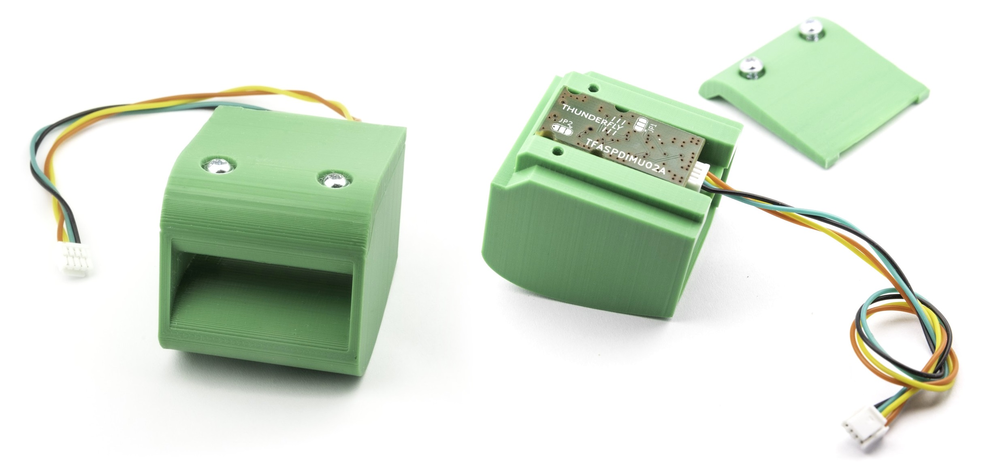
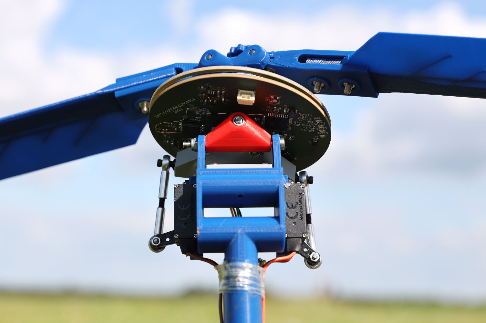

# TFSLOT датчик швидкості польоту ефекту Вентурі

[TFSLOT](https://github.com/ThunderFly-aerospace/TFSLOT01) це датчик швидкості повітря з відкритим вихідним кодом, що базується на [ефекті Вентурі](https://en.wikipedia.org/wiki/Venturi_effect), який також має ІНС.



[TFSLOT](https://github.com/ThunderFly-aerospace/TFSLOT01) - це датчик швидкості повітря на основі вентурі ефектів. У базовій конфігурації TFSLOT обладнаний платою сенсорів [TFASPDIMU02](https://github.com/ThunderFly-aerospace/TFASPDIMU02), яка містить диференційний датчик тиску ([серія Sensirion SDP3x](https://sensirion.com/products/catalog/?filter_series=d1816d53-f5c8-47e3-ab47-818c3fd54259)) та датчик відстеження руху 9-ти осей ([ICM-20948](https://invensense.tdk.com/products/motion-tracking/9-axis/icm-20948/)). Одиницю IMU можна використовувати як зовнішній компас.

- Цей дизайн має кілька переваг при використанні на невеликих і повільних безпілотних літальних апаратах.
- Краща роздільна здатність при низьких швидкостях повітря (нижче 10 м/с).
- Налаштована чутливість, яка надається зміною профілю.
- Менша схильність до засмічення (наприклад, глиною після посадки)
- Стійкий до погодних умов (дощ, сніг тощо)
- Пряме інтегрування датчика різниці тиску без будь-яких додаткових трубок. Менше шансів на відмову датчика.
- Можливість прямої інтеграції в конструкцію безпілотника. Дизайн є повністю відкритим джерелом.
- Інтегрований зовнішній блок ІНС.

Завдяки надрукованому трубці дуже легко змінити профіль вимірювання і таким чином змінити чутливість в певних діапазонах швидкості. У базовій формі воно оптимізовано так, що виміряний диференційний тиск відповідає тиску від труби Піто.

 _Перша інтеграція TFSLOT у автожир [TF-G2](https://github.com/ThunderFly-aerospace/TF-G2/)_

:::info

Повна документація та вихідні файли можна знайти на [GitHub](https://github.com/ThunderFly-aerospace/TFSLOT01).

:::

## Де купити

TFSLOT можна придбати на [магазині Tindie](https://www.tindie.com/products/thunderfly/tfslot01a-inovative-drone-airspeed-sensor/) або надіславши нам запит електронною поштою на info@thunderfly.cz

## Підключення

[TFASPDIMU02](https://github.com/ThunderFly-aerospace/TFASPDIMU02) обладнаний роз'ємом I2C JST-GH, який відповідає роз'єму стандарту [стандарту дронів](https://github.com/pixhawk/Pixhawk-Standards/blob/master/DS-009%20Pixhawk%20Connector%20Standard.pdf). Отже, датчик може бути підключений безпосередньо до порту I2C автопілота за допомогою кабелю I2C 4pin JST-GH.

## Конфігурація

Оскільки перед датчиком має бути з'єднана [IMU IC](https://invensense.tdk.com/products/motion-tracking/9-axis/icm-20948/), ІК повинен бути встановлений в режимі мосту. Після цього можна запустити драйвер датчика швидкості повітря. Це може бути зроблено за допомогою наступних послідовностей команд. Команди передбачають підключення до порту I2C2.

```sh
icm20948_i2c_passthrough start -X -b 2 -a 0x68
sdp3x_airspeed start -X -b 2
```

Цю послідовність можна зберегти на SD-картці у файлі `/etc/config.txt`. Ви можете дізнатися більше про конфігурацію на SD-картці на [окремій сторінці](../concept/system_startup.md#replacing-the-system-startup).

Оскільки перетворення різниці тиску на швидкість повітря відрізняється від трубки Піто, цей профіль потребує змін. Це робиться шляхом встановлення параметра [`CAL_AIR_CMODEL`](../advanced_config/parameter_reference.md#CAL_AIR_CMODEL) на 3 (датчик швидкості повітря на основі ефекту Вентурі)

## Калібрування

Калібрування дещо складне через те, що поточна версія прошивки не підтримує калібрування з від'ємними значеннями. Оскільки використовуваний датчик вимірює обидва напрямки повітряного потоку симетрично і має нульове зміщення, немає потреби калібрувати його знову перед кожним зльотом. Але вам потрібно забезпечити, щоб під час калібрування не було потоку повітря.

Найлегший спосіб калібрування - взяти клейку стрічку і приклеїти її між тиском на входах до датчика. Потім розпочніть процес калібрування і дмухайте ззаду, коли буде вимога. Якщо буде створено тиск принаймні 50 Па, калібрування буде успішним.
