# PMW3901-Based Flow Sensors

PMW3901 - це [оптичний потік](../sensor/optical_flow.md) ASIC, який обчислює потік внутрішньо і надає різницю в пікселях між кожною кадром. Він використовує сенсор відстеження, який схожий на те, що ви знайдете в комп'ютерній мишці, але адаптований для роботи від 80 мм і безмежжя. PMW3901 використовується в декількох продуктах, включаючи деякі від Bitcraze, Tindie, Hex, Thone та Alientek

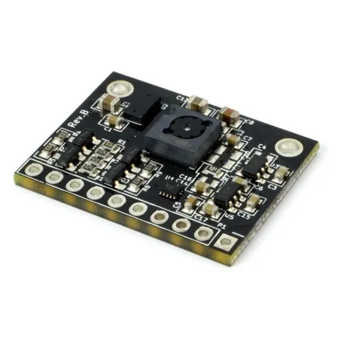

Ця тема містить посилання на датчики, які були протестовані, разом з інформацією про кріплення та конфігурацію PX4 (це загальне для всіх датчиків цього типу).

## Плати, які використовують PMW3901

Наступна таблиця показує деякі плати, які використовують цей датчик, зазначаючи кількість інтерфейсів, кількість датчиків, вхідну напругу та розмір. Назва дошки посилається на розділи, що містять інформацію про підключення та інформацію про покупку.

| Виробництво | Board                                                                             | Interface | Flow | Range Finder | Gyro | Voltage (V) | Size (mm) | Max Height (m) |
| ----------- | --------------------------------------------------------------------------------- | --------- | ---- | ------------ | ---- | ----------- | --------- | -------------- |
| Bitcraze    | [Flow breakout](#bitcraze-flow-breakout)                                          | SPI       | Y    | Y            | -    | 3 - 5       | 21x20     | 1              |
| Tindie      | [PMW3901 Optical Flow Sensor](#tindie-pmw3901-optical-flow-sensor)                | SPI       | Y    | -            | -    | 3 - 5       | AxB       | -              |
| Hex         | [HereFlow PMW3901 Optical Flow Sensor](#hex-hereflow-pmw3901-optical-flow-sensor) | CAN       | Y    | Y            | Y    | 3 - 5       | AxB       | 4              |
| Holybro     | [Holybro PMW3901 Optical Flow Sensor](#holybro-pmw3901-optical-flow-sensor)       | UART      | Y    | -            | -    | 3 - 5       | AxB       | -              |
| Thone       | [ThoneFlow-3901U](#thone-thoneflow-3901u)                                         | UART      | Y    | -            | -    | 3 - 5       | AxB       | -              |
| Alientek    | [ATK-PMW3901](#alientek-atk-pmw3901)                                              | SPI       | Y    | -            | -    | 3.3 - 4.2   | 27.5x16.5 | 1              |

## External Rangefinders

Зовнішній дальномер / датчик відстані _потрібний_ для датчиків, які не мають дальномера (наприклад, _Tindie_ або _Thone_) і _рекомендований_ для інших плат (оскільки їхній діапазон доволі обмежений).

Діапазон, необхідний для застосування, залежить від програми:

- Польот у приміщенні: ≈4 метри
- Польот на відкритому повітрі: ≥10 метрів (наприклад, для підтримки контролю за позицією в середовищах, де можуть виникнути проблеми з GPS)

Будь-який [дальномер/датчик відстані](../sensor/rangefinders.md), підтримуваний PX4, може бути використаний. Датчик може бути встановлений будь-де, але повинен бути спрямований вниз і повинен бути підключений/налаштований як зазвичай.

:::tip
Команда PX4 головним чином тестувала використання [Lidar Lite V3](../sensor/lidar_lite.md) на більших транспортних засобах та [Lanbao CM8JL65](../sensor/cm8jl65_ir_distance_sensor.md) на менших транспортних засобах.
:::

## Mounting/Orientation

Модулі потоку зазвичай встановлюються близько до центру транспортного засобу. Якщо встановлено не по центру, вам потрібно встановити зміщення: [Оптичний потік > EKF2](../sensor/optical_flow.md#ekf2).

The flow modules may be mounted with any yaw orientation relative to the vehicle body frame, but you must set the value used in [SENS_FLOW_ROT](../advanced_config/parameter_reference.md#SENS_FLOW_ROT).

"Нульовий" обертання - це коли плата сенсора та вісі X транспортного засобу [транспортного засобу](../getting_started/px4_basic_concepts.md#heading-and-directions) вирівнюються (тобто "перед" транспортного засобу та плата знаходяться в одному напрямку), з обертанням, що збільшується в годинниковому напрямку.

Модулі PMW3901 мають невеликий виступ, що вказує напрямок **задньої** частини плати. Схема показує відносні орієнтації дошки та транспортного засобу, які відповідають `SENS_FLOW_ROT=0` (зверніть увагу на виступ ззаду).

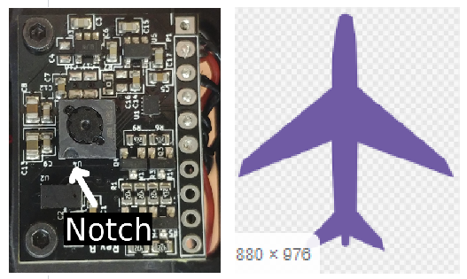

Діаграма вище показує дошку Bitcraze. Ви можете використовувати виступ, щоб знайти орієнтацію інших плат у тому ж самому способі:

| &nbsp;                                       | &nbsp;                                                                                            |
| -------------------------------------------- | ------------------------------------------------------------------------------------------------- |
| Tindie ![PMW3901 Tindie Notch][1]   | Hex Hereflow ![PMW3901 Hereflow Notch][2]                                                |
| Thone ![PMW3901 Thoneflow Notch][3] | Alientek (також має стрілку, що вказує на передню частину!) ![PMW3901 Alientek Notch][4] |

## Налаштування PX4

Конфігурація PX4, яка є загальною для всіх плат на основі PMW3901:

- [Оптичний потік > EKF2](../sensor/optical_flow.md#ekf2) пояснює, як об'єднати дані оптичного потоку в оцінювачі EKF2 та встановити зсуви позиції для монтажного положення датчика потоку.
- [SENS_FLOW_ROT](../advanced_config/parameter_reference.md#SENS_FLOW_ROT) встановлює орієнтацію датчика потоку відносно напрямку руху транспортного засобу.

Окрім того для:

- Для підключених по шині SPI датчиків вам потрібно встановити [SENS_EN_PMW3901](../advanced_config/parameter_reference.md#SENS_EN_PMW3901) на `1`, щоб увімкнути драйвер датчика.
- Датчики, підключені через UART (наприклад, ThoneFlow-3901UY), ви повинні [налаштувати відповідний послідовний порт](../peripherals/serial_configuration.md), встановивши параметр [SENS_TFLOW_CFG](../advanced_config/parameter_reference.md#SENS_TFLOW_CFG) на значення підключеного порту UART (наприклад, якщо ви підключили цей датчик до `TELEM 2`, вам потрібно встановити `SENS_TFLOW_CFG` на `102`).
- Датчики DroneCAN вам потрібно належним чином встановити `UAVCAN_ENABLE`. Для отримання додаткової інформації див. [Пристрої DroneCAN](../dronecan/index.md) (та [документацію HereFlow PMW3901 нижче](#dronecan_wiring)).

Індивідуальні датчики потоку додатково налаштовуються/конфігуруються, як описано в розділах нижче.

## Розгалуження Bitcraze Flow

The [Bitcraze Flow breakout](https://www.bitcraze.io/products/flow-breakout/) directly exposes the [SPI interface](#spi-wiring) from the PMW3901 module.

The board also incorporates a distance sensor [wired to the Pixhawk I2C port](#i2c-wiring). This distance sensor is the VL53L0x ToF sensor from STMicroelectronics. The sensor range is minimal (2 metres) and will be reduced when flying in the sunlight. We therefore highly recommend that you use an [external distance sensor](#external-rangefinders).

[PX4 configuration](#px4-configuration) and [mounting/orientation](#mounting-orientation) instructions are provided above.

### SPI Wiring

The PMW3901, if connected to the SPI port on a Pixhawk 4, will automatically detect the Bitcraze flow module. This device's driver was explicitly written to be plugged into the SPI port using the chip select 1. No parameters will have to be configured other than the [orientation and position of the sensor](#mounting-orientation).

The pinout mapping for the Pixhawk SPI port to Bitcraze Flow Board is shown below (the port mapping is the same for all Pixhawk FMU versions).

| Pixhawk SPI Port (from left to right) | Bitcraze flow board |
| ------------------------------------- | ------------------- |
| 1 (VCC)                               | VCC                 |
| 2 (SCK)                               | CLK                 |
| 3 (MISO)                              | MISO                |
| 4 (MOSI)                              | MOSI                |
| 5 (CS1)                               | CS                  |
| 6 (CS2)                               | Do not connect      |
| 7 (GND)                               | GND                 |

To connect the bitcraze flow board to the Pixhawk, you will need to solder the wires of the Pixhawk SPI cable to the flow board. An SPI cable has 7 wires, from which you need to connect 6 to the flow board.

The following diagram shows how to wire the sensor to a Pixhawk 4.

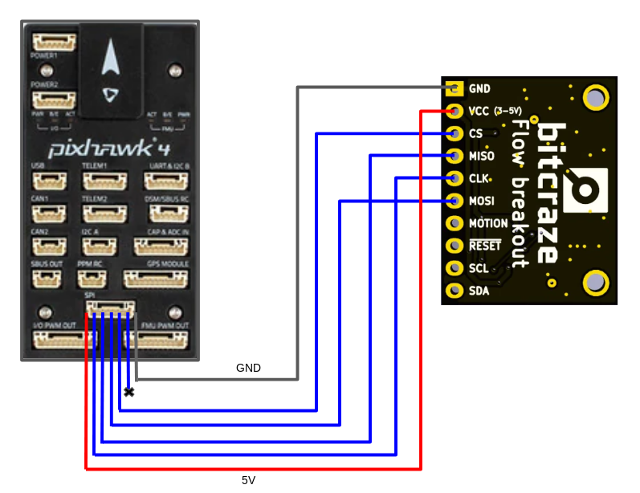

### I2C Wiring

The I2C wiring is the same for any other distance sensor. Simply connect the SLA, SLC, GND, and VCC to the corresponding (same) pins on the Pixhawk and the sensor.

## Tindie PMW3901 Optical Flow Sensor

The Tindie [PMW3901 Optical Flow Sensor](https://www.tindie.com/products/onehorse/pmw3901-optical-flow-sensor/) exposes the SPI interface from the PMW3901 module exactly as on the Bitcraze module (see [SPI Wiring](#spi-wiring)).

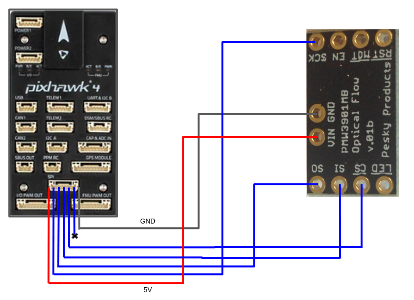

The sensor doesn't have a distance sensor onboard, so you will need to use an [external distance sensor](#external-rangefinders).

[PX4 configuration](#px4-configuration) and [mounting/orientation](#mounting-orientation) instructions are provided above.

## AlienTek ATK-PMW3901

The AlienTek [ATK-PMW3901](https://www.aliexpress.com/i/32979605707.html) exposes the SPI interface from the PMW3901 module in the same way as the Bitcraze module (see [SPI Wiring](#spi-wiring)).

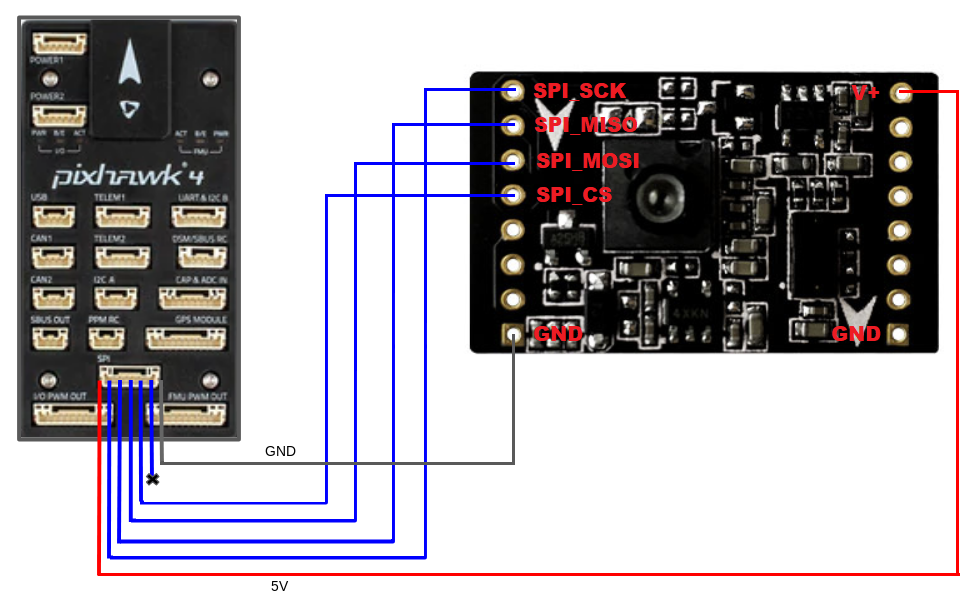

The board also incorporates a distance sensor (we recommend that you use an [external distance sensor](#external-rangefinders)). You can wire the internal sensor to the Pixhawk I2C port [in the same way as any other I2C peripheral.](#i2c-wiring) A screenshot showing the I2C pins (SLA, SLC, GND, and VCC) is provided below.

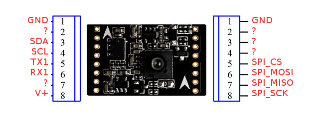

[PX4 configuration](#px4-configuration) and [mounting/orientation](#mounting-orientation) instructions are provided above.

## Hex HereFlow PMW3901 Optical Flow Sensor

The Hex [HereFlow PMW3901 Optical Flow Sensor](http://www.proficnc.com/all-products/185-pixhawk2-suite.html) is a tiny board containing the PMW3901 flow module, VL53L1X distance sensor, and an IMU (used to synchronize the flow data with the gyro data).

An onboard microcontroller samples the three sensors and publishes two DroneCAN messages containing all the information needed for the flow and distance sensor calculations.

The board can be connected to any CAN port on any Pixhawk board (see [DroneCAN wiring](#dronecan_wiring)).

As for the other optical flow boards, we recommend that you use an [external distance sensor](#external-rangefinders).

[PX4 configuration](#px4-configuration) and [mounting/orientation](#mounting-orientation) instructions are provided above.

### DroneCAN Wiring/Setup

The diagram below shows how to connect the sensor to the Pixhawk 4 CAN bus.

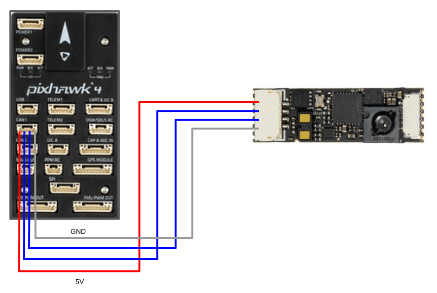

In addition to any other configuration, you will need to set the parameter [UAVCAN_ENABLE](../advanced_config/parameter_reference.md#UAVCAN_ENABLE) to either 2 or 3, depending on your system:

- `UAVCAN_ENABLE=2`: DroneCAN sensors but no motor controllers.
- `UAVCAN_ENABLE=3`: DroneCAN sensors and motor controllers.

For general information about DroneCAN wiring and configuration see: [DroneCAN Peripherals](../dronecan/index.md).

## Holybro PMW3901 Optical Flow Sensor

The [Holybro PMW3901 Optical Flow Sensor](https://holybro.com/products/pmw3901-optical-flow-sensor) exposes a PMW3901 optical flow module via a UART interface.

The board doesn't include a distance sensor onboard, so you will need to use an [external distance sensor](#external-rangefinders).

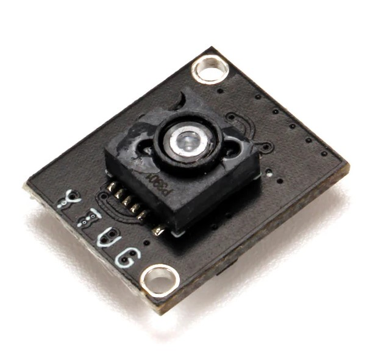
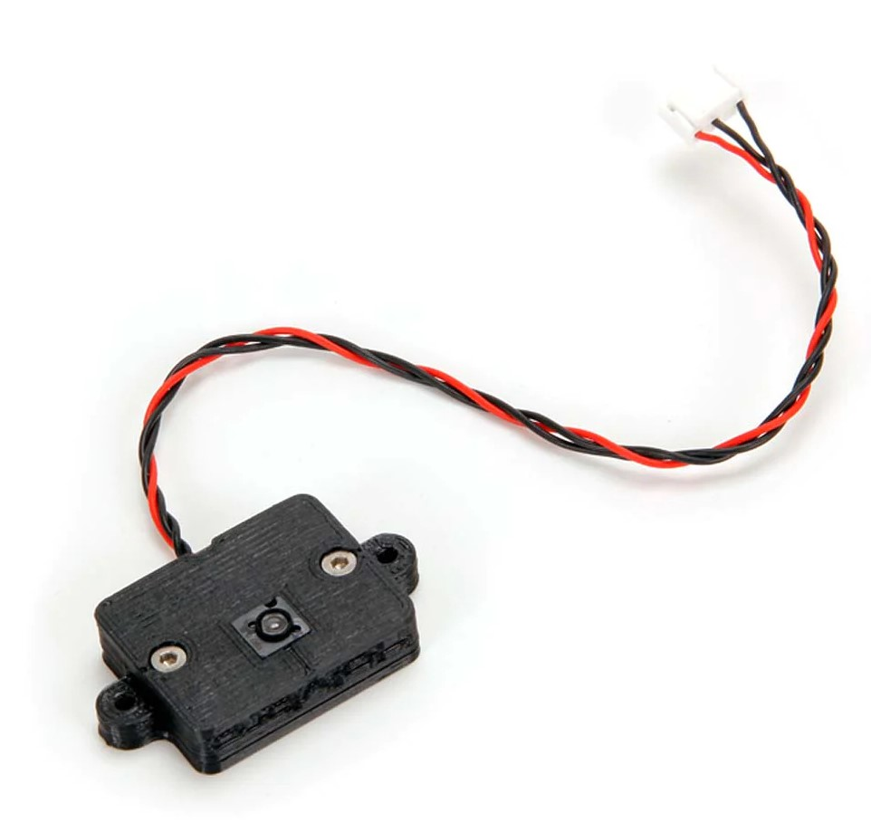

It comes with a 3D printed case and has a pre-soldered TX, Voltage, and GND 4 pin connector that can be plugged into the telemetry port of your flight controller, as shown below (for the Pixhawk 6C).

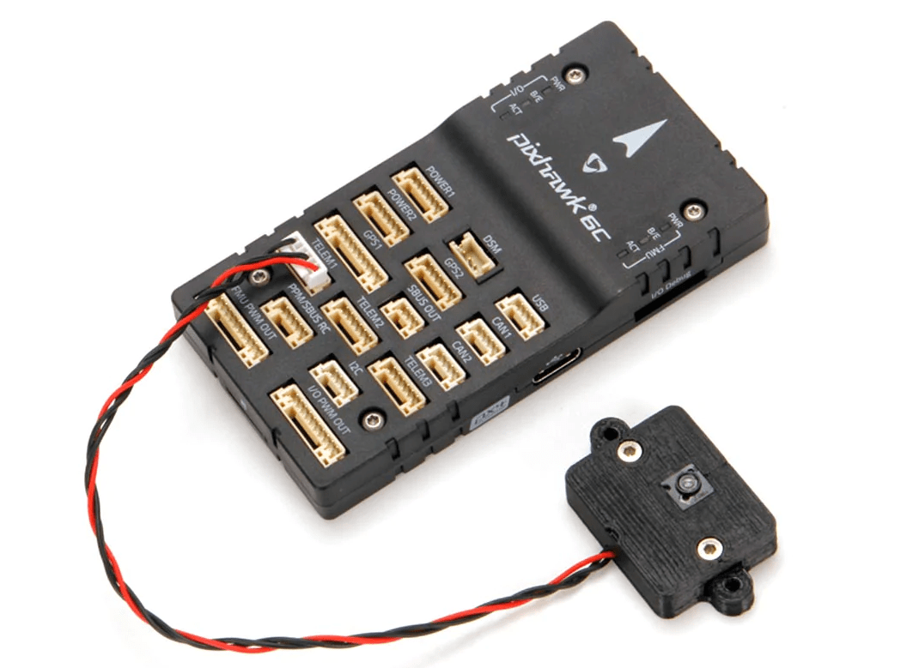

## Thone ThoneFlow-3901U

The Thone [ThoneFlow-3901U](https://www.seeedstudio.com/ThoneFlow-3901U-UART-Serial-Version-PMW3901-Optical-Flow-Sensor-p-4040.html) exposes a PMW3901 optical flow module via a UART interface.

The board doesn't include a distance sensor onboard, so you will need to use an [external distance sensor](#external-rangefinders).

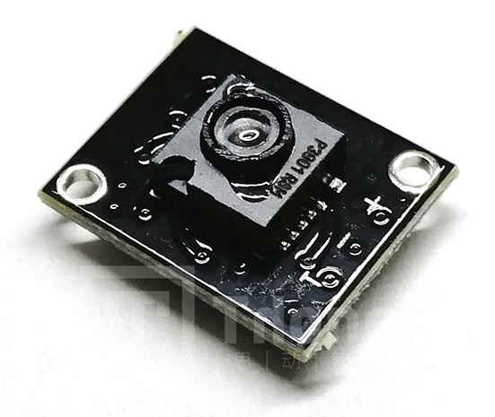

<!-- note, this will be set using SENS_TFLOW_CFG
Wiring is also required.
-->

[PX4 configuration](#px4-configuration) and [mounting/orientation](#mounting-orientation) instructions are provided above.

In addition, you must also set the parameter [SENS_TFLOW_CFG](../advanced_config/parameter_reference.md#SENS_TFLOW_CFG) to the value of the UART port you connected (e.g. if the sensor is connected to `TELEM 2` then set `SENS_TFLOW_CFG=102`. For more information see [Serial Port Configuration](../peripherals/serial_configuration.md).

[1]: ../../assets/hardware/sensors/pmw3901/tindie_notch.jpg
[2]: ../../assets/hardware/sensors/pmw3901/hex_hereflow_notch.jpg
[3]: ../../assets/hardware/sensors/pmw3901/thoneflow_3901u_notch.jpg
[4]: ../../assets/hardware/sensors/pmw3901/alientek_pmw3901_notch.jpg
