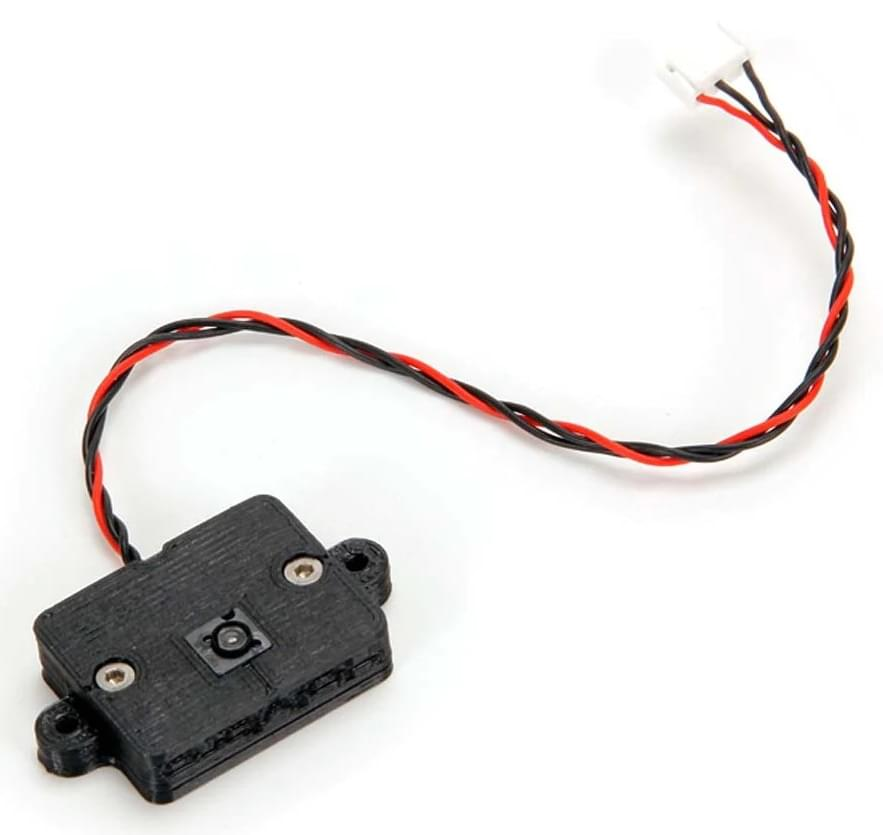

# Датчики на основі PMW3901 для вимірювання потоку

PMW3901 - це [оптичний потік](../sensor/optical_flow.md) ASIC, який обчислює потік внутрішньо і надає різницю в пікселях між кожною кадром. Він використовує сенсор відстеження, який схожий на те, що ви знайдете в комп'ютерній мишці, але адаптований для роботи від 80 мм і безмежжя. PMW3901 використовується в декількох продуктах, включаючи деякі від Bitcraze, Tindie, Hex, Thone та Alientek

Ця тема містить посилання на датчики, які були протестовані, разом з інформацією про кріплення та конфігурацію PX4 (це загальне для всіх датчиків цього типу).

## Плати, які використовують PMW3901

Наступна таблиця показує деякі плати, які використовують цей датчик, зазначаючи кількість інтерфейсів, кількість датчиків, вхідну напругу та розмір. Назва дошки посилається на розділи, що містять інформацію про підключення та інформацію про покупку.

| Виробництво | Материнська плата                                                                    | Інтерфейс | Потік | Далекомір | Гіроскоп | Напруга (V) | Розмір (мм) | Максимальна висота (м) |
| ----------- | ------------------------------------------------------------------------------------ | --------- | ----- | --------- | -------- | ----------- | ----------- | ---------------------- |
| Bitcraze    | [Розбивка потоку](#bitcraze-flow-breakout)                                           | SPI       | Y     | Y         | -        | 3 - 5       | 21x20       | 1                      |
| Tindie      | [Оптичний датчик потоку PMW3901](#tindie-pmw3901-optical-flow-sensor)                | SPI       | Y     | -         | -        | 3 - 5       | AxB         | -                      |
| Hex         | [HereFlow PMW3901 Оптичний датчик потоку](#hex-hereflow-pmw3901-optical-flow-sensor) | CAN       | Y     | Y         | Y        | 3 - 5       | AxB         | 4                      |
| Holybro     | [Holybro PMW3901 Оптичний датчик потоку](#holybro-pmw3901-optical-flow-sensor)       | UART      | Y     | -         | -        | 3 - 5       | AxB         | -                      |
| Thone       | [Thone ThoneFlow-3901U](#thone-thoneflow-3901u)                                      | UART      | Y     | -         | -        | 3 - 5       | AxB         | -                      |
| Alientek    | [ATK-PMW3901](#alientek-atk-pmw3901)                                                 | SPI       | Y     | -         | -        | 3.3 - 4.2   | 27.5x16.5   | 1                      |

## Підтримувані дальномери

Зовнішній дальномер / датчик відстані _потрібний_ для датчиків, які не мають дальномера (наприклад, _Tindie_ або _Thone_) і _рекомендований_ для інших плат (оскільки їхній діапазон доволі обмежений).

Діапазон, необхідний для застосування, залежить від програми:

- Польот у приміщенні: ≈4 метри
- Польот на відкритому повітрі: ≥10 метрів (наприклад, для підтримки контролю за позицією в середовищах, де можуть виникнути проблеми з GPS)

Будь-який [дальномер/датчик відстані](../sensor/rangefinders.md), підтримуваний PX4, може бути використаний. Датчик може бути встановлений будь-де, але повинен бути спрямований вниз і повинен бути підключений/налаштований як зазвичай.

:::tip
Команда PX4 головним чином тестувала використання [Lidar Lite V3](../sensor/lidar_lite.md) на більших транспортних засобах та [Lanbao CM8JL65](../sensor/cm8jl65_ir_distance_sensor.md) на менших транспортних засобах.
:::

## Монтаж/Орієнтація

Модулі потоку зазвичай встановлюються близько до центру транспортного засобу. Якщо встановлено не по центру, вам потрібно встановити зміщення: [Оптичний потік > EKF2](../sensor/optical_flow.md#ekf2).

Модулі процесу можуть бути встановлені з будь-якою орієнтацією Yaw, відносно системи тіла автомобіля, але ви повинні встановити значення, яке використовується в [SENS_FLOW_ROT](../advanced_config/parameter_reference.md#SENS_FLOW_ROT).

"Нульовий" обертання - це коли плата сенсора та вісі X транспортного засобу [транспортного засобу](../getting_started/px4_basic_concepts.md#heading-and-directions) вирівнюються (тобто "перед" транспортного засобу та плата знаходяться в одному напрямку), з обертанням, що збільшується в годинниковому напрямку.

Модулі PMW3901 мають невеликий виступ, що вказує напрямок **задньої** частини плати. Схема показує відносні орієнтації дошки та транспортного засобу, які відповідають `SENS_FLOW_ROT=0` (зверніть увагу на виступ ззаду).

Діаграма вище показує дошку Bitcraze. Ви можете використовувати виступ, щоб знайти орієнтацію інших плат у тому ж самому способі:

| &nbsp;                                       | &nbsp;                                                                                            |
| -------------------------------------------- | ------------------------------------------------------------------------------------------------- |
| Tindie ![PMW3901 Tindie Notch][1]   | Hex Hereflow ![PMW3901 Hereflow Notch][2]                                                |
| Thone ![PMW3901 Thoneflow Notch][3] | Alientek (також має стрілку, що вказує на передню частину!) ![PMW3901 Alientek Notch][4] |

## Налаштування PX4

Конфігурація PX4, яка є загальною для всіх плат на основі PMW3901:

- [Оптичний потік > EKF2](../sensor/optical_flow.md#ekf2) пояснює, як об'єднати дані оптичного потоку в оцінювачі EKF2 та встановити зсуви позиції для монтажного положення датчика потоку.
- [SENS_FLOW_ROT](../advanced_config/parameter_reference.md#SENS_FLOW_ROT) встановлює орієнтацію датчика потоку відносно напрямку руху транспортного засобу.

Окрім того для:

- Для підключених по шині SPI датчиків вам потрібно встановити [SENS_EN_PMW3901](../advanced_config/parameter_reference.md#SENS_EN_PMW3901) на `1`, щоб увімкнути драйвер датчика.
- Датчики, підключені через UART (наприклад, ThoneFlow-3901UY), ви повинні [налаштувати відповідний послідовний порт](../peripherals/serial_configuration.md), встановивши параметр [SENS_TFLOW_CFG](../advanced_config/parameter_reference.md#SENS_TFLOW_CFG) на значення підключеного порту UART (наприклад, якщо ви підключили цей датчик до `TELEM 2`, вам потрібно встановити `SENS_TFLOW_CFG` на `102`).
- Датчики DroneCAN вам потрібно належним чином встановити `UAVCAN_ENABLE`. Для отримання додаткової інформації див. [Пристрої DroneCAN](../dronecan/index.md) (та [документацію HereFlow PMW3901 нижче](#dronecan_wiring)).

Індивідуальні датчики потоку додатково налаштовуються/конфігуруються, як описано в розділах нижче.

## Розгалуження Bitcraze Flow

Прямий вихід [Bitcraze Flow breakout](https://www.bitcraze.io/products/flow-breakout/) безпосередньо використовує інтерфейс [SPI](#spi-wiring) з модуля PMW3901.

До плати також включено датчик відстані [підключений до порту I2C Pixhawk](#i2c-wiring). Цей датчик відстані - це датчик ToF VL53L0x від STMicroelectronics. Діапазон сенсора мінімальний (2 метри) і буде зменшуватися під час польоту на сонці. Тому ми настійно рекомендуємо використовувати [зовнішній датчик відстані](#external-rangefinders).

[Налаштування PX4](#px4-configuration) та інструкції з [монтажу/орієнтації](#mounting-orientation) наведені вище.

### Підключення SPI

PMW3901, якщо підключений до порту SPI на Pixhawk 4, автоматично виявить модуль потоку Bitcraze. Драйвер цього пристрою був явно написаний для підключення до порту SPI за допомогою вибору чіпа 1. Не потрібно налаштовувати жодних параметрів, окрім [орієнтації та положення сенсора](#mounting-orientation).

Схема виводів для порту SPI Pixhawk до плати Bitcraze Flow показана нижче (схема виводів однакова для всіх версій Pixhawk FMU).

| Порт SPI Pixhawk (зліва направо) | Плата потоку Bitcraze |
| -------------------------------- | --------------------- |
| 1 (VCC)                          | VCC                   |
| 2 (SCK)                          | CLK                   |
| 3 (MISO)                         | MISO                  |
| 4 (MOSI)                         | MOSI                  |
| 5 (CS1)                          | CS                    |
| 6 (CS2)                          | Не підключайте        |
| 7 (GND)                          | GND                   |

Щоб підключити плату bitcraze flow до Pixhawk, вам потрібно злити дроти кабелю SPI Pixhawk на плату flow. Кабель SPI має 7 провідів, з яких потрібно підключити 6 до плати потоку.

Наступна діаграма показує, як підключити датчик до Pixhawk 4.

### Підключення I2C

Проводка I2C однакова для будь-якого іншого датчика відстані. Просто підключіть SLA, SLC, GND та VCC до відповідних (таких же) контактів на Pixhawk та сенсорі.

## Оптичний датчик потоку Tindie PMW3901

Оптичний датчик потоку PMW3901 від Tindie [PMW3901](https://www.tindie.com/products/onehorse/pmw3901-optical-flow-sensor/) використовує інтерфейс SPI з модуля PMW3901 точно так само, як і модуль від Bitcraze (див. [SPI підключення](#spi-wiring)).

Датчик не має вбудованого датчика відстані, тому вам потрібно використовувати [зовнішній датчик відстані](#external-rangefinders).

[Налаштування PX4](#px4-configuration) та інструкції з [монтажу/орієнтації](#mounting-orientation) наведені вище.

## AlienTek ATK-PMW3901

Оптичний датчик потоку AlienTek [ATK-PMW3901](https://www.aliexpress.com/i/32979605707.html) використовує інтерфейс SPI з модуля PMW3901 точно так само, як і модуль від Bitcraze (див. [SPI підключення](#spi-wiring)).

Плата також включає датчик відстані (ми рекомендуємо використовувати [зовнішній датчик відстані](#external-rangefinders)). Ви можете підключити внутрішній датчик до порту I2C Pixhawk [так само, як і будь-який інший пристрій I2C.](#i2c-wiring) Нижче наведено знімок екрану, на якому показані контакти I2C (SLA, SLC, GND та VCC).

[Налаштування PX4](#px4-configuration) та інструкції з [монтажу/орієнтації](#mounting-orientation) наведені вище.

## Hex HereFlow Оптичний датчик потоку PMW3901

Шестигранний [Оптичний датчик потоку HereFlow PMW3901](http://www.proficnc.com/all-products/185-pixhawk2-suite.html) - це маленька плата, що містить модуль потоку PMW3901, датчик відстані VL53L1X та ІІМ (використовується для синхронізації даних потоку з даними гіроскопа).

Вбудований мікроконтролер зразки три датчики та публікує дві повідомлення DroneCAN, що містять всю інформацію, необхідну для розрахунків датчика потоку та відстані.

Плата може бути підключена до будь-якого порту CAN на будь-якій платі Pixhawk (див. [Проводка DroneCAN](#dronecan_wiring)).

Щодо інших плат оптичного потоку, ми рекомендуємо використовувати [зовнішній датчик відстані](#external-rangefinders).

[Налаштування PX4](#px4-configuration) та інструкції з [монтажу/орієнтації](#mounting-orientation) наведені вище.

### Проводка/Налаштування DroneCAN

Схема нижче показує, як підключити датчик до шини CAN Pixhawk 4.

Крім іншої конфігурації, вам потрібно встановити параметр [UAVCAN_ENABLE](../advanced_config/parameter_reference.md#UAVCAN_ENABLE) на значення 2 або 3, залежно від вашої системи:

- `UAVCAN_ENABLE=2`: Датчики DroneCAN, але без контролерів двигунів.
- `UAVCAN_ENABLE=3`: Датчики DroneCAN та контролери двигунів.

Для загальної інформації про підключення та налаштування DroneCAN див.: [Пристрої DroneCAN](../dronecan/index.md).

## Holybro PMW3901 Оптичний датчик потоку

Оптичний датчик руху [Holybro PMW3901](https://holybro.com/products/pmw3901-optical-flow-sensor) відкриває модуль оптичного потоку PMW3901 через інтерфейс UART.

Плата не містить вбудованого датчика відстані, тому вам доведеться використовувати [зовнішній датчик відстані](#external-rangefinders).

Це поставляється з корпусом, надрукованим у 3D, та передпаяним TX, напругою та GND 4-контактним роз'ємом, який можна підключити до порту телеметрії вашого контролера польоту, як показано нижче (для Pixhawk 6C).

## Thone ThoneFlow-3901U

Thone [ThoneFlow-3901U](https://www.seeedstudio.com/ThoneFlow-3901U-UART-Serial-Version-PMW3901-Optical-Flow-Sensor-p-4040.html) відкриває модуль оптичного потоку PMW3901 через інтерфейс UART.

Плата не має вбудованого датчика відстані, тому вам потрібно використовувати [зовнішній датчик відстані](#external-rangefinders).

<!-- note, this will be set using SENS_TFLOW_CFG
Wiring is also required.
-->

[Налаштування PX4](#px4-configuration) та інструкції з [монтажу/орієнтації](#mounting-orientation) наведені вище.

Крім того, вам також потрібно встановити параметр [SENS_TFLOW_CFG](../advanced_config/parameter_reference.md#SENS_TFLOW_CFG) на значення порту UART, до якого ви підключилися (наприклад, якщо сенсор підключений до `TELEM 2`, тоді встановіть `SENS_TFLOW_CFG=102`. Для додаткової інформації дивіться [Конфігурація послідовного порту](../peripherals/serial_configuration.md).

[1]: ../../assets/hardware/sensors/pmw3901/tindie_notch.jpg
[2]: ../../assets/hardware/sensors/pmw3901/hex_hereflow_notch.jpg
[3]: ../../assets/hardware/sensors/pmw3901/thoneflow_3901u_notch.jpg
[4]: ../../assets/hardware/sensors/pmw3901/alientek_pmw3901_notch.jpg
