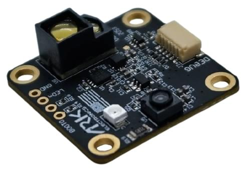

# Датчики відстані (далекодобива)

Датчики відстані надають вимірювання відстані, які можуть бути використані для [слідування за місцевістю](../flying/terrain_following_holding.md#terrain_following), [утримання на місці](../flying/terrain_following_holding.md#terrain_hold) (тобто точне зависання для фотографії), покращення поведінки при посадці ([умовна допомога в діапазоні](../advanced_config/tuning_the_ecl_ekf.md#conditional-range-aiding)), попередження про регуляторні висотні обмеження, запобігання зіткненням тощо.

Цей розділ містить перелік датчиків відстані, підтримуваних PX4 (посилання на більш докладну документацію), [загальну конфігурацію](#configuration), необхідну для всіх дальномерів, [тестування](#testing) та інформацію про [класичну симуляцію Gazebo](#gazebo-classic-simulation). Додаткову інформацію щодо налаштування та конфігурації надається в темах, посилених нижче (та в бічній панелі).



## Підтримувані дальномери

### ARK Flow

[ARK Потік](../dronecan/ark_flow.md) - це модуль сенсора відкритого коду Time-of-Flight (ToF) та оптичного потоку, який здатний вимірювати відстані від 8 см до 30 м. Він може бути підключений до контролера польоту через свій порт CAN1, що дозволяє підключати додаткові датчики через свій порт CAN2. Підтримує [DroneCAN](../dronecan/index.md), працює з [Прошивкою PX4 DroneCAN](../dronecan/px4_cannode_fw.md) та упакований у крихітний форм-фактор.

### Лідар Holybro ST VL53L1X

[VL53L1X](https://holybro.com/products/st-vl53l1x-lidar) - це передовий лазерно-вимірювальний сенсор часу польоту (ToF), який покращує продуктову лінійку ST FlightSense™. Це найшвидший мініатюрний датчик ToF на ринку з точним вимірюванням до 4 м і швидкою частотою вимірювання до 50 Гц.

Він поставляється з роз'ємом JST GHR 4 pin, який сумісний з портом I2C на [Pixhawk 4](../flight_controller/pixhawk4.md), [Pixhawk 5X](../flight_controller/pixhawk5x.md) та іншими контролерами польоту, які відповідають [Стандарту роз'ємів Pixhawk](https://github.com/pixhawk/Pixhawk-Standards/blob/master/DS-009%20Pixhawk%20Connector%20Standard.pdf)).

### Lidar-Lite

[Lidar-Lite](../sensor/lidar_lite.md) - це компактний, високопродуктивний оптичний дальніметр для вимірювання відстані. Він має діапазон сенсора від (5см - 40м) і може бути підключений до портів PWM або I2C.

### MaxBotix I2CXL-MaxSonar-EZ

Дальність MaxBotix [I2CXL-MaxSonar-EZ](https://www.maxbotix.com/product-category/i2cxl-maxsonar-ez-products) має кілька досить короткодіючих датчиків відстані на основі сонару, які підходять для допомоги при зльоті/посадці та уникнення зіткнень. Ці можуть бути підключені за допомогою порту I2C.

Дальномери активовані за допомогою параметра [SENS_EN_MB12XX](../advanced_config/parameter_reference.md#SENS_EN_MB12XX).

### Лідари Lightware

[Лідар Lightware SFxx](../sensor/sfxx_lidar.md) надає широкий спектр легких "лазерних альтиметрів", які підходять для багатьох додатків дронів.

PX4 підтримує: SF11/c та SF/LW20. PX4 також може бути використаний з наступними припиненими моделями: SF02, SF10/a, SF10/b, SF10/c.

PX4 також підтримує [LightWare LiDAR SF45 Обертовий Лідар](https://www.lightwarelidar.com/shop/sf45-b-50-m/) для застосувань у [запобіганні зіткнень](../computer_vision/collision_prevention.md#lightware-lidar-sf45-rotating-lidar).

### Дальніміри TeraRanger

[TeraRanger](../sensor/teraranger.md) надає ряд легких сенсорів вимірювання відстані на основі інфрачервоної технології часу польоту (ToF). Вони зазвичай швидші і мають більший діапазон, ніж ехолокатори, і менші та легші, ніж системи на основі лазера.

PX4 підтримує наступні моделі, підключені через шину I2C: TeraRanger One, TeraRanger Evo 60m та TeraRanger Evo 600Hz.

### Стандартний радарний висотомір Ainstein US-D1

Стандартний радіолокатор висоти [US-D1](../sensor/ulanding_radar.md) від _Ainstein_ - це компактний мікрохвильовий дальномер, який був оптимізований для використання на БПЛА. Він має діапазон виявлення близько 50м. Особливі переваги цього продукту полягають в тому, що він може ефективно працювати в усіх погодних умовах і на всіх типах місцевості (включаючи воду).

### LeddarOne

[LeddarOne](../sensor/leddar_one.md) - це невеликий модуль Lidar з вузьким, але розсіяним променем, який пропонує відмінний загальний діапазон виявлення та продуктивність в міцному, надійному та економічному пакеті. Він має діапазон відчуття від 1 см до 40 м і потребує підключення до шини UART/серійного порту.

### TFmini

Лідар [Benewake TFmini](../sensor/tfmini.md) - це крихітний, недорогий та енергоефективний лідар з дальністю 12 м.

### PSK-CM8JL65-CC5

Датчик відстані ІЧ вимірювання [Lanbao PSK-CM8JL65-CC5 ToF](../sensor/cm8jl65_ir_distance_sensor.md) є дуже малий (38 мм х 18 мм х 7 мм, <10 г) датчик відстані з діапазоном від 0,17 м до 8 м і роздільною здатністю у міліметрах. Він повинен бути підключений до шини UART/серійного порту.

### Авіоніка Анонімний UAVCAN Лазерний Альтиметр Інтерфейс

Інтерфейс лазерного альтиметра [Avionics Anonymous UAVCAN](../dronecan/avanon_laser_interface.md) дозволяє підключати кілька поширених дальномерів (наприклад, [Lightware SF11/c, SF30/D](../sensor/sfxx_lidar.md) тощо) до шини [CAN](../can/index.md) через [DroneCAN](../dronecan/index.md), інтерфейс, що є надійнішим, ніж I2C.

<a id="configuration"></a>

## Конфігурація/Налаштування

Дальні вимірювачі зазвичай підключаються до порту або послідовного (PWM), або I2C (залежно від драйвера пристрою), і активуються на порту шляхом встановлення певного параметра.

Апаратне та програмне забезпечення, яке _специфічне для кожного датчика_ відстані, описано в їхніх окремих темах.

Загальна конфігурація, яка є _спільною для всіх відстанційних датчиків_, охоплюючи як фізичне налаштування, так і використання, наведена нижче.

### Загальна конфігурація

Загальна конфігурація дальномера вказується за допомогою параметрів [EKF2_RNG\_\*](../advanced_config/parameter_reference.md#EKF2_RNG_CTRL). Ці включають (не вичерпно):

- [EKF2_RNG_POS_X](../advanced_config/parameter_reference.md#EKF2_RNG_POS_X), [EKF2_RNG_POS_Y](../advanced_config/parameter_reference.md#EKF2_RNG_POS_Y), [EKF2_RNG_POS_Z](../advanced_config/parameter_reference.md#EKF2_RNG_POS_Z) - зміщення дальномера від центру ваги транспортного засобу в напрямках X, Y, Z.
- [EKF2_RNG_PITCH](../advanced_config/parameter_reference.md#EKF2_RNG_PITCH) - Значення 0 градусів (типове) відповідає тому, що дальномер точно вирівняний з вертикальною віссю літального апарата (тобто прямо вниз), тоді як 90 градусів показує, що дальномер спрямований вперед. Проста тригонометрія використовується для обчислення відстані до землі, якщо використовується ненульовий кут нахилу.
- [EKF2_RNG_DELAY](../advanced_config/parameter_reference.md#EKF2_RNG_DELAY) - приблизна затримка даних, що надходять до оцінювача від датчика.
- [EKF2_RNG_SFE](../advanced_config/parameter_reference.md#EKF2_RNG_SFE) - Масштабування шуму, залежного від дальномера.
- [EKF2_RNG_NOISE](../advanced_config/parameter_reference.md#EKF2_RNG_NOISE) - Шум вимірювання для об'єднання дальномера

## Тестування

Найлегший спосіб перевірити дальномер - змінювати діапазон і порівнювати зі значеннями, виявленими PX4. Нижче наведено деякі підходи до отримання виміряного діапазону.

### Інспектор MAVLink QGroundControl

_Інспектор MAVLink QGroundControl_ дозволяє переглядати повідомлення, відправлені з апарату, включаючи інформацію `DISTANCE_SENSOR` від дальномера. Основна відмінність між інструментами полягає в тому, що інструмент _Аналізувати_ може побудувати значення на графіку.

:::note
Повідомлення, які надсилаються, залежать від конфігурації транспортного засобу. Ви отримаєте повідомлення лише, якщо підключений транспортний засіб має встановлений дальніомір і публікує значення сенсора `DISTANCE_SENSOR`.
:::

Для перегляду виводу дальномера:

1. Відкрийте меню **Q > Вибір Інструменту > Інструменти Аналізу**:

   

1. Виберіть повідомлення `DISTANCE_SENSOR`, а потім встановіть прапорець графіку проти `current_distance`. Інструмент потім побудує результат: 

### Консоль QGroundControl MAVLink

Ви також можете використовувати _QGroundControl MAVLink Console_, щоб спостерігати за темою uORB `distance_sensor`:

```sh
listener distance_sensor 5
```

:::note
Консоль _QGroundControl MAVLink_ працює при підключенні до Pixhawk або інших цілей NuttX, але не до Симулятора. На симуляторі ви можете виконувати команди безпосередньо в терміналі.
:::

Для отримання додаткової інформації див.: [Розробка > Налагодження/Журналювання> Налагодження датчика/Теми за допомогою команди слухача](../debug/sensor_uorb_topic_debugging.md).

## Класичний симулятор Gazebo

Лідар та сонарні дальномери можуть бути використані в симуляторі [Gazebo Classic](../sim_gazebo_classic/index.md). Для цього вам потрібно запустити симулятор, використовуючи модель автомобіля, яка включає дальномір.

Модель оптичного потоку ірису включає лідарний дальномер:

```sh
make px4_sitl gazebo-classic_iris_opt_flow
```

Тайфун_h480 включає в себе зондовий дальномер:

```sh
make px4_sitl gazebo-classic_typhoon_h480
```

Якщо вам потрібно використовувати інше транспортний засіб, ви можете включити модель у файл конфігурації. Ви можете побачити, як у відповідних файлах конфігурації Iris та Typhoon:

- [iris_opt_flow.sdf](https://github.com/PX4/PX4-SITL_gazebo-classic/blob/main/models/iris_opt_flow/iris_opt_flow.sdf)

  ```xml
    <include>
      <uri>model://lidar</uri>
      <pose>-0.12 0 0 0 3.1415 0</pose>
    </include>
    <joint name="lidar_joint" type="revolute">
      <child>lidar::link</child>
      <parent>iris::base_link</parent>
      <axis>
        <xyz>0 0 1</xyz>
        <limit>
          <upper>0</upper>
          <lower>0</lower>
        </limit>
      </axis>
    </joint>
  ```

- [typhoon_h480.sdf](https://github.com/PX4/PX4-SITL_gazebo-classic/blob/main/models/typhoon_h480/typhoon_h480.sdf.jinja#L1131-L1145)

  ```xml
    <include>
      <uri>model://sonar</uri>
    </include>
    <joint name="sonar_joint" type="revolute">
      <child>sonar_model::link</child>
      <parent>typhoon_h480::base_link</parent>
      <axis>
        <xyz>0 0 1</xyz>
        <limit>
          <upper>0</upper>
          <lower>0</lower>
        </limit>
      </axis>
    </joint>
  ```
