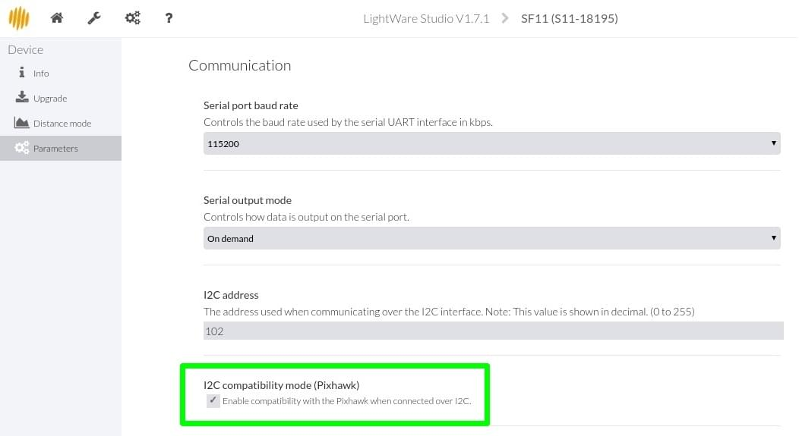

# Лідар LightWare SF1X/SF02/LW20

LightWare розробляє широкий спектр легких, загального призначення лазерних альтиметрів ("Lidar"), які підходять для установки на БПЛА. Ці інструменти корисні для застосувань, включаючи слідування за рельєфом, точне зависання у повітрі (наприклад, для фотографії), попередження про регуляторні висотні обмеження, антиколізійний датчик тощо.

## Підтримувані плати

Наступні моделі підтримуються PX4 та можуть бути підключені до шини I2C або Serial (таблиці нижче показують, яку шину можна використовувати для кожної моделі).

### Доступні

| Модель                                                     | Range (m) | Шина                 | Опис                                                                                   |
| ---------------------------------------------------------- | --------- | -------------------- | -------------------------------------------------------------------------------------- |
| [SF11/C](https://lightwarelidar.com/products/sf11-c-100-m) | 100       | Серійна або I2C шина |                                                                                        |
| [LW20/C](https://lightware.co.za/products/lw20-c-100-m)    | 100       | Шина I2C             | Водонепроникний (IP67) з сервоприводом для додатків з детекцією та уникненням перешкод |

### Знято з виробництва

Наступні моделі більше не доступні від виробника.

| Модель                                                                                             | Діапазон | Шина                                                                                                    |
| -------------------------------------------------------------------------------------------------- | -------- | ------------------------------------------------------------------------------------------------------- |
| [SF02](http://documents.lightware.co.za/SF02%20-%20Laser%20Rangefinder%20Manual%20-%20Rev%208.pdf) | 50       | Серія                                                                                                   |
| [SF10/A](http://documents.lightware.co.za/SF10%20-%20Laser%20Altimeter%20Manual%20-%20Rev%206.pdf) | 25       | Серійна або I2C шина                                                                                    |
| [SF10/B](http://documents.lightware.co.za/SF10%20-%20Laser%20Altimeter%20Manual%20-%20Rev%206.pdf) | 50       | Серійна або I2C шина                                                                                    |
| SF10/C                                                                                             | 100m     | Serial or I2C                                                                                           |
| LW20/B                                                                                             | 50       | I2C шина       | Водонепроникний (IP67) з сервоприводом для додатків з детекцією та уникненням перешкод |

## Налаштування I2C

Перевірте таблиці вище, щоб підтвердити, які моделі можна підключити до порту I2C.

### Конфігурація Lidar

Цей апаратне забезпечення не поставляється з підтримкою сумісності з Pixhawk I2C за замовчуванням. Щоб увімкнути підтримку, вам потрібно завантажити [LightWare Studio](https://lightwarelidar.com/pages/lightware-studio) та перейти до **Параметри > Зв'язок** та встановити позначку **Режим сумісності I2C (Pixhawk)**

### Апаратне забезпечення

Підключіть Лідар до порту автопілота I2C, як показано нижче (у цьому випадку для [Pixhawk 1](../flight_controller/mro_pixhawk.md)).

:::note
Деякі старі версії не можуть бути використані з PX4. Зокрема, вони можуть бути неправильно налаштовані на адресу I2C, рівну `0x55`, що конфліктує з модулем `rgbled`. На системах Linux ви можете визначити адресу, використовуючи [i2cdetect](https://linux.die.net/man/8/i2cdetect). Якщо адреса I2C дорівнює `0x66`, сенсор може бути використаний з PX4.
:::

### Налаштування параметрів

Встановіть параметр [SENS_EN_SF1XX](../advanced_config/parameter_reference.md#SENS_EN_SF1XX) для відповідності моделі дальноміра, а потім перезавантажте.

## Серійне налаштування

### Апаратне забезпечення

Лідар може бути підключений до будь-якого не використаного _серійного порту_ (UART), наприклад: TELEM2, TELEM3, GPS2 тощо.

<!-- Would be good to show serial setup! -->

### Налаштування параметрів

[Налаштуйте послідовний порт](../peripherals/serial_configuration.md), на якому буде працювати лідар, використовуючи [SENS_SF0X_CFG](../advanced_config/parameter_reference.md#SENS_SF0X_CFG). Немає потреби встановлювати швидкість передачі для порту, оскільки це налаштовано драйвером.

:::info Якщо параметр конфігурації недоступний у _QGroundControl_, можливо, вам доведеться [додати драйвер до мікропрограми](../peripherals/serial_configuration.md#parameter_not_in_firmware).
:::

Потім встановіть параметр [SENS_EN_SF0X](../advanced_config/parameter_reference.md#SENS_EN_SF0X) для відповідності моделі дальноміра та перезавантажте.

## Детальна інформація

- [Довідник модулів: Датчик відстані (Драйвер) : lightware_laser_i2c](../modules/modules_driver_distance_sensor.md#lightware-laser-i2c)
- [Довідник модулів: Датчик відстані (Драйвер): lightware_laser_serial](../modules/modules_driver_distance_sensor.md#lightware-laser-serial)
