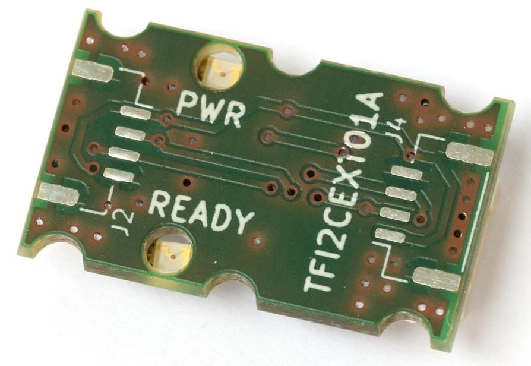

# Периферійні пристрої шини I2C

[I2C](https://en.wikipedia.org/wiki/I2C) є послідовним протоколом зв'язку, який зазвичай використовується (принаймні на менших дронах), для підключення периферійних компонентів, таких як далекобійники, світлодіоди, компас, і т. д.

Рекомендовано для:

* Connecting offboard components that require low bandwidth and low latency communication, e.g. [rangefinders](../sensor/rangefinders.md), [magnetometers](../gps_compass/magnetometer.md), [airspeed sensors](../sensor/airspeed.md) and [tachometers](../sensor/tachometers.md) .
* Сумісність з периферійними пристроями, які підтримують лише I2C.
* Можливість підключення декількох пристроїв до однієї шини, що корисно для збереження портів.

I2C дозволяє підключати декілька головних пристроїв до декількох рабочих пристроїв, використовуючи лише 2 провідника на підключення (SDA, SCL). Теоретично шина може підтримувати 128 пристроїв, що кожен з них доступний за унікальною адресою.

:::info
UAVCAN зазвичай було б бажаною альтернативою там, де потрібні вищі швидкості передачі даних, і на великих літальних апаратах, де датчики можуть бути встановлені далеко від контролера польоту.
:::


## Підключення

I2C використовує пару проводів: SDA (серійні дані) та SCL (серійний годинник). Шина є типу відкритого стоку, що означає, що пристрої заземлюють лінію даних. Він використовує резистор імпульсу, щоб відправити його до `log.` (стан покою) використовується підтягуючий резистор - кожен провідник зазвичай розташований на пристроях, що завершують шину. Одна шина може підключати до кількох пристроїв I2C. Індивідуальні пристрої підключені без перетину.

Для підключення (згідно зі стандартом dronecode) використовуються 4-жильні кабелі з роз'ємами JST-GH. Для забезпечення надійного спілкування та зменшення перехресного контролю рекомендується застосувати рекомендації щодо [заплетення кабелю](../assembly/cable_wiring.md#i2c-cables) та розташування підтягуючих резисторів.


## Перевірка статусу шини та пристроїв

Корисний інструмент для аналізу шини є [i2cdetect](../modules/modules_command.md#i2cdetect). Це список доступних пристроїв I2C за їх адресами. Він може бути використаний для визначення доступності пристрою на шині та можливості автопілота спілкуватися з ним.

Інструмент можна запустити в терміналі PX4 за допомогою наступної команди:

```
i2cdetect -b 1
```
де номер шини вказується після параметра `-b`


## Поширені проблеми

### Конфлікти адрес

Якщо два пристрої I2C на шині мають однаковий ідентифікатор, відбудеться конфлікт, і жоден з пристроїв не буде працювати належним чином (або взагалі). Це зазвичай трапляється тому, що користувач повинен підключити два сенсори одного типу до шини, але це також може статися, якщо пристрої використовують однакові адреси за замовчуванням.

Деякі конкретні пристрої I2C можуть дозволити вибрати нову адресу для одного з пристроїв, щоб уникнути конфлікту. Деякі пристрої не підтримують цю опцію, або не мають широких варіантів адрес, які можна використовувати (тобто не можуть бути використані для уникнення конфлікту).

Якщо ви не можете змінити адреси, то один варіант - використовувати [I2C Address Translator](#i2c-address-translators).

### Недостатня пропускна здатність передачі

Пропускна здатність, доступна для кожного окремого пристрою, зазвичай зменшується зі збільшенням кількості пристроїв. Точне зменшення залежить від пропускної здатності, використованої кожним окремим пристроєм. Тому можливо підключити багато пристроїв з низькою пропускною здатністю, наприклад, [тахометри](../sensor/tachometers.md). Якщо додати занадто багато пристроїв, це може призвести до помилок передачі та ненадійності мережі.

Є кілька способів зменшення проблеми:
* Розподілити пристрої на групи, кожна з приблизно однаковою кількістю пристроїв та підключити кожну групу до одного порту автопілота
* Збільшити ліміт швидкості шини (звичайно встановлений в 100кГц для зовнішнього I2C bus)

### Надмірна ємність проводки

Електрична ємність шини проводки зростає, коли додаються більше пристроїв/проводів. Точне зменшення залежить від загальної довжини шини проводки та специфічної ємності проводки. Проблему можна проаналізувати за допомогою осцилографа, де ми бачимо, що краї сигналів SDA/SCL вже не гострі.

Є кілька способів зменшення проблеми:
* Розділення пристроїв на групи, кожна з приблизно однаковою кількістю пристроїв та підключення кожної групи до одного порту автопілота
* Використання найкоротших і найвищої якості кабелів I2C, що можливо
* Відокремлення пристроїв зі слабким відкритим стоковим драйвером до меншої шини з нижчою ємністю
* [Прискорювачі шини I2C](#i2c-bus-accelerators)

## Прискорювачі шини I2C

Посилювачі шини I2C - це окремі схеми, які можуть використовуватися для підтримки більшої довжини проводки на шині I2C. Вони працюють, фізично діливши мережу I2C на 2 частини та використовуючи свої транзистори для підсилення сигналів I2C.

Доступні прискорювачі включають:
- [Thunderfly TFI2CEXT01](https://github.com/ThunderFly-aerospace/TFI2CEXT01): 
  - Цей дронекод має з'єднувачі, тому це дуже легко додати до налаштування Pixhawk I2C.
  - Модуль не має налаштувань (він працює зразу після встановлення).


## Перетворювачі I2C адрес

Перетворювачі I2C адрес можуть використовуватися для запобігання конфліктів I2C адрес в системах, де немає іншого способу призначення унікальних адрес. Вони працюють, слухаючи I2C комунікацію та трансформуючи адресу, коли викликається пристрій-слейв (згідно з попередньо налаштованим алгоритмом).

До підтримуваних перетворювачів I2C адрес включають:

- [Thunderfly TFI2CADT01](../sensor_bus/translator_tfi2cadt.md)


## Розробка I2C

Розробка програмного забезпечення для пристроїв I2C описана в [Шині I2C (Огляд розробки)](../sensor_bus/i2c_development.md).

## Подальша інформація

* [I2C](https://en.wikipedia.org/wiki/I%C2%B2C) (Вікіпедія)
* [Порівняльний огляд I2C](https://learn.sparkfun.com/tutorials/i2c) (learn.sparkfun.com)
* [Фреймворк драйвера](../middleware/drivers.md)
