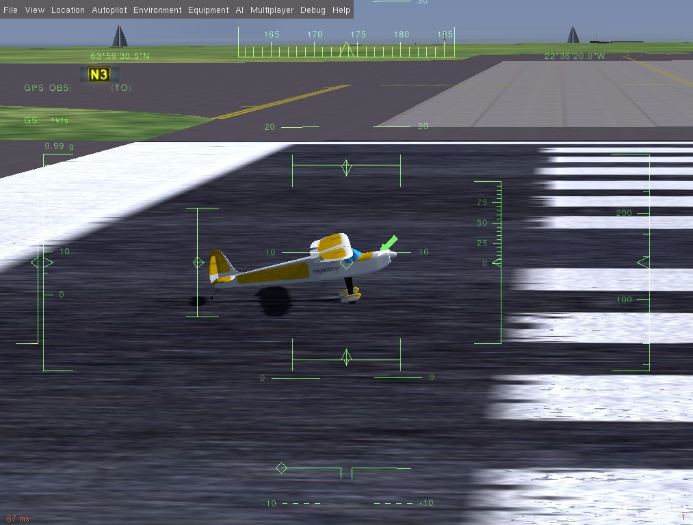

# Симуляція Flightgear

:::warning
Цей симулятор [підтримується та підтримується спільнотою](../simulation/community_supported_simulators.md). Це може працювати або не працювати з поточними версіями PX4.

Дивіться [Встановлення інструментарію](../dev_setup/dev_env.md) для інформації про середовища та інструменти, які підтримуються основною розробницькою командою.
:::

[FlightGear](https://www.flightgear.org/) - це симулятор польоту з потужними [моторами FDM](http://wiki.flightgear.org/Flight_Dynamics_Model). Це дозволяє FlightGear моделювати вертольоти в різних метеорологічних умовах (тому спочатку міст між ними був розроблений компанією [ThunderFly s.r.o.](https://www.thunderfly.cz/)).

Ця сторінка описує використання FlightGear з одним транспортним засобом у реальному часі на віртуальному полігоні (SITL). Для отримання інформації про багатокористувацьке використання дивіться: [Багатокористувацька симуляція з FlightGear](../sim_flightgear/multi_vehicle.md).

**Підтримувані Транспортні Засоби:** Автожир, Літак, Рухомий об'єкт.

<lite-youtube videoid="iqdcN5Gj4wI" title="[ThunderFly] PX4 SITL with Flightgear, Rascal110 - electric version"/>

[](https://mermaid-js.github.io/mermaid-live-editor/#/edit/eyJjb2RlIjoiZ3JhcGggTFI7XG4gIEZsaWdodEdlYXIgLS0-IEZsaWdodEdlYXItQnJpZGdlO1xuICBGbGlnaHRHZWFyLUJyaWRnZSAtLT4gTUFWTGluaztcbiAgTUFWTGluayAtLT4gUFg0X1NJVEw7XG5cdCIsIm1lcm1haWQiOnsidGhlbWUiOiJkZWZhdWx0In0sInVwZGF0ZUVkaXRvciI6ZmFsc2V9)


<!-- Original mermaid graph
graph LR;
  FlightGear-- >FlightGear-Bridge;
  FlightGear-Bridge-- >MAVLink;
  MAVLink-- >PX4_SITL;
-->

:::info Дивіться [Симуляція](../simulation/index.md) для загальної інформації про симулятори, середовище симуляції та конфігурацію симуляції (наприклад, підтримувані транспортні засоби).
:::

## Встановлення (Ubuntu Linux)

:::info
Ці інструкції були перевірені на Ubuntu 18.04
:::

1. Установіть звичайне [Середовище розробки на Ubuntu LTS / Debian Linux](../dev_setup/dev_env_linux_ubuntu.md).
1. Встановити FlightGear:

   ```sh
   sudo add-apt-repository ppa:saiarcot895/flightgear
   sudo apt update
   sudo apt install flightgear
   ```

   Це встановить останню стабільну версію FlightGear зі сховища PAA разом із пакетом FGdata.

:::tip
Для деяких моделей (наприклад, електричні двигуни) щоденна збірка з найновішими функціями може бути необхідною. Встановіть це за допомогою [щоденної збірки PPA](https://launchpad.net/~saiarcot895/+archive/ubuntu/flightgear-edge).
:::

1. Перевірте, що ви можете запустити FlightGear:

   ```sh
   fgfs --launcher
   ```

1. Установіть дозволи на запис до папки **Protocols** у каталозі встановлення FlightGear:

   ```sh
   sudo chmod a+w /usr/share/games/flightgear/Protocol
   ```

   Налаштування дозволів потрібне, оскільки PX4-FlightGear-Bridge розміщує тут файл визначення зв’язку.

Додаткові інструкції для встановлення можна знайти на [FlightGear wiki](http://wiki.flightgear.org/Howto:Install_Flightgear_from_a_PPA).

## Запуск симуляції

Запустіть симуляцію, запустивши PX4 SITL та вказавши конфігурацію повітряного каркасу на ваш вибір.

Найпростіший спосіб зробити це - відкрити термінал у кореневій директорії репозиторію PX4 _PX4-Autopilot_ і викликати `make` для потрібної цілі. Наприклад, для запуску симуляції літака:

```sh
cd /path/to/PX4-Autopilot
make px4_sitl_nolockstep flightgear_rascal
```

Нижче перелічено підтримувані транспортні засоби та команди `make` (клацніть по посиланнях, щоб побачити зображення транспортного засобу).

| Транспортний засіб                                                                          | Команда                                      |
| ------------------------------------------------------------------------------------------- | -------------------------------------------- |
| [Стандартний літак](../sim_flightgear/vehicles.md#standard-plane)                           | `make px4_sitl_nolockstep flightgear_rascal` |
| [Автомобіль Акермана (UGV/Rover)](../sim_flightgear/vehicles.md#ackerman-vehicle-ugv-rover) | `make px4_sitl_nolockstep flightgear_tf-r1`  |
| [Автогиро](../sim_flightgear/vehicles.md#autogyro)                                          | `make px4_sitl_nolockstep flightgear_tf-g1`  |

Вищенаведені команди запускають єдиний засіб з повним користувацьким інтерфейсом. _QGroundControl_ повинна автоматично підключатися до симульованого транспортного засобу.

:::info Для повного списку цілей побудови FlightGear (виділені) виконайте:

```sh
make px4_sitl_nolockstep list_vmd_make_targets | grep flightgear_
```

Для отримання додаткової інформації див. : [Літальні апарати FlightGear](../sim_flightgear/vehicles.md) (це включає інформацію про "непідтримувані" літальні апарати та додавання нових літальних апаратів).
:::

:::info Посібник [Встановлення файлів і коду](../dev_setup/dev_env.md) є корисним довідником якщо виникнуть помилки збірки.
:::

## Підйом у небо

Згадані вище команди `make` спочатку створюють PX4, а потім запускають його разом із симулятором FlightGear.

Після запуску PX4 запуститься оболонка PX4, як показано нижче. Ви повинні вибрати enter, щоб відкрити командний рядок.

```sh
______  __   __    ___
| ___ \ \ \ / /   /   |
| |_/ /  \ V /   / /| |
|  __/   /   \  / /_| |
| |     / /^\ \ \___  |
\_|     \/   \/     |_/

px4 starting.

INFO  [px4] Calling startup script: /bin/sh etc/init.d-posix/rcS 0
INFO  [param] selected parameter default file eeprom/parameters_1034
I'm Mavlink to FlightGear Bridge
Target Bridge Freq: 200, send data every step: 1
4
  5   -1
  7   -1
  2   1
  4   1
[param] Loaded: eeprom/parameters_1034
INFO  [dataman] Unknown restart, data manager file './dataman' size is 11798680 bytes
INFO  [simulator] Waiting for simulator to accept connection on TCP port 4560
INFO  [simulator] Simulator connected on TCP port 4560.
INFO  [commander] LED: open /dev/led0 failed (22)
INFO  [commander] Mission #3 loaded, 9 WPs, curr: 8
INFO  [mavlink] mode: Normal, data rate: 4000000 B/s on udp port 18570 remote port 14550
INFO  [airspeed_selector] No airspeed sensor detected. Переключитися в режим, що не використовує швидкість повітря.
INFO  [mavlink] mode: Onboard, data rate: 4000000 B/s on udp port 14580 remote port 14540
INFO  [mavlink] mode: Onboard, data rate: 4000 B/s on udp port 14280 remote port 14030
INFO  [logger] logger started (mode=all)
INFO  [logger] Start file log (type: full)
INFO  [logger] Opened full log file: ./log/2020-04-28/22_03_36.ulg
INFO  [mavlink] MAVLink only on localhost (set param MAV_{i}_BROADCAST = 1 to enable network)
INFO  [px4] Startup script returned successfully
pxh> StatsHandler::StatsHandler() Setting up GL2 compatible shaders
Now checking for plug-in osgPlugins-3.4.1/osgdb_nvtt.so
PX4 Communicator: PX4 Connected.

pxh>
```

Консоль буде виводити статус поки PX4 завантажує файли ініціалізації та параметрів для певного планера, чекати та (підключатися) до симулятора. Як тільки з'явиться вивід INFO що [ecl/EKF] `commencing GPS fusion` рухомий засіб готовий до роботи. На цьому етапі ви повинні побачити вікно FlightGear з якоюсь видимою частиною літака.

:::info Ви можете змінити вид, натиснувши **Ctrl+V**.
:::



Ви можете підняти його у повітря надрукувавши:

```sh
pxh> commander takeoff
```

## Використання/Налаштування

Ви можете налаштувати вашу FG установку/налаштування за допомогою наступних змінних середовища:

- `FG\_BINARY` - абсолютний шлях до виконавчого файлу FG. (Це може бути AppImage)
- `FG\_MODELS\_DIR` - абсолютний шлях до теки, що містить вручну завантажені моделі літаків, які слід використовувати для симуляції.
- `FG\_ARGS\_EX` - будь-які додаткові параметри FG.

<a id="frame_rate"></a>

### Відображення частоти кадрів

У FlightGear ви можете відобразити частоту кадрів, увімкнувши її в: **Перегляд > Параметри перегляду > Показати частоту кадрів**.

### Встановлення власного місця зльоту

Місце зльоту в SITL FlightGear можна встановити за допомогою додаткових змінних. Встановлення змінної перевищить місце вильоту за замовчуванням.

Змінні, які можна встановити, наведено нижче: `--airport`, `--runway` та `--offset-distance`. Інші варіанти можна знайти на [FlightGear wiki](http://wiki.flightgear.org/Command_line_options#Initial_Position_and_Orientation)

Наприклад:

```sh
FG_ARGS_EX="--airport=PHNL"  make px4_sitl_nolockstep flightgear_rascal
```

Як приклад вище запускає моделювання на [Міжнародний аеропорт Honolulu](http://wiki.flightgear.org/Suggested_airports)

### Використання джойстика

Джойстики та пальцевий джойстик підтримуються через _QGroundControl_ ([інструкції з налаштування тут](../simulation/README.md#joystick-gamepad-integration)).

Вхід джойстика в FlightGear слід вимкнути, в іншому випадку виникне "конфлікт умов" між введенням джойстика FG та командами PX4.

## Розширення та персоналізація

Для розширення та налаштування інтерфейсу симуляції, відредагуйте файли у директорії **Tools/simulation/flightgear/flightgear_bridge** . Код доступний у репозиторії [PX4-FlightGear-Bridge](https://github.com/ThunderFly-aerospace/PX4-FlightGear-Bridge) на Github.

## Подальша інформація

- [Довідка з PX4-FlightGear-Bridge](https://github.com/ThunderFly-aerospace/PX4-FlightGear-Bridge)
