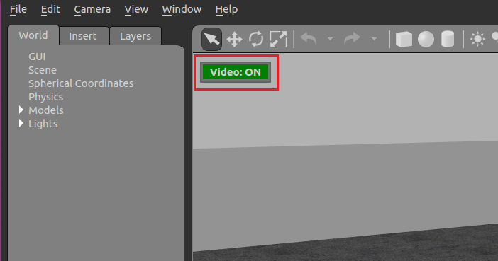
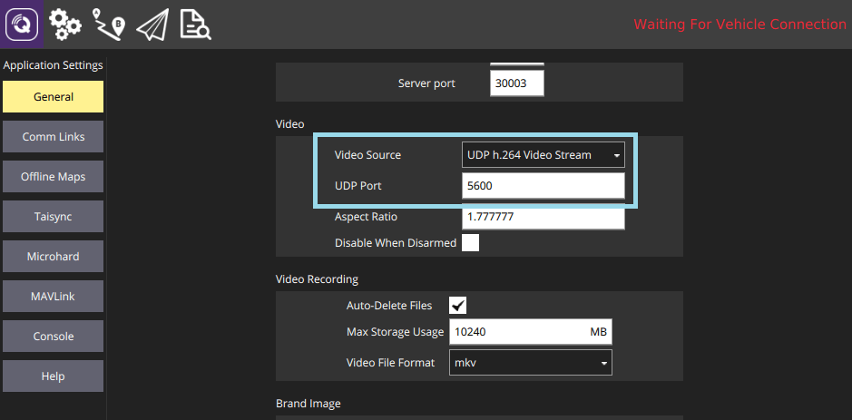

# Симуляція Gazebo Classic

:::warning
_Gazebo Classic_ підтримується з PX4 аж до Ubuntu Linux 20.04. Він був замінений [Gazebo](../sim_gazebo_gz/README.md) ([раніше відомий](https://www.openrobotics.org/blog/2022/4/6/a-new-era-for-gazebo) як "Gazebo Ignition") для використання на Ubuntu 22.04 і новіше.
:::

Gazebo Classic - це потужне середовище 3D симуляції для автономних систем яке зокрема підходить для перевірки уникання об'єктів та комп'ютерного зору. Ця сторінка описує її використання з SITL та єдиним рухомим засобом. Gazebo Classic також може бути використано з [HITL](../simulation/hitl.md) та для [симуляції кількох засобів](../sim_gazebo_classic/multi_vehicle_simulation.md).

**Рухомі засоби що підтримуються:** квадрокоптер ([Iris](../airframes/airframe_reference.md#copter_quadrotor_x_generic_quadcopter)), гексакоптер (Typhoon H480), [загальний стандартний ВЗІП (квадроплан)](../airframes/airframe_reference.md#vtol_standard_vtol_generic_standard_vtol), засіб з ВЗІП з хвоста, літак, ровер, підводний рухомий засіб (UUV).

@[youtube](https://www.youtube.com/watch?v=qfFF9-0k4KA&vq=hd720)

[](https://mermaid-js.github.io/mermaid-live-editor/#/edit/eyJjb2RlIjoiZ3JhcGggTFI7XG4gIEdhemViby0tPlBsdWdpbjtcbiAgUGx1Z2luLS0-TUFWTGluaztcbiAgTUFWTGluay0tPlNJVEw7IiwibWVybWFpZCI6eyJ0aGVtZSI6ImRlZmF1bHQifSwidXBkYXRlRWRpdG9yIjpmYWxzZX0)


<!-- original graph info
graph LR;
  Gazebo-- >Plugin;
  Plugin-- >MAVLink;
  MAVLink-- >SITL;
-->

:::note
Дивіться [Симуляція](../simulation/README.md) для загальної інформації про симуляцію, середовище симуляції та налаштування симуляції (наприклад засоби, що підтримуються).
:::

## Встановлення

Встановлення Gazebo Classic 9 або 11 включено в наші \[стандартні інструкції для збірки\](../dev_setup/dev_env.md) для Linux, macOS та Windows. Додаткові інструкції для встановлення можна знайти на [gazebosim.org](http://gazebosim.org/tutorials?cat=guided_b&tut=guided_b1).

:::note
Якщо ви плануєте використовувати PX4 з ROS вам **потрібно дотримуватись** [інструкцій ROS](../simulation/ros_interface.md) для встановлення ROS та Gazebo Classic (а також уникнення конфліктів установки).
:::

:::note
Наступні команди можна використати для видалення [Gazebo (Garden)](../sim_gazebo_gz/README.md) та перевстановлення Gazebo Classic 11:

```sh
sudo apt remove gz-garden
sudo apt install aptitude
sudo aptitude install gazebo libgazebo11 libgazebo-dev
```

Зверніть увагу, що менеджер пакетів `aptitude` потрібен, оскільки він може вирішити конфлікти залежностей (шляхом видалення певних пакетів), які `apt` не в змозі обробити.
:::

## Запуск симуляції

Виконайте симуляцію запустивши PX4 SITL та Gazebo Classic з налаштуванням планеру для завантаження (підтримуються мультикоптери, літаки, ВЗІП, оптичний потік так симуляції кількох засобів).

Найпростіший спосіб зробити це - відкрити термінал у кореневій директорії репозиторію PX4 _PX4-Autopilot_ і викликати `make` для потрібної цілі. Наприклад для запуску симуляції квадрокоптера (за замовчуванням):

```sh
cd /path/to/PX4-Autopilot
make px4_sitl gazebo-classic
```

Нижче перелічено рухомі засоби, що підтримуються та команди `make` (клацніть по посиланнях, щоб побачити зображення засобу).

:::note
Для повного списку цілей збірки запустіть `make px4_sitl list_vmd_make_targets` (і відфільтруйте ті, що починаються з `gazebo-classic_`).
:::

| Рухомий засіб                                                                                                                       | Команда                                                   |
| ----------------------------------------------------------------------------------------------------------------------------------- | --------------------------------------------------------- |
| [Квадрокоптер](../sim_gazebo_classic/vehicles.md#quadrotor-default)                                                                 | `make px4_sitl gazebo-classic`                            |
| [Квадрокоптер з оптичним потоком](../sim_gazebo_classic/vehicles.md#quadrotor-with-optical-flow)                                    | `make px4_sitl gazebo-classic_iris_opt_flow`              |
| [Квадрокоптер з камерою глибини](../sim_gazebo_classic/vehicles.md#quadrotor-with-depth-camera) (що направлено вперед)              | `make px4_sitl gazebo-classic_iris_depth_camera`          |
| [Квадрокоптер з камерою глибини](../sim_gazebo_classic/vehicles.md#quadrotor-with-depth-camera) (що направлено вниз)                | `make px4_sitl gazebo-classic_iris_downward_depth_camera` |
| [3DR Solo (квадрокоптер)](../sim_gazebo_classic/vehicles.md#3dr-solo-quadrotor)                                                     | `make px4_sitl gazebo-classic_solo`                       |
| <a id="typhoon_h480"></a>[Typhoon H480 (гексакоптер)](../sim_gazebo_classic/vehicles.md#typhoon-h480-hexrotor) (з відеотрансляцією) | `make px4_sitl gazebo-classic_typhoon_h480`               |
| [Стандартний літак](../sim_gazebo_classic/vehicles.md#standard-plane)                                                               | `make px4_sitl gazebo-classic_plane`                      |
| [Стандартний літак (із запуском з катапульти)](../sim_gazebo_classic/vehicles.md#standard-plane-with-catapult-launch)               | `make px4_sitl gazebo-classic_plane_catapult`             |
| [Стандартний ВЗІП](../sim_gazebo_classic/vehicles.md#standard-vtol)                                                                 | `make px4_sitl gazebo-classic_standard_vtol`              |
| [ВЗІП з хвоста](../sim_gazebo_classic/vehicles.md#tailsitter-vtol)                                                                  | `make px4_sitl gazebo-classic_tailsitter`                 |
| [UGV із трапецією Аккермана (ровер)](../sim_gazebo_classic/vehicles.md#ackermann-ugv)                                               | `make px4_sitl gazebo-classic_rover`                      |
| [UGV з диференціалом (ровер)](../sim_gazebo_classic/vehicles.md#differential-ugv)                                                   | `make px4_sitl gazebo-classic_r1_rover`                   |
| [HippoCampus TUHH (UUV: безпілотний підводний засіб)](../sim_gazebo_classic/vehicles.md#unmanned-underwater-vehicle-uuv-submarine)  | `make px4_sitl gazebo-classic_uuv_hippocampus`            |
| [Човен (USV: безпілотний надводний засіб)](../sim_gazebo_classic/vehicles.md#hippocampus-tuhh-uuv)                                  | `make px4_sitl gazebo-classic_boat`                       |
| [Cloudship (дирижабль)](../sim_gazebo_classic/vehicles.md#airship)                                                                  | `make px4_sitl gazebo-classic_cloudship`                  |

:::note
Посібник [Встановлення файлів і коду](../dev_setup/dev_env.md) є корисним довідником якщо виникнуть помилки збірки.
:::

Вищенаведені команди запускають єдиний засіб з повним користувацьким інтерфейсом. Інші варіанти включають:

- [Запуск PX4 та Gazebo окремо](#starting-gazebo-and-px4-separately), щоб можна було тримати Gazebo Classic запущеним та перезапускати тільки PX4 при необхідності (швидше ніж перезапускати обидва).
- Запуск симуляції у[режимі без інтерфейсу](#headless-mode), який не запускає користувацький інтерфейс Gazebo Classic (це використовує менше ресурсів та працює набагато швидше).

## Підйом у небо

Згадані вище команди `make` спочатку збирають PX4, а потім запускають її разом із симулятором Gazebo Classic.

Після запуску PX4 запуститься оболонка PX4, як показано нижче.

```sh
______  __   __    ___
| ___ \ \ \ / /   /   |
| |_/ /  \ V /   / /| |
|  __/   /   \  / /_| |
| |     / /^\ \ \___  |
\_|     \/   \/     |_/

px4 starting.

INFO  [px4] Calling startup script: /bin/sh etc/init.d-posix/rcS 0
INFO  [param] selected parameter default file eeprom/parameters_10016
[param] Loaded: eeprom/parameters_10016
INFO  [dataman] Unknown restart, data manager file './dataman' size is 11798680 bytes
INFO  [simulator] Waiting for simulator to connect on TCP port 4560
Gazebo multi-robot simulator, version 9.0.0
Copyright (C) 2012 Open Source Robotics Foundation.
Released under the Apache 2 License.
http://gazebosim.org
...
INFO  [ecl/EKF] 5188000: commencing GPS fusion
```

Консоль буде виводити статус поки PX4 завантажує файли ініціалізації та параметрів для певного планера, чекати та підключатися до симулятора. Як тільки з'явиться вивід INFO що [ecl/EKF] `commencing GPS fusion` рухомий засіб готовий до роботи.

:::note
Натискання правою кнопкою миші на модель квадрокоптера дозволяє увімкнути режим слідування у контекстному меню, що зручно для того щоб тримати його у полі зору.
:::


Ви можете підняти його у повітря надрукувавши:

```sh
pxh> commander takeoff
```

## Використання та варіанти налаштування

Параметри, які застосовуються до всіх симуляторів охоплені у темі [Симуляція](../simulation/README.md#sitl-simulation-environment) рівнем вище (деякі з них можуть бути продубльовані нижче).

### Симуляція відмов датчиків/апаратного забезпечення

[Симуляція запобігання відмовам](../simulation/failsafes.md) пояснює як викликати запобіжники відмов, таких як відмова GPS або виснаження батареї.

### Режим без інтерфейсу

Gazebo Classic можна запустити у режимі _без інтерфейсу_ в якому користувацький інтерфейс Gazebo Classic не запускається. Цей режим запускається швидше та використовує менше системних ресурсів (тобто більш "легкий" спосіб запускати симуляцію).

Просто додайте перед командою `make` `HEADLESS=1` як показано:

```sh
HEADLESS=1 make px4_sitl gazebo-classic_plane
```

<a id="custom_takeoff_location"></a>

### Встановлення користувацького місця зльоту

Місце зльоту в Gazebo Classic можна встановити використовуючи змінні середовища. Це замінить як стандартне місце зльоту, так й будь-яке значення [встановлене для світу](#set-world-location).

Змінні які потрібно встановити: `PX4_HOME_LAT`, `PX4_HOME_LON` та `PX4_HOME_ALT`.

Наприклад:

```sh
export PX4_HOME_LAT=28.452386
export PX4_HOME_LON=-13.867138
export PX4_HOME_ALT=28.5
make px4_sitl gazebo-classic
```

### Зміна швидкості симуляції

Швидкість симуляції може бути збільшена або зменшена відносно реального часу за допомогою змінної середовища `PX4_SIM_SPEED_FACTOR`.

```sh
export PX4_SIM_SPEED_FACTOR=2
make px4_sitl_default gazebo-classic
```

Для додаткової інформації дивіться: [Симуляція > Запуск симуляції швидше реального часу](../simulation/README.md#simulation_speed).

### Зміна швидкості вітру

Для симуляції швидкості вітру, додайте плагін у файл світу та встановіть `windVelocityMean` в м/с (замініть `SET_YOUR_WIND_SPEED` на бажану швидкість). Якщо потрібно, підлаштуйте параметр `windVelocityMax`, щоб він був більшим за `windVelocityMean`:

```xml
  <plugin name='wind_plugin' filename='libgazebo_wind_plugin.so'>
      <frameId>base_link</frameId>
      <robotNamespace/>
      <windVelocityMean>SET_YOUR_WIND_SPEED</windVelocityMean>
      <windVelocityMax>20.0</windVelocityMax>
      <windVelocityVariance>0</windVelocityVariance>
      <windDirectionMean>0 1 0</windDirectionMean>
      <windDirectionVariance>0</windDirectionVariance>
      <windGustStart>0</windGustStart>
      <windGustDuration>0</windGustDuration>
      <windGustVelocityMean>0</windGustVelocityMean>
      <windGustVelocityMax>20.0</windGustVelocityMax>
      <windGustVelocityVariance>0</windGustVelocityVariance>
      <windGustDirectionMean>1 0 0</windGustDirectionMean>
      <windGustDirectionVariance>0</windGustDirectionVariance>
      <windPubTopic>world_wind</windPubTopic>
    </plugin>
```

Напрямок вітру передається як вектор напрямку (за стандартною конвенцією ENU), який буде нормалізовано в плагіні gazebo. Додатково ви можете вказати відхилення швидкості вітру у (м/с)² та відхилення у напрямку на основі нормального розподілу, щоб додати випадковий фактор в симуляцію. Пориви вітру внутрішньо обробляються в такий самий спосіб що і вітер з невеликою різницею в тому, що ви можете вказати час їх початку та тривалість за допомогою наступних параметрів `windGustStart` та `windGustDuration`.

Ви можете побачити як це зроблено в [PX4/PX4-SITL_gazebo-classic/worlds/windy.world](https://github.com/PX4/PX4-SITL_gazebo-classic/blob/main/worlds/windy.world#L15-L31).

### Використання джойстика

Джойстик та підтримка джойстика для великого пальця підтримується через _QGroundControl_ ([тут інструкції налаштування](../simulation/README.md#joystick-gamepad-integration)).

### Підвищення ефективності сенсору відстані

Поточний світ за замовчуванням - [PX4-Autopilot/Tools/simulation/gazebo-classic/sitl_gazebo-classic/worlds/**iris.world**](https://github.com/PX4/PX4-SITL_gazebo-classic/tree/main/worlds)), що використовує мапу висот в  якості землі.

Це може викликати труднощі під час використання датчика відстані. Якщо присутні несподівані результати рекомендуємо змінити модель в **iris.model** з `uneven_ground` на `asphalt_plane`.

### Симуляція шуму GPS

Gazebo Classic може симулювати шум GPS подібний до того, який зазвичай можна знайти в реальних системах (в іншому випадку значення GPS що передаються будуть вільними від шуму або ідеальними). Це корисно, якщо ви працюєте над додатками, на які може вплинути шум GPS, наприклад точного позиціювання.

Шум GPS увімкнений якщо SDF файл цільового рухомого засобу містить значення для елементу `gpsNoise` (тобто має рядок `<gpsNoise>true</gpsNoise>`). Він увімкнений за замовчуванням у багатьох SDF файлах рухомих засобів: **solo.sdf**, **iris.sdf**, **standard_vtol.sdf**, **delta_wing.sdf**, **plane.sdf**, **typhoon_h480**, **tailsitter.sdf**.

Щоб увімкнути/вимкнути шум GPS:

1. Зберіть будь-яку ціль збірки gazebo, щоб згенерувати SDF файл (для всіх засобів). Наприклад:

   ```sh
   make px4_sitl gazebo-classic_iris
   ```

   :::tip
Файли SDF не перезаписуються у наступних збірках.
:::

2. Відкрийте SDF файл цільового рухомого засобу (наприклад **./Tools/simulation/gazebo-classic/sitl_gazebo-classic/models/iris/iris.sdf**).
3. Знайдіть елемент `gpsNoise`:

   ```xml
   <plugin name='gps_plugin' filename='libgazebo_gps_plugin.so'>
     <robotNamespace/>
     <gpsNoise>true</gpsNoise>
   </plugin>
   ```

   - Якщо він присутній, GPS включений. Ви можете вимкнути його, видаливши рядок: `<gpsNoise>true</gpsNoise>`
   - Якщо він відсутній, GPS вимкнено. Ви можете включити його, додавши елемент `gpsNoise`  до розділу `gps_plugin` (як показано вище).

Наступного разу, коли ви зберете/перезапустите Gazebo Classic він буде використовувати нове налаштування шуму GPS.

## Завантаження певного світу

PX4 підтримує багато [світів](../sim_gazebo_classic/worlds.md), яки зберігаються у [PX4-Autopilot/Tools/simulation/gazebo-classic/sitl_gazebo-classic/worlds](https://github.com/PX4/PX4-SITL_gazebo-classic/tree/main/worlds). За замовчуванням Gazebo Classic показує пласку рівнину без функцій, як визначено в [empty.world](https://github.com/PX4/PX4-SITL_gazebo-classic/blob/main/worlds/empty.world).

Можна завантажити будь-який зі світів вказавши їх як завершальний параметр в налаштуваннях цілі збірки PX4.

Наприклад для завантаження світу _склад_, ви можете додати його як показано:

```sh
make px4_sitl_default gazebo-classic_plane_cam__warehouse
```

:::note
There are _two underscores_ after the model (`plane_cam`) indicating that the default debugger is used (none). See [Building the Code > PX4 Make Build Targets](../dev_setup/building_px4.md#px4-make-build-targets).
:::

You can also specify the full path to a world to load using the `PX4_SITL_WORLD` environment variable. This is useful if testing a new world that is not yet included with PX4.

:::tip
If the loaded world does not align with the map, you may need to [set the world location](#set-world-location).
:::

## Set World Location

The vehicle gets spawned very close to the origin of the world model at some simulated GPS location.

:::note
The vehicle is not spawned exactly at the Gazebo origin (0,0,0), but using a slight offset, which can highlight a number of common coding issues.
:::

If using a world that recreates a real location (e.g. a particular airport) this can result in a very obvious mismatch between what is displayed in the simulated world, and what is shown on the ground station map. To overcome this problem you can set the location of the world origin to the GPS coordinates where it would be in "real life".

:::note
You can also set a [Custom Takeoff Location](#custom_takeoff_location) that does the same thing. However adding the location to the map is easier (and can still be over-ridden by setting a custom location if needed).
:::

The location of the world is defined in the **.world** file by specifying the location of the origin using the `spherical_coordinates` tag. The latitude, longitude, elevation must all be specified (for this to be a valid).

An example can be found in the [sonoma_raceway.world](https://github.com/PX4/PX4-SITL_gazebo-classic/blob/main/worlds/sonoma_raceway.world):

```xml
    <spherical_coordinates>
      <surface_model>EARTH_WGS84</surface_model>
      <latitude_deg>38.161479</latitude_deg>
      <longitude_deg>-122.454630</longitude_deg>
      <elevation>488.0</elevation>
    </spherical_coordinates>
```

You can test this by spawning a rover in the [Sonoma Raceway World](../sim_gazebo_classic/worlds.md#sonoma-raceway) using the following `make` command (note that spawning takes longer the first time as the model needs to be downloaded from the model database):

```sh
make px4_sitl gazebo-classic_rover__sonoma_raceway
```

The video below shows that the location of the environment is aligned with the world:

@[youtube](https://youtu.be/-a2WWLni5do)

## Starting Gazebo and PX4 Separately

For extended development sessions it might be more convenient to start Gazebo Classic and PX4 separately or even from within an IDE.

In addition to the existing cmake targets that run `sitl_run.sh` with parameters for px4 to load the correct model it creates a launcher targets named `px4_<mode>` that is a thin wrapper around original sitl px4 app. This thin wrapper simply embeds app arguments like current working directories and the path to the model file.

To start Gazebo Classic and PX4 separately:

- Run gazebo classic (or any other sim) server and client viewers via the terminal specifying an `_ide` variant:

  ```sh
  make px4_sitl gazebo-classic___ide
  ```

  or

  ```sh
  make px4_sitl gazebo-classic_iris_ide
  ```

- In your IDE select `px4_<mode>` target you want to debug (e.g. `px4_iris`)
- Start the debug session directly from IDE

This approach significantly reduces the debug cycle time because simulator is always running in background and you only re-run the px4 process which is very light.

## Simulated Survey Camera

The _Gazebo Classic_ survey camera simulates a [MAVLink camera](https://mavlink.io/en/services/camera.html) that captures geotagged JPEG images and sends camera capture information to a connected ground station. The camera also supports video streaming. It can be used to test camera capture, in particular within survey missions.

The camera emits the [CAMERA_IMAGE_CAPTURED](https://mavlink.io/en/messages/common.html#CAMERA_IMAGE_CAPTURED) message every time an image is captured. The captured images are saved to: **PX4-Autopilot/build/px4*sitle_default/tmp/frames/DSC_n*.jpg** (where _n_ starts as 00000 and is iterated by one on each capture).

To simulate a plane with this camera:

```sh
make px4_sitl_default gazebo-classic_plane_cam
```

:::note
The camera also supports/responds to the following MAVLink commands: [MAV_CMD_REQUEST_CAMERA_CAPTURE_STATUS](https://mavlink.io/en/messages/common.html#MAV_CMD_REQUEST_CAMERA_CAPTURE_STATUS), [MAV_CMD_REQUEST_STORAGE_INFORMATION](https://mavlink.io/en/messages/common.html#MAV_CMD_REQUEST_STORAGE_INFORMATION), [MAV_CMD_REQUEST_CAMERA_SETTINGS](https://mavlink.io/en/messages/common.html#MAV_CMD_REQUEST_CAMERA_SETTINGS), [MAV_CMD_REQUEST_CAMERA_INFORMATION](https://mavlink.io/en/messages/common.html#MAV_CMD_REQUEST_CAMERA_INFORMATION), [MAV_CMD_RESET_CAMERA_SETTINGS](https://mavlink.io/en/messages/common.html#MAV_CMD_RESET_CAMERA_SETTINGS), [MAV_CMD_STORAGE_FORMAT](https://mavlink.io/en/messages/common.html#MAV_CMD_STORAGE_FORMAT), [MAV_CMD_SET_CAMERA_ZOOM](https://mavlink.io/en/messages/common.html#MAV_CMD_SET_CAMERA_ZOOM), [MAV_CMD_IMAGE_START_CAPTURE](https://mavlink.io/en/messages/common.html#MAV_CMD_IMAGE_START_CAPTURE), [MAV_CMD_IMAGE_STOP_CAPTURE](https://mavlink.io/en/messages/common.html#MAV_CMD_IMAGE_STOP_CAPTURE), [MAV_CMD_REQUEST_VIDEO_STREAM_INFORMATION](https://mavlink.io/en/messages/common.html#MAV_CMD_REQUEST_VIDEO_STREAM_INFORMATION), [MAV_CMD_REQUEST_VIDEO_STREAM_STATUS](https://mavlink.io/en/messages/common.html#MAV_CMD_REQUEST_VIDEO_STREAM_STATUS), [MAV_CMD_SET_CAMERA_MODE](https://mavlink.io/en/messages/common.html#MAV_CMD_SET_CAMERA_MODE).
:::

:::note
The simulated camera is implemented in [PX4/PX4-SITL_gazebo-classic/main/src/gazebo_camera_manager_plugin.cpp](https://github.com/PX4/PX4-SITL_gazebo-classic/blob/main/src/gazebo_camera_manager_plugin.cpp).
:::

## Simulated Depth Camera

The _Gazebo Classic_ [depth camera model](https://github.com/PX4/PX4-SITL_gazebo-classic/blob/main/models/depth_camera/depth_camera.sdf.jinja) simulates an Intel® RealSense™ D455 stereo depth camera using the [Openni Kinect plugin](https://classic.gazebosim.org/tutorials?tut=ros_gzplugins#OpenniKinect).

This publishes depth images and camera information on the `/camera/depth/image_raw` and `/camera/depth/camera_info` ROS topics respectively.

To use these images, you will need to install ROS or ROS 2. Note the warning at the top of this page about how to "avoid installation conflicts" when installing ROS and Gazebo.

You can simulate a quadrotor with a forward-facing depth camera:

```sh
make px4_sitl gazebo-classic_iris_depth_camera
```

or a quadrotor with a downward-facing depth camera:

```sh
make px4_sitl gazebo-classic_iris_downward_depth_camera
```

## Simulated Parachute/Flight Termination

_Gazebo Classic_ can be used to simulate deploying a [parachute](../peripherals/parachute.md) during [Flight Termination](../advanced_config/flight_termination.md) (flight termination is triggered by the PWM command that is simulated in _Gazebo Classic_).

The `if750a` target has a parachute attached to the vehicle. To simulate the vehicle, run the following command:

```sh
make px4_sitl gazebo-classic_if750a
```

To put the vehicle into flight termination state, you can force it to fail a [safety check](../config/safety.md) that has flight termination set as the failsafe action. For example, you could do this by forcing a [Geofence violation](../config/safety.md#geofence-failsafe).

For more information see:

- [Flight Termination](../advanced_config/flight_termination.md)
- [Parachute](../peripherals/parachute.md)
- [Safety Configuration (Failsafes)](../config/safety.md)

## Video Streaming

PX4 SITL for Gazebo Classic supports UDP video streaming from a camera sensor attached to a simulated vehicle model. When streaming is enabled, you can connect to this stream from _QGroundControl_ (on UDP port 5600) and view video of the Gazebo Classic environment from the simulated vehicle - just as you would from a real camera. The video is streamed using a _gstreamer_ pipeline and can be enabled/disabled using a button in the Gazebo Classic UI.

The simulated camera sensor is supported/enabled on the following frames:

- [Typhoon H480](#typhoon_h480)

### Prerequisites

_Gstreamer 1.0_ is required for video streaming. The required dependencies should already have been [installed when you set up Gazebo Classic](#installation) (they are included in the standard PX4 installation scripts/instructions for macOS and Ubuntu Linux).

:::note
FYI only, the dependencies include: `gstreamer1.0-plugins-base`, `gstreamer1.0-plugins-good`, `gstreamer1.0-plugins-bad`, `gstreamer1.0-plugins-ugly`, `libgstreamer-plugins-base1.0-dev`.
:::

### Start/Stop Video Streaming

Video streaming is automatically started when supported by the target vehicle. For example, to start streaming video on the Typhoon H480:

```sh
make px4_sitl gazebo-classic_typhoon_h480
```

Streaming can be paused/restarted using the Gazebo UI _Video ON/OFF_ button..



### How to View Gazebo Video

The easiest way to view the SITL/Gazebo Classic camera video stream is in _QGroundControl_. Simply open **Application Settings > General** and set **Video Source** to _UDP h.264 Video Stream_ and **UDP Port** to _5600_:



The video from Gazebo Classic should then display in _QGroundControl_ just as it would from a real camera.


:::note
The Typhoon world is not very interesting.
:::

It is also possible to view the video using the _Gstreamer Pipeline_. Simply enter the following terminal command:

```sh
gst-launch-1.0  -v udpsrc port=5600 caps='application/x-rtp, media=(string)video, clock-rate=(int)90000, encoding-name=(string)H264' \
! rtph264depay ! avdec_h264 ! videoconvert ! autovideosink fps-update-interval=1000 sync=false
```

### Verbose Logging

SITL fails silently when there is something wrong with the model. You can enable more verbose logging using `VERBOSE_SIM`, as shown:

```sh
export VERBOSE_SIM=1
make px4_sitl gazebo-classic
```

or

```sh
VERBOSE_SIM=1 make px4_sitl gazebo-classic
```

## Extending and Customizing

To extend or customize the simulation interface, edit the files in the `Tools/simulation/gazebo/sitl_gazebo` folder. The code is available on the [sitl_gazebo repository](https://github.com/PX4/PX4-SITL_gazebo) on Github.

:::note
The build system enforces the correct GIT submodules, including the simulator. It will not overwrite changes in files in the directory.
:::

## Further Information

- [ROS with Gazebo Classic Simulation](../simulation/ros_interface.md)
- [Gazebo Classic Octomap](../sim_gazebo_classic/octomap.md)
