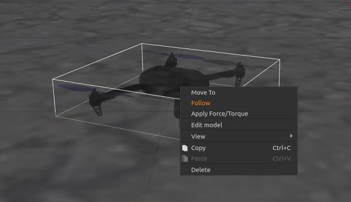
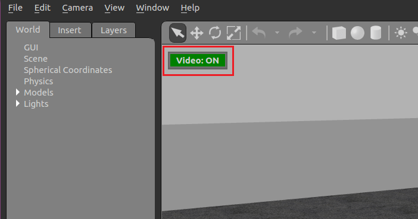
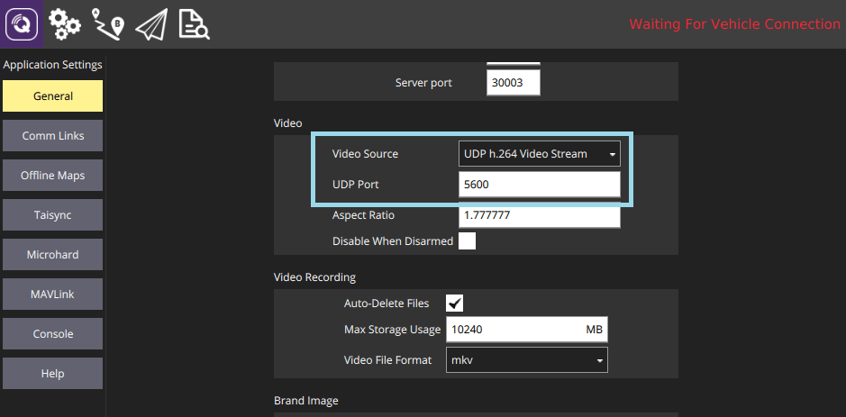
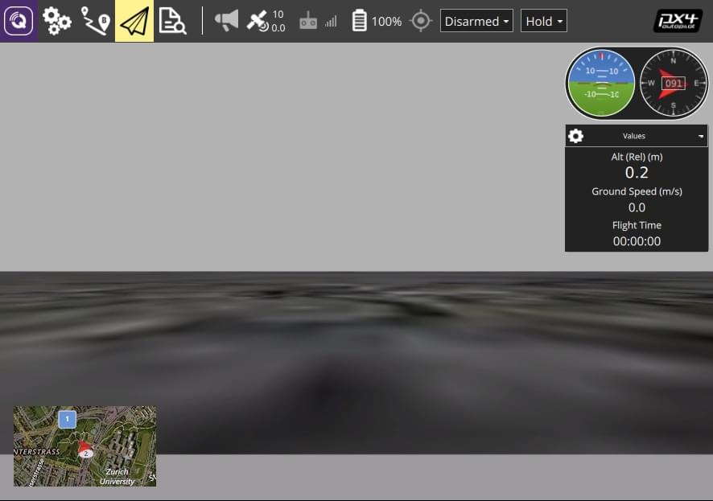

# Симуляція Gazebo Classic

:::warning
_Gazebo Classic_ підтримується з PX4 аж до Ubuntu Linux 20.04. In Ubuntu 22.04 and later you must use [Gazebo](../sim_gazebo_gz/index.md) (which was [formerly known](https://www.openrobotics.org/blog/2022/4/6/a-new-era-for-gazebo) as "Gazebo Ignition").
:::

Gazebo Classic - це потужне середовище 3D симуляції для автономних систем яке зокрема підходить для перевірки уникання об'єктів та комп'ютерного зору. Ця сторінка описує її використання з SITL та єдиним рухомим засобом. Gazebo Classic також може бути використано з [HITL](../simulation/hitl.md) та для [симуляції кількох засобів](../sim_gazebo_classic/multi_vehicle_simulation.md).

**Рухомі засоби що підтримуються:** квадрокоптер ([Iris](../airframes/airframe_reference.md#copter_quadrotor_x_generic_quadcopter)), гексакоптер (Typhoon H480), [загальний стандартний ВЗІП (квадроплан)](../airframes/airframe_reference.md#vtol_standard_vtol_generic_standard_vtol), засіб з ВЗІП з хвоста, літак, ровер, підводний рухомий засіб (UUV).

<lite-youtube videoid="qfFF9-0k4KA" title="PX4 Flight Stack ROS 3D Software in the Loop Simulation (SITL)"/>

[](https://mermaid-js.github.io/mermaid-live-editor/#/edit/eyJjb2RlIjoiZ3JhcGggTFI7XG4gIEdhemViby0tPlBsdWdpbjtcbiAgUGx1Z2luLS0-TUFWTGluaztcbiAgTUFWTGluay0tPlNJVEw7IiwibWVybWFpZCI6eyJ0aGVtZSI6ImRlZmF1bHQifSwidXBkYXRlRWRpdG9yIjpmYWxzZX0)


<!-- original graph info
graph LR;
  Gazebo-- >Plugin;
  Plugin-- >MAVLink;
  MAVLink-- >SITL;
-->

:::info
Див. [Симуляція](../simulation/index.md) для загальної інформації про симулятори, середовище симуляції та конфігурацію симуляції (наприклад, підтримувані транспортні засоби).
:::

## Встановлення

Налаштування Gazebo Classic 9 або 11 включено в наші [стандартні інструкції зі збірки](../dev_setup/dev_env.md) для Linux, macOS та Windows. Додаткові інструкції для встановлення можна знайти на [gazebosim.org](http://gazebosim.org/tutorials?cat=guided_b&tut=guided_b1).

:::info
Якщо ви плануєте використовувати PX4 з ROS вам **потрібно дотримуватись** [інструкцій ROS](../simulation/ros_interface.md) для встановлення ROS та Gazebo Classic (а також уникнення конфліктів установки).
:::

::: info
Наступні команди можна використати для видалення [Gazebo (Garden)](../sim_gazebo_gz/index.md) та перевстановлення Gazebo Classic 11:

```sh
sudo apt remove gz-garden
sudo apt install aptitude
sudo aptitude install gazebo libgazebo11 libgazebo-dev
```

Зверніть увагу, що менеджер пакетів `aptitude` потрібен, оскільки він може вирішити конфлікти залежностей (шляхом видалення певних пакетів), які `apt` не в змозі обробити.
:::

## Запуск симуляції

Виконайте симуляцію запустивши PX4 SITL та Gazebo Classic з налаштуванням планеру для завантаження (підтримуються мультикоптери, літаки, ВЗІП, оптичний потік так симуляції кількох засобів).

Найпростіший спосіб зробити це - відкрити термінал у кореневій директорії репозиторію PX4 _PX4-Autopilot_ і викликати `make` для потрібної цілі. Наприклад для запуску симуляції квадрокоптера (за замовчуванням):

```sh
cd /path/to/PX4-Autopilot
make px4_sitl gazebo-classic
```

Нижче перелічено рухомі засоби, що підтримуються та команди `make` (клацніть по посиланнях, щоб побачити зображення засобу).

:::info
Для повного списку цілей збірки запустіть `make px4_sitl list_vmd_make_targets` (і відфільтруйте ті, що починаються з `gazebo-classic_`).
:::

| Рухомий засіб                                                                                                                       | Команда                                                   |
| ----------------------------------------------------------------------------------------------------------------------------------- | --------------------------------------------------------- |
| [Квадрокоптер](../sim_gazebo_classic/vehicles.md#quadrotor-default)                                                                 | `make px4_sitl gazebo-classic`                            |
| [Квадрокоптер з оптичним потоком](../sim_gazebo_classic/vehicles.md#quadrotor-with-optical-flow)                                    | `make px4_sitl gazebo-classic_iris_opt_flow`              |
| [Квадрокоптер з камерою глибини](../sim_gazebo_classic/vehicles.md#quadrotor-with-depth-camera) (що направлено вперед)              | `make px4_sitl gazebo-classic_iris_depth_camera`          |
| [Квадрокоптер з камерою глибини](../sim_gazebo_classic/vehicles.md#quadrotor-with-depth-camera) (що направлено вниз)                | `make px4_sitl gazebo-classic_iris_downward_depth_camera` |
| [3DR Solo (квадрокоптер)](../sim_gazebo_classic/vehicles.md#3dr-solo-quadrotor)                                                     | `make px4_sitl gazebo-classic_solo`                       |
| <a id="typhoon_h480"></a>[Typhoon H480 (гексакоптер)](../sim_gazebo_classic/vehicles.md#typhoon-h480-hexrotor) (з відеотрансляцією) | `make px4_sitl gazebo-classic_typhoon_h480`               |
| [Стандартний літак](../sim_gazebo_classic/vehicles.md#standard-plane)                                                               | `make px4_sitl gazebo-classic_plane`                      |
| [Стандартний літак (із запуском з катапульти)](../sim_gazebo_classic/vehicles.md#standard-plane-with-catapult-launch)               | `make px4_sitl gazebo-classic_plane_catapult`             |
| [Стандартний ВЗІП](../sim_gazebo_classic/vehicles.md#standard-vtol)                                                                 | `make px4_sitl gazebo-classic_standard_vtol`              |
| [ВЗІП з хвоста](../sim_gazebo_classic/vehicles.md#tailsitter-vtol)                                                                  | `make px4_sitl gazebo-classic_tailsitter`                 |
| [UGV із трапецією Аккермана (ровер)](../sim_gazebo_classic/vehicles.md#ackermann-ugv)                                               | `make px4_sitl gazebo-classic_rover`                      |
| [UGV з диференціалом (ровер)](../sim_gazebo_classic/vehicles.md#differential-ugv)                                                   | `make px4_sitl gazebo-classic_r1_rover`                   |
| [HippoCampus TUHH (UUV: безпілотний підводний засіб)](../sim_gazebo_classic/vehicles.md#unmanned-underwater-vehicle-uuv-submarine)  | `make px4_sitl gazebo-classic_uuv_hippocampus`            |
| [Човен (USV: безпілотний надводний засіб)](../sim_gazebo_classic/vehicles.md#hippocampus-tuhh-uuv)                                  | `make px4_sitl gazebo-classic_boat`                       |
| [Cloudship (дирижабль)](../sim_gazebo_classic/vehicles.md#airship)                                                                  | `make px4_sitl gazebo-classic_cloudship`                  |

:::info
Посібник [Встановлення файлів і коду](../dev_setup/dev_env.md) є корисним довідником якщо виникнуть помилки збірки.
:::

Вищенаведені команди запускають єдиний засіб з повним користувацьким інтерфейсом. Інші варіанти включають:

- [Запуск PX4 та Gazebo окремо](#starting-gazebo-and-px4-separately), щоб можна було тримати Gazebo Classic запущеним та перезапускати тільки PX4 при необхідності (швидше ніж перезапускати обидва).
- Запуск симуляції у[режимі без інтерфейсу](#headless-mode), який не запускає користувацький інтерфейс Gazebo Classic (це використовує менше ресурсів та працює набагато швидше).

## Підйом у небо

Згадані вище команди `make` спочатку збирають PX4, а потім запускають її разом із симулятором Gazebo Classic.

Після запуску PX4 запуститься оболонка PX4, як показано нижче.

```sh
______  __   __    ___
| ___ \ \ \ / /   /   |
| |_/ /  \ V /   / /| |
|  __/   /   \  / /_| |
| |     / /^\ \ \___  |
\_|     \/   \/     |_/

px4 starting.

INFO  [px4] Calling startup script: /bin/sh etc/init.d-posix/rcS 0
INFO  [param] selected parameter default file eeprom/parameters_10016
[param] Loaded: eeprom/parameters_10016
INFO  [dataman] Unknown restart, data manager file './dataman' size is 11798680 bytes
INFO  [simulator] Waiting for simulator to connect on TCP port 4560
Gazebo multi-robot simulator, version 9.0.0
Copyright (C) 2012 Open Source Robotics Foundation.
Released under the Apache 2 License.
http://gazebosim.org
...
INFO  [ecl/EKF] 5188000: commencing GPS fusion
```

Консоль буде виводити статус поки PX4 завантажує файли ініціалізації та параметрів для певного планера, чекати та підключатися до симулятора. Як тільки з'явиться вивід INFO що [ecl/EKF] `commencing GPS fusion` рухомий засіб готовий до роботи.

:::info
Натискання правою кнопкою миші на модель квадрокоптера дозволяє увімкнути режим слідування у контекстному меню, що зручно для того щоб тримати його у полі зору.
:::



Ви можете підняти його у повітря надрукувавши:

```sh
pxh> commander takeoff
```

## Використання та варіанти налаштування

Параметри, які застосовуються до всіх симуляторів охоплені у темі [Симуляція](../simulation/README.md#sitl-simulation-environment) рівнем вище (деякі з них можуть бути продубльовані нижче).

### Симуляція відмов датчиків/апаратного забезпечення

[Симуляція запобігання відмовам](../simulation/failsafes.md) пояснює як викликати запобіжники відмов, таких як відмова GPS або виснаження батареї.

### Режим без інтерфейсу

Gazebo Classic можна запустити у режимі _без інтерфейсу_ в якому користувацький інтерфейс Gazebo Classic не запускається. Цей режим запускається швидше та використовує менше системних ресурсів (тобто більш "легкий" спосіб запускати симуляцію).

Просто додайте перед командою `make` `HEADLESS=1` як показано:

```sh
HEADLESS=1 make px4_sitl gazebo-classic_plane
```

<a id="custom_takeoff_location"></a>

### Встановлення користувацького місця зльоту

Місце зльоту в Gazebo Classic можна встановити використовуючи змінні середовища. Це замінить як стандартне місце зльоту, так й будь-яке значення [встановлене для світу](#set-world-location).

Змінні які потрібно встановити: `PX4_HOME_LAT`, `PX4_HOME_LON` та `PX4_HOME_ALT`.

Наприклад:

```sh
export PX4_HOME_LAT=28.452386
export PX4_HOME_LON=-13.867138
export PX4_HOME_ALT=28.5
make px4_sitl gazebo-classic
```

### Зміна швидкості симуляції

Швидкість симуляції може бути збільшена або зменшена відносно реального часу за допомогою змінної середовища `PX4_SIM_SPEED_FACTOR`.

```sh
export PX4_SIM_SPEED_FACTOR=2
make px4_sitl_default gazebo-classic
```

Для додаткової інформації дивіться: [Симуляція > Запуск симуляції швидше реального часу](../simulation/README.md#simulation_speed).

### Зміна швидкості вітру

Для симуляції швидкості вітру, додайте плагін у файл світу та встановіть `windVelocityMean` в м/с (замініть `SET_YOUR_WIND_SPEED` на бажану швидкість). Якщо потрібно, підлаштуйте параметр `windVelocityMax`, щоб він був більшим за `windVelocityMean`:

```xml
  <plugin name='wind_plugin' filename='libgazebo_wind_plugin.so'>
      <frameId>base_link</frameId>
      <robotNamespace/>
      <windVelocityMean>SET_YOUR_WIND_SPEED</windVelocityMean>
      <windVelocityMax>20.0</windVelocityMax>
      <windVelocityVariance>0</windVelocityVariance>
      <windDirectionMean>0 1 0</windDirectionMean>
      <windDirectionVariance>0</windDirectionVariance>
      <windGustStart>0</windGustStart>
      <windGustDuration>0</windGustDuration>
      <windGustVelocityMean>0</windGustVelocityMean>
      <windGustVelocityMax>20.0</windGustVelocityMax>
      <windGustVelocityVariance>0</windGustVelocityVariance>
      <windGustDirectionMean>1 0 0</windGustDirectionMean>
      <windGustDirectionVariance>0</windGustDirectionVariance>
      <windPubTopic>world_wind</windPubTopic>
    </plugin>
```

Напрямок вітру передається як вектор напрямку (за стандартною конвенцією ENU), який буде нормалізовано в плагіні gazebo. Додатково ви можете вказати відхилення швидкості вітру у (м/с)² та відхилення у напрямку на основі нормального розподілу, щоб додати випадковий фактор в симуляцію. Пориви вітру внутрішньо обробляються в такий самий спосіб що і вітер з невеликою різницею в тому, що ви можете вказати час їх початку та тривалість за допомогою наступних параметрів `windGustStart` та `windGustDuration`.

Ви можете побачити як це зроблено в [PX4/PX4-SITL_gazebo-classic/worlds/windy.world](https://github.com/PX4/PX4-SITL_gazebo-classic/blob/main/worlds/windy.world#L15-L31).

### Використання джойстика

Джойстик та підтримка джойстика для великого пальця підтримується через _QGroundControl_ ([тут інструкції налаштування](../simulation/README.md#joystick-gamepad-integration)).

### Підвищення ефективності сенсору відстані

Поточний світ за замовчуванням - [PX4-Autopilot/Tools/simulation/gazebo-classic/sitl_gazebo-classic/worlds/**iris.world**](https://github.com/PX4/PX4-SITL_gazebo-classic/tree/main/worlds)), що використовує мапу висот в  якості землі.

Це може викликати труднощі під час використання датчика відстані. Якщо присутні несподівані результати рекомендуємо змінити модель в **iris.model** з `uneven_ground` на `asphalt_plane`.

### Симуляція шуму GPS

Gazebo Classic може симулювати шум GPS подібний до того, який зазвичай можна знайти в реальних системах (в іншому випадку значення GPS що передаються будуть вільними від шуму або ідеальними). Це корисно, якщо ви працюєте над додатками, на які може вплинути шум GPS, наприклад точного позиціювання.

Шум GPS увімкнений якщо SDF файл цільового рухомого засобу містить значення для елементу `gpsNoise` (тобто має рядок `<gpsNoise>true</gpsNoise>`). Він увімкнений за замовчуванням у багатьох SDF файлах рухомих засобів: **solo.sdf**, **iris.sdf**, **standard_vtol.sdf**, **delta_wing.sdf**, **plane.sdf**, **typhoon_h480**, **tailsitter.sdf**.

Щоб увімкнути/вимкнути шум GPS:

1. Зберіть будь-яку ціль збірки gazebo, щоб згенерувати SDF файл (для всіх засобів). Наприклад:

   ```sh
   make px4_sitl gazebo-classic_iris
   ```

   :::tip
Файли SDF не перезаписуються у наступних збірках.
:::

2. Відкрийте SDF файл цільового рухомого засобу (наприклад **./Tools/simulation/gazebo-classic/sitl_gazebo-classic/models/iris/iris.sdf**).
3. Знайдіть елемент `gpsNoise`:

   ```xml
   <plugin name='gps_plugin' filename='libgazebo_gps_plugin.so'>
     <robotNamespace/>
     <gpsNoise>true</gpsNoise>
   </plugin>
   ```

   - Якщо він присутній, GPS включений. Ви можете вимкнути його, видаливши рядок: `<gpsNoise>true</gpsNoise>`
   - Якщо він відсутній, GPS вимкнено. Ви можете включити його, додавши елемент `gpsNoise`  до розділу `gps_plugin` (як показано вище).

Наступного разу, коли ви зберете/перезапустите Gazebo Classic він буде використовувати нове налаштування шуму GPS.

## Завантаження певного світу

PX4 підтримує багато [світів](../sim_gazebo_classic/worlds.md), яки зберігаються у [PX4-Autopilot/Tools/simulation/gazebo-classic/sitl_gazebo-classic/worlds](https://github.com/PX4/PX4-SITL_gazebo-classic/tree/main/worlds). За замовчуванням Gazebo Classic показує пласку рівнину без функцій, як визначено в [empty.world](https://github.com/PX4/PX4-SITL_gazebo-classic/blob/main/worlds/empty.world).

Можна завантажити будь-який зі світів вказавши їх як завершальний параметр в налаштуваннях цілі збірки PX4.

Наприклад для завантаження світу _склад_, ви можете додати його як показано:

```sh
make px4_sitl_default gazebo-classic_plane_cam__warehouse
```

:::info
Два підкреслювання присутні після моделі (`plane_cam`) вказують на те, що використовується налагоджувач за замовчуванням (none). Дивіться [Збірка коду > Цілі збірки для PX4 Make](../dev_setup/building_px4.md#px4-make-build-targets).
:::

Також можна вказати повний шлях до світу який потрібно завантажити використавши змінну середовища `PX4_SITL_WORLD`. Це підходить при тестуванні нового світу, який ще не включений до PX4.

:::tip
Якщо завантажений світ не вирівняний з мапою, можливо знадобиться [встановити розташування світу](#set-world-location).
:::

## Встановлення розташування світу

Рухомий засіб відтворюється дуже близько до початкового положення моделі світу у певному симульованому GPS розташуванні.

:::info
Засіб відтворюється не точно біля початкового положення Gazebo (0,0,0), а використовуючи невеличке зміщення, що може висвітлити ряд загальних проблем коду.
:::

При використанні світу, що відтворює реальне місце (наприклад певний аеропорт) це може призвести до доволі наявної невідповідності між тим що показується у світі, що симулюється та тим, що показується на мапі наземної станції. Для подолання цієї проблеми ви можете встановити місце розташування початкового положення світу до GPS координат, де воно буде в "реальному житті".

:::info
Ви також можете встановити [користувацьке положення злету](#custom_takeoff_location), що робить те ж саме. Однак додавання розташування на мапу простіше (і воно все ще може бути змінене шляхом встановлення користувацького розташування при необхідності).
:::

Розташування світу визначається у файлі **.world** шляхом вказання розташування початкового положення з використанням тегу `spherical_coordinates`. Щоб це було коректним, обов'язково треба вказати широту, довготу та висоту над рівнем моря.

Приклад можна знайти у [sonoma_raceway.world](https://github.com/PX4/PX4-SITL_gazebo-classic/blob/main/worlds/sonoma_raceway.world):

```xml
    <spherical_coordinates>
      <surface_model>EARTH_WGS84</surface_model>
      <latitude_deg>38.161479</latitude_deg>
      <longitude_deg>-122.454630</longitude_deg>
      <elevation>488.0</elevation>
    </spherical_coordinates>
```

Можна перевірити це відтворивши ровер у [світі траси перегонів Сономи](../sim_gazebo_classic/worlds.md#sonoma-raceway) використовуючи наступну команду `make` (зверніть увагу, що відтворення займає більше часу перший раз оскільки модель потрібно завантажити з бази даних моделей):

```sh
make px4_sitl gazebo-classic_rover__sonoma_raceway
```

У наведеному нижче відео видно, що розташування середовища збігається зі світом:

<lite-youtube videoid="-a2WWLni5do" title="Driving a simulated PX4 Rover in the Sonoma Raceway"/>

## Запуск Gazebo та PX4 окремо

Для розширених сеансів розробки можливо більш зручно запускати Gazebo Classic та PX4 окремо або навіть з IDE.

На додаток до наявних цілей збірки cmake, що виконують `sitl_run.sh` з параметрами для px4 для завантаження відповідної моделі, створюється ціль для запуску `px4_<mode>` яка є тонкою обгорткою для вихідного застосунку sitl px4. Ця тонка обгортка просто містить аргументи застосунку типу поточної робочої директорії та шляху до файлу моделі.

Щоб запустити Gazebo Classic та PX4 окремо:

- Запустіть сервер gazebo classic (або іншого симулятора) та клієнтські переглядачі через термінал, вказавши варіант `_ide`:

  ```sh
  make px4_sitl gazebo-classic___ide
  ```

  або

  ```sh
  make px4_sitl gazebo-classic_iris_ide
  ```

- У IDE оберіть ціль `px4_<mode>` яку ви хочете налагодити (наприклад `px4_iris`)
- Запустіть сеанс налагодження безпосередньо з IDE

Цей підхід суттєво зменшує час циклу налагодження, оскільки симулятор завжди працює у фоновому режимі та ви перезавантажуєте тільки процес px4, який дуже легкий.

## Симуляція камери спостереження

Камера спостереження _Gazebo Classic_ моделює [камеру MAVLink](https://mavlink.io/en/services/camera.html) яка захоплює JPEG зображення з геотегами та передає інформацію захоплення з камери на під'єднану наземну станцію. Камера також підтримує відеотрансляцію. Вона може бути використана для перевірки захоплення камери, зокрема в політних завданнях спостереження.

Камера генерує повідомлення [CAMERA_IMAGE_CAPTURED](https://mavlink.io/en/messages/common.html#CAMERA_IMAGE_CAPTURED) щоразу, коли захоплюється зображення. Захоплені зображення зберігаються у **PX4-Autopilot/build/px4*sitle_default/tmp/frames/DSC_n*.jpg** (де _n_ починається з 00000 та збільшується на один кожне захоплення).

Для симуляції літака з цією камерою:

```sh
make px4_sitl_default gazebo-classic_plane_cam
```

:::info
The camera also supports/responds to the following MAVLink commands: [MAV_CMD_REQUEST_CAMERA_CAPTURE_STATUS](https://mavlink.io/en/messages/common.html#MAV_CMD_REQUEST_CAMERA_CAPTURE_STATUS), [MAV_CMD_REQUEST_STORAGE_INFORMATION](https://mavlink.io/en/messages/common.html#MAV_CMD_REQUEST_STORAGE_INFORMATION), [MAV_CMD_REQUEST_CAMERA_SETTINGS](https://mavlink.io/en/messages/common.html#MAV_CMD_REQUEST_CAMERA_SETTINGS), [MAV_CMD_REQUEST_CAMERA_INFORMATION](https://mavlink.io/en/messages/common.html#MAV_CMD_REQUEST_CAMERA_INFORMATION), [MAV_CMD_RESET_CAMERA_SETTINGS](https://mavlink.io/en/messages/common.html#MAV_CMD_RESET_CAMERA_SETTINGS), [MAV_CMD_STORAGE_FORMAT](https://mavlink.io/en/messages/common.html#MAV_CMD_STORAGE_FORMAT), [MAV_CMD_SET_CAMERA_ZOOM](https://mavlink.io/en/messages/common.html#MAV_CMD_SET_CAMERA_ZOOM), [MAV_CMD_IMAGE_START_CAPTURE](https://mavlink.io/en/messages/common.html#MAV_CMD_IMAGE_START_CAPTURE), [MAV_CMD_IMAGE_STOP_CAPTURE](https://mavlink.io/en/messages/common.html#MAV_CMD_IMAGE_STOP_CAPTURE), [MAV_CMD_REQUEST_VIDEO_STREAM_INFORMATION](https://mavlink.io/en/messages/common.html#MAV_CMD_REQUEST_VIDEO_STREAM_INFORMATION), [MAV_CMD_REQUEST_VIDEO_STREAM_STATUS](https://mavlink.io/en/messages/common.html#MAV_CMD_REQUEST_VIDEO_STREAM_STATUS), [MAV_CMD_SET_CAMERA_MODE](https://mavlink.io/en/messages/common.html#MAV_CMD_SET_CAMERA_MODE).
:::

:::info
Симуляція камери реалізована у [PX4/PX4-SITL_gazebo-classic/main/src/gazebo_camera_manager_plugin.cpp](https://github.com/PX4/PX4-SITL_gazebo-classic/blob/main/src/gazebo_camera_manager_plugin.cpp).
:::

## Симуляція камери глибини

_Модель камери глибини_ [Gazebo Classic](https://github.com/PX4/PX4-SITL_gazebo-classic/blob/main/models/depth_camera/depth_camera.sdf.jinja) симулює стереокамеру глибини Intel® RealSense™ D455 використовуючи [плагін Openni Kinect](https://classic.gazebosim.org/tutorials?tut=ros_gzplugins#OpenniKinect).

Вона публікує зображення глибини та інформацію з камери у рубрики ROS `/camera/depth/image_raw` та `/camera/depth/camera_info` відповідно.

Щоб використовувати ці зображення, потрібно встановити ROS або ROS 2. Зверніть увагу на попередження зверху цієї сторінки про те, як "уникнути конфліктів встановлення" під час встановлення ROS і Gazebo.

Можна симулювати квадрокоптер з камерою глибини що дивиться вперед:

```sh
make px4_sitl gazebo-classic_iris_depth_camera
```

або квадрокоптер з камерою глибини, що дивиться вниз:

```sh
make px4_sitl gazebo-classic_iris_downward_depth_camera
```

## Симуляція парашутування при припиненні польоту

_Gazebo Classic_ можна використовувати для симуляції розгортання [парашуту](../peripherals/parachute.md) під час [Припинення польоту](../advanced_config/flight_termination.md) (припинення польоту викликається командою ШІМ що симулюється в _Gazebo Classic_).

Ціль збірки `if750a` має парашут прикріплений до рухомого засобу. Для симуляції засобу виконайте наступну команду:

```sh
make px4_sitl gazebo-classic_if750a
```

Для переведення рухомого засобу у стан припинення польоту, ви можете примусити його провалити [перевірку безпеки](../config/safety.md) яка має налаштування припинення польоту як дію для запобігання відмови. Наприклад ви можете зробити це примусивши [Порушити геозону](../config/safety.md#geofence-failsafe).

Для додаткової інформації дивіться:

- [Припинення польоту](../advanced_config/flight_termination.md)
- [Парашут](../peripherals/parachute.md)
- [Конфігурація безпеки (запобіжники)](../config/safety.md)

## Трансляція відео

PX4 SITL для Gazebo Classic підтримує трансляцію відео по UDP з датчика камери, приєднаної до симуляції моделі рухомого засобу. Коли трансляцію увімкнено, можна під'єднатися до цього потоку з _QGroundControl_ (на UDP порту 5600) та переглянути відео середовища Gazebo Classic з засобу, що симулюється так само як з реальної камери. Відео транслюється за допомогою конвеєра _gstreamer_ та може бути увімкнене/вимкнене за допомогою кнопки в інтерфейсі Gazebo Classic.

Симуляція датчику камери підтримується/увімкненно на наступних планерах:

- [Typhoon H480](#typhoon_h480)

### Системні вимоги

Для відеотрансляції потрібний _Gstreamer 1.0_. Потрібні залежності вже повинні бути [встановленні при налаштуванні Gazebo Classic](#installation) (вони включені в стандартні скрипти/інструкції установки PX4 для macOS та Ubuntu Linux).

:::info
Виключно для інформації, залежності включають: `gstreamer1.0-plugins-base`, `gstreamer1.0-plugins-good`, `gstreamer1.0-plugins-bad`, `gstreamer1.0-plugins-ugly`, `libgstreamer-plugins-base1.0-dev`.
:::

### Запустити/Зупинити відеотрансляцію

Трансляція відео автоматично запускається, якщо підтримується цільовим засобом. Наприклад, щоб розпочати трансляцію відео на Typhoon H480:

```sh
make px4_sitl gazebo-classic_typhoon_h480
```

Трансляція може бути припинена/перезапущена за допомогою кнопки інтерфейсу Gazebo_Video ON/OFF_.



### Як переглянути відео Gazebo

Найпростіший спосіб переглянути відеопотік з камери SITL/Gazebo Classic - в _QGroundControl_. Просто відкрийте **Налаштування застосунку > Загальне** та встановіть **Джерело відео** у _UDP h.264 відеопотік_ та **UDP порт** у _5600_:



Відео з Gazebo Classic має показуватися в _QGroundControl_ так само як зі справжньої камери.



:::info
Світ моделі Typhoon не дуже цікавий.
:::

Також можна переглянути відео, використовуючи _Конвеєр Gstreamer_. Просто введіть наступну команду терміналу:

```sh
gst-launch-1.0  -v udpsrc port=5600 caps='application/x-rtp, media=(string)video, clock-rate=(int)90000, encoding-name=(string)H264' \
! rtph264depay ! avdec_h264 ! videoconvert ! autovideosink fps-update-interval=1000 sync=false
```

### Ведення докладного журналу

SITL нічого не виводить при помилці, коли щось не так з моделлю. Можна увімкнути більш детальне логування за допомогою `VERBOSE_SIM`, як показано:

```sh
export VERBOSE_SIM=1
make px4_sitl gazebo-classic
```

або

```sh
VERBOSE_SIM=1 make px4_sitl gazebo-classic
```

## Розширення та персоналізація

Для розширення та персоналізації інтерфейсу симуляції, відредагуйте файли у директорії `Tools/simulation/gazebo/sitl_gazebo`. Код доступний в репозиторії [sitl_gazebo](https://github.com/PX4/PX4-SITL_gazebo) на Github.

:::info
Система збірки забезпечує правильний GIT підмодулі, включаючи симулятор. Вона перезапише зміни в файлах та директоріях.
:::

## Додаткова інформація

- [ROS з симуляцією Gazebo Classic](../simulation/ros_interface.md)
- [Gazebo Classic Octomap](../sim_gazebo_classic/octomap.md)
