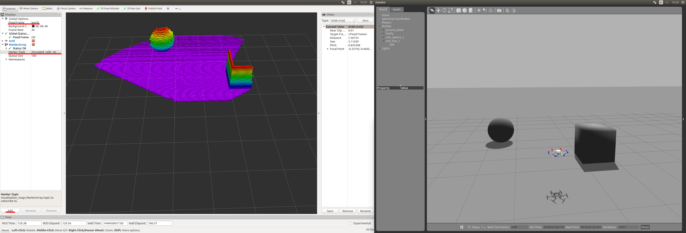

# 3D Моделі OctoMap з ROS/Gazebo Classic

[Бібліотека OctoMap](http://octomap.github.io/) - це бібліотека з відкритим кодом для генерації об'ємних моделей 3D середовища з даних датчиків. Дані цієї моделі потім можуть використовуватись дроном для навігації та уникнення перешкод.

У цьому посібнику описано як використовувати _OctoMap_ з [Gazebo Classic](../sim_gazebo_classic/README.md) [Симулятором роторів](https://github.com/ethz-asl/rotors_simulator/wiki/RotorS-Simulator) та ROS.

## Встановлення

Встановлення потребує ROS, [Gazebo Classic](../sim_gazebo_classic/README.md) та плагін симулятора роторів. Дотримуйтесь [інструкцій Симулятора роторів](https://github.com/ethz-asl/rotors_simulator) для встановлення.

Далі - встановіть бібліотеку _OctoMap_:

```sh
sudo apt-get install ros-indigo-octomap ros-indigo-octomap-mapping
rosdep install octomap_mapping
rosmake octomap_mapping
```

Тепер відкрийте `~/catkin_ws/src/rotors_simulator/rotors_gazebo/CMakeLists.txt` та додайте наступні рядки в кінець файлу:

```sh
find_package(octomap REQUIRED)
include_directories(${OCTOMAP_INCLUDE_DIRS})
link_libraries(${OCTOMAP_LIBRARIES})
```

Відкрийте `~/catkin_ws/src/rotors_simulator/rotors_gazebo/package.xml` та додайте наступні рядки:

```xml
<build_depend>octomap</build_depend>
<run_depend>octomap</run_depend>
```

Виконайте наступні два рядки:

::: info
The first line changes your default shell editor to _gedit_. Це рекомендується для користувачів, які мають мало досвіду роботи з _vim_ (редактор за замовчування), в іншому випадку його можна опустити.
:::

```sh
export EDITOR='gedit'
rosed octomap_server octomap_tracking_server.launch
```

та змінити наступні два рядки:

```xml
<param name="frame_id" type="string" value="map" />
...
<!--remap from="cloud_in" to="/rgbdslam/batch_clouds" /-->
```

на:

```xml
<param name="frame_id" type="string" value="world" />
...
<remap from="cloud_in" to="/firefly/vi_sensor/camera_depth/depth/points" />
```

## Запуск симуляції

Виконайте наступні три рядки в _окремих_ терміналах. Це відкриє [Gazebo Classic](../sim_gazebo_classic/README.md), _Rviz_ та сервер octomap.

```sh
roslaunch rotors_gazebo mav_hovering_example_with_vi_sensor.launch  mav_name:=firefly
rviz
roslaunch octomap_server octomap_tracking_server.launch
```

У _Rviz_ змінить поле 'Fixed Frame' з 'map' на 'world' у верхній правій частині вікна. Тепер натисніть кнопку "Додати" в нижньому лівому куті та оберіть MarkerArray. Потім двічі натисніть на MarkerArray та змініть 'Marker Topic' з `/free_cells_vis_array` на `/occupied_cells_vis_array`.

Тепер ви повинні побачити частину підлоги.

У вікні _Gazebo Classic_ вставте куб перед червоними роторами, який ви повинні побачити у _Rviz_.


