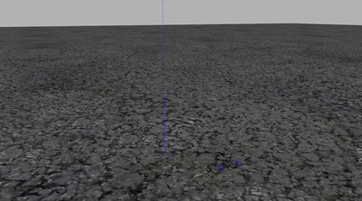

# Світи Gazebo Classic

Цей розділ надає зображення/інформацію про світи [Gazebo Classic](../sim_gazebo_classic/README.md), що підтримуються PX4.

Світ [empty.world](#empty_world) відтворюється за замовчуванням, хоча це може бути заміщено [світом відповідним до моделі](#model_specific_worlds). Розробники також можуть вручну вказати світ для завантаження: [Gazebo Classic > Завантаження певного світу](../sim_gazebo_classic/README.md#loading-a-specific-world).

Вихідний код світів, що підтримуються можна знайти на GitHub тут: [PX4/PX4-SITL_gazebo-classic/tree/main/worlds](https://github.com/PX4/PX4-SITL_gazebo-classic/tree/main/worlds).

## Порожній (за замовчуванням)

[PX4/PX4-SITL_gazebo-classic/tree/main/worlds/empty.world](https://github.com/PX4/PX4-SITL_gazebo-classic/blob/main/worlds/empty.world)

## Baylands

[PX4/PX4-SITL_gazebo-classic/tree/main/worlds/baylands.world](https://github.com/PX4/PX4-SITL_gazebo-classic/blob/main/worlds/baylands.world)

## Аеропорт KSQL

[PX4/PX4-SITL_gazebo-classic/tree/main/worlds/ksql_airport.world](https://github.com/PX4/PX4-SITL_gazebo-classic/blob/main/worlds/ksql_airport.world)

## Літовище McMillan

[PX4/PX4-SITL_gazebo-classic/tree/main/worlds/mcmillan_airfield.world](https://github.com/PX4/PX4-SITL_gazebo-classic/blob/main/worlds/mcmillan_airfield.world)

## Безпечна посадка

[PX4/PX4-SITL_gazebo-classic/tree/main/worlds/safe_landing.world](https://github.com/PX4/PX4-SITL_gazebo-classic/blob/main/worlds/safe_landing.world)

## Гоночна траса Sonoma

[PX4/PX4-SITL_gazebo-classic/tree/main/worlds/sonoma_raceway.world](https://github.com/PX4/PX4-SITL_gazebo-classic/blob/main/worlds/sonoma_raceway.world) 

## Склад

[PX4/PX4-SITL_gazebo-classic/tree/main/worlds/warehouse.world](https://github.com/PX4/PX4-SITL_gazebo-classic/blob/main/worlds/warehouse.world)

## Yosemite

[PX4/PX4-SITL_gazebo-classic/tree/main/worlds/yosemite.world](https://github.com/PX4/PX4-SITL_gazebo-classic/blob/main/worlds/yosemite.world)

## Світи певний моделей

Деякі [моделі засобів](../sim_gazebo_classic/vehicles.md) покладаються на фізику/плагіни певного світу. Інструментарій PX4 автоматично відтворить світ, який має те ж ім'я що і модель засобу якщо він присутній (замість **empty.world** за замовчуванням):

Світи певних моделей:

- [boat.world](https://github.com/PX4/PX4-SITL_gazebo-classic/blob/main/worlds/boat.world): включає поверхню для симуляції плавучості [човна](../sim_gazebo_classic/vehicles.md#unmanned-surface-vehicle-usv-boat).
- [uuv_hippocampus.world](https://github.com/PX4/PX4-SITL_gazebo-classic/blob/main/worlds/uuv_hippocampus.world): порожній світ, що використовується для симуляції підводного середовища для [підводного засобу HippoCampus](../sim_gazebo_classic/vehicles.md#hippocampus-tuhh-uuv).
- [typhoon_h480.world](https://github.com/PX4/PX4-SITL_gazebo-classic/blob/main/worlds/typhoon_h480.world): Використовується моделлю засобу [Typhoon H480 (Гексакоптер)](../sim_gazebo_classic/vehicles.md#typhoon-h480-hexrotor) та включає відео віджет, щоб увімкнути/вимкнути трансляцію відео. Цей світ включає плагін gazebo для симуляції камери.
- [iris_irlock.world](https://github.com/PX4/PX4-SITL_gazebo-classic/blob/main/worlds/iris_irlock.world): включає ІЧ маяк для тестування [точної посадки](../advanced_features/precland.md).
