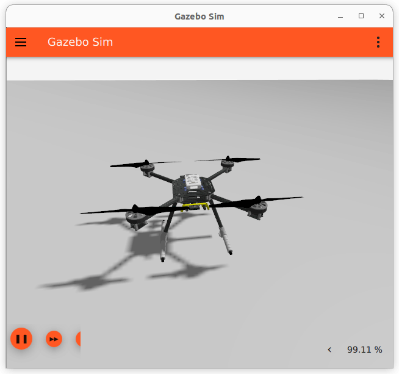

# Рухомі засоби Gazebo

Цей розділ перераховує/показує рухомі засоби, що підтримуються PX4 симуляцією [Gazebo](../sim_gazebo_gz/index.md), та команди `make` необхідні для того щоб їх запустити (команди запускаються з термінала в директорії **PX4-Autopilot**).

Моделі включені у PX4 як підмодуль який отримується з [Репозиторію моделей Gazebo](../sim_gazebo_gz/gazebo_models.md).

Типи рухомих засобів що підтримуються: мультиротор, ВЗІП, літак.

:::warning
Дивіться [Рухомі засоби Gazebo Classic](../sim_gazebo_classic/vehicles.md) для засобів, що працюють зі старішою [Симуляцією Gazebo "Classic"](../sim_gazebo_classic/index.md). Зверніть увагу, що моделі засобів не взаємозамінні між двома версіями симулятору: засоби на цій сторінці будуть працювати тільки з (новим) [Gazebo](../sim_gazebo_gz/index.md).
:::

## Мультикоптер

### Квадрокоптер X500

```sh
make px4_sitl gz_x500
```

### Квадрокоптер X500 з візуальною одометрією

```sh
make px4_sitl gz_x500_vision
```



### Квадрокоптер X500 з камерою глибини

Ці моделі мають додану камеру глибини, змодельовану за зразком OAK-D.

_Камера глибини орієнтована вперед:_

```sh
make px4_sitl gz_x500_depth
```


### Квадрокоптер X500 з монокулярною камерою

Ці моделі мають доданий простий датчик монокулярної камери (на моделі фізично немає візуалізації камери).

```sh
make px4_sitl gz_x500_mono_cam
```

::: info
The camera cannot yet be used to stream video or for image capture in QGroundControl. Використовуйте [PX4-Autopilot#22563](https://github.com/PX4/PX4-Autopilot/issues/22563) для відстеження додаткової роботи, необхідної для повної реалізації цих випадків використання.
:::

## Літак/Фіксоване крило

### Стандартний літак

```sh
make px4_sitl gz_rc_cessna
```


### Покращений літак

```sh
make px4_sitl gz_advanced_plane
```


::: info
The difference between the Advanced Plane and the "regular plane" lies in the Lift Physics that the two models use:

- Можна налаштувати плагін _покращеної піднімної сили_ що використовуються моделлю для точнішої відповідності певному засобу використовуючи [Інструмент "Покращена піднімна сила"](../sim_gazebo_gz/tools_avl_automation.md).
- Для отримання додаткової інформації про розрахунки піднімної сили для покращеного літака, дивіться [PX4-SITL_gazebo-classic/src/liftdrag_plugin/index.md](https://github.com/PX4/PX4-SITL_gazebo-classic/blob/20ded0757b4f2cb362833538716caf1e938b162a/src/liftdrag_plugin/index.md)

:::

## ВЗІП

### Стандартний ВЗІП

```sh
make px4_sitl gz_standard_vtol
```


