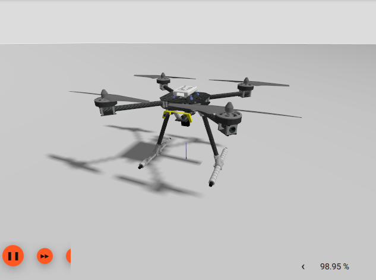

# Рухомі засоби Gazebo

Цей розділ перераховує/показує рухомі засоби, що підтримуються PX4 симуляцією [Gazebo](../sim_gazebo_gz/index.md), та команди `make` необхідні для того щоб їх запустити (команди запускаються з термінала в директорії **PX4-Autopilot**).

Моделі включені у PX4 як підмодуль який отримується з [Репозиторію моделей Gazebo](../sim_gazebo_gz/gazebo_models.md).

Supported vehicle types include: mutirotor, VTOL, Plane, Rover.

:::warning
Дивіться [Рухомі засоби Gazebo Classic](../sim_gazebo_classic/vehicles.md) для засобів, що працюють зі старішою [Симуляцією Gazebo "Classic"](../sim_gazebo_classic/index.md). Зверніть увагу, що моделі засобів не взаємозамінні між двома версіями симулятору: засоби на цій сторінці будуть працювати тільки з (новим) [Gazebo](../sim_gazebo_gz/index.md).
:::

## Мультикоптер

### Квадрокоптер X500

```sh
make px4_sitl gz_x500
```

### Квадрокоптер X500 з візуальною одометрією

```sh
make px4_sitl gz_x500_vision
```


### X500 Quadrotor with Depth Camera (Front-facing)

This model has a forward-facting depth camera attached, modelled on the [OAK-D](https://shop.luxonis.com/products/oak-d).

```sh
make px4_sitl gz_x500_depth
```


### Квадрокоптер X500 з монокулярною камерою

This model has a simple monocular camera sensor attached (there is no physical camera visualization on the model itself).

```sh
make px4_sitl gz_x500_mono_cam
```

:::info
Ця камера поки що не може використовуватись для трансляції відео або захоплення зображень у QGroundControl. Використовуйте [PX4-Autopilot#22563](https://github.com/PX4/PX4-Autopilot/issues/22563) для відстеження додаткової роботи, необхідної для повної реалізації цих випадків використання.
:::

### X500 Quadrotor with Monocular Camera (Down-facing)

This model has a simple monocular camera sensor attached facing down (there is no physical camera visualization on the model itself).

This can be used with the [Aruco world](../sim_gazebo_gz/worlds.md#aruco) to test precision landing.

```sh
make px4_sitl gz_x500_mono_cam_down
```

### X500 Quadrotor with 1D LIDAR (Down-facing)

This model have a LIDAR attached to the bottom, modelled on the [Lightware LW20/C](../sensor/sfxx_lidar.md).

It has a range between 0.1 and 100m.

The model can be used for testing [rangefinder](../sensor/rangefinders.md) use cases like [landing](../flight_modes_mc/land.md) or [terrain following](../flying/terrain_following_holding.md).

```sh
make px4_sitl gz_x500_lidar_front
```



### X500 Quadrotor with 1D LIDAR (Front-facing)

This model have a LIDAR attached to the front, modelled on the [Lightware LW20/C](../sensor/sfxx_lidar.md).

It has a range between 0.2 and 100m.

The model can be used for testing [Collision Prevention](../computer_vision/collision_prevention.md#gazebo-simulation).

```sh
make px4_sitl gz_x500_lidar_front
```


### X500 Quadrotor with 2D LIDAR

This model have a 2D LIDAR attached, modelled on the [Hokuyo UTM-30LX](https://www.hokuyo-aut.jp/search/single.php?serial=169). It has a range between 0.1 and 30m, and scans in a 270° arc. The model can be used for testing [Collision Prevention](../computer_vision/collision_prevention.md#gazebo-simulation).

```sh
make px4_sitl gz_x500_lidar_2d
```


::: info
The sensor information is written to the [ObstacleDistance](../msg_docs/ObstacleDistance.md) UORB message used by collision prevention.
:::

## Літак/Фіксоване крило

### Стандартний літак

```sh
make px4_sitl gz_rc_cessna
```


### Покращений літак

<Badge type="tip" text="PX4 v1.15" />

```sh
make px4_sitl gz_advanced_plane
```


::: info
The difference between the Advanced Plane and the "regular plane" lies in the Lift Physics that the two models use:

- Можна налаштувати плагін _покращеної піднімної сили_ що використовуються моделлю для точнішої відповідності певному засобу використовуючи [Інструмент "Покращена піднімна сила"](../sim_gazebo_gz/tools_avl_automation.md).
- Для отримання додаткової інформації про розрахунки піднімної сили для покращеного літака, дивіться [PX4-SITL_gazebo-classic/src/liftdrag_plugin/index.md](https://github.com/PX4/PX4-SITL_gazebo-classic/blob/20ded0757b4f2cb362833538716caf1e938b162a/src/liftdrag_plugin/index.md)

:::

## ВЗІП

### Стандартний ВЗІП

```sh
make px4_sitl gz_standard_vtol
```


## Землехід

### Differential Rover

[Differential Rover](../frames_rover/differential.md) uses the [rover world](../sim_gazebo_gz/worlds.md#rover) by default.

```sh
make px4_sitl gz_r1_rover
```


### Ackermann Rover

[Ackermann Rover](../frames_rover/ackermann.md) uses the [rover world](../sim_gazebo_gz/worlds.md#rover) by default.

```sh
make px4_sitl gz_rover_ackermann
```


