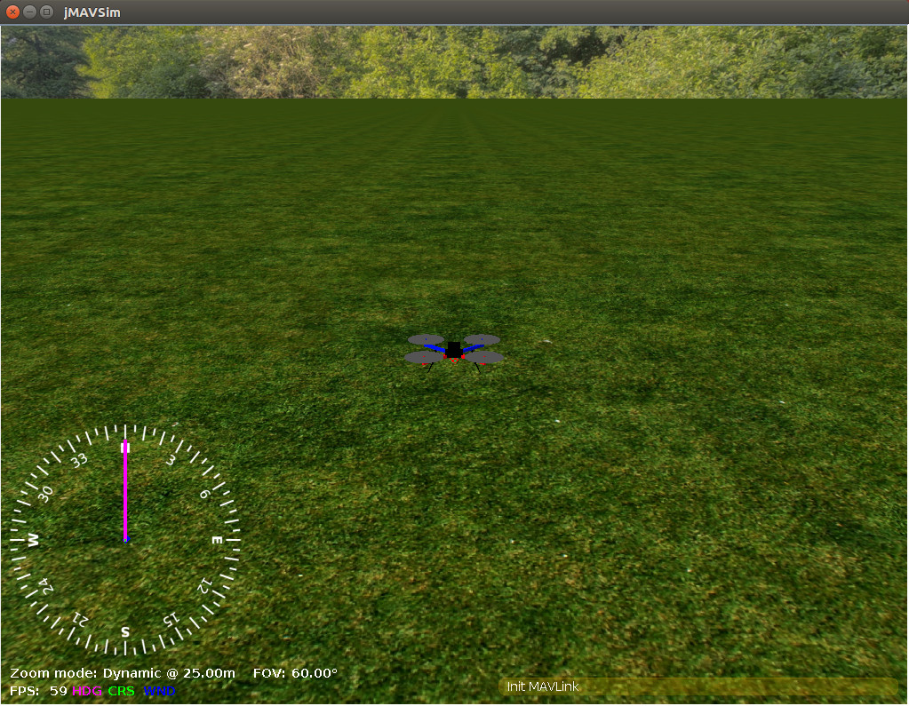

# jMAVSim з SITL

jMAVSim - це простий симулятор мультироторів/квадрокоптерів, який дозволяє вам літати на _коптерах_ типу транспортних засобів, що працюють на PX4, по симульованому світі. Його легко налаштувати і можна використовувати для перевірки того, що ваш апарат може злітати, летіти, приземлятися і належним чином реагувати на різні несправності (наприклад, несправність GPS).

<strong>Підтримувані транспортні засоби:</strong>

- Quad

Ця тема показує, як налаштувати jMAVSim для підключення до SITL версії PX4.

:::tip
jMAVSim також може бути використаний для симуляції HITL ([як показано тут](../simulation/hitl.md#jmavsim-quadrotor-only)).
:::

## Встановлення

Налаштування jMAVSim включене в наші [стандартні інструкції зі збірки](../dev_setup/dev_env.md) (для macOS, Ubuntu Linux, Windows).

## Середовище симуляції

Симуляція програмного забезпечення в петлі виконує повну систему на комп'ютері та моделює автопілот. Він підключається через локальну мережу до симулятора. Вигляд налаштування виглядає наступним чином:

[](https://mermaid-js.github.io/mermaid-live-editor/#/edit/eyJjb2RlIjoiZ3JhcGggTFI7XG4gIFNpbXVsYXRvci0tPk1BVkxpbms7XG4gIE1BVkxpbmstLT5TSVRMOyIsIm1lcm1haWQiOnsidGhlbWUiOiJkZWZhdWx0In0sInVwZGF0ZUVkaXRvciI6ZmFsc2V9)


<!-- original graph
graph LR;
  Simulator-- >MAVLink;
  MAVLink-- >SITL;
-->

## Запуск SITL

Після переконання, що [вимоги для симуляції](../dev_setup/dev_env.md) встановлені в системі, просто запустіть: Ціль make для зручності скомпілює збірку POSIX хоста та запустить симуляцію.

```sh
make px4_sitl_default jmavsim
```

Це запустить консоль PX4 як показано нижче:

```sh
[init] shell id: 140735313310464
[init] task name: px4

______  __   __    ___
| ___ \ \ \ / /   /   |
| |_/ /  \ V /   / /| |
|  __/   /   \  / /_| |
| |     / /^\ \ \___  |
\_|     \/   \/     |_/

Ready to fly.


pxh>
```

Це також викличе вікно, яке показує тривимірний вигляд симулятора [jMAVSim](https://github.com/PX4/jMAVSim):



## Підйом у небо

Система почне друкувати інформацію про статус. Ви зможете почати літати, як тільки у вас буде фіксація позиції (незабаром після того, як консоль відобразить повідомлення: _EKF починає об'єднання GPS_).

Щоб злітіти, введіть наступне у консоль:

```sh
pxh> commander takeoff
```

Ви можете використовувати _QGroundControl_ для виконання місії або для підключення до [джойстика](#using-a-joystick).

## Використання та варіанти налаштування

Параметри, які застосовуються до всіх симуляторів охоплені у темі [Симуляція](../simulation/index.md#sitl-simulation-environment) рівнем вище (деякі з них можуть бути продубльовані нижче).

### Імітація відмови датчика/обладнання

[Імітація збоїв](../simulation/failsafes.md) пояснює, як викликати збої безпеки, такі як відмова GPS і розряд акумулятора.

### Встановлення власного місця зльоту

Місце вильоту за замовчуванням в can be overridden використовуючи змінні середовища: `PX4_HOME_LAT`, `PX4_HOME_LON` та `PX4_HOME_ALT`.

Наприклад, щоб встановити широту, довготу та висоту:

```sh
export PX4_HOME_LAT=28.452386
export PX4_HOME_LON=-13.867138
export PX4_HOME_ALT=28.5
make px4_sitl_default jmavsim
```

### Зміна швидкості симуляції

Швидкість симуляції може бути збільшена або зменшена відносно реального часу за допомогою змінної середовища `PX4_SIM_SPEED_FACTOR`.

```sh
export PX4_SIM_SPEED_FACTOR=2
make px4_sitl_default jmavsim
```

Для додаткової інформації дивіться: [Симуляція > Запуск симуляції швидше реального часу](../simulation/index.md#simulation_speed).

### Використання джойстика

Джойстики та підтримка пальцевого джойстику підтримуються через _QGroundControl_ ([інструкції з налаштування тут](../simulation/index.md#joystick-gamepad-integration)).

### Моделювання Wifi Дрона

Є спеціальна ціль для моделювання безпілотника, підключеного через Wifi до локальної мережі:

```sh
make broadcast jmavsim
```

Симулятор транслює свою адресу в локальній мережі так, як це робив би справжній безпілотник.

### Запуск JMAVSim та PX4 окремо

Ви можете запустити JMAVSim та PX4 окремо:

```sh
./Tools/simulation/jmavsim/jmavsim_run.sh -l
make px4_sitl none
```

Це дозволяє швидший цикл тестування (перезапуск jMAVSim займає значно більше часу).

### Режим без інтерфейсу

Щоб запустити jMAVSim без GUI, встановіть змінну середовища `HEADLESS=1` як показано:

```sh
HEADLESS=1 make px4_sitl jmavsim
```

## Багатотранспортне моделювання

JMAVSim може бути використаний для симуляції багатьох транспортних засобів: [Багато-транспортний Симулятор з JMAVSim](../sim_jmavsim/multi_vehicle.md).

## Розширення та персоналізація

Для розширення та налаштування інтерфейсу симуляції, відредагуйте файли у директорії **Tools/jMAVSim**. Код можна отримати через [репозиторій jMAVSim](https://github.com/px4/jMAVSim) на Github.

:::info Система збірки забезпечує правильний підмодуль, який повинен бути перевірений для всіх залежностей, включаючи симулятор. Це не перезапише зміни в файлах у каталозі, проте, коли ці зміни будуть зафіксовані, підмодуль повинен бути зареєстрований у репозиторії Firmware з новим хешем коміту. Щоб це зробити, `git add Tools/jMAVSim` та здійсніть зміну. Це оновить хеш GIT симулятора.
:::

## Взаємодія з ROS

Симуляцію можна [інтерфейсувати з ROS](../simulation/ros_interface.md) так само, як і на борту реального транспортного засобу.

## Важливі файли

- Сценарії запуску обговорюються в [Запуск системи](../concept/system_startup.md).
- Симульована файлова система кореня (каталог "/") створюється всередині каталогу збірки тут: `build/px4_sitl_default/rootfs`.

## Відстеження проблем

### java.long.NoClassDefFoundError

```sh
Exception in thread "main" java.lang.NoClassDefFoundError: javax/vecmath/Tuple3d
at java.base/java.lang.Class.forName0(Native Method)
at java.base/java.lang.Class.forName(Class.java:374)
at org.eclipse.jdt.internal.jarinjarloader.JarRsrcLoader.main(JarRsrcLoader.java:56)
Caused by: java.lang.ClassNotFoundException: javax.vecmath.Tuple3d
at java.base/java.net.URLClassLoader.findClass(URLClassLoader.java:466)
at java.base/java.lang.ClassLoader.loadClass(ClassLoader.java:566)
at java.base/java.lang.ClassLoader.loadClass(ClassLoader.java:499)
... 3 more
Exception in thread "main" java.lang.NoClassDefFoundError: javax/vecmath/Tuple3d
at java.base/java.lang.Class.forName0(Native Method)
at java.base/java.lang.Class.forName(Class.java:374)
at org.eclipse.jdt.internal.jarinjarloader.JarRsrcLoader.main(JarRsrcLoader.java:56)
Caused by: java.lang.ClassNotFoundException: javax.vecmath.Tuple3d
at java.base/java.net.URLClassLoader.findClass(URLClassLoader.java:466)
at java.base/java.lang.ClassLoader.loadClass(ClassLoader.java:566)
at java.base/java.lang.ClassLoader.loadClass(ClassLoader.java:499)
```

Ця помилка більше не повинна виникати, якщо підмодуль jMAVSim буде [оновлено до новіших бібліотек jar](https://github.com/PX4/jMAVSim/pull/119), і Java 11 або Java 14 повинні працювати належним чином.

### Відбулася незаконна відображувальна операція доступу

Це попередження можна ігнорувати (ймовірно, воно буде відображено, але симуляція все одно буде працювати правильно).

```sh
WARNING: An illegal reflective access operation has occurred
WARNING: Illegal reflective access by javax.media.j3d.JoglPipeline (rsrc:j3dcore.jar) to method sun.awt.AppContext.getAppContext()
WARNING: Please consider reporting this to the maintainers of javax.media.j3d.JoglPipeline
WARNING: Use --illegal-access=warn to enable warnings of further illegal reflective access operations
WARNING: All illegal access operations will be denied in a future release
Inconsistency detected by ld.so: dl-lookup.c: 112: check_match: Assertion version->filename == NULL || ! _dl_name_match_p (version->filename, map)' failed!
```

### java.awt.AWTError: Assistive Technology not found: org.GNOME.Accessibility.AtkWrapper

```sh
Виключення в потоці "main" java.lang.reflect.InvocationTargetException
в sun.reflect.NativeMethodAccessorImpl.invoke0 (Нативний метод)
в sun.reflect.NativeMethodAccessorImpl.invoke (NativeMethodAccessorImpl.java:62)
в sun.reflect.DelegatingMethodAccessorImpl.invoke (DelegatingMethodAccessorImpl.java:43)
в java.lang.reflect.Method.invoke (Method.java:498)
в org.eclipse.jdt.internal.jarinjarloader.JarRsrcLoader.main (JarRsrcLoader.java:58)
Викликано: java.awt.AWTError: Не знайдено технологію сприяння: org.GNOME.Accessibility.AtkWrapper
в java.awt.Toolkit.loadAssistiveTechnologies (Toolkit.java:807)
в java.awt.Toolkit.getDefaultToolkit (Toolkit.java:886)
в java.awt.Window.getToolkit (Window.java:1358)
в java.awt.Window.init (Window.java:506)
в java.awt.Window. (Window.java:537)
в java.awt.Frame. (Frame.java:420)
в java.awt.Frame. (Frame.java:385)
в javax.swing.JFrame. (JFrame.java:189)
в me.drton.jmavsim.Visualizer3D. (Visualizer3D.java:104)
в me.drton.jmavsim.Simulator. (Simulator.java:157)
в me.drton.jmavsim.Simulator.main (Simulator.java:678)
```

Якщо ви бачите цю помилку, спробуйте цей обхідний шлях:

Редагуйте файл **accessibility.properties**:

```sh
sudo gedit /etc/java-8-openjdk/accessibility.properties
```

та закоментуйте рядок, вказаний нижче:

```sh
#assistive_technologies=org.GNOME.Acessibility.AtkWrapper
```

Для отримання додаткової інформації перевірте [це питання на GitHub](https://github.com/PX4/PX4-Autopilot/issues/9557). Учасник знайшов виправлення на [askubuntu.com](https://askubuntu.com/questions/695560).

### Виняток у потоці "main" java.lang.UnsupportedClassVersionError

При компіляції jMAVsim ви можливо зіткнетеся з наступною помилкою:

```sh
Exception in thread "main" java.lang.UnsupportedClassVersionError: me/drton/jmavsim/Simulator has been compiled by a more recent version of the Java Runtime (class file version 59.0), this version of the Java Runtime only recognizes class file versions up to 58.0
```

Ця помилка говорить вам, вам потрібна більш свіжа версія Java у вашому середовищі. Версія файлу класу 58 відповідає jdk14, версія 59 - jdk15, версія 60 - jdk 16 тощо.

Щоб виправити це під macOS, ми рекомендуємо встановити OpenJDK через homebrew

```sh
brew install --cask adoptopenjdk16
```
