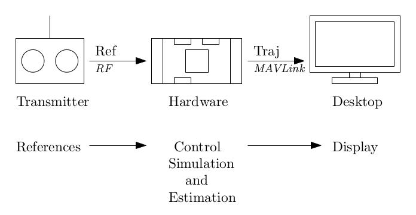

# Моделювання в апаратному забезпеченні (SIH)

:::warning
Цей симулятор підтримується та обслуговується [спільнотою](../simulation/community_supported_simulators.md). Він може працювати або не працювати з поточними версіями PX4 (відомо, що він працює в PX4 v1.14).

Перегляньте розділ [Встановлення ланцюжка інструментів](../dev_setup/dev_env.md), щоб отримати інформацію про середовища та інструменти, які підтримуються основною командою розробників.
:::

Симуляція у апаратному забезпеченні (SIH) - це альтернатива симуляції у [апаратному забезпеченні (HITL) ](../simulation/hitl.md) для квадрокоптерів, фіксованих крил (літаків) та VTOL хвостоподібних.

SIH може бути використано новими користувачами PX4 для знайомства з PX4 та різними режимами та функціями, а також, звичайно, для навчання польоту транспортного засобу за допомогою пульту керування в симуляції, що неможливо з SITL.

## Загальний огляд

З SIH вся симуляція працює на вбудованому обладнанні: контролер, оцінювач стану та симулятор. Комп'ютер на робочому столі використовується лише для відображення віртуального транспортного засобу.



### Сумісність

- SIH сумісний з усіма платами серії Pixhawk, за винятком тих, що базуються на FMUv2.
- SIH для квадрокоптера підтримується з версії PX4 v1.9.
- SIH для фіксованих крил (літака) та VTOL-конвертоплана підтримується з версії PX4 v1.13.
- SIH як SITL (без апаратного забезпечення) з версії PX4 v1.14.

### Переваги

SIH має кілька переваг перед HITL:

- It ensures synchronous timing by avoiding the bidirectional connection to the computer. As a result the user does not need such a powerful desktop computer.
- The whole simulation remains inside the PX4 environment. Розробники, які знайомі з PX4, можуть легше включити свою власну математичну модель в симулятор. Вони, наприклад, можуть змінити аеродинамічну модель або рівень шуму датчиків, або навіть додати датчик для симуляції.
- Фізичні параметри, які представляють транспортний засіб (такі як маса, інерція та максимальна сила тяги), можна легко змінити з параметрів [SIH](../advanced_config/parameter_reference.md#simulation-in-hardware).

## Вимоги

To run the SIH, you will need a:

- [Flight controller](../flight_controller/README.md), such as a Pixhawk-series board
- Development computer for displaying the virtual vehicle.
- [Manual controller](../getting_started/px4_basic_concepts.md#manual-control): either a [radio control system](../getting_started/px4_basic_concepts.md#radio-control-rc) or a [joystick](../getting_started/px4_basic_concepts.md#gcs-joystick-controller).

From PX4 v1.14 you can run SIH "as SITL", in which case a flight controller is not required.

## Setting up SIH

Щоб налаштувати SIH

1. Connect the flight controller to the desktop computer with a USB cable
1. Open QGroundControl and wait for the flight controller too boot and connect.
1. Open [Vehicle Setup > Airframe](../config/airframe.md) then select the desired frame:
   - [SIH Quadcopter X](../airframes/airframe_reference.md#copter_simulation_sih_quadcopter_x)
   - [SIH plane AERT](../airframes/airframe_reference.md#plane_simulation_sih_plane_aert)
   - [SIH Tailsitter Duo](../airframes/airframe_reference.md#vtol_simulation_sih_tailsitter_duo)

The autopilot will then reboot. Once restarted the `sih` module is started, and the vehicle should be displayed on the ground control station map.

:::warning
The airplane needs to takeoff in manual mode at full throttle.
Also, if the airplane crashes the state estimator might lose its fix.
:::

## Setting up the Display

To display the simulated vehicle:

1. Close _QGroundControl_ (if open).
1. Unplug and replug the flight controller (allow a few seconds for it to boot).
1. Start jMAVSim by calling the script **jmavsim_run.sh** from a terminal:

   ```sh
   ./Tools/simulation/jmavsim/jmavsim_run.sh -q -d /dev/ttyACM0 -b 2000000 -o
   ```

   where the flags are:

   - `-q` to allow the communication to _QGroundControl_ (optional).
   - `-d` to start the serial device `/dev/ttyACM0` on Linux. On macOS this would be `/dev/tty.usbmodem1`.
   - `-b` to set the serial baud rate to `2000000`.
   - `-o` to start jMAVSim in _display Only_ mode (i.e. the physical engine is turned off and jMAVSim only displays the trajectory given by the SIH in real-time).
   - add a flag `-a` to display an aircraft or '-t' to display a tailsitter. If this flag is not present a quadrotor will be displayed by default.

1. After few seconds, _QGroundControl_ can be opened again.

At this point, the system can be armed and flown. The vehicle can be observed moving in jMAVSim, and on the QGC _Fly_ view.

## Running the SIH as SITL (without hardware)

SIH can be run as SITL (Software-In-The-Loop) from v1.14. What this means is that the simulation code is executed on the laptop/computer, similar to Gazebo or jMAVSim. In this case you don't need the flight controller hardware.

To run SIH as SITL:

1. Install the [PX4 Development toolchain](../dev_setup/dev_env.md).
1. Run the appropriate make command for each vehicle type (at the root of the PX4-Autopilot repository):

   - quadrotor:

     ```sh
     make px4_sitl sihsim_quadx
     ```

   - Fixed-wing (plane):

     ```sh
     make px4_sitl sihsim_airplane
     ```

   - XVert VTOL tailsitter:

     ```sh
     make px4_sitl sihsim_xvert
     ```

SITL allows the simulation to be run faster than real time. To run the airplane simulation 10 times faster than real time, run the commandL

```sh
PX4_SIM_SPEED_FACTOR=10 make px4_sitl sihsim_airplane
```

## Динамічний режим

The dynamic models for the various vehicles are:

- Quadrotor: [pdf report](https://github.com/PX4/PX4-user_guide/raw/main/assets/simulation/SIH_dynamic_model.pdf).
- Fixed-wing: Inspired by the PhD thesis: "Dynamics modeling of agile fixed-wing unmanned aerial vehicles." Khan, Waqas, supervised by Nahon, Meyer, McGill University, PhD thesis, 2016.
- Tailsitter: Inspired by the master's thesis: "Modeling and control of a flying wing tailsitter unmanned aerial vehicle." Chiappinelli, Romain, supervised by Nahon, Meyer, McGill University, Masters thesis, 2018.

## Відео

@[youtube](https://youtu.be/PzIpSCRD8Jo)

## Подяка

SIH was originally developed by Coriolis g Corporation. The airplane model and tailsitter models were added by Altitude R&D inc. Both are Canadian companies:

- [Coriolis g](http://ww7.vogi-vtol.com) develops a new type of Vertical Takeoff and Landing (VTOL) vehicles based on passive coupling systems;
- [Altitude R&D](https://www.altitude-rd.com/) is specialized in dynamics, control, and real-time simulation.

The simulator is released for free under BSD license.
