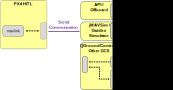

# Симуляція з апаратним забезпеченням в контурі (HITL)

:::warning HITL
[підтримується та утримується спільнотою](../simulation/community_supported_simulators.md). Це може працювати або не працювати з поточними версіями PX4.

Дивіться [Встановлення інструментарію](../dev_setup/dev_env.md) для інформації про середовища та інструменти, які підтримуються основною розробницькою командою.
:::

Апаратне забезпечення в контурі (HITL або HIL) режим симуляції в якому звичайна прошивка PX4 виконується на реальному пристрої польотного контролера. Цей підхід має перевагу у вигляді можливості тестування більшості коду для польоту на реальному апаратному забезпеченні.

PX4 підтримує HITL для мультикоптерів (за допомогою jMAVSim або Gazebo Classic) та ВЗІП (за допомогою Gazebo Classic).

<a id="compatible_airframe"></a>

## Планери сумісні з HITL

Поточний набір сумісних планерів проти симуляторів:

| Планер                                                                                                               | `SYS_AUTOSTART` | Gazebo Classic | jMAVSim |
| -------------------------------------------------------------------------------------------------------------------- | --------------- | -------------- | ------- |
| [HIL квадрокоптер у конфігурації X](../airframes/airframe_reference.md#copter_simulation_hil_quadcopter_x)           | 1001            | Y              | Y       |
| [HIL ВЗІП квадроплан стандартний](../airframes/airframe_reference.md#vtol_standard_vtol_hil_standard_vtol_quadplane) | 1002            | Y              |         |
| [Загальний квадрокоптер у конфігурації X](../airframes/airframe_reference.md#copter_quadrotor_x_generic_quadcopter)  | 4001            | Y              | Y       |

<a id="simulation_environment"></a>

## Середовище симуляції HITL

У симуляції з апаратним забезпеченням у контурі (HITL) звичайна прошивка PX4 виконується на реальному обладнані. JMAVSim або Gazebo Classic (які працюють на комп'ютері розробки) підключені до пристрою польотного контролера через USB/UART. Симулятор діє як шлюз для спільного використання даних MAVLink між PX4 та _QGroundControl_.

:::info Симулятор також може бути підключений за допомогою UDP якщо політний контролер має підтримку мережі та використовує стабільне з'єднання з низькою затримкою (наприклад дротове Ethernet підключення, WiFi підключення зазвичай недостатньо надійне). Наприклад, ця конфігурація була перевірена з PX4, що виконується на Raspberry Pi який підключений через Ethernet до комп'ютера (налаштування запуску яке включає команди для запуску jMAVSim можна знайти [тут](https://github.com/PX4/PX4-Autopilot/blob/main/posix-configs/rpi/px4_hil.config)).
:::

Діаграма нижче показує середовище симуляції:

- Обрано конфігурацію HITL (у _QGroundControl_), яка не запускає ніяких реальних датчиків.
- _jMAVSim_ або _Gazebo Classic_ підключені до політного контролера через USB.
- Симулятор підключено до _QGroundControl_ через UDP і передає повідомлення MAVLink до PX4.
- _Gazebo Classic_ та _jMAVSim_ можуть також підключатися до зовнішнього API та передавати повідомлення MAVLink до PX4.
- (Необов'язково) Для підключення джойстика/геймпада через _QGroundControl_ може бути використано послідовне з'єднання.



## HITL у порівнянні з SITL

SITL працює на комп'ютері розробки в модельованому середовищі та використовує прошивку спеціально створену для цього середовища. Крім драйверів симуляції для забезпечення підроблених даних середовища від симулятора система поводиться як зазвичай.

На противагу, HITL виконує звичайну прошивку PX4 в "режимі HITL" на звичайному обладнані. Дані симуляції потрапляють в систему в іншій точці ніж для SITL. Основні модулі на кшталт командного або датчиків мають режими HITL, що оминають частину звичайної функціональності при старті.

Підсумовуючи, HITL виконує PX4 на реальному обладнанні за допомогою стандартної прошивки, а SITL фактично більше виконує стандартний системний код.

## Налаштування HITL

### Налаштування PX4

1. З'єднайте автопілот безпосередньо з _QGroundControl_ за допомогою USB.
1. Увімкніть режим HITL

   1. Відкрийте розділ **Налаштування > Безпека**.
   1. Увімкніть режим HITL обравши **Увімкнено** в переліку _HITL увімкнено_:

      

1. Оберіть планер

   1. Відкрийте **Налаштування > Планери**
   1. Оберіть [сумісний планер](#compatible_airframe) який потрібно перевірити. Потім натисніть **Застосувати та перезапустити** у верхній правій частині сторінки _Налаштування планера_.

      

1. При необхідності відкалібруйте пульт РК або джойстик.
1. Налаштування UDP

   1. У вкладці _Загальне_ меню налаштувань приберіть усі прапорці _AutoConnect_ окрім **UDP**.

      

1. (Необов'язково) Налаштуйте джойстик та запобіжник відмови. Встановіть наступні [параметри](../advanced_config/parameters.md) для того щоб використовувати джойстик замість передавача РК пульту:

   - [COM_RC_IN_MODE](../advanced_config/parameter_reference.md#COM_RC_IN_MODE) у "Joystick/No RC Checks". Це дозволить керування джойстиком та відключить перевірки пульту РК.
   - [NAV_RCL_ACT](../advanced_config/parameter_reference.md#NAV_RCL_ACT) у "Вимкнено". Це гарантує, що ніякі дії запобігання відмові не будуть перешкоджати коли не виконується HITL з радіо керуванням.

:::tip
_Посібник користувача QGroundControl_ має інструкції для налаштування [Джойстика](https://docs.qgroundcontrol.com/master/en/SetupView/Joystick.html) та [Віртуального джойстика](https://docs.qgroundcontrol.com/master/en/SettingsView/VirtualJoystick.html).
:::

Як тільки налаштування завершене, **закрийте** _QGroundControl_ та від'єднайте політний контролер від комп'ютера.

### Налаштування відповідних симуляторів

Дотримуйтесь відповідних кроків для певного симулятора в наступних розділах.

#### Gazebo Classic

:::info Переконайтеся, що _QGroundControl_ не запущено!
:::

1. Зберіть PX4 з [Gazebo Classic](../sim_gazebo_classic/README.md) (щоб зібрати плагіни Gazebo Classic).

   ```sh
   cd <Firmware_clone>
   DONT_RUN=1 make px4_sitl_default gazebo-classic
   ```

1. Відкрийте sdf файл моделі рухомого засобу (наприклад **Tools/simulation/gazebo-classic/sitl_gazebo-classic/models/iris_hitl/iris_hitl.sdf**).
1. Якщо необхідно, замінить параметр `serialDevice` (`/dev/ttyACM0`).

   :::info Пристрій послідовного порту залежить від порту, що використано для під'єднання засобу до комп'ютера (зазвичай це `/dev/ttyACM0`). Простий спосіб перевірити це на Ubuntu - під'єднати автопілот, відкрити термінал та ввести `dmesg | grep "tty"`. Останній показаний пристрій і буде тим що потрібно.
:::

1. Налаштуйте змінні середовища:

   ```sh
   source Tools/simulation/gazebo-classic/setup_gazebo.bash $(pwd) $(pwd)/build/px4_sitl_default
   ```

   та запустіть Gazebo Classic в режимі HITL:

   ```sh
   gazebo Tools/simulation/gazebo-classic/sitl_gazebo-classic/worlds/hitl_iris.world
   ```

1. Запустіть _QGroundControl_. Воно повинно автоматично підключитися до PX4 та Gazebo Classic.

#### jMAVSim (тільки квадрокоптер)

:::info Переконайтеся, що _QGroundControl_ не запущено!
:::

1. Під'єднайте політний контролер до комп'ютера та дочекайтесь коли він завантажиться.
1. Запустіть jMAVSim в режимі HITL:

   ```sh
   ./Tools/simulation/jmavsim/jmavsim_run.sh -q -s -d /dev/ttyACM0 -b 921600 -r 250
   ```

   :::info Замінить ім'я послідовного порту `/dev/ttyACM0` на відповідний. На macOS цей порт буде `/dev/tty.usbmodem1`. На Windows (включно з Cygwin) це буде COM1 або інший порт - перевірте з'єднання в менеджері пристроїв Windows.
:::

1. Запустіть _QGroundControl_. Воно повинно автоматично підключитися до PX4 та jMAVSim.

## Політ за автономним завданням у HITL

Ви повинні мати можливість використовувати _QGroundControl_ для [запуску політних завдань](https://docs.qgroundcontrol.com/master/en/FlyView/FlyView.html#missions) та іншим чином керувати рухомим засобом.
