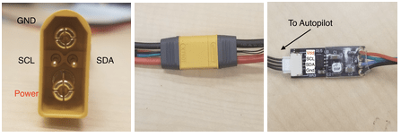

# Rotoye Batmon

[Rotoye Batmon](https://rotoye.com/batmon/) - це набір для додавання функціональності розумної батареї до готових літій-іонних та LiPo батарей. Його можна придбати як самостійний пристрій або як частину заводсько зібраної розумної батареї.

::: info At time of writing you can only use Batmon by [building a custom branch of PX4](#build-px4-firmware). Підтримка в кодовій лінії очікує на [затвердження PR](https://github.com/PX4/PX4-Autopilot/pull/16723).
:::


## Де купити

[Магазин Rotoye](https://rotoye.com/batmon/): комплекти Batmon, розумні батареї на замовлення та аксесуари


## Проведення/Підключення

Система Rotoye Batmon використовує роз'єм батареї XT-90 з контактами I2C та оптоволоконно-ізоляційну плату для передачі даних.



Більш детальну інформацію можна знайти [тут](https://github.com/rotoye/batmon_reader)


## Налаштування програмного забезпечення

### Створення прошивки PX4

1. Клонуйте або завантажте [репозиторій Rotoye для PX4:](https://github.com/rotoye/PX4-Autopilot/tree/batmon_4.03)
   ```sh
   git clone https://github.com/rotoye/PX4-Autopilot.git
   cd PX4-Autopilot
   ```
1. Переключіться на гілку *batmon_4.03*
   ```sh
   git fetch origin batmon_4.03
   git checkout batmon_4.03
   ```
1. [Зібрати та завантажити прошивку](../dev_setup/building_px4.md) для вашої цільової плати

### Налаштування параметрів

У *QGroundControl*:
1. Встановить наступні [параметри](../advanced_config/parameters.md):
   - `BATx_SOURCE` до `External`,
   - `SENS_EN_BAT` до `true`,
   - `BAT_SMBUS_MODEL` до `3:Rotoye`
1. Open the [MAVLink Console](https://docs.qgroundcontrol.com/master/en/qgc-user-guide/analyze_view/mavlink_console.html)
1. Запустіть драйвер [batt_smbus](../modules/modules_driver.md) у консолі. Наприклад, для запуску двох BatMons у одному підключенні:
   ```sh 
   batt_smbus start -X -b 1 -a 11 # External bus 1, address 0x0b  
   batt_smbus start -X -b 1 -a 12 # External bus 1, address 0x0c
   ```

## Детальна інформація

[Швидкий початок роботи](https://rotoye.com/batmon-tutorial/) (Rotoye)
