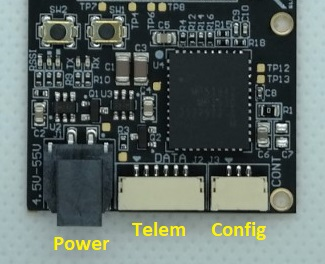

# ARK Electron Microhard Серійне Телеметрійне Радіо

_ARK Electron Мікрорадіопередавачі Microhard Serial Telemetry Radios_ інтегрують модуль радіо [Microhard Pico Serial](http://microhardcorp.com/P900.php) P900 RF. Це може бути використано для активації комунікації MAVLink між радіо на транспортному засобі та GCS.

Радіостанції Microhard Pico Serial - це радіостанції з вихідною потужністю (до) 1 Вт, які підтримують режими точка-точка, точка-багато точок та мережеві режими. Радіопристрої Microhard Pico також можуть бути замовлені з шифруванням AES-256.

Приблизний діапазон з вихідною потужністю, встановленою на рівні 1 Вт, становить 8 км (5 миль), коли використовуються налаштування за замовчуванням. Одне радіо земної станції може бути використано для зв'язку з кількома транспортними засобами за допомогою точка-багатоточної або мережевої топології меш. Транспортні засоби повинні мати різні ідентифікатори MAVLINK.

## Де купити

- [1W 900MHz Серійне Телеметрійне Радіо](https://arkelectron.com/product/1w-900mhz-serial-telemetry-air-radio/) (транспортний)
- [1W 900МГц USB Серійне Телеметрійне Радіо](https://arkelectron.com/product/1w-900mhz-serial-telemetry-ground-radio/) (наземна станція)
- [1W 2.4ГГц Серійне Телеметрійне Радіо](https://arkelectron.com/product/1w-2400mhz-serial-telemetry-radio/) (транспортний засіб)
- [1W 2.4ГГц USB Серійне Телеметрійне Радіо](https://arkelectron.com/product/1w-2400mhz-usb-serial-telemetry-radio/) (наземна станція)

## З'єднання

### Транспортний радіопередавач

Підключіть радіо автомобіля до порту керування польотом `TELEM1`. Для цієї мети надається кабель телеметрії з 6 контактами JST GH стандарту Pixhawk.

Радіо може бути живлений за допомогою телеметричного кабелю, якщо вихідна потужність встановлена менше 100 мВт. Для вищих рівнів виводу радіо повинно бути окремо живлене через 2-контактний роз'єм Molex Nano-Fit (тобто від батареї).

### Радіо наземної станції

Підключіть земельне радіо до земельної станції за допомогою USB C. Радіо не потребує окремого живлення при використанні USB PD (може бути постачана потужність 1 Вт).

## Налаштування/Конфігурація

Радіостанції налаштовані за замовчуванням на використання режиму peer-to-peer та швидкість передачі 57600 бод. Це дозволяє їм підключатися до порту `TELEM1` PX4 та _QGroundControl_ **без додаткової конфігурації**.

::: note
Ви можете використовувати іншу швидкість передачі даних, режим або порт контролера польоту.
Єдине "вимога" - земний радіопередавач, повітряний радіопередавач, PX4 та QGroundControl повинні мати однакову швидкість передачі даних.
:::

Радіопередавачі з віддаленою телеметрією [Microhard Serial > Налаштування](../telemetry/microhard_serial.md#configuration) пояснює, як налаштувати радіопередавачі, _QGroundControl_ та PX4.

Радіопристрої ARK Electron повинні бути підключені до комп'ютера, на якому працює конфігураційний інструмент _PicoConfig_, як описано нижче:

- Для налаштування радіообладнання автомобіля вам доведеться підключити адаптер FTDI між конфігураційним портом JST-GH на 3 контакта радіо та Windows PC з програмою _Pico Config_ (радіо повинно бути увімкнено, що можна зробити з батареї або через підключення даних до порту `TELEM1` автопілота).

  

  Програма _Pico Config_ автоматично виявить радіо. Налаштуйте швидкість передачі даних (бод-швидкість) так, щоб вона відповідала PX4 (і радіо земної станції).

- З'єднання USB C радіостанції наземної станції може бути використане для налаштування радіо (а також для телеметричних даних). Програма _Pico Config_ автоматично виявить та підключиться до порту конфігурації. Налаштуйте параметри так, щоб швидкість передачі даних відповідала PX4.

Як тільки радіостанції та PX4 будуть налаштовані на використання одного темпу передачі, ви зможете підключити QGroundControl до транспортного засобу через радіо.

### Конфігурація за замовчуванням

Конфігурація радіо за замовчуванням, яка поставляється, показана в _PicoConfig_ нижче.

## Подальша інформація

- [Pico Config 1.7](https://arkelectron.com/wp-content/uploads/2021/04/PicoConfig-1.7.zip) - Інструмент конфігурації радіо
