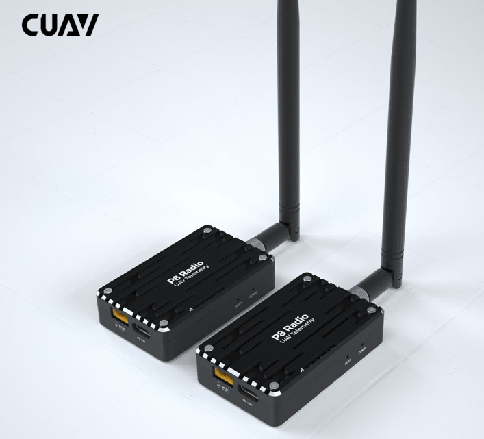

# CUAV P8 Телеметрійне радіо

Радіо CUAV P8 - це модуль дальнього зв'язку (>60км) із високою швидкістю передачі даних (375 Кбіт/с) для безпілотників, який працює за принципом "plug-and-play" з PX4.

Він підтримує кілька режимів, таких як точка-точка, точка-багатоточка та релеєве спілкування.

## Основні характеристики

- Дальність дії: >60 км (залежно від антени та середовища, до 100 км).
- Підтримує режими точка-точка, точка-багатоточка та ретранслятор.
- До 2 Вт потужності (фіксована частота 2 Вт; стробування частотою 1 Вт)
- До 345 Кбіт / с швидкість передачі.
- Підтримує 12v~60V операційну напругу.
- Одиниця може працювати або як наземний модем станції, або як модем літака.
- Незалежне енергопостачання для більш стабільної операції
- USB порт Type-C, інтегрований USB до конвертера UART

## Де купити

- [CUAV store](https://www.cuav.net/en/p8-2/)
- [CUAV alibaba](https://www.alibaba.com/product-detail/Free-shipping-CUAV-UAV-P8-Radio_1600324379418.html?spm=a2747.manage.0.0.2dca71d2bY4B0M)

## Налаштування PX4

CUAV P8 радіо є попередньо налаштованим (швидкість 57600, режим трансляції) для використання з PX4. Якщо підключено до `TELEM1` АБО `TELEM2`, додаткове налаштування не потрібно.

На деяких контролерах польоту, або якщо використовується інший послідовний порт, можливо знадобиться [налаштувати порт для комунікації з MAVLink](../peripherals/mavlink_peripherals.md).

:::tip
[Конфігурація P8](https://doc.cuav.net/data-transmission/p8-radio/en/config.html) надає повну інформацію про конфігурацію радіо, якщо потрібно.
:::

## Схема розташування виводів

### Порт даних

| pin | C-RTK GPS 6P | pin | Pixhawk стандартні контакти |
| --- | ------------ | --- | --------------------------- |
| 1   | 5V+(NC)      | 1   | VCC                         |
| 2   | RX           | 2   | TX                          |
| 3   | TX           | 3   | RX                          |
| 4   | RTS          | 4   | RTS                         |
| 5   | CTS          | 5   | CTS                         |
| 6   | GND          | 6   | GND                         |

## Підключення

Підключіть радіо CUAV P8 до інтерфейсу керування польотом `TELEM1`/`TELEM2` та використовуйте акумулятор або BEC для живлення модуля. Необхідні кабелі включені в комплект.

:::tip
Радіостанція CUAV P8 не підтримує живлення від контролера польоту, її потрібно підключити до акумулятора 12~60 В або BEC.
:::

## Докладніше

[Підручник P8](http://manual.cuav.net/data-transmission/p8-radio/p8-user-manual-en.pdf)

[CUAV P8 радіо](https://doc.cuav.net/data-transmission/p8-radio/en/) (Офіційний посібник)
