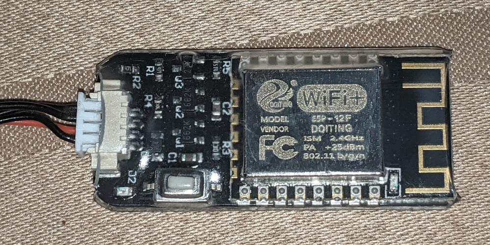
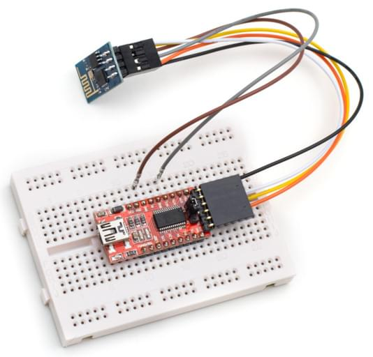

# Модуль WiFi ESP8266

ESP8266 та його клони - це недорогі та легко доступні модулі Wi-Fi з повним стеком TCP/IP та можливістю мікроконтролера. Вони можуть використовуватись з будь-яким контролером Pixhawk.

:::tip ESP8266 - це _defacto_ за замовчуванням WiFi модуль для використання з [Pixracer](../flight_controller/pixracer.md) (і, як правило, має вбудований з ним).
:::

## Де купити

Модуль ESP8266 легко доступний від ряду постачальників. Нижче наведено перелік кількох виконавців.

Більшість модулів підтримують тільки 3.3 V у той час як деякі контролери польоту (наприклад, Pixhawk 4) вивід на 5V (вам потрібно перевірити сумісність і виконати зниження напруги при необхідності).

Модулі, що приймають постачання 3.3V:

- [WRL-17146](https://www.sparkfun.com/products/13678) (Sparkfun)
- [AI Cloud](https://us.gearbest.com/boards-shields/pp_009604906563.html) - discontinued (GearBeast)

Модулі, що приймають постачання 5.3V:

- [AI Thinker](https://www.banggood.com/Wireless-Wifi-to-Uart-Telemetry-Module-With-Antenna-for-Mini-APM-Flight-Controller-p-1065339.html) (Banggood)
- [AlphaUAVLink](https://www.banggood.com/MAVLink-Wifi-Bridge-2_4G-Wireless-Wifi-Telemetry-Module-with-Antenna-for-Pixhawk-APM-Flight-Controller-p-1428590.html) (Banggood)

<a id="px4_config"></a>

## Встановлення Pixhawk/PX4 & конфігурації

:::tip
Спершу вам _може_ знадобитися оновити радіо з прошивкою ESP8266, сумісною з PX4 ([див. нижче](#esp8266-flashing-firmware-advanced)). Інструкції по виготовленню повинні пояснити, чи це потрібно.
:::

Підключіть свій ESP8266 до вашого польотного контролера серії Pixhawk (наприклад, Pixracer) на будь-якому вільному UART.

Підключіть контролер польоту до вашої наземної станції через USB (так як WiFi ще не повністю налаштований).

Використання _QGroundControl_:

- [Завантажити останню прошивку PX4 на контролер польоту](../config/firmware.md).
- [Налаштувати послідовний порт](../peripherals/serial_configuration.md), який використовується для підключення ESP8266. Не забудьте встановити швидкість передачі даних на 921600, щоб відповідати значенню, встановленому для ESP8266.
- [Налаштуйте MAVLink](../peripherals/mavlink_peripherals.md) на відповідному послідовному порту для отримання телеметрії та передачі команд через ESP8266.

Після того, як ви налаштували послідовний порт керування польотом для підключення до радіо, ви можете від'єднати фізичне USB-підключення між наземною станцією та транспортним засобом.

## Підключення через ESP8266 до QGC

Модуль надає точку доступу WiFi, яку ваш комп'ютер земної станції може використовувати для підключення до літального апарату.

::: info Налаштування точки доступу ESP8266 повинні бути надані разом з платою (наприклад, зазвичай надруковані на зворотному боці плати або на упаковці).

Типові налаштування заводської мережі:

- **SSID:** PixRacer
- **Password:** pixracer
- **WiFi Channel:** 11
- **UART speed:** 921600

Інші модулі можуть використовувати налаштування, подібні до цього:

- **SSID:** IFFRC_xxxxxxxx
- **Password:** 12345678
- **IP:** 192.168.4.1
- **Port:** 6789 (TCP)

Приклади дошок від AlphaUILink та DOITING показані нижче:

   
:::

У Wi-Fi увімкнена _QGroundControl_ основний комп'ютер станцій/планшет, знайдіть і підключіться до відкритої бездротової мережі для ESP8266. На комп'ютері з Windows налаштування підключення до мережі з назвою **Pixracer** та типовим паролем **pixracer** будуть виглядати так:

 

_QGroundControl_ автоматично підключиться до літального апарату, коли комп'ютер наземної станції підключений до точки доступу WiFi з назвою "Pixracer".

Якщо ви використовуєте модуль з будь-яким іншим ім'ям WiFi, вам потрібно вручну налаштувати підключення WiFi QGroundControl, як показано в наступному розділі.

## Налаштувати QGC з нестандартними WiFi підключеннями

_QGroundControl_ автоматично підключиться до транспортного засобу, коли комп'ютер наземної станції буде підключений до точки доступу WiFi "Pixracer". Для будь-якого іншого імені точки доступу вам потрібно буде вручну створити спеціальне комунікаційне посилання:

1. Перейдіть у [Налаштування додатку > Канали зв'язку](https://docs.qgroundcontrol.com/master/en/qgc-user-guide/settings_view/settings_view.html)
2. Додайте нове підключення з відповідними налаштуваннями.
3. Виберіть нове підключення та натисніть **Підключитися**.
4. Автомобіль тепер повинен підключатися

## Перевірити

Тепер ви повинні бачити рух HUD на вашому комп'ютері QGC через бездротове з'єднання і мати можливість переглядати панель підсумків для моста WiFi ESP8266 (як показано нижче).


:::tip
Якщо у вас виникли проблеми з підключенням, див. [Проблеми використання QGC](https://docs.qgroundcontrol.com/master/en/qgc-user-guide/troubleshooting/qgc_usage.html).
:::

## Прошивка/прошивка ESP8266 (розширений)

Модулі ESP8266 від різних виробників можуть не мати встановленого відповідного прошивкового забезпечення ESP8266 наперед. Інструкції нижче пояснюють, як налаштувати та запустити тести локально.

### Готові бінарні файли

[MavLink ESP8266 Firmware V 1.2.2](http://www.grubba.com/mavesp8266/firmware-1.2.2.bin)

### Build From Sources

У сховищі [прошивки](https://github.com/dogmaphobic/mavesp8266) містяться інструкції та всі необхідні інструменти для збирання та прошивки прошивки ESP8266.

### Оновлення прошивки OTA

If you have firmware 1.0.4 or greater installed, you can do the update using the ESP's _Over The Air Update_ feature. Просто підключіться до його AP WiFi мережі та перейдіть за посиланням: `http://192.168.4.1/update`. Потім ви можете вибрати файл прошивки, який ви завантажили вище, та завантажити його на модуль WiFi.

:::tip
Це найпростіший спосіб оновити прошивку!
:::

### Прошивка прошивки ESP8266

Перед прошивкою переконайтеся, що ви завантажили ESP8266 в _Режим прошивання_, як описано нижче. Якщо ви клонували репозиторій [MavESP8266](https://github.com/dogmaphobic/mavesp8266), ви можете зібрати та прошити прошивку, використовуючи надані інструменти та середовище [PlatformIO](http://platformio.org). Якщо ви завантажили заздалегідь побудоване вбудоване програмне забезпечення вище, завантажте утиліту [esptool](https://github.com/espressif/esptool) та скористайтеся наведеною нижче командною стрічкою:

```sh
esptool.py --baud 921600 --port /dev/your_serial_port write_flash 0x00000 firmware_xxxxx.bin
```

Де:

- **firmware_xxxxx.bin** це прошивка, яку ви завантажили вище
- **your_serial_port** - це назва серійного порту в якому ESP8266 підключений до (`/dev/cu.usbmodem`)

### Проводка для Прошивання Програмного Забезпечення

:::warning
Більшість модулів ESP8266 підтримують напругу 3,3 вольти (лише), тоді як деякі контролери польоту (наприклад, Pixhawk 4) видають напругу на рівні 5 В.
Перевірте сумісність та знизьте напругу, якщо це потрібно.
:::

Існують різні методи для встановлення ESP8266 у _Режим Прошивки_, але не всі USB/UART адаптери надають всі необхідні контакти для автоматичного перемикання режиму. Для того щоб завантажити ESP8266 у _режимі Flash_, пін GPIO-0 повинен бути встановлений у низьке положення (GND), а пін CH_PD повинен бути встановлений у високе положення (VCC). Ось як виглядає моя власна налаштування:



Я побудував кабель, де RX, TX, VCC та GND правильно підключені безпосередньо від адаптера FTDI до ESP8266. З ESP8266 я залишив дві проводи, підключені до GPIO-0 та CH_PD вільними, щоб я міг завантажити його або зазвичай, або в режимі флеш, підключивши їх до GND та VCC відповідно.

#### ESP8266 (ESP-01) Pinout


#### Діаграма миготіння за допомогою адаптера USB/UART FTDI


