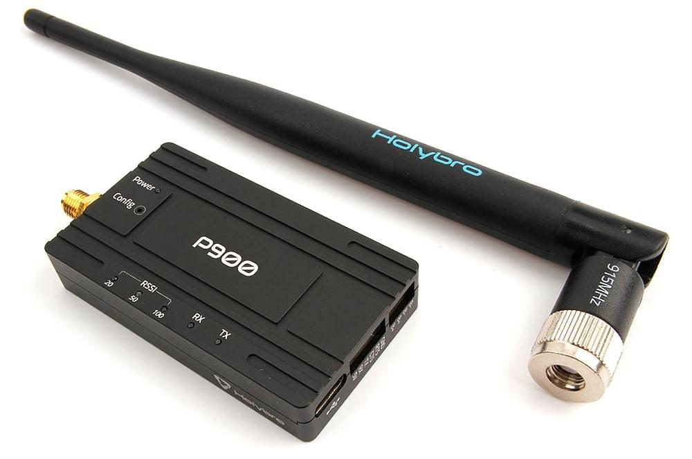
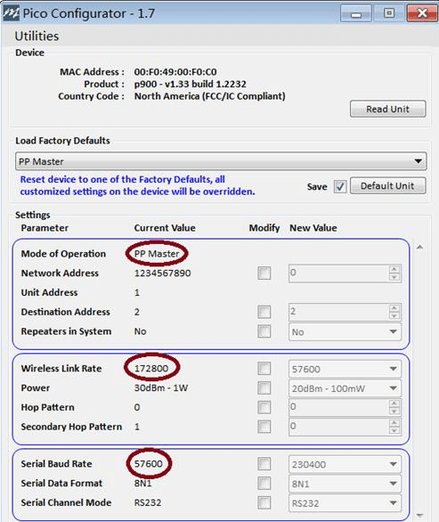
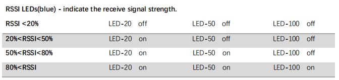

# Holybro Microhard P900 Радіо

Радіопередавач [Holybro Microhard P900](https://holybro.com/products/microhard-radio) інтегрує модуль радіо [Microhard Pico Serial](http://microhardcorp.com/P900.php) P900, який здатний забезпечувати високопродуктивний бездротовий серійний зв'язок в надійних і безпечних мережах типу меш, точка-точка або точка-багатоточка. Він дозволяє комунікацію MAVLink між радіо на транспортному засобі та GCS.

Цей радіопередавач працює у діапазоні частот 902-928 МГц ISM, використовуючи технологію розподіленого спектра з переходом по частоті (FHSS), що забезпечує надійний бездротовий асинхронний передачу даних між більшістю типів обладнання, яке використовує послідовний інтерфейс. Радіопередавач може бути налаштований як основний координатор, вторинний координатор, резервний координатор або віддалений в мережевій топології меш, або як майстер(master,), ретранслятор(repeater) або віддалений в топології точка-точка(PP) або точка-багатоточка (PMP).

Ця універсальність дуже зручна для користувача. Цей радіопередавач налаштовується за допомогою AT-команд через порт даних або за допомогою програми _PicoConfig_ через діагностичний порт.

Потужність передачі програмно вибирається від 100 мВт до 1 Вт, з дальністю до 40 миль. Одне радіо земної станції може бути використано для зв'язку з кількома транспортними засобами за допомогою точка-багатоточної або мережевої топології меш. Транспортні засоби повинні мати різні ідентифікатори MAVLINK.

## Функції

- USB Type-C port, integrated USB to UART converter
- 6-position JST-GH connector, can be directly connected to the TELEM port on various Pixhawk-standard flight controllers such [Pixhawk 4](../flight_controller/pixhawk4.md) & [Pixhawk 5X](../flight_controller/pixhawk5x.md)
- High voltage BEC onboard, Support DC7~35V voltage supply
- UART transmission & Three-stage RSSI LED indicator
- Transmission within a public, license-exempt band of the radio spectrum
- Transparent, low latency link rates up to 276 Kbps
- Supports a robust true Mesh operation with auto-routing
- 32 bits of CRC, selectable retransmission and forward error correction
- Separate diagnostics port, transparent remote diagnostics and online network control

## Де купити

- [Holybro Microhard P900 Telemetry Radio (100mW - 1W)](https://holybro.com/products/microhard-radio)

## Специфікація

## Підключення

#### Транспортний радіопередавач

Цей радіопередавач поставляється з кабелем JST GH з 6 контактами, який можна підключити до порту `TELEM1` на контролерах польоту, які відповідають стандарту роз'єму Pixhawk. Радіопередавач повинен окремо живитися через кабель живлення з 4-контактним роз'ємом JST-GH XT30 (7-35VDC).

#### Земна станція радіопередавача

У цього радіопередавача є внутрішній конвертер USB в UART, земний радіопередавач може бути підключений до земної станції через USB C. Радіопередавач повинен окремо живитися через кабель живлення XT30 (7-35VDC).

## Налаштування/Конфігурація

Радіопередавачі Holybro Microhard P900 налаштовані на режим роботи точка-точка та швидкість передачі даних 57600 бод в заводських умовах. Це дозволяє їм підключатися до порту `TELEM1` PX4 та _QGroundControl_ **без додаткової конфігурації**.

::: note
Ви можете використовувати іншу швидкість передачі даних, режим або порт контролера польоту.
Єдине "вимога" - земний радіопередавач, повітряний радіопередавач, PX4 та QGroundControl повинні мати однакову швидкість передачі даних.
:::

Радіопередавачі з віддаленою телеметрією [Microhard Serial > Налаштування](../telemetry/microhard_serial.md#configuration) пояснює, як налаштувати радіопередавачі, _QGroundControl_ та PX4.

Для налаштування радіопередавачів за допомогою програми _PicoConfig_ (як описано за посиланням вище) вона повинна бути підключена через діагностичний порт:

Діагностичний порт використовує роз'єм JST SH з 4 позиціями. Якщо ви використовуєте програму _PicoConfig_ або спеціальні діагностичні команди для налаштування радіопередавача, ви повинні підключитися до цього порту. Діагностичний порт сумісний з логічним рівнем напруги 3,3 В. Для підключення радіопередавача до комп'ютера потрібна плата USB-серійного перетворювача. Ви можете придбати конвертер [Holybro UART to USB](https://holybro.com/products/uart-to-usb-converter).

Програма _Pico Config_ автоматично виявить і підключиться до порту налаштування. Налаштуйте параметри так, щоб швидкість передачі даних відповідала PX4 (та земній станції).

Утримуючи кнопку **Конфігурація** під час увімкнення радіостанції, пристрій перейде в режим КОМАНД: буде активовано послідовний інтерфейс за замовчуванням і тимчасово налаштовано на роботу з налаштуваннями послідовного порту за замовчуванням 9600/8/N/1.

Зверніть увагу, що також можна налаштувати радіоприймачі за допомогою команд AT в порту.

### Конфігурація за замовчуванням

Конфігурація радіо за замовчуванням, яка постачається, показана в _PicoConfig_ нижче (може знадобитися повторно налаштувати їх, як показано після оновлення мікропрограми або скидання радіо).

У режимах роботи «точка-точка» для забезпечення мережевої синхронізації системи має бути головний пристрій, тому один радіоприймач має бути налаштований на головний PP, а інший — на віддалений PP.

## LED-статус

The P900 Radio has 6 status LEDs: three are blue, two are orange, and one is green. The meanings of the different LEDs are:

- Power LED(green)
  - This LED will illuminate when the P900 Radio is connected to a power source (7-35VDC).
- TX LED (orange)
  - When illuminated, this LED indicates that the Radio is transmitting data over the air.
- RX LED (orange)
  - This LED indicates that the Radio is synchronized and has received valid packets.
- RSSI LEDs (3x Blue)
  - As the received signal strength increases, starting with the furthest left, the number of active
- RSSI LEDs increases. Signal strength is calculated based on the last four valid received packets with correct CRC. The value of RSSI is reported in S123.

### Схема розташування виводів

#### Порт діагностики

| Pin       | Сигнал | Напруга |
| --------- | ------ | ------- |
| 1         | NC     | --      |
| 2 (black) | RX     | +3.3V   |
| 3 (black) | TX     | +3.3V   |
| 4 (black) | GND    | GND     |

#### Порт даних

| Pin       | Сигнал | Напруга |
| --------- | ------ | ------- |
| 1 (red)   | NC     | --      |
| 2 (black) | RX     | +3.3V   |
| 3 (black) | TX     | +3.3V   |
| 4 (black) | CTS    | +3.3V   |
| 5 (black) | RTS    | +3.3V   |
| 6 (black) | GND    | GND     |

#### Порт живлення

| Pin       | Сигнал | Напруга |
| --------- | ------ | ------- |
| 1(red)    | BAT+   | 7-35V   |
| 2 (red)   | BAT+   | 7-35V   |
| 3 (black) | BAT-   | GND     |
| 4 (black) | BAT-   | GND     |

### Розміри

### Power Consumption

- Supply voltage: DC7~35V from 4-pin JST-GH to XT30 (included)
- Transmit current: 200 mA/7V at 20dBm
  - 350mA/7V at 27dBm
  - 800 mA/7V at 30dBm
- Receive current: 100 mA
- Weight: 42g (without antenna)

## Подальша інформація

- [Microhard Радіо](https://docs.holybro.com/telemetry-radio/microhard-radio) (docs.holybro.com)
- [Завантаження Holybro Microhard P900](https://docs.holybro.com/telemetry-radio/microhard-radio/download) (посібники та інші документи) (Holybro)
