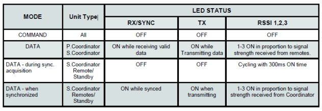

# Holybro Microhard P900 Радіо

Радіопередавач [Holybro Microhard P900](https://holybro.com/products/microhard-radio) інтегрує модуль радіо [Microhard Pico Serial](http://microhardcorp.com/P900.php) P900, який здатний забезпечувати високопродуктивний бездротовий серійний зв'язок в надійних і безпечних мережах типу меш, точка-точка або точка-багатоточка. Він дозволяє комунікацію MAVLink між радіо на транспортному засобі та GCS.

Цей радіопередавач працює у діапазоні частот 902-928 МГц ISM, використовуючи технологію розподіленого спектра з переходом по частоті (FHSS), що забезпечує надійний бездротовий асинхронний передачу даних між більшістю типів обладнання, яке використовує послідовний інтерфейс. Радіопередавач може бути налаштований як основний координатор, вторинний координатор, резервний координатор або віддалений в мережевій топології меш, або як майстер(master,), ретранслятор(repeater) або віддалений в топології точка-точка(PP) або точка-багатоточка (PMP).

Ця універсальність дуже зручна для користувача. Цей радіопередавач налаштовується за допомогою AT-команд через порт даних або за допомогою програми _PicoConfig_ через діагностичний порт.

Потужність передачі програмно вибирається від 100 мВт до 1 Вт, з дальністю до 40 миль. Одне радіо земної станції може бути використано для зв'язку з кількома транспортними засобами за допомогою точка-багатоточної або мережевої топології меш. Транспортні засоби повинні мати різні ідентифікатори MAVLINK.

## Функції

- Порт USB Type-C, інтегрований конвертер USB на UART
- 6-позиційний роз'єм JST-GH, може бути безпосередньо підключений до порту TELEM на різних польотних контролерах стандарту Pixhawk, таких як [Pixhawk 4](../flight_controller/pixhawk4.md) та [Pixhawk 5X](../flight_controller/pixhawk5x.md)
- Високовольтний BEC на борту, Підтримка живлення напругою DC7~35V
- Передача UART та індикатор ступеня сигналу RSSI з трьома етапами світлодіодів
- Передача в межах громадського, ліцензійно-вільного діапазону радіочастот
- Прозорий, низькій затримкою швидкості зв'язку до 276 Кбіт/с
- Підтримує потужну операцію із справжньою мережею Mesh з автоматичним маршрутизуванням
- 32 біти CRC, вибіркове перетранслювання та корекція помилок вперед
- Окремий порт діагностики, прозора віддалена діагностика та онлайн контроль мережі

## Де купити

- [Holybro Microhard P900 Telemetry Radio (100mW - 1W)](https://holybro.com/products/microhard-radio)

## Специфікація

## Підключення

#### Транспортний радіопередавач

Цей радіопередавач поставляється з кабелем JST GH з 6 контактами, який можна підключити до порту `TELEM1` на контролерах польоту, які відповідають стандарту роз'єму Pixhawk. Радіопередавач повинен окремо живитися через кабель живлення з 4-контактним роз'ємом JST-GH XT30 (7-35VDC).

#### Земна станція радіопередавача

У цього радіопередавача є внутрішній конвертер USB в UART, земний радіопередавач може бути підключений до земної станції через USB C. Радіопередавач повинен окремо живитися через кабель живлення XT30 (7-35VDC).

## Налаштування/Конфігурація

Радіопередавачі Holybro Microhard P900 налаштовані на режим роботи точка-точка та швидкість передачі даних 57600 бод в заводських умовах. Це дозволяє їм підключатися до порту `TELEM1` PX4 та _QGroundControl_ **без додаткової конфігурації**.

::: note
Ви можете використовувати іншу швидкість передачі даних, режим або порт контролера польоту.
Єдине "вимога" - земний радіопередавач, повітряний радіопередавач, PX4 та QGroundControl повинні мати однакову швидкість передачі даних.
:::

Радіопередавачі з віддаленою телеметрією [Microhard Serial > Налаштування](../telemetry/microhard_serial.md#configuration) пояснює, як налаштувати радіопередавачі, _QGroundControl_ та PX4.

Для налаштування радіопередавачів за допомогою програми _PicoConfig_ (як описано за посиланням вище) вона повинна бути підключена через діагностичний порт:

Діагностичний порт використовує роз'єм JST SH з 4 позиціями. Якщо ви використовуєте програму _PicoConfig_ або спеціальні діагностичні команди для налаштування радіопередавача, ви повинні підключитися до цього порту. Діагностичний порт сумісний з логічним рівнем напруги 3,3 В. Для підключення радіопередавача до комп'ютера потрібна плата USB-серійного перетворювача. Ви можете придбати конвертер [Holybro UART to USB](https://holybro.com/products/uart-to-usb-converter).

Програма _Pico Config_ автоматично виявить і підключиться до порту налаштування. Налаштуйте параметри так, щоб швидкість передачі даних відповідала PX4 (та земній станції).

Утримуючи кнопку **Конфігурація** під час увімкнення радіостанції, пристрій перейде в режим КОМАНД: буде активовано послідовний інтерфейс за замовчуванням і тимчасово налаштовано на роботу з налаштуваннями послідовного порту за замовчуванням 9600/8/N/1.

Зверніть увагу, що також можна налаштувати радіоприймачі за допомогою команд AT в порту.

### Конфігурація за замовчуванням

Конфігурація радіо за замовчуванням, яка постачається, показана в _PicoConfig_ нижче (може знадобитися повторно налаштувати їх, як показано після оновлення мікропрограми або скидання радіо).

У режимах роботи «точка-точка» для забезпечення мережевої синхронізації системи має бути головний пристрій, тому один радіоприймач має бути налаштований на головний PP, а інший — на віддалений PP.

## LED-статус

Радіо P900 має 6 світлодіодів статусу: три з них сині, два помаранчеві, а один зелений. Інтерпретація різних станів світлодіодів LEDs:

- Power LED(green)
  - Цей світлодіод буде світитися, коли радіо P900 підключено до джерела живлення (7-35VDC).
- TX LED (orange)
  - Коли підсвічується, цей світлодіод вказує на те, що радіо передає дані повітрям.
- RX LED (orange)
  - Цей світлодіод показує, що радіо синхронізовано і отримано дійсні пакети.
- RSSI LEDs (3x Blue)
  - По мірі збільшення отриманої сили сигналу, починаючи з найлівішого, кількість активних
- RSSI LEDs збільшуються. Сила сигналу обчислюється на основі останніх чотирьох отриманих пакетів з правильним CRC. Значення RSSI повідомляється в S123.

### Схема розташування виводів

#### Порт діагностики

| Pin       | Сигнал | Напруга |
| --------- | ------ | ------- |
| 1         | NC     | --      |
| 2 (black) | RX     | +3.3V   |
| 3 (black) | TX     | +3.3V   |
| 4 (black) | GND    | GND     |

#### Порт даних

| Pin       | Сигнал | Напруга |
| --------- | ------ | ------- |
| 1 (red)   | NC     | --      |
| 2 (black) | RX     | +3.3V   |
| 3 (black) | TX     | +3.3V   |
| 4 (black) | CTS    | +3.3V   |
| 5 (black) | RTS    | +3.3V   |
| 6 (black) | GND    | GND     |

#### Порт живлення

| Pin       | Сигнал | Напруга |
| --------- | ------ | ------- |
| 1(red)    | BAT+   | 7-35V   |
| 2 (red)   | BAT+   | 7-35V   |
| 3 (black) | BAT-   | GND     |
| 4 (black) | BAT-   | GND     |

### Розміри

### Споживання електроенергії

- Напруга живлення: DC7~35V від 4-контактного роз'єму JST-GH до XT30 (включено)
- Передавати поточний: 200 мА / 7 В при 20 дБм
  - 350мА/7В при 27дБм
  - 800 мА/7V при 30 дБм
- Отримуваний струм: 100 мА
- Вага: 42 г (без антени)

## Подальша інформація

- [Microhard Радіо](https://docs.holybro.com/telemetry-radio/microhard-radio) (docs.holybro.com)
- [Завантаження Holybro Microhard P900](https://docs.holybro.com/telemetry-radio/microhard-radio/download) (посібники та інші документи) (Holybro)
