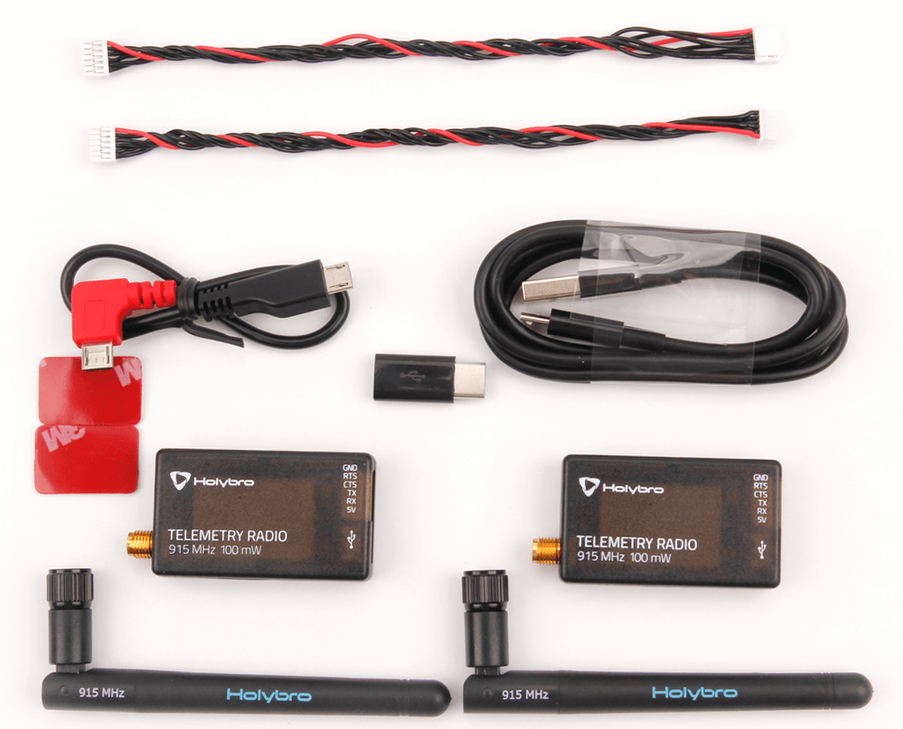

# HolyBro Телеметричне радіо

Цей Holybro [SiK](../telemetry/sik_radio.md) Телеметрійний радіо зв'язок є невеликим, легким і недорогим відкритим джерелом платформа "plug-and-play" для підключення вашого автопілотного контролера польоту та земної станції.

Це радіо - "plug-and-play" з усіма контролерами, що працюють у PX4 і мають JST-GH 6 Pin Connector TELEM порт ([Pixhawk Connector Standard](https://github.com/pixhawk/Pixhawk-Standards)). Це надає найлегший спосіб налаштування телеметрійного з'єднання між вашим контролером польоту та наземною станцією. Він використовує open source прошивку, яка була спеціально розроблена для успішної роботи з пакетами MAVLink та інтеграції з QGroundControl & PX4 Autopilot.

Вони, як правило, дозволяють межі краще, ніж 300 "поза коробкою" (діапазон можна поширити на кілька кілометрів із використанням патч-антени на землі).

Радіоприймач може бути 915 МГц (США), або 433 МГц з кроком (ЄС, Азія, Африка Океанія). Зверніть увагу, що регіони, зазначені вище, є орієнтовними, і вам слід перевірити правила для вашої країни.

## Де купити

- [HolyBro (Sik) Телеметричне радіо V3](https://holybro.com/collections/telemetry-radios/products/sik-telemetry-radio-v3)

## Особливості

- Open-source SiK firmware
- Plug-n-play for Pixhawk Standard Flight Controller
- Easiest way to connect your Autopilot and Ground Station
- Interchangeable air and ground radio
- Micro-USB port (Type-C Adapter Cable Included)
- 6-position JST-GH connector

## Специфікація

- 100 mW maximum output power (adjustable) -117 dBm receive sensitivity
- RP-SMA connector
- 2-way full-duplex communication through adaptive TDM UART interface
- Transparent serial link
- MAVLink protocol framing
- Frequency Hopping Spread Spectrum (FHSS) Configurable duty cycle
- Error correction corrects up to 25% of bit errors Open-source SIK firmware
- Configurable through Mission Planner & APM Planner
- FT230X USB to BASIC UART IC

## Стан індикатора світлодіодів

The radios have 2 status LEDs, one red and one green. The interpretation of the different LED states are:

- Green LED blinking - searching for another radio
- Green LED solid - link is established with another radio
- Red LED flashing - transmitting data
- Red LED solid - in firmware update mode

## Connecting to Flight Controller

Use the 6 pin JST-GH connector that come with the radio to connect the radio to your flight controller's `TELEM1` port (`TELEM2` can also be used but the default recommendation is `TELEM1`).

## Connecting to a PC or Ground Station

Connecting the radio to your Windows PC or Ground Station is as simple as connecting the micro/type-C USB cable (Type-C adapter included with the radio) to your PC/Ground Station.

The necessary drivers should be installed automatically and the radio will appear as a new “USB Serial Port” in the Windows Device Manager under Ports (COM & LPT). The Mission Planner's COM Port selection drop-down should also contain the same new COM port.

## Пакет включає

- Радіомодулі з антенами \*2
- Мікро-USB для USB-кабелю \*1
- Micro-USB to Micro-USB OTG adapter cable \*1
- Micro USB to Type C Adapter
- JST-GH-6P to JST-GH-6P cable \*1 (for Pixhawk Standard FC)
- JST-GH-6P to Molex DF12 6P (for Pix32, Pixhawk 2.4.6, etc.)

