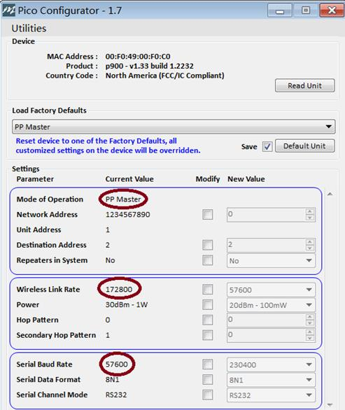
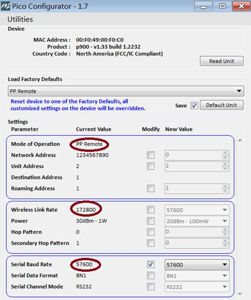

# Microhard Serial Telemetry Radios

[Мікрорадіопередавачі Microhard Pico Serial](http://microhardcorp.com/P900.php) інтегрують модуль радіо [Microhard Pico Serial](http://microhardcorp.com/P900.php) P900 RF.

Це відносно невеликий за розміром та недорогий радіопередавач, який підтримує такі режими як точка-точка, точка-багатоточка та мережеві режими. Він має налаштований вихідну потужність та також може бути налаштований на використання корекції помилок передачі. Радіопередавачі також можна замовити з підтримкою безпечних/шифрованих каналів, хоча це підлягає обмеженням на експорт.

Виробники зазвичай налаштовують радіопередавачі в режимі пір-до-пір та встановлюють таку саму швидкість передачі даних, яка очікується PX4 та _QGroundControl_ (57600 бод). Це дозволяє підключати радіопередавачі до звичайних портів телеметрії на контролерах польоту Pixhawk (`TELEM1` або `TELEM2`) разом із автоматичним виявленням з'єднання в _QGroundControl_.

Кілька виробників пропонують рішення на основі цих радіопродуктів:

- [ARK Electron Microhard Серійний Телеметрійний Радіо](../telemetry/ark_microhard_serial.md)
- [Holybro Microhard P900 Телеметрійне Радіо](../telemetry/holybro_microhard_p900_radio.md)

## Компроміси щодо дальності передачі

Дальність передачі радіо залежить від кількох факторів, включаючи: швидкість передачі даних, вихідну потужність, режим, включено корекцію помилок передачі, включено шифрування, використання антени тощо.

Вибір цих параметрів є компромісом:

- збільшення швидкості передачі даних зменшує дальність радіопередачі.
- збільшення потужності радіо збільшує дальність, але зменшує час польоту.
- точка-багатоточка означає можливість однієї земної станції, яка спілкується з кількома транспортними засобами, але збільшує пропускну спроможність каналу.
- мережеві конфігурації надають подібний зручність і вартість.

Максимальна заявлена дальність в специфікаціях становить приблизно 60 км. ARK Electron пропонує приблизно 8 км дальності з вихідною потужністю, встановленою на рівні 1 Вт та використанням налаштувань за замовчуванням.

## Конфігурація

Для зручності радіостанції зазвичай налаштовані за замовчуванням так, що їх можна використовувати з PX4 та _QGroundControl_ без додаткових налаштувань.

Розробники можуть змінювати конфігурацію. Єдине "вимога" полягає в тому, що: земельне радіо, повітряне радіо, PX4 та _QGroundControl_ повинні бути налаштовані на використання **того самого** швидкості бод (і, звісно, кожна система MAVLink повинна мати унікальний ідентифікатор системи).

### Конфігурація PX4

PX4 налаштований на використання `TELEM1` для телеметрійних радіо, з типовою швидкістю передачі 57600. Ви можете налаштувати PX4 для використання будь-якого іншого вільного послідовного порту з іншою швидкістю передачі даних, дотримуючись інструкцій у [MAVLink Периферійні пристрої](../peripherals/mavlink_peripherals.md).

### Налаштування QGroundControl

QGroundControl автоматично виявляє послідовне зв'язку телеметрії з швидкістю передачі даних 57600.

Для будь-якого іншого тарифу вам потрібно додати послідовне з'єднання, яке встановлює тариф, який був використаний. See [Налаштування додатку > Канали зв'язку](https://docs.qgroundcontrol.com/master/en/qgc-user-guide/settings_view/settings_view.html).

### Конфігурація радіо

Серійні радіоприймачі Microhard налаштовуються за допомогою програми _PicoConfig_ (лише для Windows). Це можна завантажити тут: [PicoConfig-1.7.zip](https://arkelectron.com/wp-content/uploads/2021/04/PicoConfig-1.7.zip) (ARK Electron) або [picoconfig-1-10](https://docs.holybro.com/telemetry-radio/microhard-radio/download) (Holybro).

У режимах роботи «точка-точка» для забезпечення мережевої синхронізації системи має бути головний пристрій, тому один радіоприймач має бути налаштований на головний PP, а інший — на віддалений PP.

Знімки екрану нижче показують налаштування конфігурації радіо за замовчуванням для підключення до PX4 та _QGroundControl_.

Додаткову інформацію про конфігурацію радіо (включаючи мережеві та багатоточкові режими) містить [Посібник з експлуатації Pico Series P900 версії 1.8.7](https://github.com/PX4/PX4-user_guide/raw/main/assets/hardware/telemetry/Pico-Series-P900.Operating-Manual.v1.8.7.pdf).

### Режими Mesh та Multipoint

Підтримуються режими Mesh та point to multi-point, але всі транспортні засоби повинні мати унікальний ідентифікатор Mavlink.

Додатково:

- На найвищій швидкості зв'язку, без FEC, ми можемо мати 201 дрона в одній мережі, що передає 80 байт один раз на секунду.
- Ви можете мати кілька мереж, які працюють разом одночасно без взаємного втручання за допомогою "спільно розташованих систем". Наприклад, для розгортання більше ніж 500 транспортних засобів вам знадобиться розгорнути три координатори мережі P900, кожен з яких обслуговуватиме до 201 дронів у відповідних локальних мережах.
