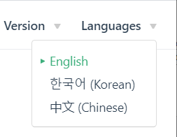

# PX4自动驾驶用户指南({{ $themeConfig.px4_version }})

  

PX4 is the *Professional Autopilot*. 它由来自业界和学术界的世界级开发商开发，并得到活跃的全球社区的支持，为从竞速和物流无人机到地面车辆和潜水艇的各种载具提供动力。

:::tip
本指南包含了组装、配置和安全驾驶基于 PX4 的飞机所需的一切。 对贡献感兴趣吗 查看[开发](development/development.md)部分。 :::

## 如何开始？

所有使用者都应该阅读[入门指南](getting_started/README.md)！ 它提供了对PX4的概述，包括飞行控制栈（飞行模式和安全功能）以及支持的硬件（飞控板，飞行器，机架，数传系统，遥控系统）提供的功能。

根据您想要实现的目标，以下提示将帮助您浏览本指南：

**我已经拥有一架无人机，我只是想让它飞起来：**

如果您有支持 PX4 的到手飞（RTF）的飞行器：

- [基本配置](config/README.md) 解释了如何将固件更新到最新版本，校准主传感器（罗盘、陀螺仪、空速等），以及如何设置遥控器和安全功能。
- [飞行](flying/README.md) 教授飞行要领，包括安全飞行的地点和方式，以及如何调试解锁和飞行问题。 同样提供了关于飞行模式的详细信息。

**我想要从头开始组装一架使用PX4的无人机：**

:::tip
支持的机体列举在 [机架参考](airframes/airframe_reference.md)。 These are vehicles that have tested and tuned configurations that you can download using *QGroundControl*. :::

如果您想从头开始组装一架飞机：

- 选择机架 - [Airframe Builds](airframes/README.md) 列举出了支持的机架，并且提供了详细的说明如何组装。
- Choose a flight controller - see [Getting Started > Flight Controllers](getting_started/flight_controller_selection.md) and [Autopilot Hardware](flight_controller/README.md).
- [装配](assembly/README.md) 解释了如何将重要的外围设备连接到自动驾驶仪上。
- [基本配置](config/README.md) 演示如何更新固件，并使用适合您的机身的设置对其进行配置。 本节还介绍了如何校准主传感器（罗盘、陀螺仪、空速等），并设置遥控器和安全功能。

当您准备好飞您的飞机时，请访问[飞行](flying/README.md)部分。

**我想添加有效负载或相机：**

有效负载部分描述了如何添加一个相机以及如何配置PX4以使您能够运送包裹。

- [有效负载](payloads/README.md)描述了如何整合有效负载

**我想要修改已支持的机体：**

上文介绍了如何修改飞行控制器和基本的传感器。 为了使用新的传感器，或者您的修改对飞行特性有重大的影响：

- [外设硬件](peripherals/README.md)提供了有关使用外部传感器的其他信息。
- [基本配置](config/README.md)解释了如何校准主传感器。
- [高级配置](advanced_config/README.md)应该用于重新/微调机架。

**我想在新硬件上运行 PX4 并扩展平台：**

- [开发](development/development.md)介绍了如何支持新的机架、机型，修改飞行算法，添加新的模式，集成新的硬件，从飞行控制器的外部与PX4通信，以及如何为PX4做出贡献。

## 获取帮助

[帮助](contribute/support.md)页面介绍了如何从核心开发团队和更广泛的社区获取帮助。

除此以外，它还包括了：
- [您可以得到帮助的论坛](contribute/support.md#forums-and-chat)
- [问题诊断](contribute/support.md#diagnosing-problems)
- [如何报告错误（bugs）](contribute/support.md#issue-bug-reporting)
- [每周开发通讯](contribute/support.md#weekly-dev-call)

## 报告Bug & 问题

如果您在使用PX4的过程中遇到任何问题，请先将他们发布到[支持论坛](contribute/support.md#forums-and-chat)上（即使他们可能是飞行器配置问题导致的）

如果代码的问题得到了开发团队的指导，这个问题可能会被上传到[Github here](https://github.com/PX4/PX4-Autopilot/issues)。 如果可能，请提供问题模板中所要求的[飞行日志](getting_started/flight_reporting.md)和其他信息。

## 参与贡献

有关如何贡献代码和文档的信息可以在[贡献](contribute/README.md)部分中找到：
- [代码](contribute/README.md)
- [文档](contribute/docs.md)
- [翻译](contribute/translation.md)

## 翻译

本指南有多版本的[翻译](contribute/translation.md)。 您可以从语言菜单中访问到它们（右上角）：

## 许可证

根据许可 [BSD 3 条款许可证](https://opensource.org/licenses/BSD-3-Clause) 的细则，PX4 代码可自由使用和修改。 文档在[CC BY 4.0](https://creativecommons.org/licenses/by/4.0/)中获得许可。 更多信息请参见：[许可证](contribute/licenses.md)。

## 日历 & 活动

The *Dronecode Calendar* shows important community events for platform users and developers. 选择以下链接将其显示在您所在的时区日历中(并将其添加到您自己的日历中)：
* [瑞士 - 苏黎世州](https://calendar.google.com/calendar/embed?src=linuxfoundation.org_g21tvam24m7pm7jhev01bvlqh8%40group.calendar.google.com&ctz=Europe%2FZurich)
* [太平洋时间—蒂华纳](https://calendar.google.com/calendar/embed?src=linuxfoundation.org_g21tvam24m7pm7jhev01bvlqh8%40group.calendar.google.com&ctz=America%2FTijuana)
* [澳大利亚 - 墨尔本/悉尼/霍巴特](https://calendar.google.com/calendar/embed?src=linuxfoundation.org_g21tvam24m7pm7jhev01bvlqh8%40group.calendar.google.com&ctz=Australia%2FSydney)

:::tip

日历默认为CET。

:::

<iframe src="https://calendar.google.com/calendar/embed?title=Dronecode%20Calendar&amp;mode=WEEK&amp;height=600&amp;wkst=1&amp;bgcolor=%23FFFFFF&amp;src=linuxfoundation.org_g21tvam24m7pm7jhev01bvlqh8%40group.calendar.google.com&amp;color=%23691426&amp;ctz=Europe%2FZurich" style="border-width:0" width="800" height="600" frameborder="0" scrolling="no"></iframe>

### 图标

此库中使用的以下图标是单独授权的（如下所示）：

 *placeholder* icon made by <a href="https://www.flaticon.com/authors/smashicons" title="Smashicons">Smashicons</a> from <a href="https://www.flaticon.com/" title="Flaticon">www.flaticon.com</a> is licensed by <a href="https://creativecommons.org/licenses/by/3.0/" title="Creative Commons BY 3.0" target="_blank">CC 3.0 BY</a>.

 *camera-automatic-mode* icon made by <a href="https://www.freepik.com" title="Freepik">Freepik</a> from <a href="https://www.flaticon.com/" title="Flaticon">www.flaticon.com</a> is licensed by <a href="http://creativecommons.org/licenses/by/3.0/" title="Creative Commons BY 3.0" target="_blank">CC 3.0 BY</a>.

## 治理

PX4飞行控制栈由 [Dronecode项目](https://www.dronecode.org/) 治理。

&nbsp;

