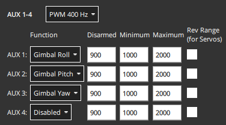
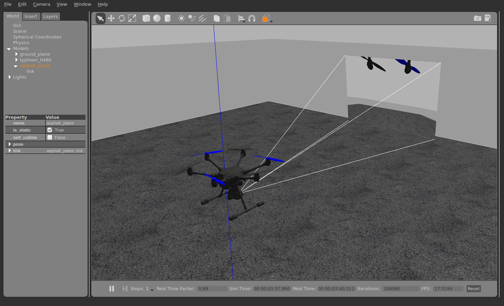

# 云台配置

本页面介绍了如何配置及控制一个安装了相机（或其他任务载荷）的云台。

## 概述

PX4包含支持不同输入输出方法的通用云台驱动程序：

- **输入方法**定义了被PX4管理的云台指令协议。 该输入可能是一个RC遥控器，通过GCS发送的MAVLink命令，或者两者兼备并可自动切换。
- **输出方法**定义了PX4如何与已连接的云台通讯。 推荐使用Mavlink v2协议，但是你也可以直接通过PWM输出端口与非空链接。

PX4接收输入信号并将其经过路由/转换发送至输出。 任何输入方法都可以被用来驱动任何输出。

输入和输出都使用参数进行配置。 输入通过参数[MNT_MODE_IN](../advanced_config/parameter_reference.md#MNT_MODE_IN)进行设置。 默认情况下设置为 `Disabled (-1)` 既驱动不运行。 在选择输入模式后，请重新启动飞行器以启动云台驱动程序。

`MNT_MODE_IN` 应该被设置为下列选项中的其中一个： `RC (1)` ，`MAVlink gimbal protocol v2 (4)` 或 `Auto (0)` (其他选项已废弃)。 如果选择 `Auto(0)`，则云台将基于最新地输入自动选择 RC 或 MAVLink 作为输入。 请注意，从 MAVLink 到 RC 的自动切换需要一个大幅度地杆量操作！

输出通过参数[MNT_MODE_OUT](../advanced_config/parameter_reference.md#MNT_MODE_OUT)进行设置。 默认情况下，输出被设置为 PXM 端口(`AUX (0)`)。 如果云台支持 [MAVLink Gimbal Protocol v2](https://mavlink.io/en/services/gimbal_v2.html) ，应该选择 `MAVLink gimbal protocl v2 (2)`。

云台驱动的完整参数列表可在 [参数 > Mount](../advanced_config/parameter_reference.md#mount) 中找到。 下面介绍了一些通用的云台相关设置。

## MAVLink 云台(MNT_MODE_OUT=MAVLINK)

Each physical gimbal device on the system must have its own high level gimbal manager, which is discoverable by a ground station using the MAVLink gimbal protocol. The ground station sends high level [MAVLink Gimbal Manager](https://mavlink.io/en/services/gimbal_v2.html#gimbal-manager-messages) commands to the manager of the gimbal it wants to control, and the manager will in turn send appropriate lower level "gimbal device" commands to control the gimbal.

PX4 can be configured as the gimbal manager to control a single gimbal device (which can either be physically connected or be a MAVLink gimbal that implements the [gimbal device interface](https://mavlink.io/en/services/gimbal_v2.html#gimbal-device-messages)).

To enable a MAVLink gimbal, first set parameter [MNT_MODE_IN](../advanced_config/parameter_reference.md#MNT_MODE_IN) to `MAVlink gimbal protocol v2` and [MNT_MODE_OUT](../advanced_config/parameter_reference.md#MNT_MODE_OUT) to `MAVLink gimbal protocol v2`.

The gimbal can be connected to _any free serial port_ using the instructions in [MAVLink Peripherals (GCS/OSD/Companion)](../peripherals/mavlink_peripherals.md) (also see [Serial Port Configuration](../peripherals/serial_configuration.md#serial-port-configuration)). For example, if the `TELEM2` port on the flight controller is unused you can connect it to the gimbal and set the following PX4 parameters:

- [MAV_1_CONFIG](../advanced_config/parameter_reference.md#MAV_1_CONFIG)为**TELEM2**（如果`MAV_1_CONFIG`已经用于连接机载计算机，使用`MAV_2_CONFIG`）。
- [MAV_1_MODE](../advanced_config/parameter_reference.md#MAV_1_MODE)为**NORMAL**
- [SER_TEL2)BAUD](../advanced_config/parameter_reference.md#SER_TEL2_BAUD)设置为厂家建议的波特率。

### Multiple Gimbal Support

PX4 can automatically create a gimbal manager for a connected PWM gimbal or the first MAVLink gimbal device with the same system id it detects on any interface. It does not automatically create gimbal manager for any other MAVLink gimbal devices that it detects.

You can support additional gimbals provided that they:

- implement the gimbal _manager_ protocol
- Are visible to the ground station and PX4 on the MAVLink network. This may require that traffic forwarding be configured between PX4, the GCS, and the gimbal.
- Each gimbal must have a unique component id. For a PWM connected gimbal this will be the component ID of the autopilot

## Gimbal on FC PWM Output (MNT_MODE_OUT=AUX)

The gimbal can also be controlled by connecting it to up to three flight controller PWM ports and setting the output mode to `MNT_MODE_OUT=AUX`.

The output pins that are used to control the gimbal are set in the [Acuator Configuration > Outputs](../config/actuators.md#actuator-outputs) by selecting any three unused Actuator Outputs and assigning them the following output functions:

- `Gimbal Roll`: Output controls gimbal roll.
- `Gimbal Pitch`: Output controls Gimbal pitch.
- `Gimbal Yaw`: Output controls Gimbal pitch.

For example, you might have the following settings to assign the gimbal roll, pitch and yaw to AUX1-3 outputs.



The PWM values to use for the disarmed, maximum and minimum values can be determined in the same way as other servo, using the [Actuator Test sliders](../config/actuators.md#actuator-testing) to confirm that each slider moves the appropriate axis, and changing the values so that the gimbal is in the appropriate position at the disarmed, low and high position in the slider. The values may also be provided in gimbal documentation.

## SITL

The [Gazebo Classic](../sim_gazebo_classic/README.md) simulation [Typhoon H480 model](../sim_gazebo_classic/gazebo_vehicles.md#typhoon-h480-hexrotor) comes with a preconfigured simulated gimbal.

要运行它，请使用：

```
make px4_sitl gazebo-classic_typhoon_h480
```

To just test the [gimbal driver](../modules/modules_driver.md#gimbal) on other models or simulators, make sure the driver runs (using `gimbal start`), then configure its parameters.

## 测试

The driver provides a simple test command. 接下来描述了在SITL中的测试方式，但是这些指令也可以在真实的设备中使用。

使用下面这条指令开始仿真（不需要修改任何参数）：

```
make px4_sitl gazebo-classic_typhoon_h480
```

确保无人机是上锁状态，例如使用`命令行 takeoff`， 然后用下面的命令来控制云台（例如）：

```
gimbal test yaw 30
```

注意模拟的云台自身稳定，因此如果发送 MAVLink 命令，设置`stabilize`标志为`false`。


