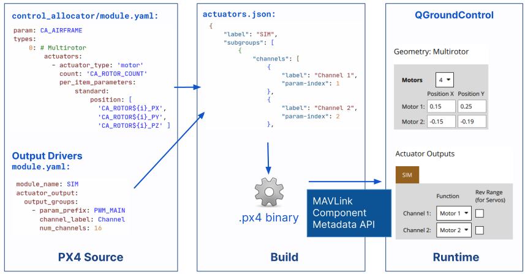

# PX4 元数据

PX4 使用并生成人类和机器可读的元数据:

- [参数](../advanced_config/parameters.md) 配置 PX4 的行为。
  - 一个参数由一个 ID 字符串表示，并映射到 PX4 中存储的一个值。
  - 相关的元数据包含对设置的描述，可能的取值，有关值如何呈现的信息 (比如位掩码)。
- [Events](../concept/events_interface.md) 提供事件通知，例如失效保护的原因，电池低电量告警，校准结束等等。
  - 事件是由一个 id 表示，并且发送带有日志级别和一些参数。
  - 相关的元数据包括每个事件的消息、描述和参数列表 (包括它们的类型)。
- [Actuators](../config/actuators.md) 配置自定义飞行器的特定几何形状，将执行器和电机绑定到飞控的输出，并测试执行器和电机响应。
  - 元数据包含所支持的飞行器几何形状信息，驱动输出列表，以及如何配置它们。
  - _QGroundControl_  地面站使用该信息动态构建配置界面。

元数据和元数据翻译与外部系统共享，例如 QGroundControl 地面站，使其能够显示有关参数和事件的信息，并配置飞行器几何形状和执行器输出映射。

本节解释了您如何定义元数据并翻译成字符串 (以及"仅供您参考"，它是如何工作的)。

## 元数据翻译

在 Crowdin 项目 [PX4-Metadata-Translations](https://crowdin.com/project/px4-metadata-translations) 中翻译 PX4 元数据。
更多关于 PX4 和 Crowdin 信息请参阅[Translation](../contribute/translation.md)。

## 元数据定义

PX4 元数据是在 PX4 源代码及其相关数据中定义的。
这可以通过在 C/C++ 注释中使用特殊标记来指示元数据字段及其值，或者使用 YAML 文件来完成。

更多信息请参阅每种数据类型的章节：

- [参数与配置> 创建/定义参数](../advanced/parameters_and_configurations.md#creating-defining-parameters)
- [事件接口](../concept/events_interface.md)
- [执行器元数据](#actuator-metadata)（下文）

## 元数据工具链

处理元数据的过程对所有元数据类型都是相同的。

每次构建 PX4 时，元数据都会被收集到 JSON 文件中。

对于大多数飞控（因为大多数都有足够的可用 FLASH 存储空间），JSON文件经过 xz 压缩并存储在生成的二进制文件中。
The file is then shared to ground stations using the MAVLink [Component Metadata Protocol](https://mavlink.io/en/services/component_information.html).
Using the component metadata protocol ensures that the recipient can always fetch up-to-date metadata for the code running on the vehicle.
Events metadata is also added to the log files, allowing log analysis tools (such as Flight Review) to use the correct metadata to display events.

Binaries for flight controller targets with constrained memory do not store the parameter metadata in the binary, but instead reference the same data stored on `px4-travis.s3.amazonaws.com`.
This applies, for example, to the [Omnibus F4 SD](../flight_controller/omnibus_f4_sd.md).
The metadata is uploaded via [github CI](https://github.com/PX4/PX4-Autopilot/blob/main/.github/workflows/metadata.yml) for all build targets (and hence will only be available once parameters have been merged into main).

::: info
You can identify memory constrained boards because they specify `CONFIG_BOARD_CONSTRAINED_FLASH=y` in their [px4board definition file](https://github.com/PX4/PX4-Autopilot/blob/main/boards/omnibus/f4sd/default.px4board).

If doing custom development on a FLASH-constrained board you can adjust the URL [here](https://github.com/PX4/PX4-Autopilot/blob/main/src/lib/component_information/CMakeLists.txt#L41) to point to another server.
:::

The metadata on `px4-travis.s3.amazonaws.com` is used if parameter metadata is not present on the vehicle.
It may also be used as a fallback to avoid a very slow download over a low-rate telemetry link.

The metadata JSON files for CI builds of `main` are also copied to the github repo: [PX4/PX4-Metadata-Translations](https://github.com/PX4/PX4-Metadata-Translations/).
This integrates with Crowdin to get translations, which are stored in the [translated](https://github.com/PX4/PX4-Metadata-Translations/tree/main/translated) folder as xz-compressed translation files for each language.
These are referenced by the vehicle component metadata, and are downloaded when needed.
For more information see [PX4-Metadata-Translations](https://github.com/PX4/PX4-Metadata-Translations/) and [Component Metadata Protocol > Translation](https://mavlink.io/en/services/component_information.html#translation).

:::info
The parameter XML file of the main branch is copied into the QGC source tree via CI and is used as a fallback in cases where no metadata is available via the component metadata protocol (this approach predates the existence of the component metadata protocol).
:::

### 元数据执行器

The following diagram shows how actuator metadata is assembled from the source code and used by QGroundControl:

<!-- Source: https://docs.google.com/drawings/d/1hMQmIijdFjr21rREcXj50qz0C1b47JW0OEa6p5P231k/edit -->

- **Left**: the metadata is defined in `module.yml` files in different modules.
  The `control_allocator` modules defines the geometries, while each output driver defines its set of channels and configuration parameters.
  [The schema file](https://github.com/PX4/PX4-Autopilot/blob/main/validation/module_schema.yaml) documents the structure of these yaml files.
- **Middle**: At build time, the `module.yml` files for all enabled modules for the currently built target are parsed and turned into an `actuators.json` file using the [Tools/module_config/generate_actuators_metadata.py](https://github.com/PX4/PX4-Autopilot/blob/main/Tools/module_config/generate_actuators_metadata.py) script.
  There is also [schema file](https://github.com/mavlink/mavlink/blob/master/component_metadata/actuators.schema.json) for this.
- **Right**: At runtime, the JSON file is requested by QGroundControl via MAVLink Component Metadata API (described above).

## 更多信息：

- [Parameters & Configurations](../advanced/parameters_and_configurations.md)
- [Events Interface](../concept/events_interface.md)
- [Translation](../contribute/translation.md)
- [Component Metadata Protocol](https://mavlink.io/en/services/component_information.html) (mavlink.io)
- [PX4-Metadata-Translations](https://github.com/PX4/PX4-Metadata-Translations/) (Github)
