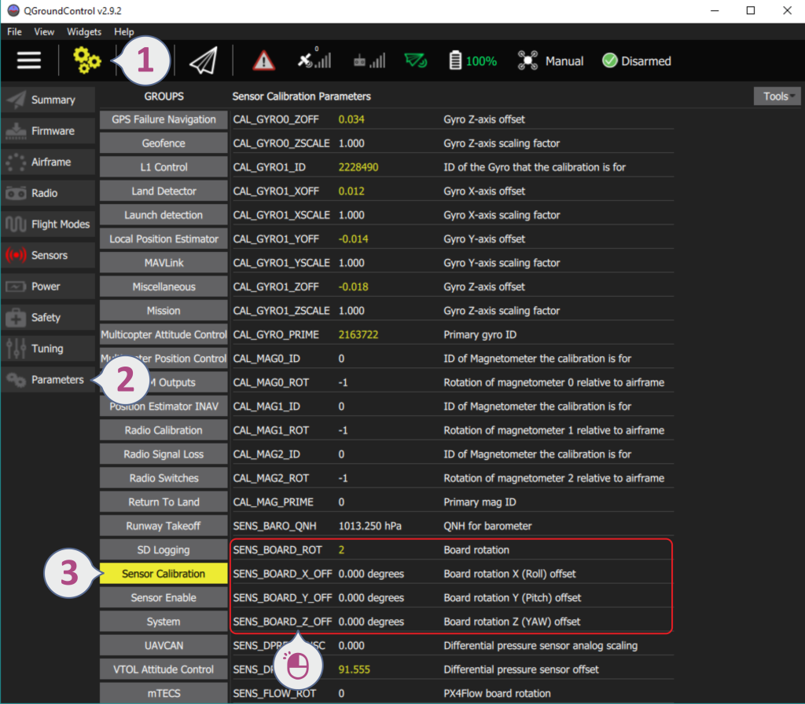

# 飞行控制器的朝向的高级调参

可以通过手动调参来修正无人机的方向和地平线水准，以校正传感器芯片存在的微小不对准或校准误差。

> **Note** 不建议普通用户使用该教程。 对于基本设置，请遵循下面链接的说明：

- [飞行控制器方向](../config/flight_controller_orientation.md)
- [水平平面校准](../config/level_horizon_calibration.md) 

如果存在持续的漂移偏差(通常存在于多旋翼中，但不仅限于多旋翼)，一个比较好的方法是可以通过微调偏移角度参数的帮助，去除该偏差，而不是使用RC发射器的修整器。 这样，当完全自主飞行时，飞机将保持去除漂移偏差。

## 方向参数设置

为了更改方向参数：

1. 打开 QGroundControl 菜单: **Settings > Parameters > Sensor Calibration**.
2. 更改以下参数： 

## 参数信息

参数**SENS_BOARD_ROT** 定义了相对于平台platform的旋转，而X，Y和Z微调偏移量相对于电路板本身是固定的。 实质上是微调的偏移量被添加到了 SENS_BOARD_ROT 角度中， 为了获得飞行控制器的偏航，俯仰和滚转方向的总偏移角度。

**SENS_BOARD_ROT**

该参数定义了FMU飞控板相对于飞机平台的旋转角。 可选值有：

- 0 = 无旋转
- 1 = 偏航 45°
- 2 = 偏航 90°
- 3 = 偏航 135°
- 4 = 偏航 180°
- 5 = 偏航 225°
- 6 = 偏航 270°
- 7 = 偏航 315°
- 8 = 滚转 180°
- 9 = 滚转 180°, 偏航 45°
- 10 = 滚转 180°, 偏航 90°
- 11 = 滚转 180°, 偏航 135°
- 12 = 俯仰 180°
- 13 = 滚转 180°, 偏航 225°
- 14 = 滚转 180°, 偏航 270°
- 15 = 滚转 180°, 偏航 315°
- 16 = 滚转 90°
- 17 = 滚转 90°, 偏航 45°
- 18 = 滚转 90°, 偏航 90°
- 19 = 滚转 90°, 偏航 135°
- 20 = 滚转 270°
- 21 = 滚转 270°, 偏航 45°
- 22 = 滚转 270°, 偏航 90°
- 23 = 滚转 270°, 偏航 135°
- 24 = 俯仰 90°
- 25 = 俯仰角 270°

**SENS_BOARD_X_OFF**

以PX4的FMU的x坐标轴或Z坐标轴（翻滚轴）以度为单位做旋转。 角度的正值增加CCW方向，角度的负值增加CW方向

**SENS_BOARD_Y_OFF**

以PX4的FMU的x坐标轴或Z坐标轴（翻滚轴）以度为单位做旋转。 角度的正值增加CCW方向，角度的负值增加CW方向

**SENS_BOARD_Z_OFF**

以PX4的FMU的x坐标轴或Z坐标轴（翻滚轴）以度为单位做旋转。 角度的正值增加 CCW 方向，角度的负值增加CW方向。