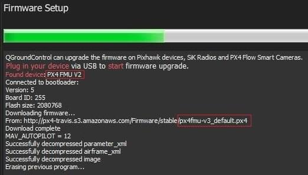

# Bootloader 更新

早期的 [Pixhawk系列](../flight_controller/pixhawk_series.md#fmu-versions) 基于 FMUv2 的飞行控制器有一个硬件问题（[芯片勘误表](../flight_controller/silicon_errata.md#fmuv2--pixhawk-silicon-errata)），这导致限制它们只能使用 1MB 的闪存空间。 这个问题已经在新版本的硬件中被修正了，所以它现在（理论上）可以安装 FMUv3 固件，并访问全部的 2MB 可用储存空间。

但不行的是，一些厂商生产的飞控板仍在使用旧版的bootloader，导致无法检测硬件问题是否依然存在。 因此，FMUv2 固件仍然必须对储存空间做限制。

本篇将介绍，怎样将 bootloader 更新至最新版，以便在兼容的飞控板上使用FMUv3固件。

### 主要步骤

您可以通过设置参数：[SYS_BL_UPDATE](../advanced_config/parameter_reference.md#SYS_BL_UPDATE)，以便在下次重新启动时启动 bootloader 更新。

要更新bootloader，请执行以下操作：

1. 插入 SD 卡（启用引导日志记录，便于调试任何可能的问题。）
2. [更新固件](../config/firmware.md) 至PX4 *master* 版本（当更新固件时，查看 **高级设置** 并从下拉列表选择**Developer Build (master)** ）。 *QGroundControl* 会自动识别到硬件支持 FMUv2，并安装相应的固件。
    
    
    
    等待飞控重启。

3. [找到并启用](../advanced_config/parameters.md#parameter-configuration) 参数 [SYS_BL_UPDATE](../advanced_config/parameter_reference.md#SYS_BL_UPDATE)。

4. 重新启动（断开/重新连接飞控板）。 bootloader更新只需要几秒钟即可完成。
5. 然后再重新 [更新固件](../config/firmware.md) 。 这一次 *QGroundControl* 会自动识别到硬件支持 FMUv3，并相应地安装固件。
    
    
    
    > **Note** 如果硬件有 *芯片错误*，它仍将被检测为 FMUv2，你将会（在控制台）看到 FMUv2 被重新安装。 在这种情况下，你将不能安装 FMUv3 固件。