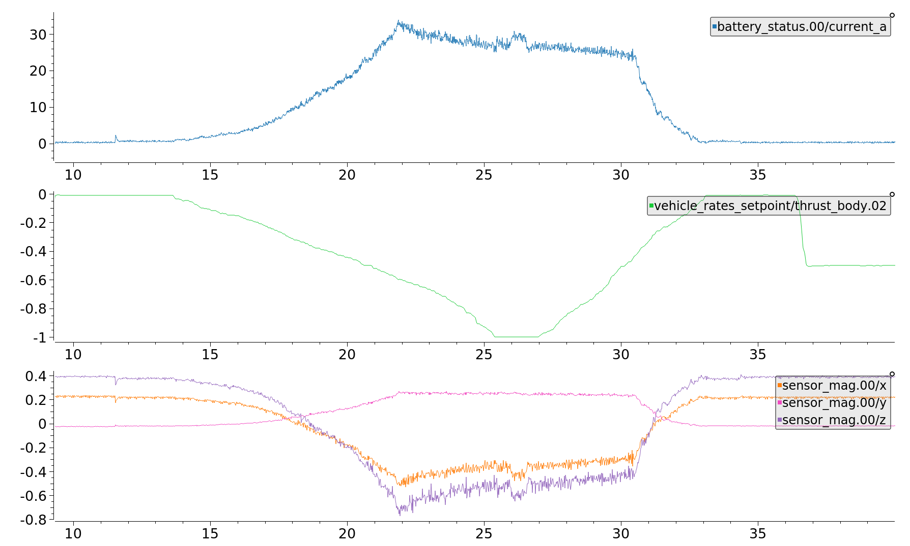
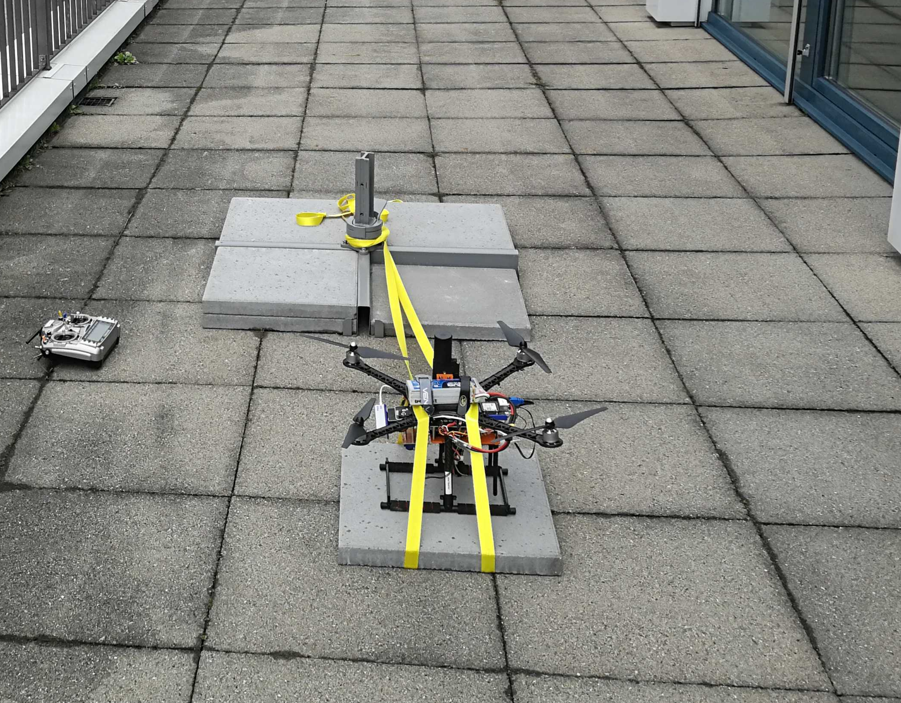
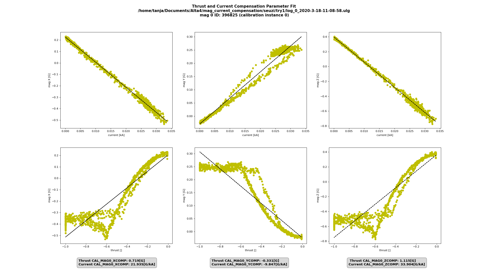
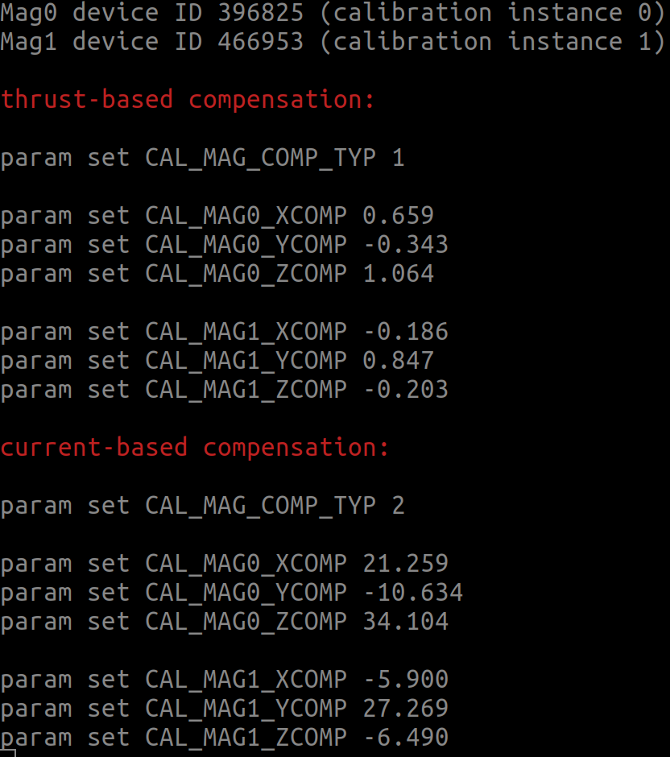

# 磁罗盘功率补偿

罗盘（磁力计）应该安装在尽可能远离通过大电流的线缆的位置，因为大电流诱发的磁场会干扰罗盘的读数。

本文解释了如何在不能改变磁航向计安装位置的情况下如何补偿诱发磁场带来的影响。

:::tip
使磁航向计远离动力电缆是最简单和最有效的避免诱发磁场干扰的方法，因为磁场强度是按与电缆的距离的二次方衰减的。
:::

:::note
下述过程基于多旋翼无人机演示，但同样适用于其他类型的载具。
:::

<span id="when"></span>
## 本节补偿方法可用的前提

只有当下述的全部条件都满足时才建议采用功率补偿：
1. 磁航向计无法远离动力线缆。
1. 磁航向计读数与油门杆位与/或电池电流有强相关性。

1. 无人机的线缆都是固定的或不会移动的（当通电的线缆能够移动会导致计算出的补偿参数失效）。

<span id="how"></span>
## 如何实现罗盘补偿

1. 确保无人机运行在支持电源补偿的固件版本上（当前的Master版，或v1.11.0之后的版本）。
1. 执行标准的[指南针校准](../config/compass.md#compass-calibration)流程。
1. 将参数[SDLOG_MODE](../advanced_config/parameter_reference.md#SDLOG_MODE) 设为2，使系统一启动就开始记录日志。
1. Set the parameter [SDLOG_PROFILE](../advanced_config/parameter_reference.md#SDLOG_PROFILE) checkbox for *Sensor comparison* (bit 6) to get more data points.
1. 固定好无人机使其无法移动，然后装好螺旋桨（这样电机可以获得与实际飞行中同样大的电流）。 本例中用带子固定了无人机。

   
1. 给无人机上电，并切换到[特技 (ACRO) 飞行模式](../flight_modes/acro_mc.md) （此模式下无人机不会试图去补偿带子对运动造成的影响）。
   - 解锁无人机，然后缓缓将油门推到最大。
   - 慢慢将油门降到0
   - 给无人机加锁 > **Note** 谨慎地进行测试，并密切注意振动情况。

   :::note
仔细测试并密切监视震动情况。
:::
1. Retrieve the ulog and use the python script [mag_compensation.py](https://github.com/PX4/PX4-Autopilot/blob/release/1.13/src/modules/sensors/vehicle_magnetometer/mag_compensation/python/mag_compensation.py) to identify the compensation parameters.
   ```bash
   python mag_compensation.py ~/path/to/log/logfile.ulg
   ```

   :::note
如果日志中不包含电池电流测量，你需要注释掉 python 脚本中相关的代码，这样就只能进行推力计算。

:::
1. 这个脚本将返回基于推力和基于电流的补偿参数，并打印输出到控制台。 脚本弹出的数值显示了每个罗盘匹配的程度，以及使用了建议的补偿值后数据将是什么样的。 如果有电流测数，那么依据电流补偿通常可以获得更好的结果。 这里是一个日志的例子，电流匹配得很好，然而因为不是线性关系推力参数则完全不可用。 

1. 一旦确定了参数，必须通过将[CAL_MAG_COMP_TYP](../advanced_config/parameter_reference.md#CAL_MAG_COMP_TYP)设为1（使用推力参数时）或2（使用电流参数时）来激活电源补偿。 此外，还要设置好每个罗盘每个轴的补偿参数值。

   
