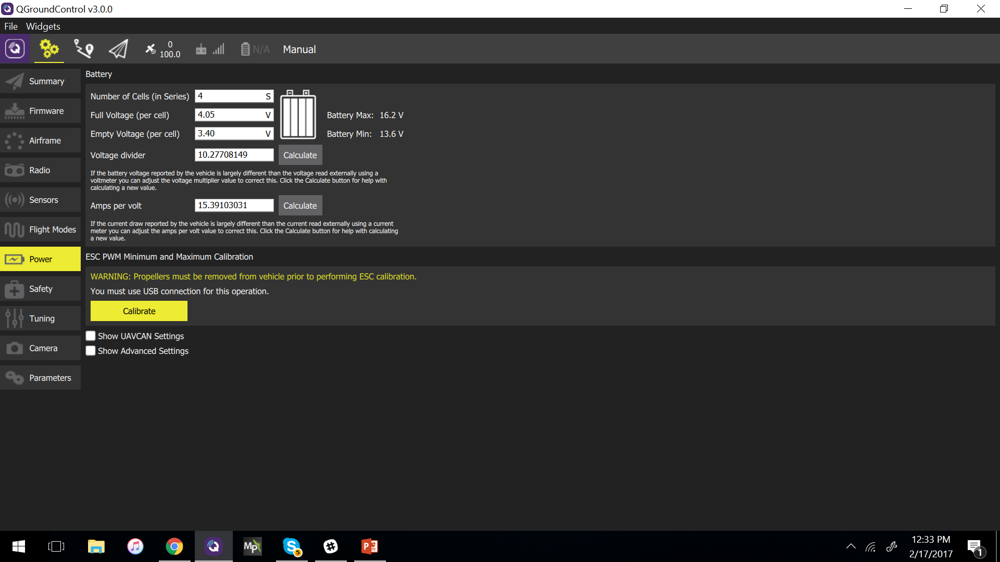
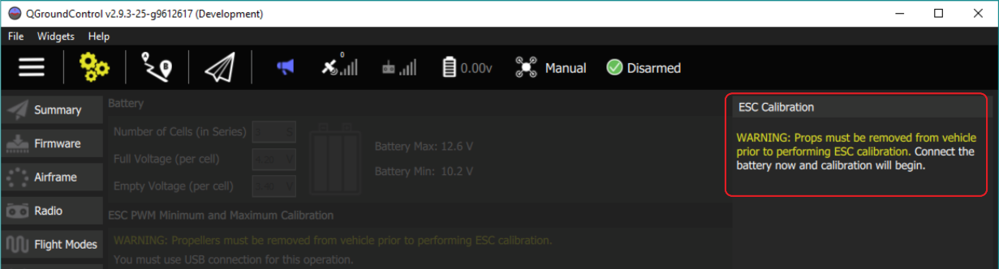
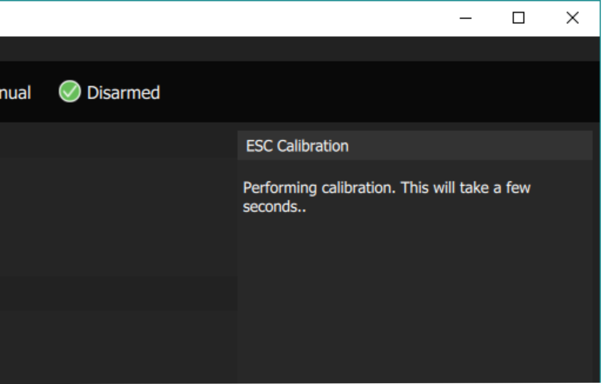
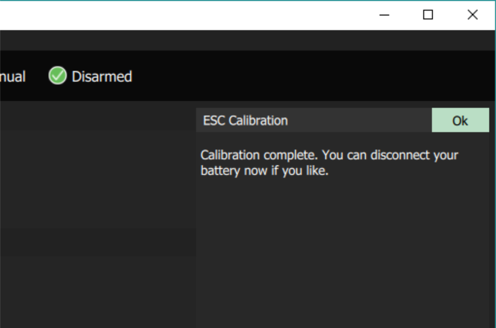

# 电调（ESC）校准

> **Note** 这些说明仅与 [PWM 电调](../peripherals/pwm_escs_and_servo.md) 有关。

电子速度控制器 (ESCs) 根据来自飞行控制器 (FC) 的 PWM 输入值调节电机速度 (和方向)。 ESC 响应的输入范围是可配置的, 甚至同一型号的不同 ESC 之间的默认范围也会有所不同。

此校准将更新所有 ESCs, 其最大和最小 PWM 输入值将由飞行控制器提供。 继而，所有的ECSs将以同样的方式响应飞控的输入(在完整的输入范围内)。

建议同时校准所有的ESCs，特别是对于低成本的模型机。

## 操作前提

系统必须包括一个电源模块（PX4 使用测量过的电压来确定电池是否连接）。

## 步骤

校准电调：

1. 卸下螺旋桨。
    
    > **Warning** 切勿进行电调校准时将螺旋桨装上。
    > 
    > 电调校准期间电机不应旋转。 但是，如果ESC没有正确的进入校准程序，它将通过以最大的速度运行电机来响应pwm输入。

2. 断开电池并（仅）通过 USB 连接飞行控制器。

3. 打开 * QGroundControl *** 设置 > 电源**界面，然后按 **校准** 按钮。
    
    

4. 在出现提示时连接电池:
    
    
    
    校准将自动开始:
    
    

5. 校准完成后, 系统将提示您断开电池的连接。
    
    

> **Note** 某些高品质的ESC在出厂时就已经被校准过。 *按理说*，这意味着这些电调可以按照电调技术规格书仅通过设置 [PWM_MIN](../advanced_config/parameter_reference.md#PWM_MIN)，[PWM_MAX](../advanced_config/parameter_reference.md#PWM_MAX)参数来进行配置即可。 实际上，高品质的飞控也存在着不同的输入范围，因此我们推荐再次校准。