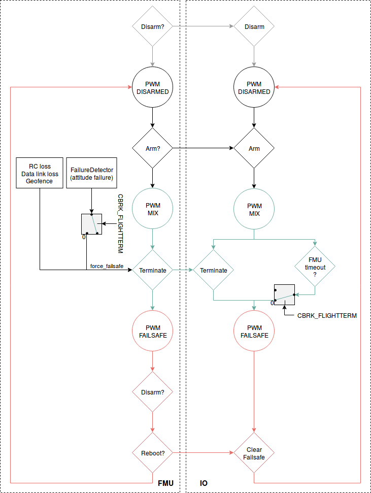

# 飞行终止配置

*飞行终止*[故障保护动作](../config/safety.md#failsafe_actions)可由[安全检查](../config/safety.md)（例如任何载具类型或任何飞行模式下的 RC 丢失、违反地理围栏等）或者故障检测器触发。 

当*飞行终止*激活时，PX4 同时关闭所有控制器，并将所有 PWM 输出设置为其故障保护值。

根据所连接的设备，PWM 故障保护输出可以用来完成以下动作：

- 展开[降落伞](../peripherals/parachute.md)。
- 伸展可伸缩起落架。
- 将连接了 PWM 的云台移动到安全的方向（或将它回收）以保护摄像机。
- 触发一个重启装置，比如安全气囊。
- 触发警报。

飞行终止是无法取消的。 在飞行终止触发后，您应尽快拔下电池。 您需要在重启载具或重新上电后才能再次使用。

> **Tip** PX4 不知道连接了哪些安全设备——它仅仅将一组预设的 PWM 值应用于安全设备的输出。

> **Tip** 故障保护值被应用于终端的所有输出。 无法配置基于独立时间（或其他）触发的电机或特定安全装置。

> **Note** 这*不是*一个独立的*飞行终止系统*。 如果断电或自动驾驶仪完全崩溃，则不会触发故障安全设备。

## 硬件配置

可以使用通过改变 PWM 值触发的任何*安全装置*（例如[降落伞](../peripherals/parachute.md)），此外可以连接到任何空闲的 PWM 端口（MAIN 端口和 AUX 端口均可）。

> **Note** 如果您使用的是 Pixhawk 系列电路板，则必须单独为伺服导轨供电（通常可利用您无刷电调上的 5V BEC 供电）。

## 软件配置

[安全](../config/safety.md)话题解释了如何将*飞行终止*设置为针对特定故障安全检查而执行的[故障保护动作](../config/safety.md#failsafe_actions)。

如果载具翻转（超过一定姿态）或外部自动触发系统（ATS）检测到故障，则[故障检测器](../config/safety.md#failure_detector)也可以（可选）通过配置来触发飞行终止，如下所示：

- 设置 [CBRK_FLIGHTTERM=0](../advanced_config/parameter_reference.md#CBRK_FLIGHTTERM) 启用故障检测器（默认情况下禁用）。
- 通过[安全 > 故障检测器 > 姿态触发器](../config/safety.md#attitude_trigger)可以配置触发*飞行终止*的姿态极限值。 > **Note** 在*起飞期间*，超过限制值的姿态将触发*上锁*（制动电机但不启动降落伞），而不是飞行终止。 无论 `CBRK_FLIGHTTERM` 为何值，此选项始终启用。
- [通过安全 > 外部自动触发系统（ATS）](../config/safety.md#external_ats)可以配置外部触发系统。

对于每个与安全装置相连的 MAIN 输出，其中“n”指 PWM 端口号：

- 将 [PWM_MAIN_DISn](../advanced_config/parameter_reference.md#PWM_MAIN_DIS1) 设置为设备的“OFF”PWM值。
- 将 [PWM_MAIN_FAILn](../advanced_config/parameter_reference.md#PWM_MAIN_FAIL1) 设置为设备的“ON”PWM值。

对于每个与安全装置相连的 AUX 输出，其中“n”指 PWM 端口号：

- 将 [PWM_AUX_DISn](../advanced_config/parameter_reference.md#PWM_AUX_DIS1) 设置为设备的“OFF”PWM值。
- 将 [PWM_AUX_FAILn](../advanced_config/parameter_reference.md#PWM_AUX_FAIL1) 设置为设备的“ON”PWM值。

最后，设置任意电机的 `PWM_AUX_FAILn` and `PWM_MAIN_FAILn` PWM值。

## 逻辑图解

下图显示了飞行终止的逻辑流程。

