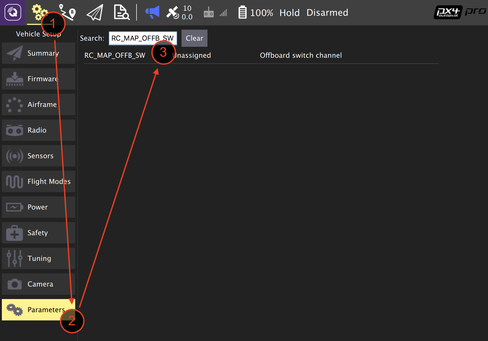
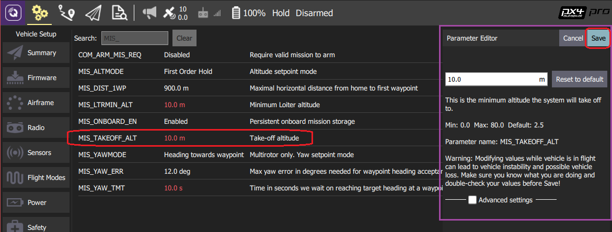
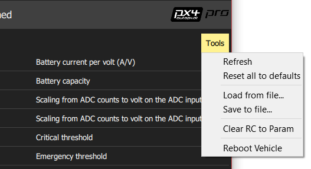

# 查找/修改参数

通过配置和调整[参数](../advanced_config/parameter_reference.md)可以影响PX4的表现（例如: [多轴无人机的PID增益](../config_mc/pid_tuning_guide_multicopter.md)、校准信息等）。

你可以在*QGroundControl 参数* 界面查找和修改任何与载具相关的参数。在屏幕上方的工具条中点击 齿轮 图标，然后在侧边栏中选择 参数(parameter)。 通过单击边栏中的顶部菜单 * 齿轮 * 图标, 然后 * 参数(Parameters) *, 就可以访问参数设置的页面。

> **Note**大部分常用参数都可以通过[基本设置](../config/README.md)章节中描述的专用配置界面更方便地设置。 对于不太常用的参数，比如调试全新的载具，就需要用到 *参数(Parameters)* 界面了。

> **Waring**虽然某些参数可以在飞行中更改，但不建议这样做 (除非在本指南中有明确说明)。

## 查找参数 {#finding}

可以通过在 * 搜索(Search) * 框中输入一个相关字眼来搜索参数。 和搜索字眼相关的所有参数名称和说明将会以列表形式显示 (按 ** 清除(Clear) ** 重置搜索)。

你也可以按组浏览参数, 方法是单击左侧的按钮 (在选中 * 电池校准(Battery Calibration) * 下的图像中)。

> **Tip** 如果找不到期望的参数，请参阅[下一节](#missing)。

## 找不到的参数 {#missing}

一般情况下，与以其他参数为先决条件，或者固件中没有该参数，是部分参数不可见的原因（参见下文）。

### 受条件限制的参数

如果一个参数所依赖的参数没有激活，则该参数不会被显示。

您可以通过检索[全部参数参考 (full parameter reference)](../advanced_config/parameter_reference.md)和其他文档来找到哪些参数是受条件限制的。 特别是[串行端口配置参数 (serial port configuration parameters)](../peripherals/serial_configuration.md)，它取决于分配给串行端口的服务。

### 固件中没有的参数

如果使用了不同版本的PX4或者你的固件版本中没有包含相关的模块都会导致固件中没有该参数。

每一版PX4都会增加一些新的参数，原有的参数有时也会被删除或改名。 您可以通过查阅对应版本的[全部参数参考 (full parameter reference)](../advanced_config/parameter_reference.md)来检查一个参数是否*应该*存在。 您还可以在源代码和发布说明中查找参数。

固件中缺少参数的另一个原因相关的模块没有被导入。 这一问题（尤其）在*FMUv2固件*常见，因为PX4必须删减许多模块才能放进它只有1M的闪存中。 解决此问题有两种方法：

- 检查你的控制板是否可以升级到包含了所有模块的FMUv3固件：[固件 > FMUv2 Bootloader 升级](../config/firmware.md#bootloader)
- 如果你的控制板只能运行FMUv2固件，你就要引入确实的模块后[重生成PX4](https://dev.px4.io/master/en/setup/building_px4.html)。 在[boards/px4/fmu-v2/default.cmake](https://github.com/PX4/Firmware/blob/master/boards/px4/fmu-v2/default.cmake)文件中看到注释掉的模块: 
        DRIVERS
            adc
            #barometer # 全部支持的气压计驱动
            barometer/ms5611
            #batt_smbus
            #camera_capture > 
    
    **Note** 您可能还需要禁用其他的模块才能使重生成的固件适于1MB的闪存. 找到可以移除的模块需要一些试错， 还取决于你要求载具达到哪些使用案例。

## 修改参数 {#changing}

通过单击 参数组中 或 参数搜索结果列表中 的参数行来改变参数的值。 单击后屏幕侧边会显示一个对话框，您在其中更改参数的值（这个对话框还提供了该参数的额外细节信息——包括是否需要重启才能使参数生效）。

> **Note** 当单击**保存(Save)**按钮后，参数会自动且静默地上传到连接的载具。 对于不同的参数，你可能需要重启飞控才能使改变的参数生效。

## 工具（Tools）菜单

您可以在屏幕右上角的**工具 (Tools)**菜单中选择更多的选项。

**刷新 (Refresh)**  用从载具上重新请求的所有参数值刷新地面站上的参数值。

**重置所有参数为默认值 (Reset all to defaults)**  将全部参数重置为原始默认值。

**从文件读取 / 写入文件 (Load from file / Save to file)**  从已有文件中读取参数，或将当前的参数设置写入文件。

**清空遥控器参数 (Clear RC to Param)**  清除全部与遥控器相关的参数。 更多信息请参见：[遥控器设置 > 通道参数调校 ](../config/radio.md#param-tuning-channels)。

**重启载具 (Reboot Vehicle)**  重新启动载具（某些参数在改动后，需要重启才能生效）。