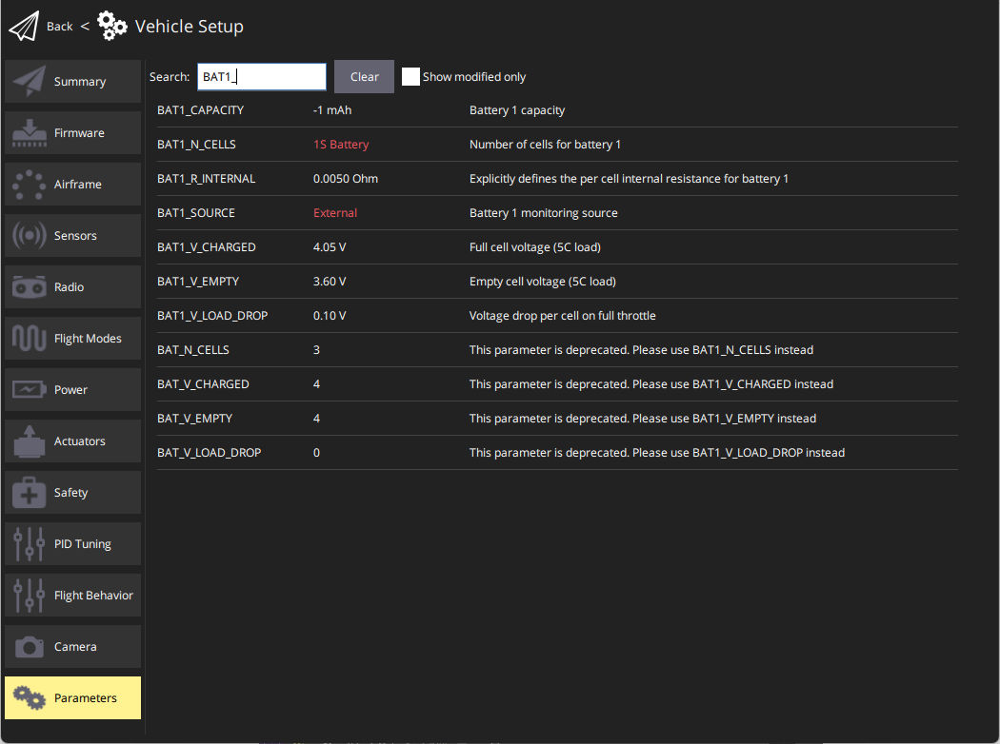
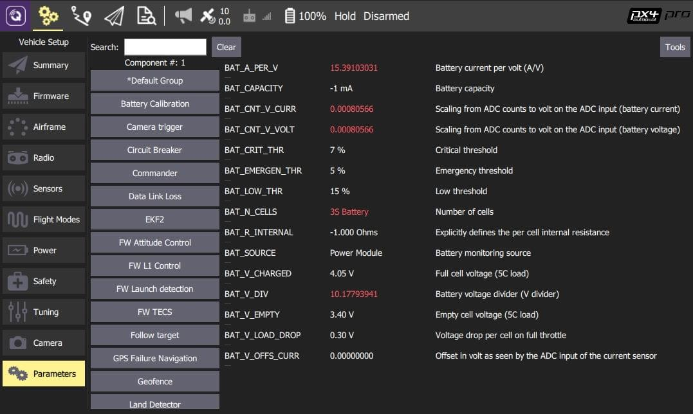

# 查找/修改参数

通过配置和调整[参数](../advanced_config/parameter_reference.md)可以影响PX4的表现（例如: [多轴无人机的PID增益](../config_mc/pid_tuning_guide_multicopter.md)、校准信息等）。

The *QGroundControl Parameters* screen allows you to find and modify **any** of the parameters associated with the vehicle. The screen is accessed by clicking the top menu *Gear* icon and then *Parameters* in the sidebar.

:::note
大多数常用的参数可以通过[基本设置](../config/README.md)中的专用配置界面更方便的设置。 The *Parameters* screen is needed when modifying less commonly modified parameters - for example while tuning a new vehicle.
:::

:::warning
虽然又写参数可以在飞行中更改，但是不建议这样做（除非指南中又明确说明）。
:::

<span id="finding"></span>
## 查找参数

You can search for a parameter by entering a term in the *Search* field. This will show you a list of all parameter names and descriptions that contain the entered substring (press **Clear** to reset the search).



You can also browse the parameters by group by clicking on the buttons to the left (in the image below the *Battery Calibration* group is selected).



:::tip
如果找不到想要的参数，请参阅[下一节](#missing)。
:::

<span id="missing"></span>
## 找不到的参数

参数通常不可见，因为它们要么以其他参数为条件，要么不存在于固件中（见下文）。

### 条件参数

如果一个参数是以未启用的另一个参数为条件，则该参数不会被显示。

您通常可以通过搜索 [完整的参数参考](../advanced_config/parameter_reference.md) 和其他文档来找到条件参数。 尤其是[串口配置参数](../peripherals/serial_configuration.md)，它依赖于分配给串口的服务。


### 固件中没有的参数

参数可能不在固件中，因为您使用了不同版本的 PX4，或者因为您构建的固件中没有包含相关的模块。

每个PX4版本都添加了新参数，现有参数有时被删除或重命名。 You can check whether a parameter *should* be present by reviewing the [full parameter reference](../advanced_config/parameter_reference.md) for the version you're targeting. 您还可以在源代码和发布说明中查找参数。

参数可能不在固件中的另一个原因是如果其关联的模块没有被包含。 This is a problem (in particular) for *FMUv2 firmware*, which omits many modules so that PX4 can fit into the 1MB of available flash. 解决此问题有两种方法：
- Check if you can update your board to run FMUv3 firmware, which includes all modules: [Firmware > FMUv2 Bootloader Update](../config/firmware.md#bootloader)
- If your board can only run FMUv2 firmware you will need to [rebuild PX4](../dev_setup/building_px4.md) with the missing modules enabled. You need reconfigure the PX4 firmware itself through make px4_fmuv2_default boardconfig where you can enabled/disable modules ``` :::note
You may also need to disable other modules in order to fit the rebuilt firmware into 1MB flash.
Finding modules to remove requires some trial/error and depends on what use cases you need the vehicle to meet.
:::

<span id="changing"></span>
## 更改参数

要更改参数的值，请单击组或搜索列表中的参数行。 单击后屏幕侧边会显示一个对话框，您在其中更改参数的值（这个对话框还提供了该参数的额外细节信息——包括是否需要重启才能使参数生效）。


:::note
When you click **Save** the parameter is automatically and silently uploaded to the connected vehicle. 根据参数，您可能需要重新启动飞控才能使更改生效。
:::

## 工具

You can select additional options from the **Tools** menu on the top right hand side of the screen.


**Refresh** <br>Refresh the parameter values by re-requesting all of them from the vehicle.

**Reset all to defaults** <br>Reset all parameters to their original default values.

**Load from file / Save to file** <br>Load parameters from an existing file or save your current parameter settings to a file.

**Clear RC to Param** <br>This clears all associations between RC transmitter controls and parameters. For more information see: [Radio Setup > Param Tuning Channels](../config/radio.md#param-tuning-channels).

**Reboot Vehicle** <br>Reboot the vehicle (required after changing some parameters).
