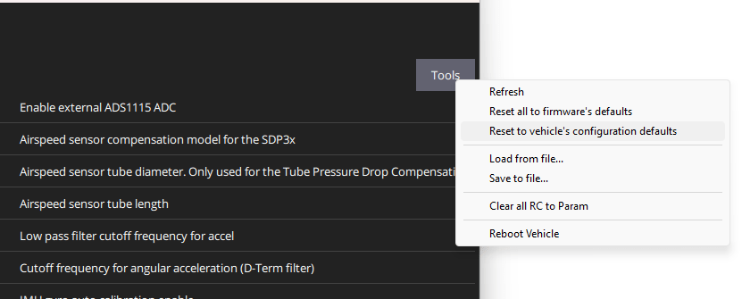

# 查找/修改参数

通过配置和调整[参数](../advanced_config/parameter_reference.md)可以影响PX4的表现（例如: [多轴无人机的PID增益](../config_mc/pid_tuning_guide_multicopter.md)、校准信息等）。

你可以在*QGroundControl 参数* 界面查找和修改**任何**与载具相关的参数。 点击顶部菜单 *齿轮* 图标，然后点击侧边栏中的 *参数* 访问屏幕。

:::note
大多数常用的参数可以通过[基本设置](../config/README.md)中的专用配置界面更方便的设置。 在修改不太常用的修改参数时需要 *参数* 界面。例如，在调整新的载具时。
:::

:::warning
虽然又写参数可以在飞行中更改，但是不建议这样做（除非指南中又明确说明）。
:::

## 查找参数

可以在*搜索*框中输入一个词来搜索参数。 和搜索字眼相关的所有参数名称和说明将会以列表形式显示 (按 ** 清除(Clear) ** 重置搜索)。

您也可以点击左边的按钮来浏览参数组（下图显示了*电池校准*参数组被选中）。

:::tip
如果找不到想要的参数，请参阅[下一节](#missing)。
:::

## 找不到的参数

参数通常不可见，因为它们要么以其他参数为条件，要么不存在于固件中（见下文）。

### 条件参数

如果一个参数是以未启用的另一个参数为条件，则该参数不会被显示。

You can usually find out what parameters are conditional by searching the [full parameter reference](../advanced_config/parameter_reference.md) and other documentation. 尤其是[串口配置参数](../peripherals/serial_configuration.md)，它依赖于分配给串口的服务。

### 固件中没有的参数

参数可能不在固件中，因为您使用了不同版本的 PX4，或者因为您构建的固件中没有包含相关的模块。

每个PX4版本都添加了新参数，现有参数有时被删除或重命名。 您可以通过查阅对应版本的[全部参数参考](../advanced_config/parameter_reference.md)来检查一个参数是否*应该*存在。 您还可以在源代码和发布说明中查找参数。

参数可能不在固件中的另一个原因是如果其关联的模块没有被包含。 这个问题（特别是）对*FMUv2 固件*，该固件省略了许多模块，才能使 PX4 可以适用于 1MB的闪存。 解决此问题有两种方法：

- 检查你是否可以更新你的板来运行 FMUv3 固件，其中包括所有模块： [固件 > FMUv2 Bootloader 更新](../config/firmware.md#bootloader)
- 如果你的控制板只能运行FMUv2固件，你就要引入确实的模块后[重生成PX4](../dev_setup/building_px4.md)。 在[boards/px4/fmu-v2/default.cmake](https://github.com/PX4/PX4-Autopilot/blob/master/boards/px4/fmu-v2/default.cmake)文件中看到注释掉的模块: 
        DRIVERS
            adc
            #barometer # 全部支持的气压计驱动
            barometer/ms5611
            #batt_smbus
            #camera_capture :::note You may also need to disable other modules in order to fit the rebuilt firmware into 1MB flash. 找到可以移除的模块需要一些试错， 还取决于你要求载具达到哪些使用案例。
:::

## 更改参数

To change the value of a parameter click on the parameter row in a group or search list. This will open a side dialog in which you can update the value (this dialog also provides additional detailed information about the parameter - including whether a reboot is required for the change to take effect).

:::note
When you click **Save** the parameter is automatically and silently uploaded to the connected vehicle. Depending on the parameter, you may then need to reboot the flight controller for the change to take effect.
:::

## 工具（Tools）菜单

You can select additional options from the **Tools** menu on the top right hand side of the screen.

**Refresh**  Refresh the parameter values by re-requesting all of them from the vehicle.

**Reset all to defaults**  Reset all parameters to their original default values.

**Load from file / Save to file**  Load parameters from an existing file or save your current parameter settings to a file.

**Clear RC to Param**  This clears all associations between RC transmitter controls and parameters. For more information see: [Radio Setup > Param Tuning Channels](../config/radio.md#param-tuning-channels).

**Reboot Vehicle**  Reboot the vehicle (required after changing some parameters).