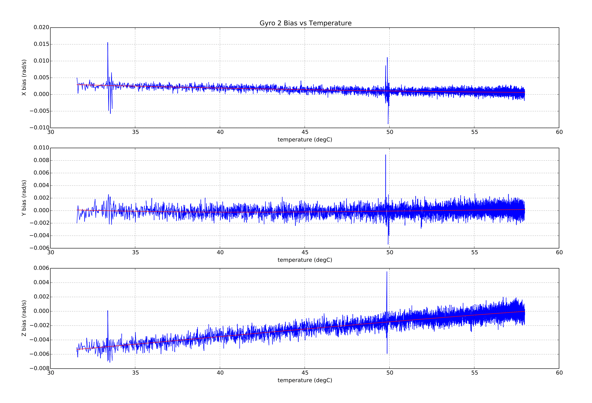

# 热校准和补偿

px4 包含校准和补偿速率陀螺仪、加速度计和气压传感器的功能, 以纠正传感器温度对传感器偏差的影响。

本主题详细介绍了 [测试环境](#test_setup) 和 [校准过程](#calibration_procedures)。 最后是 [实施过程](#implementation) 的描述。

## 测试设置/最佳实践 {#test_setup}

以下部分中描述的 [校准程序](#calibration_procedures) 是在理想的 *环境室*（温度和湿度受控的环境）中进行的，因为电路板被从最低温度加热到最高运行/校准温度。 在开始校准之前，首先将电路板 *冷却*（冷却至最低温度并使其达到平衡）。

对于冷却，您可以使用普通的家用冰箱达到 -20C，商用冰箱可以达到 -40C 的量级。 电路板应放在带有硅胶干燥剂包的拉链/防静电袋中，电源线通过密封孔引出。 冷却后，可将袋子移至测试环境，并在同一袋中继续测试。

> **Note**硅胶干燥剂包是为了防止水蒸气在电路板上冷凝。

可以在没有商业级环境室的情况下执行校准。 可以使用具有非常小的内部空气体积的泡沫塑料盒来创造一个简单的环境容器。 这允许自驾仪将空气相对快速地自加热（确保盒子有一个小孔以平衡容器内外压力，但仍然能够在容器内加热）。

使用这种设置可以将电路板加热到约 70C 。 轶事证据表明，许多普通板可以加热到这个温度而没有不良副作用。 如有疑问，请与制造商核实安全操作的温度范围。

> **Tip**要检查板载热校准的状态，请使用 MAVlink console（或 NuttX console）检查传感器报告的内部温度。

## 校准过程 {#calibration_procedures}

PX4 支持两种校准过程：

* [板载校准](#onboard_calibration) - 校准在电路板上运行。 该方法需要知道测试设置中可实现的温升量。
* [板外校准](#offboard_calibration) - 基于在校准过程期间收集的日志信息在计算机上计算补偿参数。 该方法允许用户可视地检查数据和曲线拟合的质量。

板外校准更复杂，速度更慢，但需要更少的测试设置知识，更容易验证。

### 板载校准过程 {#onboard_calibration}

板载校准完全在设备上运行。 它需要知道测试设置中可达到的温升量。

执行板载校准：

1. 确保在校准前设置机架类型，否则在设置飞控板时校准参数将丢失。
2. 为电路板供电并将 ` SYS_CAL _ * `参数设置为 1，以便在下次启动时启用所需传感器的校准。 [^1]
3. 将[ SYS_CAL_TDEL ](../advanced_config/parameter_reference.md#SYS_CAL_TDEL) 参数设置为板载校准器完成所需的温升度数。 如果此参数太小，则校准将提前完成，并且校准的温度范围将不足以在电路板完全预热时进行补偿。 如果此参数设置得太大，则板载校准器将永远不会完成。 在设置此参数时，应考虑到电路板自加热导致的温度升高。 如果传感器的温升量未知，则应使用板外校准方法。
4. 将 [ SYS_CAL_TMIN ](../advanced_config/parameter_reference.md#SYS_CAL_TMIN) 参数设置为您希望校准器发挥作用的最低温度数据。 更低的冷却温度能够用于减少冷却时间，同时保持对校准最低温度的控制。 如果校准器温度低于此参数设置的值，则不会使用传感器的数据。
5. 将 [ SYS_CAL_TMAX ](../advanced_config/parameter_reference.md#SYS_CAL_TMAX) 参数设置为校准器起作用的最高起始传感器温度。 如果起始温度高于此参数设置的值，校准将退出并报告错误。 注意，如果不同传感器测量的温度的差异超过 `SYS_CAL_TMAX ` 和 ` SYS_CAL_TMIN `的差值 ，则校准将不可能启动。
6. 断开电源并将电路板冷却至低于` SYS_CAL_TMIN `参数指定的起始温度。 请注意，在校准开始之前启动过程有10秒的延迟，以允许所有传感器稳定，并且传感器在此期间会内部发热。
7. 保持电路板静止[^2]，接通电源并加热到足够高的温度，以达到由` SYS_CAL_TDEL `参数指定的温升。 校准期间，完成百分比将打印到系统控制台。 [^3]
8. 校准完成后，断开电源，让电路板冷却到校准范围内的温度，然后再执行下一步。
9. 通过系统控制台使用 `commander calibrate accel` 指令或通过* QGroundControl *，执行6点加速度校准。 如果首次设置电路板，则还需要执行陀螺仪和磁力计校准。
10. 在任何传感器校准之后的首次飞行之前，电路板必须重新上电，因为校准带来的突然的偏移变化可能会扰乱导航估计器，并且某些参数直到下次启动时才会被使用它们的算法加载。 

### 板外校准过程 {#offboard_calibration}

使用在校准测试期间收集的数据在开发计算机上运行板外校准。 该方法提供了一种可视化检查数据和曲线拟合质量的方法。

执行板外校准：

1. 确保在校准前设置机架类型，否则在设置飞控板时校准参数将丢失。
2. 上电并将参数 ` TC_A_ENABLE `，` TC_B_ENABLE ` 和 ` TC_G_ENABLE ` 设置为1。
3. 将所有 [ CAL_GYRO * ](../advanced_config/parameter_reference.md#CAL_GYRO0_EN) 和 [ CAL_ACC * ](../advanced_config/parameter_reference.md#CAL_ACC0_EN)参数设置为默认值。
4. 将 [ SYS_LOGGER ](../advanced_config/parameter_reference.md#SYS_LOGGER) 参数设置为 1 以使用新的系统日志。
5. 将 [ SDLOG_MODE ](../advanced_config/parameter_reference.md#SDLOG_MODE) 参数设置为 2 以从系统启动时就开始记录日志。 
6. 为 *thermal calibration*（位2）设置 [ SDLOG_PROFILE ](../advanced_config/parameter_reference.md#SDLOG_PROFILE) 复选框，以记录校准所需的原始传感器数据。
7. 将电路板冷却到操作所需的最低温度。
8. 接通电源并保持电路板静止<a href="#fn:2" class="footnote-ref"> 2 </a>，将其缓慢加热至所需的最高工作温度。 <a href="#fn:3" class="footnote-ref">3</a>
9. 断开电源并取出 .ulog 文件。
10. 在** Firmware / Tools **目录中打开一个终端窗口并运行 python 校准脚本文件： 
        sh
        python process_sensor_caldata.py &lt;full path name to .ulog file&gt; 这将生成 
    
    **.pdf ** 文件，其显示每个传感器的测量数据和拟合曲线，以及包含校准参数的 **.params ** 文件。
11. 给电路板上电，连接 * QGroundControl * 并使用 * QGroundControl * 将生成的**.params **文件中的参数加载到电路板上。 由于参数的数量，加载它们可能需要一些时间。
12. 参数完成加载后，将` SDLOG_MODE `设置为 1 以重新启用常规日志并断开电源。
13. 为电路板供电并使用 * QGroundControl * 执行常规加速计传感器校准。 重要的是，此步骤在飞控板处于校准温度范围内进行。 此步骤后的首次飞行之前，应重新启动电路板，因为突然的偏置变化会扰乱导航估计器，并且某些参数直到下次启动时才会被使用它们的算法加载。

## 实施细节 {#implementation}

校准是指在一系列内部温度范围内测量传感器值的变化，并对数据进行多项式拟合以计算可用于校正传感器数据的一组系数（存储为参数）的过程。 补偿是指使用内部温度来计算偏移量，传感器读数将减去这个偏移量，以校正随温度变化的偏移量的过程。

使用三阶多项式计算惯性速率陀螺仪和加速度计传感器偏移，而使用五阶多项式计算气压传感器偏移。 示例拟合如下所示：

### 校准参数存储

对于现有的参数系统实现，我们仅限于将结构中的每个值作为单独的条目存储。 为了解决这一限制，对 [热补偿参数](../advanced_config/parameter_reference.md#thermal-compensation) 使用了以下逻辑命名约定：

    TC_[type][instance]_[cal_name]_[axis]
    

其中：

* `type`：表示 `G`=速率陀螺仪、`A`=加速度计和 `B`=气压计的传感器类型。
* `instance`：是一个整数 0、1或2 ，允许至多校准三个相同 `type` 的传感器。
* `cal_name`：是标识校准值的字符串。 它具有可能的值如下：
    
    * `Xn`：多项式系数，其中n是系数的阶数，例如 `X3* (temperature - reference temperature)**3` 。
    * `SCL`：比例（缩放）系数
    * `TREF`：参考温度(deg C)。
    * `TMIN`：最低有效温度(deg C)。
    * `TMAX`：最高有效温度(deg C)。

* `axis`：是一个整数0，1或2，指示校准数据为飞控板参照系的 X，Y 或 Z 轴。 对于气压传感器，省略 `axis` 后缀。

示例:

* [TC_G0_X3_0](../advanced_config/parameter_reference.md#TC_G0_X3_0) 是第一个陀螺 x 轴的 `^3` 系数。
* [TC_A1_TREF](../advanced_config/parameter_reference.md#TC_A1_TREF) 是第二个加速度计的参考温度。

### 校准参数使用

热偏差校正(使用校准参数) 在 [sensors module](https://dev.px4.io/en/middleware/modules_system.html#sensors) 中执行。 测量温度中减去参考温度，得到一个 delta 温度，其中：

    delta = measured_temperature - reference_temperature
    

然后使用 delta 温度来计算偏移量，其中：

    offset = X0 + X1*delta + X2*delta**2 + ... + Xn*delta**n
    

然后使用偏移量和温度比例（缩放）系数来校正传感器的测量，其中：

    corrected_measurement = (raw_measurement - offset) * scale_factor
    

如果温度超过 `*_TMIN` 和 `*_TMAX` 参数设置的测试范围，则所测温度将被裁剪以保持在限制范围内。

通过分别将 [TC_A_ENABLE](../advanced_config/parameter_reference.md#TC_A_ENABLE)、[TC_B_ENABLE](../advanced_config/parameter_reference.md#TC_B_ENABLE) 或 [TC_G_ENABLE](../advanced_config/parameter_reference.md#TC_G_ENABLE) 参数设置为 1，可以对加速度计、气压计或速率陀螺仪数据进行校正。

### 与遗留 `CAL*` 参数和 commander 控制校准的兼容性

The legacy temperature-agnostic PX4 rate gyro and accelerometer sensor calibration is performed by the commander module and involves adjusting offset, and in the case of accelerometer calibration, scale factor calibration parameters. The offset and scale factor parameters are applied within the driver for each sensor. These parameters are found in the [CAL parameter group](../advanced_config/parameter_reference.md#sensor-calibration).

Onboard temperature calibration is controlled by the events module and the corrections are applied within the sensors module before the sensor combined uORB topic is published. This means that if thermal compensation is being used, all of the corresponding legacy offset and scale factor parameters must be set to defaults of zero and unity before a thermal calibration is performed. If an on-board temperature calibration is performed, this will be done automatically, however if an offboard calibration is being performed it is important that the legacy `CAL*OFF` and `CAL*SCALE` parameters be reset before calibration data is logged.

If gyro thermal compensation has been enabled by setting the `TC_G_ENABLE` parameter to 1, then the commander controlled gyro calibration can still be performed, however it will be used to shift the compensation curve up or down by the amount required to zero the angular rate offset. It achieves this by adjusting the X0 coefficients.

If accel thermal compensation has been enabled by setting the `TC_A_ENABLE` parameter to 1, then the commander controlled 6-point accel calibration can still be performed, however instead of adjusting the `*OFF` and `*SCALE` parameters in the `CAL` parameter group, these parameters are set to defaults and the thermal compensation `X0` and `SCL` parameters are adjusted instead.

### Limitations

Scale factors are assumed to be temperature invariant due to the difficulty associated with measuring these at different temperatures. This limits the usefulness of the accelerometer calibration to those sensor models with stable scale factors. In theory with a thermal chamber or IMU heater capable of controlling IMU internal temperature to within a degree, it would be possible to perform a series of 6 sided accelerometer calibrations and correct the accelerometers for both offset and scale factor. Due to the complexity of integrating the required board movement with the calibration algorithm, this capability has not been included.

* * *

[^1]: The [SYS_CAL_ACCEL](../advanced_config/parameter_reference.md#SYS_CAL_ACCEL), [SYS_CAL_BARO](../advanced_config/parameter_reference.md#SYS_CAL_BARO) and [SYS_CAL_GYRO](../advanced_config/parameter_reference.md#SYS_CAL_GYRO) parameters are reset to 0 when the calibration is started.

[^2]: Calibration of the barometric pressure sensor offsets requires a stable air pressure environment. The air pressure will change slowly due to weather and inside buildings can change rapidly due to external wind fluctuations and HVAC system operation.[&#8617;](#fnref2:2){.footnote-backref}

[^3]: Care must be taken when warming a cold soaked board to avoid formation of condensation on the board that can cause board damage under some circumstances.[&#8617;](#fnref2:3){.footnote-backref}