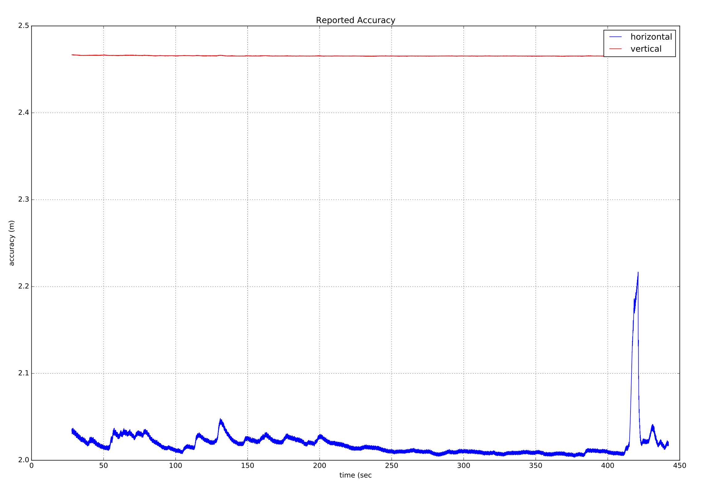

# 使用 ECL EKF

本文主要回答使用 ECL EKF 算法的常见问题。

:::tip
The [PX4 State Estimation Overview](https://youtu.be/HkYRJJoyBwQ) video from the *PX4 Developer Summit 2019* (Dr. Paul Riseborough) provides an overview of the estimator, and additionally describes both the major changes from 2018/2019, and the expected improvements through 2020.
:::

## 什么是 ecl EKF？

估计和控制库（ECL）使用扩展卡尔曼滤波算法（EKF）来处理传感器的测量信息，并提供如下状态量的估计值：

* 四元数定义从北，东，下局部地球坐标系到 X，Y，Z 机体坐标系的旋转
* IMU 的速度 - 北，东，地 \(m/s\)
* IMU 的位置 - 北，东，地 \(m\)
* IMU 增量角度偏差估计 - X, Y, Z \(rad\)
* IMU 增量速度偏差估计 - X, Y, Z\(m/s\)
* 地球磁场组分 - 北，东，地 \(gauss\)
* 飞行器机体坐标系磁场偏差 - X, Y, Z \(gauss\)
* 风速-北, 东\(m/s\)

EKF 在延迟的“融合时间范围”上运行，以允许相对于 IMU 的每次测量的不同时间延迟。 为了保证所有传感器数据都能在正确的时间内使用，每个传感器的数据都是按照先入先出（FIFO）队列进行缓存，并由EKF从缓存区中读取。 每个传感器的延迟补偿由 [EKF2 _*_ DELAY](../advanced_config/parameter_reference.md#ekf2) 参数控制。

互补滤波器用于使用缓冲的 IMU 数据将状态从“融合时间范围”向前传播到当前时间。 该滤波器的时间常数由 [EKF2_TAU_VEL](../advanced_config/parameter_reference.md#EKF2_TAU_VEL) 和 [EKF2_TAU_POS](../advanced_config/parameter_reference.md#EKF2_TAU_POS) 参数控制。

:::note
'融合时间范围'延迟和缓冲区长度由最大的 `EKF2_*_DELAY` 参数决定。 如果未使用传感器，建议将其时间延迟设置为零。 减少“融合时间范围”延迟减少了用于将状态向前传播到当前时间的互补滤波器中的误差。
:::

位置及速度状态变量在输出至控制回路之前会根据IMU与机体坐标系之间的偏差量进行修正。 IMU 相对于机体坐标系的位置由 `EKF2_IMU_POS_X,Y,Z` 参数设置。

EKF仅将IMU数据用于状态预测。 在EKF推导中，IMU数据不作为观测值使用。 使用 Matlab symbolic toolbox 推导得到用于进行协方差预测、状态更新、协方差更新的线性代数方程，相关内容详见： [Matlab Symbolic Derivation](https://github.com/PX4/ecl/blob/master/EKF/matlab/scripts/Inertial Nav EKF/GenerateNavFilterEquations.m).

## 它使用什么传感器测量值？

EKF 具有不同的操作模式，以允许不同的传感器测量组合。 滤波器在启动时会检查传感器的最小可行组合，并且在完成初始倾斜，偏航和高度对准之后，进入提供旋转，垂直速度，垂直位置，IMU 角度偏差和 IMU 速度偏差估计的模式。

此模式需要 IMU 数据，偏航源（磁力计或外部视觉）和高度数据源。 该数据集是所有EKF运行模式的最低需求数据。 Other sensor data can then be used to estimate additional states.

### IMU

* 三轴机体固连惯性测量单元，以最小100Hz的频率获取增量角度和增量速度数据 。 注意：在 EKF 使用它们之前，应该使用圆锥校正算法校正 IMU 增量角度数据。

### 磁力计

Three axis body fixed magnetometer data (or external vision system pose data) at a minimum rate of 5Hz is required. Magnetometer data can be used in two ways:

* 使用倾角估计和磁偏角将磁力计测量值转换为偏航角。 然后将该偏航角用作 EKF 的观察值。 该方法精度较低并且不允许学习机体坐标系场偏移，但是它对于磁场异常和大的初置陀螺偏差更有鲁棒性。 它是启动期间和在地面时的默认方法。
* XYZ 磁力计读数用作单独的观察值。 该方法更精确并且允许学习机体坐标系场偏移，但是它假设地球磁场环境只会缓慢变化，并且当存在显着的外部磁场异常时表现较差。

The logic used to select these modes is set by the [EKF2_MAG_TYPE](../advanced_config/parameter_reference.md#EKF2_MAG_TYPE) parameter.

The option is available to operate without a magnetometer, either by replacing it using [yaw from a dual antenna GPS](#yaw_measurements) or using the IMU measurements and GPS velocity data to [estimate yaw from vehicle movement](#yaw_from_gps_velocity).

### 高度

A source of height data - either GPS, barometric pressure, range finder or external vision at a minimum rate of 5Hz is required.

:::note
The primary source of height data is controlled by the [EKF2_HGT_MODE](../advanced_config/parameter_reference.md#EKF2_HGT_MODE) parameter.
:::

If these measurements are not present, the EKF will not start. When these measurements have been detected, the EKF will initialise the states and complete the tilt and yaw alignment. When tilt and yaw alignment is complete, the EKF can then transition to other modes of operation enabling use of additional sensor data:

#### 静态气压位置误差校正

Barometric pressure altitude is subject to errors generated by aerodynamic disturbances caused by vehicle wind relative velocity and orientation. This is known in aeronautics as *static pressure position error*. The EKF2 module that uses the ECL/EKF2 estimator library provides a method of compensating for these errors, provided wind speed state estimation is active.

For platforms operating in a fixed wing mode, wind speed state estimation requires either [Airspeed](#airspeed) and/or [Synthetic Sideslip](#synthetic-sideslip) fusion to be enabled.

For multi-rotors, fusion of [Drag Specific Forces](#mc_wind_estimation_using_drag) can be enabled and tuned to provide the required wind velocity state estimates.

The EKF2 module models the error as a body fixed ellipsoid that specifies the fraction of dynamic pressure that is added to/subtracted from the barometric pressure - before it is converted to a height estimate. See the following parameter documentation for information on how to use this feature:

* [EKF2_PCOEF_XP](../advanced_config/parameter_reference.md#EKF2_PCOEF_XP)
* [EKF2_PCOEF_XN](../advanced_config/parameter_reference.md#EKF2_PCOEF_XN)
* [EKF2_PCOEF_YP](../advanced_config/parameter_reference.md#EKF2_PCOEF_YP)
* [EKF2_PCOEF_YN](../advanced_config/parameter_reference.md#EKF2_PCOEF_YN)
* [EKF2_PCOEF_Z](../advanced_config/parameter_reference.md#EKF2_PCOEF_Z)

### GPS

#### 位置和速度测量

GPS measurements will be used for position and velocity if the following conditions are met:

* GPS use is enabled via setting of the [EKF2_AID_MASK](../advanced/parameter_reference.md#EKF2_AID_MASK) parameter.
* GPS 信号质量检查已通过。 These checks are controlled by the [EKF2_GPS_CHECK](../advanced/parameter_reference.md#EKF2_GPS_CHECK) and `EKF2\_REQ\_\*` parameters.
* The quality metric returned by the flow sensor is greater than the minimum requirement set by the [EKF2_OF_QMIN](../advanced/parameter_reference.md#EKF2_OF_QMIN) parameter.

#### 偏航角测量

Some GPS receivers such as the [Trimble MB-Two RTK GPS receiver](https://www.trimble.com/Precision-GNSS/MB-Two-Board.aspx) can be used to provide a heading measurement that replaces the use of magnetometer data. This can be a significant advantage when operating in an environment where large magnetic anomalies are present, or at latitudes here the earth's magnetic field has a high inclination. Use of GPS yaw measurements is enabled by setting bit position 7 to 1 (adding 128) in the [EKF2_AID_MASK](../advanced_config/parameter_reference.md#EKF2_AID_MASK) parameter.

#### 从 GPS 速度数据获取偏航角

The EKF runs an additional multi-hypothesis filter internally that uses multiple 3-state Extended Kalman Filters (EKF's) whose states are NE velocity and yaw angle. These individual yaw angle estimates are then combined using a Gaussian Sum Filter (GSF). The individual 3-state EKF's use IMU and GPS horizontal velocity data (plus optional airspeed data) and do not rely on any prior knowledge of the yaw angle or magnetometer measurements. This provides a backup to the yaw from the main filter and is used to reset the yaw for the main 24-state EKF when a post-takeoff loss of navigation indicates that the yaw estimate from the magnetometer is bad. This will result in an `Emergency yaw reset - magnetometer use stopped` message information message at the GCS.

Data from this estimator is logged when ekf2 replay logging is enabled and can be viewed in the `yaw_estimator_status` message. The individual yaw estimates from the individual 3-state EKF yaw estimators are in the `yaw` fields. The GSF combined yaw estimate is in the `yaw_composite` field. The variance for the GSF yaw estimate is in the `yaw_variance` field. All angles are in radians. Weightings applied by the GSF to the individual 3-state EKF outputs are in the`weight` fields.

This also makes it possible to operate without any magnetometer data or dual antenna GPS receiver for yaw provided some horizontal movement after takeoff can be performed to enable the yaw to become observable. To use this feature, set [EKF2_MAG_TYPE](../advanced_config/parameter_reference.md#EKF2_MAG_TYPE) to `none` (5) to disable magnetometer use. Once the vehicle has performed sufficient horizontal movement to make the yaw observable, the main 24-state EKF will align it's yaw to the GSF estimate and commence use of GPS.

#### 双 GPS 接收器

Data from GPS receivers can be blended using an algorithm that weights data based on reported accuracy (this works best if both receivers output data at the same rate and use the same accuracy). The mechanism also provides automatic failover if data from a receiver is lost (it allows, for example, a standard GPS to be used as a backup to a more accurate RTK receiver). This is controlled by the [EKF2_GPS_MASK](../advanced_config/parameter_reference.md#EKF2_GPS_MASK) parameter.

The [EKF2_GPS_MASK](../advanced_config/parameter_reference.md#EKF2_GPS_MASK) parameter is set by default to disable blending and always use the first receiver, so it will have to be set to select which receiver accuracy metrics are used to decide how much each receiver output contributes to the blended solution. Where different receiver models are used, it is important that the [EKF2_GPS_MASK](../advanced_config/parameter_reference.md#EKF2_GPS_MASK) parameter is set to a value that uses accuracy metrics that are supported by both receivers. For example do not set bit position 0 to `true` unless the drivers for both receivers publish values in the `s_variance_m_s` field of the `vehicle_gps_position` message that are comparable. This can be difficult with receivers from different manufacturers due to the different way that accuracy is defined, e.g. CEP vs 1-sigma, etc.

The following items should be checked during setup:

* 验证第二接收器的数据是否存在。 这些数据将记录为 `vehicle_gps_position_1` 消息，并且也可以通过命令 *nsh console* 登录终端，在连接后使用命令 `listener vehicle_gps_position -i 1` 进行检查。 [GPS_2_CONFIG](../advanced_config/parameter_reference.md#GPS_2_CONFIG) 参数需要被正确设置。
* 检查每个接收器的 `s_variance_m_s`, `eph` 和 `epv` 数据，并决定可以使用哪些精确度指标。 如果两个接收器都输出有意义的 `s_variance_m_s` 和 `eph` 数据， 并且 GPS 垂直位置数据不直接用于导航，建议设置 [EKF2_GPS_MASK](../advanced_config/parameter_reference.md#EKF2_GPS_MASK) 为 3。 在仅有 `eph` 数据可用并且两个接收器都不输出 `s_variance_m_s` 数据的地方，设置 [EKF2_GPS_MASK](../advanced_config/parameter_reference.md#EKF2_GPS_MASK) 为 2。 只有在 GPS 被选定为主高度数据源，并具有 [EKF2_HGT_MODE](../advanced_config/parameter_reference.md#EKF2_HGT_MODE) 参数，两个接收器都输出有意义的 `epv` 数据的情况下，第 2 位才会被设置。
* External vision system pose data will be used for yaw estimation if bit position 4 in the [EKF2_AID_MASK](../advanced/parameter_reference.md#EKF2_AID_MASK) parameter is true.
* 如果接收器以不同的频率输出, 混合输出的频率将是较低的接收器的频率。 在可能的情况下，接收器应配置为同样的输出频率。

#### GNSS Performance Requirements

For the ECL to accept GNSS data for navigation, certain minimum requirements need to be satisfied over a period of time, defined by [EKF2_REQ_GPS_H](../advanced_config/parameter_reference.md#EKF2_REQ_GPS_H) (10 seconds by default).

Minima are defined in the [EKF2_REQ_*](../advanced_config/parameter_reference.md#EKF2_REQ_EPH) parameters and each check can be en-/disabled using the [EKF2_GPS_CHECK](../advanced_config/parameter_reference.md#EKF2_GPS_CHECK) parameter.

The table below shows the different metrics directly reported or calculated from the GNSS data, and the minimum required values for the data to be used by ECL. In addition, the *Average Value* column shows typical values that might reasonably be obtained from a standard GNSS module (e.g. u-blox M8 series) - i.e. values that are considered good/acceptable.

| Metric               | Minimum required                                                                            | Average Value | 单位                          | 备注                                                                                                                                          |
| -------------------- | ------------------------------------------------------------------------------------------- | ------------- | --------------------------- | ------------------------------------------------------------------------------------------------------------------------------------------- |
| eph                  | <&nbsp;3 ([EKF2_REQ_EPH](../advanced_config/parameter_reference.md#EKF2_REQ_EPH))         | 0.8           | 米                           | 水平位置误差的标准偏差                                                                                                                                 |
| epv                  | <&nbsp;5 ([EKF2_REQ_EPV](../advanced_config/parameter_reference.md#EKF2_REQ_EPV))         | 1.5           | 米                           | 垂直位置误差的标准偏差                                                                                                                                 |
| Number of satellites | ≥6&nbsp;([EKF2_REQ_NSATS](../advanced_config/parameter_reference.md#EKF2_REQ_NSATS))      | 14            | -                           |                                                                                                                                             |
| sacc                 | <&nbsp;0.5 ([EKF2_REQ_SACC](../advanced_config/parameter_reference.md#EKF2_REQ_SACC))     | 0.2           | 米/秒                         | Standard deviation of horizontal speed error                                                                                                |
| fix type             | ≥&nbsp;3                                                                                    | 4             | -                           | 0-1: no fix, 2: 2D fix, 3: 3D fix, 4: RTCM code differential, 5: Real-Time Kinematic, float, 6: Real-Time Kinematic, fixed, 8: Extrapolated |
| PDOP                 | <&nbsp;2.5 ([EKF2_REQ_PDOP](../advanced_config/parameter_reference.md#EKF2_REQ_PDOP))     | 1.0           | -                           | Position dilution of precision                                                                                                              |
| hpos drift rate      | <&nbsp;0.1 ([EKF2_REQ_HDRIFT](../advanced_config/parameter_reference.md#EKF2_REQ_HDRIFT)) | 0.01          | 米/秒                         | Drift rate calculated from reported GNSS position (when stationary).                                                                        |
| vpos drift rate      | <&nbsp;0.2 ([EKF2_REQ_VDRIFT](../advanced_config/parameter_reference.md#EKF2_REQ_VDRIFT)) | 0.02          | 2\] Velocity NED \(m/s\) | Drift rate calculated from reported GNSS altitude (when stationary).                                                                        |
| hspd                 | <&nbsp;0.1 ([EKF2_REQ_HDRIFT](../advanced_config/parameter_reference.md#EKF2_REQ_HDRIFT)) | 0.01          | m/s                         | Filtered magnitude of reported GNSS horizontal velocity.                                                                                    |
| vspd                 | <&nbsp;0.2 ([EKF2_REQ_VDRIFT](../advanced_config/parameter_reference.md#EKF2_REQ_VDRIFT)) | 0.02          | m/s                         | Filtered magnitude of reported GNSS vertical velocity.                                                                                      |

:::note
The `hpos_drift_rate`, `vpos_drift_rate` and `hspd` are calculated over a period of 10 seconds and published in the `ekf2_gps_drift` topic. Note that `ekf2_gps_drift` is not logged!
:::

### 测距仪

Range finder distance to ground is used by a single state filter to estimate the vertical position of the terrain relative to the height datum.

If operating over a flat surface that can be used as a zero height datum, the range finder data can also be used directly by the EKF to estimate height by setting the [EKF2_HGT_MODE](../advanced_config/parameter_reference.md#EKF2_HGT_MODE) parameter to 2.

### 空速

Equivalent Airspeed (EAS) data can be used to estimate wind velocity and reduce drift when GPS is lost by setting [EKF2_ARSP_THR](../advanced_config/parameter_reference.md#EKF2_ARSP_THR) to a positive value. Airspeed data will be used when it exceeds the threshold set by a positive value for [EKF2_ARSP_THR](../advanced_config/parameter_reference.md#EKF2_ARSP_THR) and the vehicle type is not rotary wing.

### 合成侧滑

Fixed wing platforms can take advantage of an assumed sideslip observation of zero to improve wind speed estimation and also enable wind speed estimation without an airspeed sensor. This is enabled by setting the [EKF2_FUSE_BETA](../advanced_config/parameter_reference.md#EKF2_FUSE_BETA) parameter to 1.

### Drag Specific Forces

Multi-rotor platforms can take advantage of the relationship between airspeed and drag force along the X and Y body axes to estimate North/East components of wind velocity. This is enabled by setting bit position 5 in the [EKF2_AID_MASK](../advanced_config/parameter_reference.md#EKF2_AID_MASK) parameter to true. The relationship between airspeed and specific force (IMU acceleration) along the X and Y body axes is controlled by the [EKF2_BCOEF_X](../advanced_config/parameter_reference.md#EKF2_BCOEF_X) and [EKF2_BCOEF_Y](../advanced_config/parameter_reference.md#EKF2_BCOEF_Y) parameters which set the ballistic coefficients for flight in the X and Y directions respectively. The amount of specific force observation noise is set by the [EKF2_DRAG_NOISE](../advanced_config/parameter_reference.md#EKF2_DRAG_NOISE) parameter.

These can be tuned by flying the vehicle in [Position mode](../flight_modes/position_mc.md) repeatedly forwards/backwards between rest and maximum speed, adjusting [EKF2_BCOEF_X](../advanced_config/parameter_reference.md#EKF2_BCOEF_X) so that the corresponding innovation sequence in the `ekf2_innovations_0.drag_innov[0]` log message is minimised. This is then repeated for right/left movement with adjustment of [EKF2_BCOEF_Y](../advanced_config/parameter_reference.md#EKF2_BCOEF_Y) to minimise the `ekf2_innovations_0.drag_innov[1]` innovation sequence. Tuning is easier if this testing is conducted in still conditions.

If you are able to log data without dropouts from boot using [SDLOG_MODE = 1](../advanced_config/parameter_reference.md#SDLOG_MODE) and [SDLOG_PROFILE = 2](../advanced_config/parameter_reference.md#SDLOG_PROFILE), have access to the development environment, and are able to build code, then we recommended you fly *once* and perform the tuning on logs generated via [EKF2 Replay](../debug/system_wide_replay.md#ekf2-replay) of the flight data.

### 光流

[Optical flow](../sensor/optical_flow.md) data will be used if the following conditions are met:

* 有效的测距仪数据可用。
* The ecl EKF uses more RAM and flash space
* 光流传感器返回的质量度量值大于 [EKF2_OF_QMIN](../advanced_config/parameter_reference.md#EKF2_OF_QMIN) 参数设置的最低要求。

### 外部视觉系统

Position, velocity or orientation measurements from an external vision system, e.g. Vicon, can be used:

* The ecl EKF is able to fuse data from sensors with different time delays and data rates in a mathematically consistent way which improves accuracy during dynamic manoeuvres once time delay parameters are set correctly.
* External vision system vertical position data will be used if the [EKF2_HGT_MODE](../advanced/parameter_reference.md#EKF2_HGT_MODE) parameter is set to 3.
* External vision system horizontal position data will be used if bit position 3 in the [EKF2_AID_MASK](../advanced/parameter_reference.md#EKF2_AID_MASK) parameter is true.
* 如果 [EKF2_AID_MASK](../advanced_config/parameter_reference.md#EKF2_AID_MASK) 参数中的第 4 位为真，则外部视觉系统姿态数据将用于偏航估计。
* 如果 [EKF2_AID_MASK](../advanced_config/parameter_reference.md#EKF2_AID_MASK) 参数中的第 6 位为真，则外部视觉参考帧偏移将被估计并用于旋转外部视觉系统数据。

Either bit 4 (`EV_YAW`) or bit 6 (`EV_ROTATE`) should be set to true, but not both together. Following [EKF2_AID_MASK](../advanced_config/parameter_reference.md#EKF2_AID_MASK) values are supported when using with an external vision system.

| EKF_AID_MASK 值 | 设置位                           | 描述                                           |
| ---------------- | ----------------------------- | -------------------------------------------- |
| 321              | GPS + EV_VEL + ROTATE_EV    | 航向相关/以北为正(**Recommended**)                   |
| 73               | GPS + EV_POS + ROTATE_EV    | 航向相关/以北为正(*Not recommended*, 使用 `EV_VEL` 替代) |
| 24               | EV_POS + EV_YAW             | 航向相关/跟随外部视觉系统                                |
| 72               | EV_POS + ROTATE_EV          | 航向相关/以北为正                                    |
| 272              | EV_VEL + EV_YAW             | 航向相关/跟随外部视觉系统                                |
| 320              | EV_VEL + ROTATE_EV          | 航向相关/以北为正                                    |
| 280              | EV_POS + EV_VEL + EV_YAW    | 航向相关/跟随外部视觉系统                                |
| 328              | EV_POS + EV_VEL + ROTATE_EV | 航向相关/以北为正                                    |

The EKF considers uncertainty in the visual pose estimate. This uncertainty information can be sent via the covariance fields in the MAVLink [ODOMETRY](https://mavlink.io/en/messages/common.html#ODOMETRY) message or it can be set through the parameters [EKF2_EVP_NOISE](../advanced_config/parameter_reference.md#EKF2_EVP_NOISE), [EKF2_EVV_NOISE](../advanced_config/parameter_reference.md#EKF2_EVV_NOISE) and [EKF2_EVA_NOISE](../advanced_config/parameter_reference.md#EKF2_EVA_NOISE). You can choose the source of the uncertainty with [EKF2_EV_NOISE_MD](../advanced_config/parameter_reference.md#EKF2_EV_NOISE_MD).

## 我如何启用 'ecl' 库中的 EKF ？

Set the [SYS_MC_EST_GROUP](../advanced_config/parameter_reference.md#SYS_MC_EST_GROUP) parameter to 2 to use the ecl EKF.

## ecl EKF 和其它估计器相比的优点和缺点是什么？

Like all estimators, much of the performance comes from the tuning to match sensor characteristics. Tuning is a compromise between accuracy and robustness and although we have attempted to provide a tune that meets the needs of most users, there will be applications where tuning changes are required.

For this reason, no claims for accuracy relative to the legacy combination of `attitude_estimator_q` + `local_position_estimator` have been made and the best choice of estimator will depend on the application and tuning.

### 缺点

* ecl EKF 是一种复杂的算法，需要很好地理解扩展卡尔曼滤波器理论及其应用于导航中的问题才能成功调整。 因此，不知道怎么修改，用户就很难得到好结果。
* Local position output data is found in the [vehicle\_local\_position](https://github.com/PX4/Firmware/blob/master/msg/vehicle_local_position.msg) message.
* ecl EKF 使用更多的日志空间。

### 优点

* ecl EKF 能够以数学上一致的方式融合来自具有不同时间延迟和数据速率的传感器的数据，一旦正确设置时间延迟参数，就可以提高动态操作期间的准确性。
* ecl EKF 能够融合各种不同的传感器类型。
* 当 ecl EKF 检测并报告传感器数据中统计上显着的不一致性，将帮助诊断传感器错误。
* 对于固定翼飞机的操作，ecl EKF 可以使用或不使用空速传感器估计风速，并且能够将估计的风速与空速测量和侧滑假设结合使用，以延长 GPS 在飞行中丢失时的航位推算时间。
* ecl EKF估计3轴加速度计偏差，这提高了尾座式无人机和其它机体在飞行阶段之间经历大的姿态变化时的精度。
* The federated architecture \(combined attitude and position/velocity estimation\) means that attitude estimation benefits from all sensor measurements. 如果调整正确，这应该提供改善态度估计的潜力。

## 如何检查 EKF 性能？

EKF outputs, states and status data are published to a number of uORB topics which are logged to the SD card during flight. The following guide assumes that data has been logged using the *.ulog file format*. The **.ulog** format data can be parsed in python by using the [PX4 pyulog library](https://github.com/PX4/pyulog).

Most of the EKF data is found in the [estimator_innovations](https://github.com/PX4/PX4-Autopilot/blob/master/msg/estimator_innovations.msg) and [estimator\_status](https://github.com/PX4/PX4-Autopilot/blob/master/msg/estimator_status.msg) uORB messages that are logged to the .ulog file.

A python script that automatically generates analysis plots and metadata can be found [here](https://github.com/PX4/PX4-Autopilot/blob/master/Tools/ecl_ekf/process_logdata_ekf.py). To use this script file, cd to the `Tools/ecl_ekf` directory and enter `python process_logdata_ekf.py <log_file.ulg>`. This saves performance metadata in a csv file named **<log_file>.mdat.csv** and plots in a pdf file named `<log_file>.pdf`.

Multiple log files in a directory can be analysed using the [batch\_process\_logdata\_ekf.py](https://github.com/PX4/PX4-Autopilot/blob/master/Tools/ecl_ekf/batch_process_logdata_ekf.py) script. When this has been done, the performance metadata files can be processed to provide a statistical assessment of the estimator performance across the population of logs using the [batch\_process\_metadata\_ekf.py](https://github.com/PX4/PX4-Autopilot/blob/master/Tools/ecl_ekf/batch_process_metadata_ekf.py) script.

### 输出数据

* Attitude output data is found in the [vehicle\_attitude](https://github.com/PX4/Firmware/blob/master/msg/vehicle_attitude.msg) message.
* Global \(WGS-84\) output data is found in the [vehicle\_global\_position](https://github.com/PX4/Firmware/blob/master/msg/vehicle_global_position.msg) message.
* Wind velocity output data is found in the [wind\_estimate](https://github.com/PX4/Firmware/blob/master/msg/wind_estimate.msg) message.
* High frequency delta velocity vibration - [estimator\_status](https://github.com/PX4/Firmware/blob/master/msg/estimator_status.msg).vibe\[2\]

### 状态

Refer to states\[32\] in [estimator\_status](https://github.com/PX4/PX4-Autopilot/blob/master/msg/estimator_status.msg). The index map for states\[32\] is as follows:

* \[0 ... 3\] 四元数
* \[4 ... 6\] 速度 NED \(m/s\)
* \[7 ... 9\] 位置 NED \(m\)
* \[10 ... 12\] IMU 增量角度偏差 XYZ \(rad\)
* \[13 ... 15\] IMU 增量速度偏差 XYZ \(m/s\)
* \[16 ... 18\] 地球磁场 NED \(gauss\)
* \[19 ... 21\] 机体磁场 XYZ \(gauss\)
* \[22 ... 23\] 风速 NE \(m/s\)
* \[24 ... 32\] 未使用

### 状态变量

Refer to covariances\[28\] in [estimator\_status](https://github.com/PX4/PX4-Autopilot/blob/master/msg/estimator_status.msg). The index map for covariances\[28\] is as follows:

* \[0 ... 3\] 四元数
* \[4 ... 6\] 速度 NED \(m/s\)^2
* \[7 ... 9\] 位置 NED \(m^2\)
* \[10 ... 12\] IMU 增量角度偏差 XYZ \(rad^2\)
* \[13 ... 15\] IMU 增量速度偏差 XYZ \(m/s\)^2
* \[16 ... 18\] 地球磁场 NED \(gauss^2\)
* \[19 ... 21\] 机体磁场 XYZ \(gauss^2\)
* \[22 ... 23\] 风速 NE \(m/s\)^2
* \[24 ... 28\] 未使用

### Observation Innovations

The observation `estimator_innovations`, `estimator_innovation_variances`, and `estimator_innovation_test_ratios` message fields are defined in [estimator_innovations.msg](https://github.com/PX4/PX4-Autopilot/blob/master/msg/estimator_innovations.msg). The messages all have the same field names/types (but different units).

:::note
The messages have the same fields because they are generated from the same field definition. The `# TOPICS` line (at the end of [the file](https://github.com/PX4/PX4-Autopilot/blob/master/msg/estimator_innovations.msg)) lists the names of the set of messages to be created):

    # TOPICS estimator_innovations estimator_innovation_variances estimator_innovation_test_ratios
    

:::

Some of the observations are:

* \[0\] Angular tracking error magnitude \(rad\)
* 偏航角度 (rad, rad^2) : `heading`
* True Airspeed \(m/s\)^2 : Refer to airspeed\_innov\_var in [ekf2\_innovations](https://github.com/PX4/Firmware/blob/master/msg/ekf2_innovations.msg).
* Synthetic sideslip \(rad^2\) : Refer to beta\_innov\_var in [ekf2\_innovations](https://github.com/PX4/Firmware/blob/master/msg/ekf2_innovations.msg).
* Optical flow XY \(rad/sec\)^2 : Refer to flow\_innov\_var in [ekf2\_innovations](https://github.com/PX4/Firmware/blob/master/msg/ekf2_innovations.msg).
* Height above ground \(m^2\) : Refer to hagl\_innov\_var in [ekf2\_innovations](https://github.com/PX4/Firmware/blob/master/msg/ekf2_innovations.msg).
* 阻力比力 ((m/s)^2): `drag`
* 速度和位置新息：每个传感器

In addition, each sensor has its own fields for horizontal and vertical position and/or velocity values (where appropriate). These are largely self documenting, and are reproduced below:

    # GPS
    float32[2] gps_hvel # horizontal GPS velocity innovation (m/sec) and innovation variance ((m/sec)**2)
    float32    gps_vvel # vertical GPS velocity innovation (m/sec) and innovation variance ((m/sec)**2)
    float32[2] gps_hpos # horizontal GPS position innovation (m) and innovation variance (m**2)
    float32    gps_vpos # vertical GPS position innovation (m) and innovation variance (m**2)
    
    # External Vision
    float32[2] ev_hvel  # horizontal external vision velocity innovation (m/sec) and innovation variance ((m/sec)**2)
    float32    ev_vvel  # vertical external vision velocity innovation (m/sec) and innovation variance ((m/sec)**2)
    float32[2] ev_hpos  # horizontal external vision position innovation (m) and innovation variance (m**2)
    float32    ev_vpos  # vertical external vision position innovation (m) and innovation variance (m**2)
    
    # Fake Position and Velocity
    float32[2] fake_hvel  # fake horizontal velocity innovation (m/s) and innovation variance ((m/s)**2)
    float32    fake_vvel  # fake vertical velocity innovation (m/s) and innovation variance ((m/s)**2)
    float32[2] fake_hpos  # fake horizontal position innovation (m) and innovation variance (m**2)
    float32    fake_vpos  # fake vertical position innovation (m) and innovation variance (m**2)
    
    # Height sensors
    float32 rng_vpos  # range sensor height innovation (m) and innovation variance (m**2)
    float32 baro_vpos # barometer height innovation (m) and innovation variance (m**2)
    
    # Auxiliary velocity
    float32[2] aux_hvel # horizontal auxiliar velocity innovation from landing target measurement (m/sec) and innovation variance ((m/sec)**2)
    float32    aux_vvel # vertical auxiliar velocity innovation from landing target measurement (m/sec) and innovation variance ((m/sec)**2)
    

### 输出互补滤波器

The output complementary filter is used to propagate states forward from the fusion time horizon to current time. To check the magnitude of the angular, velocity and position tracking errors measured at the fusion time horizon, refer to `output_tracking_error[3]` in the `ekf2_innovations` message.

The index map is as follows:

* \[0\] 角度跟踪误差幅度 (rad)
* \[1\] Velocity tracking error magnitude \(m/s\). The velocity tracking time constant can be adjusted using the [EKF2_TAU_VEL](../advanced/parameter_reference.md#EKF2_TAU_VEL) parameter. 减小此参数可减少稳态误差，但会增加 NED 速度输出上的观察噪声量。
* \[2\] Position tracking error magnitude \(m\). The position tracking time constant can be adjusted using the [EKF2_TAU_POS](../advanced/parameter_reference.md#EKF2_TAU_POS) parameter. 减小此参数可减少稳态误差，但会增加 NED 位置输出上的观察噪声量。

### EKF 错误

The EKF contains internal error checking for badly conditioned state and covariance updates. Refer to the filter\_fault\_flags in [estimator\_status](https://github.com/PX4/PX4-Autopilot/blob/master/msg/estimator_status.msg).

### 观察错误

There are two categories of observation faults:

* 数据丢失。 一个例子是测距仪无法提供返回数据。
* 新息，即状态预测和传感器观察之间的差异过度。 这种情况的一个例子是过度振动导致大的垂直位置误差，导致气压计高度测量被拒绝。

Both of these can result in observation data being rejected for long enough to cause the EKF to attempt a reset of the states using the sensor observations. All observations have a statistical confidence checks applied to the innovations. The number of standard deviations for the check are controlled by the `EKF2_*_GATE` parameter for each observation type.

Test levels are available in [estimator\_status](https://github.com/PX4/PX4-Autopilot/blob/master/msg/estimator_status.msg) as follows:

* mag\_test\_ratio : ratio of the largest magnetometer innovation component to the innovation test limit
* State variances \(diagonals in the covariance matrix\) are constrained to be non-negative.
* pos\_test\_ratio : ratio of the largest horizontal position innovation component to the innovation test limit
* hgt\_test\_ratio : ratio of the vertical position innovation to the innovation test limit
* tas\_test\_ratio : ratio of the true airspeed innovation to the innovation test limit
* vel\_test\_ratio : ratio of the largest velocity innovation component to the innovation test limit

For a binary pass/fail summary for each sensor, refer to innovation\_check\_flags in [estimator\_status](https://github.com/PX4/PX4-Autopilot/blob/master/msg/estimator_status.msg).

### GPS 数据质量检查

The EKF applies a number of GPS quality checks before commencing GPS aiding. These checks are controlled by the [EKF2_GPS_CHECK](../advanced_config/parameter_reference.md#EKF2_GPS_CHECK) and `EKF2_REQ_*` parameters. The pass/fail status for these checks is logged in the [estimator_status](https://github.com/PX4/PX4-Autopilot/blob/master/msg/estimator_status.msg).gps\_check\_fail\_flags message. This integer will be zero when all required GPS checks have passed. If the EKF is not commencing GPS alignment, check the value of the integer against the bitmask definition `gps_check_fail_flags` in [estimator_status](https://github.com/PX4/PX4-Autopilot/blob/master/msg/estimator_status.msg).

### EKF 数值误差

The EKF uses single precision floating point operations for all of its computations and first order approximations for derivation of the covariance prediction and update equations in order to reduce processing requirements. This means that it is possible when re-tuning the EKF to encounter conditions where the covariance matrix operations become badly conditioned enough to cause divergence or significant errors in the state estimates.

To prevent this, every covariance and state update step contains the following error detection and correction steps:

* If the innovation variance is less than the observation variance \(this requires a negative state variance which is impossible\) or the covariance update will produce a negative variance for any of the states, then: 
  * 跳过状态和协方差更新
  * 协方差矩阵中的相应行和列被重置
  * The failure is recorded in the [estimator\_status](https://github.com/PX4/Firmware/blob/master/msg/estimator_status.msg) filter\_fault\_flags message
* [estimator\_status](https://github.com/PX4/Firmware/blob/master/msg/estimator_status.msg).hgt\_test\_ratio will be greater than 1.0
* 状态方差应用数值上限。
* 协方差矩阵强制对称。

After re-tuning the filter, particularly re-tuning that involve reducing the noise variables, the value of `estimator_status.gps_check_fail_flags` should be checked to ensure that it remains zero.

## 如果高度估计值发散了怎么办?

The most common cause of EKF height diverging away from GPS and altimeter measurements during flight is clipping and/or aliasing of the IMU measurements caused by vibration. If this is occurring, then the following signs should be evident in the data

* [ekf2\_innovations](https://github.com/PX4/Firmware/blob/master/msg/ekf2_innovations.msg).vel\_pos\_innov\[2\] and [ekf2\_innovations](https://github.com/PX4/Firmware/blob/master/msg/ekf2_innovations.msg).vel\_pos\_innov\[5\] will both have the same sign.
* Plot the height innovation test ratio - [estimator\_status](https://github.com/PX4/Firmware/blob/master/msg/estimator_status.msg).hgt\_test\_ratio

The recommended first step is to ensure that the autopilot is isolated from the airframe using an effective isolation mounting system. An isolation mount has 6 degrees of freedom, and therefore 6 resonant frequencies. As a general rule, the 6 resonant frequencies of the autopilot on the isolation mount should be above 25Hz to avoid interaction with the autopilot dynamics and below the frequency of the motors.

An isolation mount can make vibration worse if the resonant frequencies coincide with motor or propeller blade passage frequencies.

The EKF can be made more resistant to vibration induced height divergence by making the following parameter changes:

* 将主要的高度传感器的新息通道的值加倍。 If using barometric height this is [EKF2_BARO_GATE](../advanced/parameter_reference.md#EKF2_BARO_GATE).
* Increase the value of [EKF2_ACC_NOISE](../advanced/parameter_reference.md#EKF2_ACC_NOISE) to 0.5 initially. 如果仍然出现发散，则进一步增加 0.1，但不要超过 1.0。

Note that the effect of these changes will make the EKF more sensitive to errors in GPS vertical velocity and barometric pressure.

## 如果位置估计发散了应该怎么办?

The most common causes of position divergence are:

* 高振动级别。 
  * 通过改进无人机的机械隔离来解决。
  * 增加 [EKF2_ACC_NOISE](../advanced_config/parameter_reference.md#EKF2_ACC_NOISE) 和 [EKF2_GYR_NOISE](../advanced_config/parameter_reference.md#EKF2_GYR_NOISE) 的值会有所帮助，但确实会使 EKF 更容易受到 GPS 故障的影响。
* 过大的陀螺仪偏差偏移。 
  * 通过重新校准陀螺仪来修复。 Check for excessive temperature sensitivity (&gt; 3 deg/sec bias change during warm-up from a cold start and replace the sensor if affected of insulate to slow the rate of temperature change.
* 不好的偏航对齐 
  * 检查磁力计校准和对齐。
  * Check the heading shown QGC is within 15 deg truth
* GPS 精度差 
  * 检查是否有干扰
  * 改善隔离和屏蔽
  * 检查飞行位置是否有 GPS 信号障碍物和反射器（附近的高层建筑）
* GPS 数据丢失

Determining which of these is the primary cause requires a methodical approach to analysis of the EKF log data:

* Plot the velocity innovation test ratio - [estimator\_status](https://github.com/PX4/Firmware/blob/master/msg/estimator_status.msg).vel\_test\_ratio
* Plot the horizontal position innovation test ratio - [estimator\_status](https://github.com/PX4/Firmware/blob/master/msg/estimator_status.msg).pos\_test\_ratio
* Plot the magnetometer innovation test ratio - [estimator\_status](https://github.com/PX4/Firmware/blob/master/msg/estimator_status.msg).mag\_test\_ratio
* Magnetometer XYZ \(gauss\) : Refer to mag\_innov\[3\] in [ekf2\_innovations](https://github.com/PX4/Firmware/blob/master/msg/ekf2_innovations.msg).
* 绘制 GPS 接收器报告的速度精度-[vehicle\_gps\_position](https://github.com/PX4/PX4-Autopilot/blob/master/msg/vehicle_gps_position.msg).s\_variance\_m\_s
* Plot the IMU delta angle state estimates - [estimator\_status](https://github.com/PX4/Firmware/blob/master/msg/estimator_status.msg).states\[10\], states\[11\] and states\[12\]
* 绘制 EKF 内部高频振动指标： 
  * Delta angle coning vibration - [estimator\_status](https://github.com/PX4/Firmware/blob/master/msg/estimator_status.msg).vibe\[0\]
  * High frequency delta angle vibration - [estimator\_status](https://github.com/PX4/Firmware/blob/master/msg/estimator_status.msg).vibe\[1\]
  * 高频增量速度振动 - [estimator_status](https://github.com/PX4/PX4-Autopilot/blob/master/msg/estimator_status.msg).vibe\[2\]

During normal operation, all the test ratios should remain below 0.5 with only occasional spikes above this as shown in the example below from a successful flight:

The following plot shows the EKF vibration metrics for a multirotor with good isolation. The landing shock and the increased vibration during takeoff and landing can be seen. Insufficient data has been gathered with these metrics to provide specific advice on maximum thresholds.

The above vibration metrics are of limited value as the presence of vibration at a frequency close to the IMU sampling frequency (1 kHz for most boards) will cause offsets to appear in the data that do not show up in the high frequency vibration metrics. The only way to detect aliasing errors is in their effect on inertial navigation accuracy and the rise in innovation levels.

In addition to generating large position and velocity test ratios of &gt; 1.0, the different error mechanisms affect the other test ratios in different ways:

### 振动过大的测定

High vibration levels normally affect vertical position and velocity innovations as well as the horizontal components. Magnetometer test levels are only affected to a small extent.

\(insert example plots showing bad vibration here\)

### 过度陀螺偏差的测定

Large gyro bias offsets are normally characterised by a change in the value of delta angle bias greater than 5E-4 during flight (equivalent to ~3 deg/sec) and can also cause a large increase in the magnetometer test ratio if the yaw axis is affected. Height is normally unaffected other than extreme cases. Switch on bias value of up to 5 deg/sec can be tolerated provided the filter is given time settle before flying. Pre-flight checks performed by the commander should prevent arming if the position is diverging.

\(insert example plots showing bad gyro bias here\)

### 确定较差的偏航精度

Bad yaw alignment causes a velocity test ratio that increases rapidly when the vehicle starts moving due inconsistency in the direction of velocity calculated by the inertial nav and the GPS measurement. Magnetometer innovations are slightly affected. Height is normally unaffected.

\(insert example plots showing bad yaw alignment here\)

### GPS 数据精度差的确定

Poor GPS accuracy is normally accompanied by a rise in the reported velocity error of the receiver in conjunction with a rise in innovations. Transient errors due to multipath, obscuration and interference are more common causes. Here is an example of a temporary loss of GPS accuracy where the multi-rotor started drifting away from its loiter location and had to be corrected using the sticks. The rise in [estimator_status](https://github.com/PX4/PX4-Autopilot/blob/master/msg/estimator_status.msg).vel\_test\_ratio to greater than 1 indicates the GPs velocity was inconsistent with other measurements and has been rejected.

This is accompanied with rise in the GPS receivers reported velocity accuracy which indicates that it was likely a GPS error.

If we also look at the GPS horizontal velocity innovations and innovation variances, we can see the large spike in North velocity innovation that accompanies this GPS 'glitch' event.

### GPS 数据丢失的确定

Loss of GPS data will be shown by the velocity and position innovation test ratios 'flat-lining'. If this occurs, check the other GPS status data in `vehicle_gps_position` for further information.

The following plot shows the NED GPS velocity innovations `ekf2_innovations_0.vel_pos_innov[0 ... 2]`, the GPS NE position innovations `ekf2_innovations_0.vel_pos_innov[3 ... 4]` and the Baro vertical position innovation `ekf2_innovations_0.vel_pos_innov[5]` generated from a simulated VTOL flight using SITL Gazebo.

The simulated GPS was made to lose lock at 73 seconds. Note the NED velocity innovations and NE position innovations 'flat-line' after GPS is lost. Note that after 10 seconds without GPS data, the EKF reverts back to a static position mode using the last known position and the NE position innovations start to change again.

### 气压计地面效果补偿

If the vehicle has the tendency during landing to climb back into the air when close to the ground, the most likely cause is barometer ground effect.

This is caused when air pushed down by the propellers hits the ground and creates a high pressure zone below the drone. The result is a lower reading of pressure altitude, leading to an unwanted climb being commanded. The figure below shows a typical situation where the ground effect is present. Note how the barometer signal dips at the beginning and end of the flight.

You can enable *ground effect compensation* to fix this problem:

* 从绘图中估算出气压计在起飞或着陆期间的跌落程度。 在上面的绘图中，人们可以看到降落过程中大约6米的气压计下沉。
* 然后将参数 [EKF2_GND_EFF_DZ](../advanced_config/parameter_reference.md#EKF2_GND_EFF_DZ) 设置为该值，并添加 10% 的余量值。 因此，在这种情况下，6.6米的数值将是一个良好的起点。

If a terrain estimate is available (e.g. the vehicle is equipped with a range finder) then you can additionally specify [EKF2_GND_MAX_HGT](../advanced_config/parameter_reference.md#EKF2_GND_MAX_HGT), the above ground-level altitude below which ground effect compensation should be activated. If no terrain estimate is available this parameter will have no effect and the system will use heuristics to determine if ground effect compensation should be activated.

## 更多信息

* [PX4 状态估计概述视频](https://youtu.be/HkYRJJoyBwQ)，*PX4 开发者峰会 2019*， (Dr. Paul Riseborough) 对状态估计器进行了概述，并且还进一步介绍了2018/19年以来的重大变化以及2019年期间计划的改进措施。