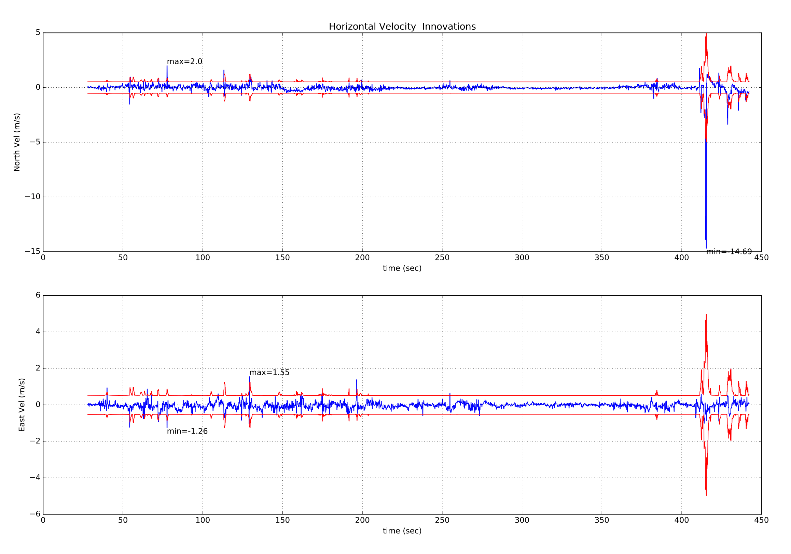

# 使用 ECL EKF

本文主要回答使用 ECL EKF 算法的常见问题。

:::tip
[PX4 State Estimation Overview](https://youtu.be/HkYRJJoyBwQ) 视频来自 *PX4 Developer Summit 2019* (Dr. Paul Riseborough) 概要介绍了估计器，并另外说明了2018/2019年的主要变化以及2020年的预期改进。
:::

## 什么是 ecl EKF？

估计和控制库（ECL）使用扩展卡尔曼滤波算法（EKF）来处理传感器的测量信息，并提供如下状态量的估计值：

* 四元数定义从北，东，地局部地球坐标系到 X，Y，Z 机体坐标系的旋转
* IMU 处的速度 - 北，东，地 \(m/s)
* IMU 处的位置 - 北，东，地 \(m)
* IMU 增量角度偏差估计 - X, Y, Z \(rad)
* IMU 增量速度偏差估计 - X, Y, Z\(m/s)
* 地球磁场组分 - 北，东，地 \(gauss\)
* 飞行器机体坐标系磁场偏差 - X, Y, Z \(gauss\)
* 风速-北, 东\(m/s\)

EKF 在延迟的“融合时间范围”上运行，以允许相对于 IMU 的每次测量的不同时间延迟。 为了保证所有传感器数据都能在正确的时间内使用，每个传感器的数据都是按照先入先出（FIFO）队列进行缓存，并由EKF从缓存区中读取。 每个传感器的延迟补偿由 [EKF2 _*_ DELAY](../advanced_config/parameter_reference.md#ekf2) 参数控制。

互补滤波器用于使用缓冲的 IMU 数据将状态从“融合时间范围”向前传播到当前时间。 该滤波器的时间常数由 [EKF2_TAU_VEL](../advanced_config/parameter_reference.md#EKF2_TAU_VEL) 和 [EKF2_TAU_POS](../advanced_config/parameter_reference.md#EKF2_TAU_POS) 参数控制。

:::note
'融合时间范围'延迟和缓冲区长度由最大的 `EKF2_*_DELAY` 参数决定。 如果未使用传感器，建议将其时间延迟设置为零。 减少“融合时间范围”延迟减少了用于将状态向前传播到当前时间的互补滤波器中的误差。
:::

位置及速度状态变量在输出至控制回路之前会根据IMU与机体坐标系之间的偏差量进行修正。 IMU 相对于机体坐标系的位置由 `EKF2_IMU_POS_X,Y,Z` 参数设置。

EKF仅将IMU数据用于状态预测。 在EKF推导中，IMU数据不作为观测值使用。 使用Matlab符号工具箱导出了协方差预测、状态更新和协方差更新的代数方程，该工具箱可在这里找到：[Matlab Symbolic Derivation](https://github.com/PX4/PX4-ECL/blob/master/EKF/matlab/scripts/Terrain%20Estimator/GenerateEquationsTerrainEstimator.m)。

## 运行单个EKF实例

*默认行为* 是运行一个 EKF 的单个实例。 在这种情况下，在EKF收到数据之前执行传感器选择和故障切换。 这为防止有限数量的传感器故障，如数据丢失等，提供了保护。 但不能防止传感器提供的不准确数据超过EKF和控制循环的补偿能力。

运行单个EKF实例的参数设置为：

* [EKF2_MULTI_IMU](../advanced_config/parameter_reference.md#EKF2_MULTI_IMU) = 0
* [EKF2_MULTI_MAG](../advanced_config/parameter_reference.md#EKF2_MULTI_MAG) = 0
* [SENS_IMU_MODE](../advanced_config/parameter_reference.md#SENS_IMU_MODE) = 1
* [SENS_MAG_MODE](../advanced_config/parameter_reference.md#SENS_MAG_MODE) = 1

## 运行多个EKF实例

根据IMU和磁强计的数量以及自动驾驶仪的CPU能力，EKF可以运行多个实例。 这提供了一系列更广泛的传感器错误的保护，每个EKF实例使用不同的传感器组合实现了这一点。 通过比较每个EKF实例的内部一致性，EKF选择器能够确定具有最佳数据一致性的EKF和传感器组合。 这样可以检测和隔离IMU偏差、饱和或数据卡住等故障。

EKF实例总数是由 [EKF2_MULTI_IMU](../advanced_config/parameter_reference.md#EKF2_MULTI_IMU) 和 [EKF2_MULTI_MAG](../advanced_config/parameter_reference.md#EKF2_MULTI_MAG) 所选择的IMU数量和磁强计数量的乘积，由以下公式给出：

> N_instances = MAX([EKF2_MULTI_IMU](../advanced_config/parameter_reference.md#EKF2_MULTI_IMU) , 1) x MAX([EKF2_MULTI_MAG](../advanced_config/parameter_reference.md#EKF2_MULTI_MAG) , 1)

例如，一个带有 2 个IMU和 2 个磁强计的自动化驾驶仪可以在 EKF2_MULTI_IMU = 2 和 EKF2_MULTI_MAG = 2 的情况下运行，总共 4 个EKF实例，其中每个实例使用以下传感器组合：

* EKF instance 1 : IMU 1, magnetometer 1
* EKF instance 2 : IMU 1, magnetometer 2
* EKF instance 3 : IMU 2, magnetometer 1
* EKF instance 4 : IMU 2, magnetometer 2

可处理的IMU或磁强计传感器的最大数量为每种传感器有4个，因此理论上最大有 4 x 4 = 16 个EKF实例。 实际上，这种做法受到现有计算资源的限制。 在开发这一功能的过程中，使用基于STM32F7的硬件的CPU进行测试，结果显示 4 个EKF实例具有可接受的处理负载和内存利用率裕度。

:::警告 应在飞行前进行地面测试以检查 CPU 和内存使用。
:::

如果 [EKF2_MULTI_IMU](../advanced_config/parameter_reference.md#EKF2_MULTI_IMU) >= 3 ，则大速率陀螺错误的故障切换时间将进一步缩短，因为EKF选择器能够应用中值选择策略以更快地隔离故障IMU。

多EKF实例的设置由以下参数控制：

* [SENS_IMU_MODE](../advanced_config/parameter_reference.md#SENS_IMU_MODE): 如果在具有IMU传感器多样性情况下运行多个EKF实例，即 [EKF2_MULTI_IMU](../advanced_config/parameter_reference.md#EKF2_MULTI_IMU) > 1，则设置为 0。
  
  当设置为 1 (单个EKF 操作默认值)时，传感器模块选择EKF使用的IMU 数据。 这种保护可防止来自传感器的数据丢失，但并不能防止不良的传感器数据。 当设置为 0 时，传感器模块不进行选择。

* [SENS_MAG_MODE](../advanced_config/parameter_reference.md#SENS_MAG_MODE): 如果在具有磁强计传感器多样性情况下运行多个的EKF实例，即 [EKF2_MULTI_MAG](../advanced_config/parameter_reference.md#EKF2_MULTI_MAG) > 1，则设置为 0。
  
  当设置为 1 (单个EKF 操作默认值)时，传感器模块选择EKF使用的磁强计数据。 这种保护可防止来自传感器的数据丢失，但并不能防止不良的传感器数据。 当设置为 0 时，传感器模块不进行选择。

* [EKF2_MULTI_IMU](../advanced_config/parameter_reference.md#EKF2_MULTI_IMU): 此参数指定了多个EKF实例使用的 IMU 传感器数量。 如果 `EKF2_MULTI_IMU` <= 1, 那么只会使用第一个IMU 传感器。 当 [SENS_IMU_MODE](../advanced_config/parameter_reference.md#SENS_IMU_MODE) = 1, 这将是传感器模块选择的传感器。 如果 `EKF2_MULTI_IMU` >= 2 ，则一个单独的EKF实例将运行于指定数量的IMU传感器，最多不超过 4 个或目前的IMU数量。

* [EKF2_MULTI_MAG](../advanced_config/parameter_reference.md#EKF2_MULTI_MAG): 此参数指定了多个EKF实例使用的磁强计传感器数量。 如果 `EKF2_MULTI_MAG` <= 1 ，则只会使用第一个磁强计传感器。 当 [SENS_MAG_MODE](../advanced_config/parameter_reference.md#SENS_MAG_MODE) = 1 ，这将是传感器模块选择的传感器。 如果 `EKF2_MULTI_MAG` >= 2 ，则一个单独的EKF实例将运行于指定数量的磁强计传感器，最多不超过 4 个或目前的磁强计数量。

::: 注释 不支持多个EKF实例的飞行日志的录制和 [EKF2 replay](../debug/system_wide_replay.md#ekf2-replay) 。 若要启用 EKF 重播录音，你必须设置参数以启用 [single EKF instance](#running-a-single-ekf-instance) 。
:::

## 它使用什么传感器测量值？

EKF 具有不同的操作模式，以允许不同的传感器测量组合。 滤波器在启动时会检查传感器的最小可行组合，并且在完成初始倾斜，偏航和高度对准之后，进入提供旋转，垂直速度，垂直位置，IMU 增量角度偏差和 IMU 增量速度偏差估计的模式。

此模式需要 IMU 数据，一个偏航源（磁力计或外部视觉）和一个高度数据源。 所有EKF操作模式都需要这个最小数据集。 在此基础上可以使用其它传感器数据来估计额外的状态变量。

### IMU

* 三轴机体固连惯性测量单元，以最小100Hz的频率获取增量角度和增量速度数据 。 注意：在 EKF 使用它们之前，应该使用圆锥校正算法校正 IMU 增量角度数据。

### 磁力计

需要以最小 5Hz 的速率的三轴机体固连磁力计数据（或外部视觉系统姿势数据）。 磁力计数据可以用于两种方式：

* 使用倾角估计和磁偏角将磁力计测量值转换为偏航角。 然后将该偏航角用作 EKF 的观测值。 该方法精度较低并且不允许学习机体坐标系场偏移，但是它对于磁场异常和大的初置陀螺偏差更有鲁棒性。 它是启动期间和在地面时的默认方法。
* XYZ 磁力计读数用作单独的观测值。 该方法更精确并且允许学习机体坐标系场偏移，但是它假设地球磁场环境只会缓慢变化，并且当存在显着的外部磁场异常时表现较差。

用于选择这些模式的逻辑由 [EKF2_MAG_TYPE](../advanced_config/parameter_reference.md#EKF2_MAG_TYPE) 参数设置。

该选项可以在没有磁力计的情况下运行。 或者使用 [yaw from a dual antenna GPS](#yaw_measurements) 来替换磁力计，或者使用IMU测量数据和GPS速度数据从飞行器运动中估计偏航 [estimate yaw from vehicle movement](#yaw_from_gps_velocity)。

### 高度

高度数据源 - 来自 GPS，气压计，测距仪或外部视觉设备，需要最小频率为 5Hz。

:::注释 高度数据的主要来源由 [EKF2_HGT_MODE](../advanced_config/parameter_reference.md#EKF2_HGT_MODE) 参数控制。
:::

如果不存在这些测量值，EKF 将无法启动。 当检测到这些测量值时，EKF 将初始化状态并完成倾角和偏航对准。 当倾角和偏航对齐完成后，EKF 可以转换到其它操作模式，从而可以使用其它传感器数据：

#### 静态气压位置误差校正

气压表示的海拔高度因机体风的相对速度和方向造成的空气动力扰动而发生误差。 这在航空学中被称为*静态气压位置误差*。 使用ECL/EKF2估计器库的EKF2模块提供了补偿这些误差的方法，只要风速状态估计是激活的。

对于固定翼式模式运行平台， 风速状态估计需要启用 [Airspeage](#airspeed) 或 [Synthetic Sideslip](#synthetic-sideslip) 聚合。

对于多旋翼飞行器，可以启用并调整 [Drag Specific Forces](#mc_wind_estimation_using_drag) 的融合，以提供所需风速状态估计。

EKF2模块将误差建模为与机体固连的椭球体，在将其转换为高度估计之前，它指定了从大气气压中加/减的动态气压的分量。 关于如何使用此功能的信息，请参阅以下参数文档：

* [EKF2_PCOEF_XP](../advanced_config/parameter_reference.md#EKF2_PCOEF_XP)
* [EKF2_PCOEF_XN](../advanced_config/parameter_reference.md#EKF2_PCOEF_XN)
* [EKF2_PCOEF_YP](../advanced_config/parameter_reference.md#EKF2_PCOEF_YP)
* [EKF2_PCOEF_YN](../advanced_config/parameter_reference.md#EKF2_PCOEF_YN)
* [EKF2_PCOEF_Z](../advanced_config/parameter_reference.md#EKF2_PCOEF_Z)

### GPS

#### 位置和速度测量

如果满足以下条件，GPS 测量值将做为位置和速度使用：

* 通过设置 [EKF2_AID_MASK](../advanced_config/parameter_reference.md#EKF2_AID_MASK) 参数启用 GPS 的使用。
* GPS 信号质量检查已通过。 这些检查由 [EKF2_GPS_CHECK](../advanced_config/parameter_reference.md#EKF2_GPS_CHECK) 和 `EKF2_REQ_*` 参数控制。
* 通过设置 [EKF2_HGT_MODE](../advanced_config/parameter_reference.md#EKF2_HGT_MODE) 参数，EKF 可以直接使用 GPS 高度。

#### 偏航角测量

有一些全球定位系统接收器，例如[Trimble MB-Two RTK GPS receiver](https://www.trimble.com/Precision-GNSS/MB-Two-Board.aspx)，可用来提供一个偏航角测量，以取代磁强计数据的使用。 在存在大型磁场异常的环境中工作时，或在高纬度地区，地球磁场具有很大的倾斜角时，这可能是一个重要的优势。 通过在 [EKF2_AID_MASK](../advanced_config/parameter_reference.md#EKF2_AID_MASK) 参数中设置第7位为1 (或操作128)，就启用了 GPS 偏航角测量功能。

#### 从 GPS 速度数据获取偏航角

EKF在内部运行一个附加的多假设滤波器，它使用多个3-状态\---北/东向（N/E）的速度和偏航角\---的扩展卡尔曼滤波器（EKF）。 然后使用高斯加和滤波器（GSF）合并这些偏航角的估计值。 单个3-状态的EKF使用了IMU和GPS水平速度数据（加上可选的空速数据），而不依赖于事先对偏航角或磁强计测量有任何了解。 这里提供了一个对于主滤波器的偏航角备份，当起飞后导航丢失，表明磁力计的偏航估计值不好时，它被用于重置主 EKF 滤波器的24-状态的中的偏航数据。 其结果是一个 `Emergency yaw reset - magnetometer use stopped` 消息被发送给 GCS。

当启用 ekf2 重播日志时，此估计器的数据将被记录下来，可以在 `yaw_estimator_status` 消息中查看。 从单个3-状态的EKF的偏航估计器得到的单个偏航估计值保存在 `yaw` 字段中。 GSF 合并的偏航角估计保存在 `yaw_composite` 字段中。 GSF 估计的偏航角的方差保存在`yaw_variance` 字段中。 所有角度的单位均为弧度。 GSF对单个3-状态EKF输出的加权保存在`weight`字段中。

这也使得 ECL 能够在没有任何磁力计、或没有双天线 GPS 接收器的情况下运行，并提供偏航数据，只要起飞后能够进行某种水平的移动，偏航数据就变得可观测。 若要使用此功能，设置 [EKF2_MAG_TYPE](../advanced_config/parameter_reference.md#EKF2_MAG_TYPE) 为 `none` (5)以禁用磁力计。 一旦机体完成了足够的水平移动，使偏航角可观测， 24-状态的主EKF将使其偏航角与GSF的估计值对齐，并开始使用 GPS。

#### 双 GPS 接收器

GPS接收器提供的数据可以用基于所报告数据的精确度的加权算法混合（如果两者都以相同的速度输出数据并使用相同的精确度，这样做效果最好）。 如果来自接收器的数据丢失，该机制还提供了自动故障转移，（例如，它允许使用标准 GPS 作为更精确的 RTK 接收器的备份）。 这是由 [SENS_GPS_MASK](../advanced_config/parameter_reference.md#SENS_GPS_MASK) 参数控制的。

[SENS_GPS_MASK](../advanced_config/parameter_reference.md#SENS_GPS_MASK) 参数默认设置为禁用混合，并且总是使用第一个接收器， 因此必须设置它，以选择使用哪个接收器准确度指标，以决定每个接收器输出对混合解决方案有多大贡献。 当使用不同型号的接收器时， 重要的是，将 [SENS_GPS_MASK](../advanced_config/parameter_reference.md#SENS_GPS_MASK) 参数设置为两个接收器都支持的精确度量值。 例如，除非两个接收器的驱动程序在 `vehicle_gps_position` 消息中的 `s_variance_m_s` 字段中发布具有可比性的值，否则不要将第 0 位设置为 `true` 。 由于精确度定义方法不同，例如 CEP 对比 1-sigma 等等，不同制造商的接收器可能很难做到这一点。

在设置过程中应检查以下条目：

* 验证第二接收器的数据是否存在。 This will be logged as `vehicle_gps_position_1` and can also be checked when connected via the *nsh console* using the command `listener vehicle_gps_position -i 1`. The [GPS_2_CONFIG](../advanced_config/parameter_reference.md#GPS_2_CONFIG) parameter will need to be set correctly.
* Check the `s_variance_m_s`, `eph` and `epv` data from each receiver and decide which accuracy metrics can be used. If both receivers output sensible `s_variance_m_s` and `eph` data, and GPS vertical position is not being used directly for navigation, then setting [SENS_GPS_MASK](../advanced_config/parameter_reference.md#SENS_GPS_MASK) to 3 is recommended. Where only `eph` data is available and both receivers do not output `s_variance_m_s` data, set [SENS_GPS_MASK](../advanced_config/parameter_reference.md#SENS_GPS_MASK) to 2. Bit position 2 would only be set if the GPS had been selected as a primary height source with the [EKF2_HGT_MODE](../advanced_config/parameter_reference.md#EKF2_HGT_MODE) parameter and both receivers output sensible `epv` data.
* The output from the blended receiver data is logged as `ekf_gps_position`, and can be checked whilst connect via the nsh terminal using the command `listener ekf_gps_position`.
* Where receivers output at different rates, the blended output will be at the rate of slower receiver. Where possible receivers should be configured to output at the same rate.

#### 全球导航卫星系统性能要求

For the ECL to accept GNSS data for navigation, certain minimum requirements need to be satisfied over a period of time, defined by [EKF2_REQ_GPS_H](../advanced_config/parameter_reference.md#EKF2_REQ_GPS_H) (10 seconds by default).

Minima are defined in the [EKF2_REQ_*](../advanced_config/parameter_reference.md#EKF2_REQ_EPH) parameters and each check can be en-/disabled using the [EKF2_GPS_CHECK](../advanced_config/parameter_reference.md#EKF2_GPS_CHECK) parameter.

The table below shows the different metrics directly reported or calculated from the GNSS data, and the minimum required values for the data to be used by ECL. In addition, the *Average Value* column shows typical values that might reasonably be obtained from a standard GNSS module (e.g. u-blox M8 series) - i.e. values that are considered good/acceptable.

| 指标                   | 最小需求                                                                                        | 平均值  | 单位                          | 备注                                                                              |
| -------------------- | ------------------------------------------------------------------------------------------- | ---- | --------------------------- | ------------------------------------------------------------------------------- |
| eph                  | <&nbsp;3 ([EKF2_REQ_EPH](../advanced_config/parameter_reference.md#EKF2_REQ_EPH))         | 0.8  | 米                           | 水平位置误差的标准偏差                                                                     |
| epv                  | <&nbsp;5 ([EKF2_REQ_EPV](../advanced_config/parameter_reference.md#EKF2_REQ_EPV))         | 1.5  | 米                           | 垂直位置误差的标准偏差                                                                     |
| Number of satellites | ≥6&nbsp;([EKF2_REQ_NSATS](../advanced_config/parameter_reference.md#EKF2_REQ_NSATS))      | 14   | -                           |                                                                                 |
| sacc                 | <&nbsp;0.5 ([EKF2_REQ_SACC](../advanced_config/parameter_reference.md#EKF2_REQ_SACC))     | 0.2  | 米/秒                         | 水平速度误差的标准偏差                                                                     |
| fix type             | ≥&nbsp;3                                                                                    | 4    | -                           | 0-1: 不修正, 2: 2D 修正, 3: 3D 修正, 4: RTCM 编码差分, 5: 实时动态定位, 浮动, 6: 实时动态定位, 固定, 8: 外推 |
| PDOP                 | <&nbsp;2.5 ([EKF2_REQ_PDOP](../advanced_config/parameter_reference.md#EKF2_REQ_PDOP))     | 1.0  | -                           | 精度降低位置                                                                          |
| hpos drift rate      | <&nbsp;0.1 ([EKF2_REQ_HDRIFT](../advanced_config/parameter_reference.md#EKF2_REQ_HDRIFT)) | 0.01 | 米/秒                         | 根据所报告的全球导航卫星系统位置计算出的漂移率（在固定状态时）。                                                |
| vpos drift rate      | <&nbsp;0.2 ([EKF2_REQ_VDRIFT](../advanced_config/parameter_reference.md#EKF2_REQ_VDRIFT)) | 0.02 | 2\] Velocity NED \(m/s\) | 根据所报告的全球导航卫星系统高度计算出的漂移率（在固定时）。                                                  |
| hspd                 | <&nbsp;0.1 ([EKF2_REQ_HDRIFT](../advanced_config/parameter_reference.md#EKF2_REQ_HDRIFT)) | 0.01 | m/s                         | 所报告的全球导航卫星系统横向速度的筛选星等。                                                          |
| vspd                 | <&nbsp;0.2 ([EKF2_REQ_VDRIFT](../advanced_config/parameter_reference.md#EKF2_REQ_VDRIFT)) | 0.02 | m/s                         | 所报告的全球导航卫星系统垂直速度的滤波量级。                                                          |

:::note
The `hpos_drift_rate`, `vpos_drift_rate` and `hspd` are calculated over a period of 10 seconds and published in the `ekf2_gps_drift` topic. Note that `ekf2_gps_drift` is not logged!
:::

### 测距仪

Range finder distance to ground is used by a single state filter to estimate the vertical position of the terrain relative to the height datum.

If operating over a flat surface that can be used as a zero height datum, the range finder data can also be used directly by the EKF to estimate height by setting the [EKF2_HGT_MODE](../advanced_config/parameter_reference.md#EKF2_HGT_MODE) parameter to 2.

### 空速

Equivalent Airspeed (EAS) data can be used to estimate wind velocity and reduce drift when GPS is lost by setting [EKF2_ARSP_THR](../advanced_config/parameter_reference.md#EKF2_ARSP_THR) to a positive value. Airspeed data will be used when it exceeds the threshold set by a positive value for [EKF2_ARSP_THR](../advanced_config/parameter_reference.md#EKF2_ARSP_THR) and the vehicle type is not rotary wing.

### 合成侧滑

Fixed wing platforms can take advantage of an assumed sideslip observation of zero to improve wind speed estimation and also enable wind speed estimation without an airspeed sensor. This is enabled by setting the [EKF2_FUSE_BETA](../advanced_config/parameter_reference.md#EKF2_FUSE_BETA) parameter to 1.

### 基于阻力比力的多旋翼风场估计

Multi-rotor platforms can take advantage of the relationship between airspeed and drag force along the X and Y body axes to estimate North/East components of wind velocity. This is enabled by setting bit position 5 in the [EKF2_AID_MASK](../advanced_config/parameter_reference.md#EKF2_AID_MASK) parameter to true. The relationship between airspeed and specific force (IMU acceleration) along the X and Y body axes is controlled by the [EKF2_BCOEF_X](../advanced_config/parameter_reference.md#EKF2_BCOEF_X) and [EKF2_BCOEF_Y](../advanced_config/parameter_reference.md#EKF2_BCOEF_Y) parameters which set the ballistic coefficients for flight in the X and Y directions respectively. The amount of specific force observation noise is set by the [EKF2_DRAG_NOISE](../advanced_config/parameter_reference.md#EKF2_DRAG_NOISE) parameter.

These can be tuned by flying the vehicle in [Position mode](../flight_modes/position_mc.md) repeatedly forwards/backwards between rest and maximum speed, adjusting [EKF2_BCOEF_X](../advanced_config/parameter_reference.md#EKF2_BCOEF_X) so that the corresponding innovation sequence in the `ekf2_innovations_0.drag_innov[0]` log message is minimised. This is then repeated for right/left movement with adjustment of [EKF2_BCOEF_Y](../advanced_config/parameter_reference.md#EKF2_BCOEF_Y) to minimise the `ekf2_innovations_0.drag_innov[1]` innovation sequence. Tuning is easier if this testing is conducted in still conditions.

If you are able to log data without dropouts from boot using [SDLOG_MODE = 1](../advanced_config/parameter_reference.md#SDLOG_MODE) and [SDLOG_PROFILE = 2](../advanced_config/parameter_reference.md#SDLOG_PROFILE), have access to the development environment, and are able to build code, then we recommended you fly *once* and perform the tuning via [EKF2 Replay](../debug/system_wide_replay.md#ekf2-replay) of the flight log.

:::note
The recording and [EKF2 replay](../debug/system_wide_replay.md#ekf2-replay) of flight logs with multiple EKF instances is not supported. To enable recording for EKF replay you must set the parameters to enable a [single EKF instance](#running-a-single-ekf-instance).
:::

### 光流

[Optical flow](../sensor/optical_flow.md) data will be used if the following conditions are met:

* Valid range finder data is available.
* Bit position 1 in the [EKF2_AID_MASK](../advanced_config/parameter_reference.md#EKF2_AID_MASK) parameter is true.
* The quality metric returned by the flow sensor is greater than the minimum requirement set by the [EKF2_OF_QMIN](../advanced_config/parameter_reference.md#EKF2_OF_QMIN) parameter.

### 外部视觉系统

Position, velocity or orientation measurements from an external vision system, e.g. Vicon, can be used:

* External vision system horizontal position data will be used if bit position 3 in the [EKF2_AID_MASK](../advanced_config/parameter_reference.md#EKF2_AID_MASK) parameter is true.
* External vision system vertical position data will be used if the [EKF2_HGT_MODE](../advanced_config/parameter_reference.md#EKF2_HGT_MODE) parameter is set to 3.
* External vision system velocity data will be used if bit position 8 in the [EKF2_AID_MASK](../advanced_config/parameter_reference.md#EKF2_AID_MASK) parameter is true.
* External vision system orientation data will be used for yaw estimation if bit position 4 in the [EKF2_AID_MASK](../advanced_config/parameter_reference.md#EKF2_AID_MASK) parameter is true.
* External vision reference frame offset will be estimated and used to rotate the external vision system data if bit position 6 in the [EKF2_AID_MASK](../advanced_config/parameter_reference.md#EKF2_AID_MASK) parameter is true.

Either bit 4 (`EV_YAW`) or bit 6 (`EV_ROTATE`) should be set to true, but not both together. Following [EKF2_AID_MASK](../advanced_config/parameter_reference.md#EKF2_AID_MASK) values are supported when using with an external vision system.

| EKF_AID_MASK 值 | 设置位                           | 描述                                           |
| ---------------- | ----------------------------- | -------------------------------------------- |
| 321              | GPS + EV_VEL + ROTATE_EV    | 航向相关/以北为正(**Recommended**)                   |
| 73               | GPS + EV_POS + ROTATE_EV    | 航向相关/以北为正(*Not recommended*, 使用 `EV_VEL` 替代) |
| 24               | EV_POS + EV_YAW             | 航向相关/跟随外部视觉系统                                |
| 72               | EV_POS + ROTATE_EV          | 航向相关/以北为正                                    |
| 272              | EV_VEL + EV_YAW             | 航向相关/跟随外部视觉系统                                |
| 320              | EV_VEL + ROTATE_EV          | 航向相关/以北为正                                    |
| 280              | EV_POS + EV_VEL + EV_YAW    | 航向相关/跟随外部视觉系统                                |
| 328              | EV_POS + EV_VEL + ROTATE_EV | 航向相关/以北为正                                    |

The EKF considers uncertainty in the visual pose estimate. This uncertainty information can be sent via the covariance fields in the MAVLink [ODOMETRY](https://mavlink.io/en/messages/common.html#ODOMETRY) message or it can be set through the parameters [EKF2_EVP_NOISE](../advanced_config/parameter_reference.md#EKF2_EVP_NOISE), [EKF2_EVV_NOISE](../advanced_config/parameter_reference.md#EKF2_EVV_NOISE) and [EKF2_EVA_NOISE](../advanced_config/parameter_reference.md#EKF2_EVA_NOISE). You can choose the source of the uncertainty with [EKF2_EV_NOISE_MD](../advanced_config/parameter_reference.md#EKF2_EV_NOISE_MD).

## How do I use the 'ecl' library EKF?

Set the [SYS_MC_EST_GROUP](../advanced_config/parameter_reference.md#SYS_MC_EST_GROUP) parameter to 2 to use the ecl EKF.

## What are the advantages and disadvantages of the ecl EKF over other estimators?

Like all estimators, much of the performance comes from the tuning to match sensor characteristics. Tuning is a compromise between accuracy and robustness and although we have attempted to provide a tune that meets the needs of most users, there will be applications where tuning changes are required.

For this reason, no claims for accuracy relative to the legacy combination of `attitude_estimator_q` + `local_position_estimator` have been made and the best choice of estimator will depend on the application and tuning.

### 缺点

* The ecl EKF is a complex algorithm that requires a good understanding of extended Kalman filter theory and its application to navigation problems to tune successfully. It is therefore more difficult for users that are not achieving good results to know what to change.
* The ecl EKF uses more RAM and flash space.
* The ecl EKF uses more logging space.

### 优点

* The ecl EKF is able to fuse data from sensors with different time delays and data rates in a mathematically consistent way which improves accuracy during dynamic maneuvers once time delay parameters are set correctly.
* The ecl EKF is capable of fusing a large range of different sensor types.
* The ecl EKF detects and reports statistically significant inconsistencies in sensor data, assisting with diagnosis of sensor errors.
* For fixed wing operation, the ecl EKF estimates wind speed with or without an airspeed sensor and is able to use the estimated wind in combination with airspeed measurements and sideslip assumptions to extend the dead-reckoning time available if GPS is lost in flight.
* The ecl EKF estimates 3-axis accelerometer bias which improves accuracy for tailsitters and other vehicles that experience large attitude changes between flight phases.
* The federated architecture (combined attitude and position/velocity estimation) means that attitude estimation benefits from all sensor measurements. This should provide the potential for improved attitude estimation if tuned correctly.

## How do I check the EKF performance?

EKF outputs, states and status data are published to a number of uORB topics which are logged to the SD card during flight. The following guide assumes that data has been logged using the *.ulog file format*. The **.ulog** format data can be parsed in python by using the [PX4 pyulog library](https://github.com/PX4/pyulog).

Most of the EKF data is found in the [estimator_innovations](https://github.com/PX4/PX4-Autopilot/blob/master/msg/estimator_innovations.msg) and [estimator\_status](https://github.com/PX4/PX4-Autopilot/blob/master/msg/estimator_status.msg) uORB messages that are logged to the .ulog file.

A python script that automatically generates analysis plots and metadata can be found [here](https://github.com/PX4/PX4-Autopilot/blob/master/Tools/ecl_ekf/process_logdata_ekf.py). To use this script file, cd to the `Tools/ecl_ekf` directory and enter `python process_logdata_ekf.py <log_file.ulg>`. This saves performance metadata in a csv file named **<log_file>.mdat.csv** and plots in a pdf file named `<log_file>.pdf`.

Multiple log files in a directory can be analysed using the [batch\_process\_logdata\_ekf.py](https://github.com/PX4/PX4-Autopilot/blob/master/Tools/ecl_ekf/batch_process_logdata_ekf.py) script. When this has been done, the performance metadata files can be processed to provide a statistical assessment of the estimator performance across the population of logs using the [batch\_process\_metadata\_ekf.py](https://github.com/PX4/PX4-Autopilot/blob/master/Tools/ecl_ekf/batch_process_metadata_ekf.py) script.

### 输出数据

* Attitude output data is found in the [vehicle\_attitude](https://github.com/PX4/PX4-Autopilot/blob/master/msg/vehicle_attitude.msg) message.
* Local position output data is found in the [vehicle\_local\_position](https://github.com/PX4/PX4-Autopilot/blob/master/msg/vehicle_local_position.msg) message.
* Global \(WGS-84\) output data is found in the [vehicle\_global\_position](https://github.com/PX4/PX4-Autopilot/blob/master/msg/vehicle_global_position.msg) message.
* Wind velocity output data is found in the [wind\_estimate](https://github.com/PX4/PX4-Autopilot/blob/master/msg/wind_estimate.msg) message.

### 状态

Refer to states\[32\] in [estimator\_status](https://github.com/PX4/PX4-Autopilot/blob/master/msg/estimator_status.msg). The index map for states\[32\] is as follows:

* \[0 ... 3\] Quaternions
* \[4 ... 6\] Velocity NED \(m/s\)
* \[7 ... 9\] Position NED \(m\)
* \[10 ... 12\] IMU delta angle bias XYZ \(rad\)
* \[13 ... 15\] IMU delta velocity bias XYZ \(m/s\)
* \[16 ... 18\] Earth magnetic field NED \(gauss\)
* \[19 ... 21\] Body magnetic field XYZ \(gauss\)
* \[22 ... 23\] Wind velocity NE \(m/s\)
* \[24 ... 32\] Not Used

### 状态方差

Refer to covariances\[28\] in [estimator\_status](https://github.com/PX4/PX4-Autopilot/blob/master/msg/estimator_status.msg). The index map for covariances\[28\] is as follows:

* \[0 ... 3\] Quaternions
* \[4 ... 6\] Velocity NED \(m/s\)^2
* \[7 ... 9\] Position NED \(m^2\)
* \[10 ... 12\] IMU delta angle bias XYZ \(rad^2\)
* \[13 ... 15\] IMU delta velocity bias XYZ \(m/s\)^2
* \[16 ... 18\] Earth magnetic field NED \(gauss^2\)
* \[19 ... 21\] Body magnetic field XYZ \(gauss^2\)
* \[22 ... 23\] Wind velocity NE \(m/s\)^2
* \[24 ... 28\] Not Used

### 观测新息和新息方差

The observation `estimator_innovations`, `estimator_innovation_variances`, and `estimator_innovation_test_ratios` message fields are defined in [estimator_innovations.msg](https://github.com/PX4/PX4-Autopilot/blob/master/msg/estimator_innovations.msg). The messages all have the same field names/types (but different units).

:::note
The messages have the same fields because they are generated from the same field definition. The `# TOPICS` line (at the end of [the file](https://github.com/PX4/PX4-Autopilot/blob/master/msg/estimator_innovations.msg)) lists the names of the set of messages to be created):

    # TOPICS estimator_innovations estimator_innovation_variances estimator_innovation_test_ratios
    

:::

Some of the observations are:

* Magnetometer XYZ (gauss, gauss^2) : `mag_field[3]`
* Yaw angle (rad, rad^2) : `heading`
* True Airspeed (m/s, (m/s)^2) : `airspeed`
* Synthetic sideslip (rad, rad^2) : `beta`
* Optical flow XY (rad/sec, (rad/s)^2) : `flow`
* Height above ground (m, m^2) : `hagl`
* Drag specific force ((m/s)^2): `drag`
* Velocity and position innovations : per sensor

In addition, each sensor has its own fields for horizontal and vertical position and/or velocity values (where appropriate). These are largely self documenting, and are reproduced below:

    # GPS
    float32[2] gps_hvel # horizontal GPS velocity innovation (m/sec) and innovation variance ((m/sec)**2)
    float32    gps_vvel # vertical GPS velocity innovation (m/sec) and innovation variance ((m/sec)**2)
    float32[2] gps_hpos # horizontal GPS position innovation (m) and innovation variance (m**2)
    float32    gps_vpos # vertical GPS position innovation (m) and innovation variance (m**2)
    
    # External Vision
    float32[2] ev_hvel  # horizontal external vision velocity innovation (m/sec) and innovation variance ((m/sec)**2)
    float32    ev_vvel  # vertical external vision velocity innovation (m/sec) and innovation variance ((m/sec)**2)
    float32[2] ev_hpos  # horizontal external vision position innovation (m) and innovation variance (m**2)
    float32    ev_vpos  # vertical external vision position innovation (m) and innovation variance (m**2)
    
    # Fake Position and Velocity
    float32[2] fake_hvel  # fake horizontal velocity innovation (m/s) and innovation variance ((m/s)**2)
    float32    fake_vvel  # fake vertical velocity innovation (m/s) and innovation variance ((m/s)**2)
    float32[2] fake_hpos  # fake horizontal position innovation (m) and innovation variance (m**2)
    float32    fake_vpos  # fake vertical position innovation (m) and innovation variance (m**2)
    
    # Height sensors
    float32 rng_vpos  # range sensor height innovation (m) and innovation variance (m**2)
    float32 baro_vpos # barometer height innovation (m) and innovation variance (m**2)
    
    # Auxiliary velocity
    float32[2] aux_hvel # horizontal auxiliar velocity innovation from landing target measurement (m/sec) and innovation variance ((m/sec)**2)
    float32    aux_vvel # vertical auxiliar velocity innovation from landing target measurement (m/sec) and innovation variance ((m/sec)**2)
    

### 输出互补滤波器

The output complementary filter is used to propagate states forward from the fusion time horizon to current time. To check the magnitude of the angular, velocity and position tracking errors measured at the fusion time horizon, refer to `output_tracking_error[3]` in the `ekf2_innovations` message.

The index map is as follows:

* [0] Angular tracking error magnitude (rad)
* [1] Velocity tracking error magnitude (m/s). The velocity tracking time constant can be adjusted using the [EKF2_TAU_VEL](../advanced_config/parameter_reference.md#EKF2_TAU_VEL) parameter. Reducing this parameter reduces steady state errors but increases the amount of observation noise on the NED velocity outputs.
* [2] Position tracking error magnitude \(m\). The position tracking time constant can be adjusted using the [EKF2_TAU_POS](../advanced_config/parameter_reference.md#EKF2_TAU_POS) parameter. Reducing this parameter reduces steady state errors but increases the amount of observation noise on the NED position outputs.

### EKF 错误

The EKF contains internal error checking for badly conditioned state and covariance updates. Refer to the filter\_fault\_flags in [estimator\_status](https://github.com/PX4/PX4-Autopilot/blob/master/msg/estimator_status.msg).

### 观测错误

There are two categories of observation faults:

* Loss of data. An example of this is a range finder failing to provide a return.
* The innovation, which is the difference between the state prediction and sensor observation is excessive. An example of this is excessive vibration causing a large vertical position error, resulting in the barometer height measurement being rejected.

Both of these can result in observation data being rejected for long enough to cause the EKF to attempt a reset of the states using the sensor observations. All observations have a statistical confidence checks applied to the innovations. The number of standard deviations for the check are controlled by the `EKF2_*_GATE` parameter for each observation type.

Test levels are available in [estimator\_status](https://github.com/PX4/PX4-Autopilot/blob/master/msg/estimator_status.msg) as follows:

* `mag_test_ratio`: ratio of the largest magnetometer innovation component to the innovation test limit
* `vel_test_ratio`: ratio of the largest velocity innovation component to the innovation test limit
* `pos_test_ratio`: ratio of the largest horizontal position innovation component to the innovation test limit
* `hgt_test_ratio`: ratio of the vertical position innovation to the innovation test limit
* `tas_test_ratio`: ratio of the true airspeed innovation to the innovation test limit
* `hagl_test_ratio`: ratio of the height above ground innovation to the innovation test limit

For a binary pass/fail summary for each sensor, refer to innovation\_check\_flags in [estimator\_status](https://github.com/PX4/PX4-Autopilot/blob/master/msg/estimator_status.msg).

### GPS 数据质量检查

The EKF applies a number of GPS quality checks before commencing GPS aiding. These checks are controlled by the [EKF2_GPS_CHECK](../advanced_config/parameter_reference.md#EKF2_GPS_CHECK) and `EKF2_REQ_*` parameters. The pass/fail status for these checks is logged in the [estimator_status](https://github.com/PX4/PX4-Autopilot/blob/master/msg/estimator_status.msg).gps\_check\_fail\_flags message. This integer will be zero when all required GPS checks have passed. If the EKF is not commencing GPS alignment, check the value of the integer against the bitmask definition `gps_check_fail_flags` in [estimator_status](https://github.com/PX4/PX4-Autopilot/blob/master/msg/estimator_status.msg).

### EKF 数值误差

The EKF uses single precision floating point operations for all of its computations and first order approximations for derivation of the covariance prediction and update equations in order to reduce processing requirements. This means that it is possible when re-tuning the EKF to encounter conditions where the covariance matrix operations become badly conditioned enough to cause divergence or significant errors in the state estimates.

To prevent this, every covariance and state update step contains the following error detection and correction steps:

* If the innovation variance is less than the observation variance (this requires a negative state variance which is impossible) or the covariance update will produce a negative variance for any of the states, then: 
  * The state and covariance update is skipped
  * The corresponding rows and columns in the covariance matrix are reset
  * The failure is recorded in the [estimator_status](https://github.com/PX4/PX4-Autopilot/blob/master/msg/estimator_status.msg) filter\_fault\_flags message
* State variances (diagonals in the covariance matrix) are constrained to be non-negative.
* An upper limit is applied to state variances.
* Symmetry is forced on the covariance matrix.

After re-tuning the filter, particularly re-tuning that involve reducing the noise variables, the value of `estimator_status.gps_check_fail_flags` should be checked to ensure that it remains zero.

## What should I do if the height estimate is diverging?

The most common cause of EKF height diverging away from GPS and altimeter measurements during flight is clipping and/or aliasing of the IMU measurements caused by vibration. If this is occurring, then the following signs should be evident in the data

* [estimator_innovations](https://github.com/PX4/PX4-Autopilot/blob/master/msg/estimator_innovations.msg).vel\_pos\_innov\[2\] and [estimator_innovations](https://github.com/PX4/PX4-Autopilot/blob/master/msg/estimator_innovations.msg).vel\_pos\_innov\[5\] will both have the same sign.
* [estimator_status](https://github.com/PX4/PX4-Autopilot/blob/master/msg/estimator_status.msg).hgt\_test\_ratio will be greater than 1.0

The recommended first step is to ensure that the autopilot is isolated from the airframe using an effective isolation mounting system. An isolation mount has 6 degrees of freedom, and therefore 6 resonant frequencies. As a general rule, the 6 resonant frequencies of the autopilot on the isolation mount should be above 25Hz to avoid interaction with the autopilot dynamics and below the frequency of the motors.

An isolation mount can make vibration worse if the resonant frequencies coincide with motor or propeller blade passage frequencies.

The EKF can be made more resistant to vibration induced height divergence by making the following parameter changes:

* Double the value of the innovation gate for the primary height sensor. If using barometric height this is [EKF2_BARO_GATE](../advanced_config/parameter_reference.md#EKF2_BARO_GATE).
* Increase the value of [EKF2_ACC_NOISE](../advanced_config/parameter_reference.md#EKF2_ACC_NOISE) to 0.5 initially. If divergence is still occurring, increase in further increments of 0.1 but do not go above 1.0

Note that the effect of these changes will make the EKF more sensitive to errors in GPS vertical velocity and barometric pressure.

## What should I do if the position estimate is diverging?

The most common causes of position divergence are:

* High vibration levels. 
  * Fix by improving mechanical isolation of the autopilot.
  * Increasing the value of [EKF2_ACC_NOISE](../advanced_config/parameter_reference.md#EKF2_ACC_NOISE) and [EKF2_GYR_NOISE](../advanced_config/parameter_reference.md#EKF2_GYR_NOISE) can help, but does make the EKF more vulnerable to GPS glitches.
* Large gyro bias offsets. 
  * Fix by re-calibrating the gyro. Check for excessive temperature sensitivity (&gt; 3 deg/sec bias change during warm-up from a cold start and replace the sensor if affected of insulate to slow the rate of temperature change.
* Bad yaw alignment 
  * Check the magnetometer calibration and alignment.
  * Check the heading shown QGC is within 15 deg truth
* Poor GPS accuracy 
  * Check for interference
  * Improve separation and shielding
  * Check flying location for GPS signal obstructions and reflectors \(nearby tall buildings\)
* Loss of GPS

Determining which of these is the primary cause requires a methodical approach to analysis of the EKF log data:

* Plot the velocity innovation test ratio - [estimator_status](https://github.com/PX4/PX4-Autopilot/blob/master/msg/estimator_status.msg).vel\_test\_ratio
* Plot the horizontal position innovation test ratio - [estimator\_status](https://github.com/PX4/PX4-Autopilot/blob/master/msg/estimator_status.msg).pos\_test\_ratio
* Plot the height innovation test ratio - [estimator_status](https://github.com/PX4/PX4-Autopilot/blob/master/msg/estimator_status.msg).hgt\_test\_ratio
* Plot the magnetometer innovation test ratio - [estimator_status](https://github.com/PX4/PX4-Autopilot/blob/master/msg/estimator_status.msg).mag\_test\_ratio
* Plot the GPS receiver reported speed accuracy - [vehicle\_gps\_position](https://github.com/PX4/PX4-Autopilot/blob/master/msg/vehicle_gps_position.msg).s\_variance\_m\_s
* Plot the IMU delta angle state estimates - [estimator\_status](https://github.com/PX4/PX4-Autopilot/blob/master/msg/estimator_status.msg).states\[10\], states\[11\] and states\[12\]
* Plot the EKF internal high frequency vibration metrics: 
  * Delta angle coning vibration - [estimator_status](https://github.com/PX4/PX4-Autopilot/blob/master/msg/estimator_status.msg).vibe\[0\]
  * High frequency delta angle vibration - [estimator_status](https://github.com/PX4/PX4-Autopilot/blob/master/msg/estimator_status.msg).vibe\[1\]
  * High frequency delta velocity vibration - [estimator_status](https://github.com/PX4/PX4-Autopilot/blob/master/msg/estimator_status.msg).vibe\[2\]

During normal operation, all the test ratios should remain below 0.5 with only occasional spikes above this as shown in the example below from a successful flight:

The following plot shows the EKF vibration metrics for a multirotor with good isolation. The landing shock and the increased vibration during takeoff and landing can be seen. Insufficient data has been gathered with these metrics to provide specific advice on maximum thresholds.

The above vibration metrics are of limited value as the presence of vibration at a frequency close to the IMU sampling frequency (1 kHz for most boards) will cause offsets to appear in the data that do not show up in the high frequency vibration metrics. The only way to detect aliasing errors is in their effect on inertial navigation accuracy and the rise in innovation levels.

In addition to generating large position and velocity test ratios of &gt; 1.0, the different error mechanisms affect the other test ratios in different ways:

### 确定过度振动

High vibration levels normally affect vertical position and velocity innovations as well as the horizontal components. Magnetometer test levels are only affected to a small extent.

\(insert example plots showing bad vibration here\)

### 确定过度的陀螺偏差

Large gyro bias offsets are normally characterised by a change in the value of delta angle bias greater than 5E-4 during flight (equivalent to ~3 deg/sec) and can also cause a large increase in the magnetometer test ratio if the yaw axis is affected. Height is normally unaffected other than extreme cases. Switch on bias value of up to 5 deg/sec can be tolerated provided the filter is given time settle before flying. Pre-flight checks performed by the commander should prevent arming if the position is diverging.

\(insert example plots showing bad gyro bias here\)

### 确定较差的偏航精度

Bad yaw alignment causes a velocity test ratio that increases rapidly when the vehicle starts moving due inconsistency in the direction of velocity calculated by the inertial nav and the GPS measurement. Magnetometer innovations are slightly affected. Height is normally unaffected.

\(insert example plots showing bad yaw alignment here\)

### 确定较差的GPS 数据精度

Poor GPS accuracy is normally accompanied by a rise in the reported velocity error of the receiver in conjunction with a rise in innovations. Transient errors due to multipath, obscuration and interference are more common causes. Here is an example of a temporary loss of GPS accuracy where the multi-rotor started drifting away from its loiter location and had to be corrected using the sticks. The rise in [estimator_status](https://github.com/PX4/PX4-Autopilot/blob/master/msg/estimator_status.msg).vel\_test\_ratio to greater than 1 indicates the GPs velocity was inconsistent with other measurements and has been rejected.

This is accompanied with rise in the GPS receivers reported velocity accuracy which indicates that it was likely a GPS error.

If we also look at the GPS horizontal velocity innovations and innovation variances, we can see the large spike in North velocity innovation that accompanies this GPS 'glitch' event.

### 确定 GPS 数据的丢失

Loss of GPS data will be shown by the velocity and position innovation test ratios 'flat-lining'. If this occurs, check the other GPS status data in `vehicle_gps_position` for further information.

The following plot shows the NED GPS velocity innovations `ekf2_innovations_0.vel_pos_innov[0 ... 2]`, the GPS NE position innovations `ekf2_innovations_0.vel_pos_innov[3 ... 4]` and the Baro vertical position innovation `ekf2_innovations_0.vel_pos_innov[5]` generated from a simulated VTOL flight using SITL Gazebo.

The simulated GPS was made to lose lock at 73 seconds. Note the NED velocity innovations and NE position innovations 'flat-line' after GPS is lost. Note that after 10 seconds without GPS data, the EKF reverts back to a static position mode using the last known position and the NE position innovations start to change again.

### 气压计地面效应补偿

If the vehicle has the tendency during landing to climb back into the air when close to the ground, the most likely cause is barometer ground effect.

This is caused when air pushed down by the propellers hits the ground and creates a high pressure zone below the drone. The result is a lower reading of pressure altitude, leading to an unwanted climb being commanded. The figure below shows a typical situation where the ground effect is present. Note how the barometer signal dips at the beginning and end of the flight.

You can enable *ground effect compensation* to fix this problem:

* From the plot estimate the magnitude of the barometer dip during takeoff or landing. In the plot above one can read a barometer dip of about 6 meters during landing.
* Then set the parameter [EKF2_GND_EFF_DZ](../advanced_config/parameter_reference.md#EKF2_GND_EFF_DZ) to that value and add a 10 percent margin. Therefore, in this case a value of 6.6 meters would be a good starting point.

If a terrain estimate is available (e.g. the vehicle is equipped with a range finder) then you can additionally specify [EKF2_GND_MAX_HGT](../advanced_config/parameter_reference.md#EKF2_GND_MAX_HGT), the above ground-level altitude below which ground effect compensation should be activated. If no terrain estimate is available this parameter will have no effect and the system will use heuristics to determine if ground effect compensation should be activated.

## Further Information

* [PX4 State Estimation Overview](https://youtu.be/HkYRJJoyBwQ), *PX4 Developer Summit 2019*, Dr. Paul Riseborough): Overview of the estimator, and major changes from 2018/19, and the expected improvements through 2019/20.