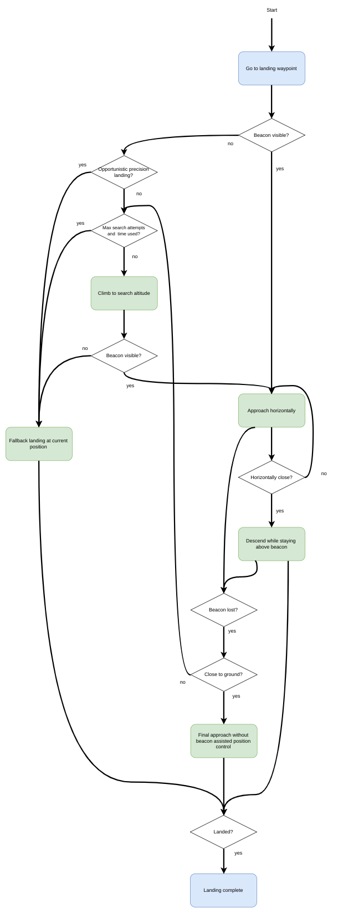

# 精准着陆

PX4 支持多旋翼精准着陆（从 PX4 1.7.4版本），这一功能使用 [IR-LOCK 传感器](https://irlock.com/products/ir-lock-sensor-precision-landing-kit)和 IR 信标（如 [ IR-LOCK MarkOne ](https://irlock.com/collections/markone) ）以及朝下的距离传感器。 这使飞行器能以约 10 cm 的精度着陆（相比之下，GPS 的精度可能达到几米）。

精准着陆可由切换至 *精准着陆* 飞行模式或作为 [任务](#mission) 的一部分来启动。

## 设置

### 硬件安装

按照官方指南安装 IR-LOCK 传感器。 确保传感器的 x 轴与飞行器的 y 轴对齐，并且传感器的 y 轴与飞行器的 x 方向对齐（如果摄像头从正面朝下倾斜 90 度，则会出现这种情况）。

安装 [范围/距离传感器](../getting_started/sensor_selection.md#distance)（已发现 * LidarLite v3 * 效果良好）。

:::note
Many infrared based range sensors do not perform well in the presence of the IR-LOCK beacon. Refer to the IR-LOCK guide for other compatible sensors.
:::

### 固件配置

Precision landing requires the modules `irlock` and `landing_target_estimator`, which are not included in the PX4 firmware by default. They can be included by adding (or uncommenting) the following lines in the relevant configuration file for your flight controller (e.g. [PX4-Autopilot/boards/px4/fmu-v5/default.cmake](https://github.com/PX4/PX4-Autopilot/blob/master/boards/px4/fmu-v5/default.cmake)):

    drivers/irlock
    modules/landing_target_estimator
    

The two modules should also be started on system boot. For instructions see: [customizing the system startup](../concept/system_startup.md#customizing-the-system-startup).

## 软件配置（参数）

Precision landing is configured with the `landing_target_estimator` and `navigator` parameters, which are found in the "Landing target estimator" and "Precision land" groups, respectively. The most important parameters are discussed below.

The parameter [LTEST_MODE](../advanced_config/parameter_reference.md#LTEST_MODE) determines if the beacon is assumed to be stationary or moving. If `LTEST_MODE` is set to moving (e.g. it is installed on a vehicle on which the multicopter is to land), beacon measurements are only used to generate position setpoints in the precision landing controller. If `LTEST_MODE` is set to stationary, the beacon measurements are also used by the vehicle position estimator (EKF2 or LPE).

The parameters [LTEST_SCALE_X](../advanced_config/parameter_reference.md#LTEST_SCALE_X) and [LTEST_SCALE_Y](../advanced_config/parameter_reference.md#LTEST_SCALE_Y) can be used to scale beacon measurements before they are used to estimate the beacon's position and velocity relative to the vehicle. Measurement scaling may be necessary due to lens distortions of the IR-LOCK sensor. Note that `LTEST_SCALE_X` and `LTEST_SCALE_Y` are considered in the sensor frame, not the vehicle frame.

To calibrate these scale parameters, set `LTEST_MODE` to moving, fly your multicopter above the beacon and perform forward-backward and left-right motions with the vehicle, while [logging](../dev_log/logging.md#configuration) `landing_target_pose` and `vehicle_local_position`. Then, compare `landing_target_pose.vx_rel` and `landing_target_pose.vy_rel` to `vehicle_local_position.vx` and `vehicle_local_position.vy`, respectively (both measurements are in NED frame). If the estimated beacon velocities are consistently smaller or larger than the vehicle velocities, adjust the scale parameters to compensate.

If you observe slow sideways oscillations of the vehicle while doing a precision landing with `LTEST_MODE` set to stationary, the beacon measurements are likely scaled too high and you should reduce the scale parameter in the relevant direction.

## 精准降落模式

A precision landing can be configured to either be "required" or "opportunistic". The choice of mode affects how a precision landing is performed.

### 必须的模式

In *Required Mode* the vehicle will search for a beacon if none is visible when landing is initiated. The vehicle will perform a precision landing if a beacon is located.

The search procedure consists of climbing to the search altitude ([PLD_SRCH_ALT](../advanced_config/parameter_reference.md#PLD_SRCH_ALT)). If the beacon is still not visible at the search altitude and after a search timeout ([PLD_SRCH_TOUT](../advanced_config/parameter_reference.md#PLD_SRCH_TOUT)), a normal landing is initiated at the current position.

### 随机的模式

In *Opportunistic Mode* the vehicle will use precision landing *if* (and only if) the beacon is visible when landing is initiated. If it is not visible the vehicle immediately performs a *normal* landing at the current position.

## 执行精准着陆

:::note
Due to a limitation in the current implementation of the position controller, precision landing is only possible with a valid global position.
:::

### 通过命令

Precision landing can be initiated through the command line interface with

    commander mode auto:precland
    

In this case, the precision landing is always considered "required".

### 在任务中

Precision landing can be initiated as part of a [mission](../flying/missions.md) using [MAV_CMD_NAV_LAND](https://mavlink.io/en/messages/common.html#MAV_CMD_NAV_LAND) with `param2` set appropriately:

- `param2` = 0: 正常着陆而不使用信标。
- ` param2 ` = 1：*随机的* 精准着陆。
- ` param2 ` = 2：*必需的* 精准着陆。

## 仿真

Precision landing with the IR-LOCK sensor and beacon can be simulated in [SITL Gazebo](../simulation/gazebo.md).

To start the simulation with the world that contains a IR-LOCK beacon and a vehicle with a range sensor and IR-LOCK camera, run:

    make px4_sitl gazebo_iris_irlock
    

You can change the location of the beacon either by moving it in the Gazebo GUI or by changing its location in the [Gazebo world](https://github.com/PX4/sitl_gazebo/blob/master/worlds/iris_irlock.world#L42).

## 工作原理

### 着陆目标估计器

The `landing_target_estimator` takes measurements from the `irlock` driver as well as the estimated terrain height to estimate the beacon's position relative to the vehicle.

The measurements in `irlock_report` contain the tangent of the angles from the image center to the beacon. In other words, the measurements are the x and y components of the vector pointing towards the beacon, where the z component has length "1". This means that scaling the measurement by the distance from the camera to the beacon results in the vector from the camera to the beacon. This relative position is then rotated into the north-aligned, level body frame using the vehicle's attitude estimate. Both x and y components of the relative position measurement are filtered in separate Kalman Filters, which act as simple low-pass filters that also produce a velocity estimate and allow for outlier rejection.

The `landing_target_estimator` publishes the estimated relative position and velocity whenever a new `irlock_report` is fused into the estimate. Nothing is published if the beacon is not seen or beacon measurements are rejected. The landing target estimate is published in the `landing_target_pose` uORB message.

### 改进的飞行器位置估计

If the beacon is specified to be stationary using the parameter `LTEST_MODE`, the vehicle's position/velocity estimate can be improved with the help of the beacon measurements. This is done by fusing the beacon's velocity as a measurement of the negative velocity of the vehicle.

### 精准着陆过程

The precision land procedure consists of three phases:

1. **水平接近：**飞行器在保持其当前高度的同时水平接近信标。 一旦信标相对于车辆的位置差异低于阈值（[ PLD_HACC_RAD ](../advanced_config/parameter_reference.md#PLD_HACC_RAD)），就进入下一阶段。 如果信标在此阶段丢失（不可见超过时长[ PLD_BTOUT ](../advanced_config/parameter_reference.md#PLD_BTOUT)），则启动搜索程序（在必须的精准降落模式）或飞行器正常着陆（在随机的精准降落模式）。

2. **信标上方降落：**飞行器下降，同时保持在信标中心上方。 如果信标在此阶段丢失（不可见超过时长` PLD_BTOUT `），则启动搜索程序（在必须的精准降落模式）或飞行器正常着陆（在随机的精准降落模式）。

3. **最终接近：**当飞行器接近地面（高度小于[ PLD_FAPPR_ALT ](../advanced_config/parameter_reference.md#PLD_FAPPR_ALT)）时，飞行器会下降，同时保持在信标中心上方。 如果信标在此阶段丢失，则会继续下降，与精准着陆的类型无关。

Search procedures are initiated in 1. and 2. a maximum of [PLD_MAX_SRCH](../advanced_config/parameter_reference.md#PLD_MAX_SRCH) times.

