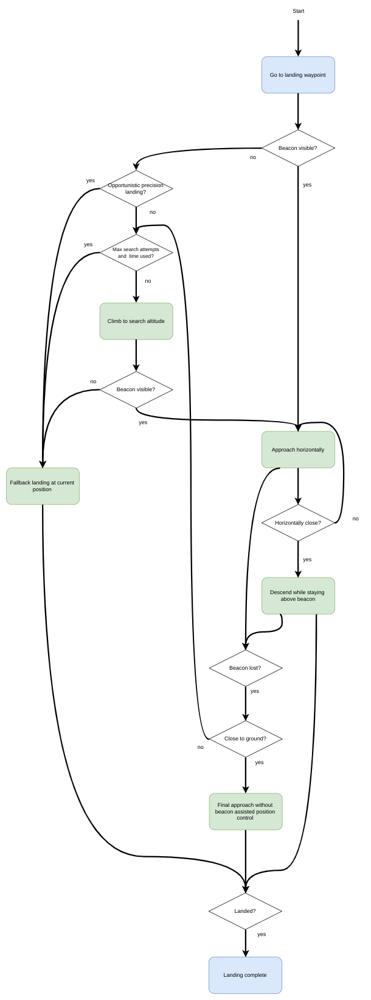

# 精准着陆

PX4 支持多旋翼精准着陆（从 PX4 1.7.4版本），这一功能使用 [IR-LOCK 传感器](https://irlock.com/products/ir-lock-sensor-precision-landing-kit)和 IR 信标（如 [ IR-LOCK MarkOne ](https://irlock.com/collections/markone) ）以及朝下的距离传感器。 这使飞行器能以约 10 cm 的精度着陆（相比之下，GPS 的精度可能达到几米）。

精准着陆可由切换至 *精准着陆* 飞行模式或作为 [任务](#mission) 的一部分来启动。

## 设置

### 硬件安装

按照官方指南安装 IR-LOCK 传感器。 确保传感器的 x 轴与飞行器的 y 轴对齐，并且传感器的 y 轴与飞行器的 x 方向对齐（如果摄像头从正面朝下倾斜 90 度，则会出现这种情况）。

安装 [范围/距离传感器](../getting_started/sensor_selection.md#distance)（已发现 * LidarLite v3 * 效果良好）。

> **Note**许多基于红外线的距离传感器在 IR-LOCK 信标存在的情况下表现不佳。 有关其他兼容传感器，请参阅 IR-LOCK 指南。

### 固件配置

精确着陆需要模块 ` irlock ` 和 ` landing_target_estimator ` ，默认情况下不包含在 PX4 固件中。 可以通过在飞行控制器的相关[配置](https://github.com/PX4/Firmware/blob/master/boards/px4/fmu-v5/default.cmake)，即 编译脚本 和 启动脚本 中添加（或取消注释）以下行来包含它们：

    drivers/irlock
    modules/landing_target_estimator
    

这两个模块也应该在系统启动时启动。 有关说明，请参阅：[自定义系统启动](https://dev.px4.io/master/en/concept/system_startup.html#customizing-the-system-startup)。

## 软件配置（参数）

使用` landing_target_estimator `和` navigator `参数配置精准着陆，你可以分别在“Landing target estimator”和“Precision land”组中找到这些参数。 最重要的参数将在下面讨论。

参数[ LTEST_MODE ](../advanced_config/parameter_reference.md#LTEST_MODE) 决定信标是被认为静止的还是移动的。 如果 <LT> LTEST_MODE </code>被设置为移动的（例如，它所安装得多旋翼飞行器将要在运动车辆上着陆），则信标测量仅用于在精准着陆控制器中产生位置设定点。 如果<LT> LTEST_MODE </code> 被设置为静止得，则飞行器位置估计器（EKF2 或 LPE）也使用信标测量结果。

参数[ LTEST_SCALE_X ](../advanced_config/parameter_reference.md#LTEST_SCALE_X) 和 [ LTEST_SCALE_Y ](../advanced_config/parameter_reference.md#LTEST_SCALE_Y) 可用于在估计信标相对于飞行器的位置和速度之前对信标测量结果进行缩放。 由于 IR-LOCK 传感器的镜头失真，可能需要进行测量缩放。 注意，在传感器坐标系中考虑` LTEST_SCALE_X `和` LTEST_SCALE_Y `，而不是飞行器坐标系。

要校准这些缩放参数，请将` LTEST_MODE `设置为移动模式（moving），操作多旋翼飞行器在信标上方飞行，并使飞行器前后和左右运动，同时[记录](https://dev.px4.io/master/en/log/logging.html#configuration) ` landing_target_pose `和` vehicle_local_position `的日志。 然后，将 ` landing_target_pose.vx_rel ` 和 ` landing_target_pose.vy_rel ` 分别与` vehicle_local_position.vx ` 和 ` vehicle_local_position.vy ` 进行比较（均在NED坐标系中测量）。 如果估计的信标速度始终小于或大于飞行器速度，则调整缩放参数以进行补偿。

如果在 <LT> LTEST_MODE </code> 设置为静止的情况下进行精准着陆时观察到飞行器缓慢侧向振荡，则信标测量可能会缩放得太高，您应该减小相关方向上的缩放参数。

## 精准降落模式

精确着陆可以配置为“必需的”或“随机的”。 模式的选择会影响精准着陆的执行方式。

### 必须的模式

在 *必须的模式* 中，如果在启动着陆时信标不可见，则飞行器将搜索信标。 如果找到信标，飞行器将执行精准着陆。

搜索过程包括爬到搜索高度（[ PLD_SRCH_ALT ](../advanced_config/parameter_reference.md#PLD_SRCH_ALT)）。 如果信标在搜索高度仍然不可见并且在搜索超时（[ PLD_SRCH_TOUT ](../advanced_config/parameter_reference.md#PLD_SRCH_TOUT)）之后，则在当前位置启动正常着陆。

### 随机的模式

在 *随机的模式* 中，*如果*（并且仅当）在启动着陆时信标可见，则飞行器将使用精准着陆<0>。 如果此时不可见，则飞行器立即在当前位置执行正常着陆。

## 执行精准着陆

> **Note**由于位置控制器的当前实施方式的限制，只有具有有效的全局位置时才能实现精准着陆。

### 通过命令

精准着陆可以通过命令行接口启动：

    commander mode auto:precland
    

在这种情况下，精准着陆始终被视为“必需的”。

### In a Mission

Precision landing can be initiated as part of a [mission](../flying/missions.md) using [MAV_CMD_NAV_LAND](https://mavlink.io/en/messages/common.html#MAV_CMD_NAV_LAND) with `param2` set appropriately:

- `param2` = 0: 正常着陆而不使用信标。
- ` param2 ` = 1：*随机的* 精准着陆。
- ` param2 ` = 2：*必需的* 精准着陆。

## 仿真

Precision landing with the IR-LOCK sensor and beacon can be simulated in [SITL Gazebo](https://dev.px4.io/master/en/simulation/gazebo.html).

To start the simulation with the world that contains a IR-LOCK beacon and a vehicle with a range sensor and IR-LOCK camera, run:

    make px4_sitl gazebo_iris_irlock
    

You can change the location of the beacon either by moving it in the Gazebo GUI or by changing its location in the [Gazebo world](https://github.com/PX4/sitl_gazebo/blob/master/worlds/iris_irlock.world#L42).

## 工作原理

### 着陆目标估计器

The `landing_target_estimator` takes measurements from the `irlock` driver as well as the estimated terrain height to estimate the beacon's position relative to the vehicle.

The measurements in `irlock_report` contain the tangent of the angles from the image center to the beacon. In other words, the measurements are the x and y components of the vector pointing towards the beacon, where the z component has length "1". This means that scaling the measurement by the distance from the camera to the beacon results in the vector from the camera to the beacon. This relative position is then rotated into the north-aligned, level body frame using the vehicle's attitude estimate. Both x and y components of the relative position measurement are filtered in separate Kalman Filters, which act as simple low-pass filters that also produce a velocity estimate and allow for outlier rejection.

The `landing_target_estimator` publishes the estimated relative position and velocity whenever a new `irlock_report` is fused into the estimate. Nothing is published if the beacon is not seen or beacon measurements are rejected. The landing target estimate is published in the `landing_target_pose` uORB message.

### 改进的飞行器位置估计

If the beacon is specified to be stationary using the parameter `LTEST_MODE`, the vehicle's position/velocity estimate can be improved with the help of the beacon measurements. This is done by fusing the beacon's velocity as a measurement of the negative velocity of the vehicle.

### 精准着陆过程

The precision land procedure consists of three phases:

1. **水平接近：**飞行器在保持其当前高度的同时水平接近信标。 一旦信标相对于车辆的位置差异低于阈值（[ PLD_HACC_RAD ](../advanced_config/parameter_reference.md#PLD_HACC_RAD)），就进入下一阶段。 如果信标在此阶段丢失（不可见超过时长[ PLD_BTOUT ](../advanced_config/parameter_reference.md#PLD_BTOUT)），则启动搜索程序（在必须的精准降落模式）或飞行器正常着陆（在随机的精准降落模式）。

2. **信标上方降落：**飞行器下降，同时保持在信标中心上方。 如果信标在此阶段丢失（不可见超过时长` PLD_BTOUT `），则启动搜索程序（在必须的精准降落模式）或飞行器正常着陆（在随机的精准降落模式）。

3. **最终接近：**当飞行器接近地面（高度小于[ PLD_FAPPR_ALT ](../advanced_config/parameter_reference.md#PLD_FAPPR_ALT)）时，飞行器会下降，同时保持在信标中心上方。 如果信标在此阶段丢失，则会继续下降，与精准着陆的类型无关。

Search procedures are initiated in 1. and 2. a maximum of [PLD_MAX_SRCH](../advanced_config/parameter_reference.md#PLD_MAX_SRCH) times.

