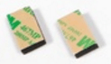

# 安装固定飞控

## 安装方向

基本上所有的飞控都会标示*指向箭头*（如下图所示）。 飞控应该顶部朝上安装在机架上，并使箭头指向与载具的前向一致（在所有的飞行器机架：固定翼、多旋翼、垂直起降、地面载具等上都是如此）。

:::note
If the controller cannot be mounted in the recommended/default orientation (e.g. due to physical constraints) you will need to configure the autopilot software with the orientation that you actually used: [Flight Controller Orientation](../config/flight_controller_orientation.md). 一部分型号的飞控板提供了内置的减振；另一些型号则提供了*减振泡沫*，垫在载具和飞控之间以起到减振作用。

## 振动隔离

Flight Control boards with in-built accelerometers or gyros are sensitive to vibrations. 一部分型号的飞控板提供了内置的减振；另一些型号则提供了*减振泡沫*，垫在载具和飞控之间以起到减振作用。

 减振泡沫

You should use the mounting strategy recommended in your flight controller documentation.

:::tip
[使用Flight Review进行日志分析 > 振动](../log/flight_review.md#vibration) 解释如何检测振动水平是否可以接受。如果遇到了问题，[振动隔离](../assembly/vibration_isolation.md)提供了一些可能的解决办法。 :::
