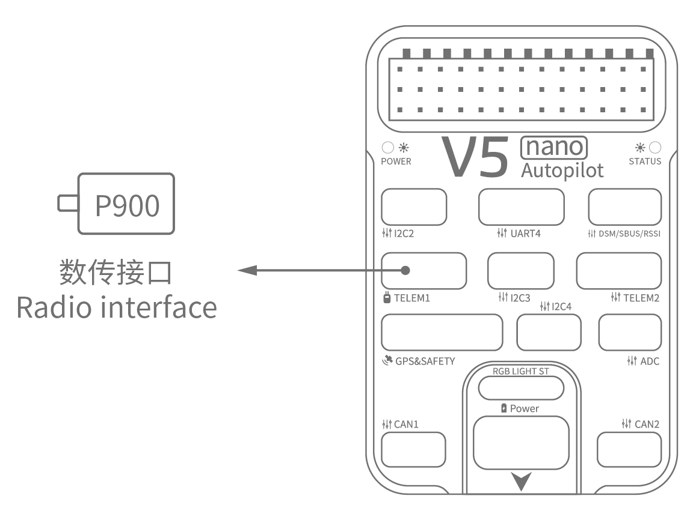

# CUAV V5 nano Wiring Quick Start

> **Warning** PX4 不生产这款且也不生产任何自动驾驶仪。 若需要硬件支持或咨询合规问题，请联系 [制造商](https://store.cuav.net/)。

This quick start guide shows how to power the [CUAV V5 nano](../flight_controller/cuav_v5_nano.md) flight controller and connect its most important peripherals.

## 接线图概述

下图展示了如何连接最重要的传感器和外围设备（电机和伺服舵机输出除外）。 我们将在下面各节中介绍它们的细节。

| 主要接口           | 功能                                                                                                               |
|:-------------- |:---------------------------------------------------------------------------------------------------------------- |
| 电源             | Connect Power module; Provides Power and ANALOG voltage and current measurements.                                |
| PM2            | [Do not use with PX4](../flight_controller/cuav_v5_nano.md#compatibility_pm2)                                    |
| TF CARD        | SD card for log storage (comes with card)                                                                        |
| M1~M8          | PWM输出接口 可以使用它控制电机或舵机。                                                                                            |
| A1~A3          | Capture pins (not *currently* supported on PX4).                                                                 |
| nARMED         | Indicates the FMU armed state. It is active low (low when armed).                                                |
| DSU7           | 用于FMU调试，读取调试信息。                                                                                                  |
| I2C2/I2C3/I2C4 | 连接I2C总线设备；比如外部指南针。                                                                                               |
| CAN1/CAN2      | 用于连接UAVCAN设备,比如CAN GPS。                                                                                          |
| TYPE-C(USB)    | Connect to a computer for communication between the flight controller and the computer, such as loading firmware |
| GPS&SAFETY     | 连接到Neo GPS，其中包括GPS、安全开关、蜂鸣器接口。                                                                                   |
| TELEM1/TELEM2  | 连接到数传电台                                                                                                          |
| DSM/SBUS/RSSI  | 包含DSM、SBUS、RSSI信号输入接口；DSM接口可以连接DSM卫星接收机，SBUS接口可以连接SBUS总线的遥控器接收机，RSSI连接RSSI信号强度回传模块。                              |

> **Note** For more interface information, please read [V5 nano Manual](http://manual.cuav.net/V5-nano.pdf).

> **Note** 如果无法以推荐/默认方向安装控制器（例如，由于空间限制），则需要以实际使用的方向配置自动驾驶仪参数：[飞控的安装方向](../advanced_features/rtk-gps.md)。

## GPS + 罗盘 + 安全开关 + LED

推荐的 GPS 模块是 *Neo v2 GPS *，其中包含GPS、指南针、安全开关、蜂窝、LED 状态灯。

> **Note** Other GPS modules may not work (see [this compatibility issue](../flight_controller/cuav_v5_nano.md#compatibility_gps)).

The GPS/Compass module should be mounted on the frame as far away from other electronics as possible, with the direction marker towards the front of the vehicle (Neo GPS arrow is in the same direction as the flight control arrow). 使用电缆连接到飞行控制器GPS接口。

> **Note**If you use CAN GPS, please use the cable to connect to the flight control CAN interface.

## 安全开关

The dedicated safety switch that comes with the V5+ is only required if you are not using the recommended *Neo v2 GPS* (which has an inbuilt safety switch).

If you are flying without the GPS you must attach the switch directly to the `GPS1` port in order to be able to arm the vehicle and fly (If you use the old 6-pin GPS, please read the definition of the bottom interface to change the line).

## 蜂鸣器

If you do not use the recommended *Neo v2 GPS* the buzzer may not work.

## 遥控器

如果您想要手动控制您的飞行器，需要使用遥控器 （PX4在自动飞行模式下可以不需要遥控器）。 您需要 选择一个兼容的发射/接收机并对频使它们能够通信 (对频方法参考发射/接收机的说明书)。

The figure below shows how you can access your remote receiver (please find the S.Bus cable in the kit)

## Spektrum 卫星接收器

The V5 nano has a dedicated DSM cable. If using a Spektrum satellite receiver, this should be connected to the flight controller `DSM/SBUS/RSSI` interface.

## 电源

The *v5 nano* kit includes the *HV\_PM* module, which supports 2~14S LiPo batteries. Connect the 6pin connector of the *HW\_PM* module to the flight control `Power` interface.

> **Warning** The supplied power module is unfused. Power **must** be turned off while connecting peripherals.

> **Note** The power module is not a power source for peripherals connected to the PWM outputs. If you're connecting servos/actuators you will need to separately power them using a BEC.

## Telemetry System (Optional)

数传系统允许您通过地面站对飞行器进行通信、监控和控制 (例如，您可以指定无人机飞行到指定位置或上传新的任务)。

The communication channel is via Telemetry Radios. The vehicle-based radio should be connected to the **TELEM1** or **TELEM2** port (if connected to these ports, no further configuration is required). 另一个数传模块连接到您的地面站电脑或移动设备 （通常通过USB连接）。

## SD 卡

An [SD card](../getting_started/px4_basic_concepts.md#sd_cards) is inserted in the factory (you do not need to do anything).

## 电机

Motors/servos are connected to the MAIN ports in the order specified for your vehicle in the [Airframes Reference](../airframes/airframe_reference.md).

## 针脚定义

## 更多信息

- [Airframe buildlog using CUAV v5 nano on a DJI FlameWheel450](../frames_multicopter/dji_f450_cuav_5nano.md)
- [CUAV V5 nano](../flight_controller/cuav_v5_nano.md)
- [V5 nano manual](http://manual.cuav.net/V5-nano.pdf) (CUAV)
- [FMUv5 reference design pinout](https://docs.google.com/spreadsheets/d/1-n0__BYDedQrc_2NHqBenG1DNepAgnHpSGglke-QQwY/edit#gid=912976165) (CUAV)
- [CUAV Github](https://github.com/cuav) (CUAV)