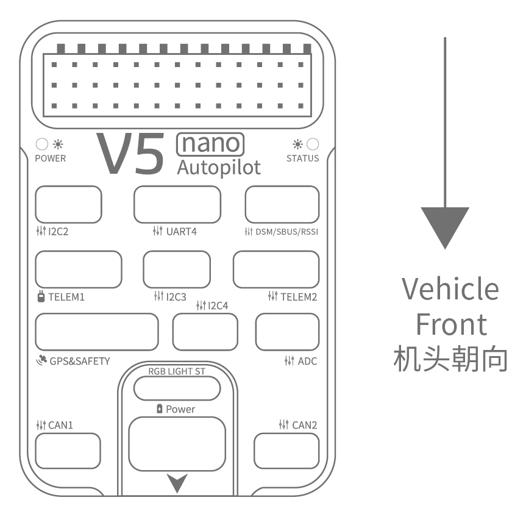

# 雷迅 V5 nano飞控接线快速入门

:::warning
PX4 does not manufacture this (or any) autopilot. Contact the [manufacturer](https://store.cuav.net/) for hardware support or compliance issues.
:::

本快速入门指南介绍了如何为 [CUAV V5 nano](../flight_controller/cuav_v5_nano.md) 飞控供电以及如何连接其最主要的外部设备。

## 接线图概述

下图展示了如何连接最重要的传感器和外围设备（电机和伺服舵机输出除外）。 我们将在下面各节中介绍它们的细节。

| 主要接口           | 功能                                                                                  |
|:-------------- |:----------------------------------------------------------------------------------- |
| 电源             | 连接电源模块；提供能量、模拟电压和电流测量。                                                              |
| PM2            | [不要与 PX4 一起使用 ](../flight_controller/cuav_v5_nano.md#compatibility_pm2)             |
| TF CARD        | 用于日志存储的SD卡（随卡提供）                                                                    |
| M1~M8          | PWM 输出接口。 可以使用它控制电机或舵机。                                                             |
| A1~A3          | 捕获引脚（目前 PX4 上不支持）                                                                   |
| nARMED         | 表示 FMU 处于待命状态。 低电平时表示激活（待命时是低电平）。                                                   |
| DSU7           | 用于 FMU 调试，读取调试信息。                                                                   |
| I2C2/I2C3/I2C4 | 连接I2C总线设备；比如外部的罗盘。                                                                  |
| CAN1/CAN2      | 用于连接 UAVCAN 设备，比如 CAN GPS。                                                          |
| TYPE-C(USB)    | 连接到计算机，以便在飞控和计算机之间进行通信，例如加载固件。                                                      |
| GPS&SAFETY     | 连接到 Neo GPS，其中包括GPS、安全开关、蜂鸣器接口。                                                     |
| TELEM1/TELEM2  | 连接到数传电台                                                                             |
| DSM/SBUS/RSSI  | 包含DSM、SBUS、RSSI信号输入接口；DSM接口可以连接DSM卫星接收机，SBUS接口可以连接SBUS总线的遥控器接收机，RSSI连接RSSI信号强度回传模块。 |

> **注意** ：获取更多的接口信息，请阅读 [V5 nano Manual](http://manual.cuav.net/V5-nano.pdf) 。

> **注意**如果控制器无法安装在推荐/默认方向（例如，由于空间限制），则需要使用实际使用的方向配置自动驾驶仪软件，请参考： [Flight Controller Orientation](../advanced_features/rtk-gps.md)。

## GPS + 罗盘 + 安全开关 + LED

推荐的 GPS 模块是 *Neo v2 GPS *，其中包含GPS、指南针、安全开关、蜂鸣器、LED 状态灯。

> **Note** 如果无法以推荐/默认方向安装控制器（例如，由于空间限制），则需要以实际使用的方向配置自动驾驶仪参数：[飞控的安装方向](../advanced_features/rtk-gps.md)。

GPS /罗盘模块应安装在机架上，尽可能远离其他电子设备，方向标记朝向机体前方（ Neo GPS 方向箭头与飞行控制箭头方向相同）。 使用电缆连接到飞控的 GPS 接口。

> **Note** 如果您使用 CAN 接口的 GPS，请将电缆连接到飞控的 CAN 接口。

## 安全开关

只有在不使用推荐的 *Neo V2 GPS*（带有内置安全开关）时，才需要V5+附带的专用安全开关。 

如果您在没有安装 GPS 的情况下飞行，则必须将安全开关直接连接到`GPS1`端口，以便能够启动无人机并飞行（如果您使用过去的 6 针 GPS，请阅读底部接口的定义以更改接线）。

## 蜂鸣器

如果不使用推荐的 *Neo v2 GPS*，蜂鸣器可能会不工作。

## 遥控器

如果您想要手动控制飞行器，则需要使用遥控器（PX4 在自动飞行模式下不需要遥控器）。 您需要选择一个飞控兼容的发射机和接收机并对频，使它们能够通信 (对频方法参考发射/接收机的说明书)。

下图显示了您如何访问远程接收机 (请在工具包中找到 SBUS 电缆)。

## Spektrum 卫星接收器

V5 nano 有专用 DSM 电缆。 如果使用 Spektrum 卫星接收器，应连接到飞控的 `DSM/SBUS/RSSI` 接口。

## 电源

v5 nano</em>套件包括了支持 2~14S 锂聚合物电池的 *HV\\u PM* 模块。 将 *HW\\u PM* 模块的6针连接器连接到飞控的`电源`接口。

> **警告** 提供的电源模块没有安装熔断器。 连接外围设备时**必须**关闭电源。

> **注意**电源模块不能作为连接到PWM输出的外围设备的电源。 如果您需要连接伺服电机/促动器，您需要使用 BEC 为它们分别提供电源。

## 数传系统（可选）

数传系统允许您通过地面站对飞行器进行通信、监控和控制 （例如，您可以让无人机飞行到指定位置或上传新的飞行任务）。

通信频道是通过数传无线电实现的。 机载的无线数传模块应连接到 **TELEM1** 或者 **TELEM2** 端口（如果连接到这些端口，则无需进一步配置）。 另一个数传模块连接到您的地面站电脑或移动设备 （通常通过 USB 连接）。

## SD 卡

出厂时已插入[SD卡](../getting_started/px4_basic_concepts.md#sd_cards)（无需执行任何操作）。

## 电机

电机和舵机按照 [机架参考列表](../airframes/airframe_reference.md) 中为您的飞机指定的顺序连接至 **MAIN** 端口。

## 针脚定义

## 更多信息

- [Airframe buildlog using CUAV v5 nano on a DJI FlameWheel450](../frames_multicopter/dji_f450_cuav_5nano.md)
- [CUAV V5 nano](../flight_controller/cuav_v5_nano.md)
- [V5 nano manual](http://manual.cuav.net/V5-nano.pdf) (CUAV)
- [FMUv5 reference design pinout](https://docs.google.com/spreadsheets/d/1-n0__BYDedQrc_2NHqBenG1DNepAgnHpSGglke-QQwY/edit#gid=912976165) (CUAV)
- [CUAV Github](https://github.com/cuav) (CUAV)