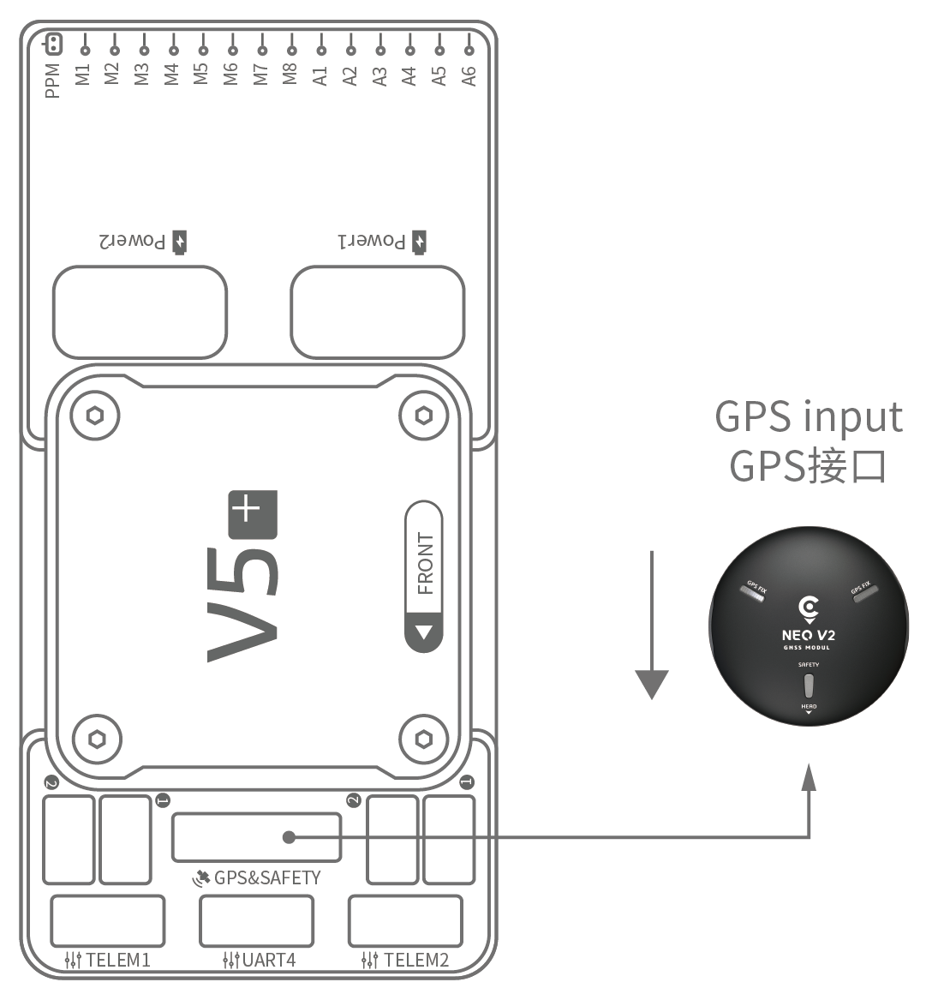

# CUAV V5+ 快速接线指南

:::warning PX4 does not manufacture this (or any) autopilot. Contact the [manufacturer](https://store.cuav.net/) for hardware support or compliance issues.
:::

This quick start guide shows how to power the [CUAV V5+](../flight_controller/cuav_v5_plus.md) flight controller and connect its most important peripherals.

## 接线图概述

The image below shows how to connect the most important sensors and peripherals (except the motor and servo outputs). We'll go through each of these in detail in the following sections.

| 主要接口          | 功能                                                                                               |
|:------------- |:------------------------------------------------------------------------------------------------ |
| Power1        | 连接到电源模块（电流计）。 Power input with *analog* voltage and current detection. 请不要连接数字电源模块（比如UAVCAN电流计）！ |
| Power2        | 连接I2C总线的智能电池                                                                                     |
| TF CARD       | 用于日志存储的SD卡（出厂时SD已经装配好）。                                                                          |
| M1~M8         | PWM输出接口 可以使用它控制电机或舵机。                                                                            |
| A1~A6         | PWM 输出接口。 可以使用它控制电机或舵机。                                                                          |
| DSU7          | 用于FMU调试，读取调试信息。                                                                                  |
| I2C1/I2C2     | 连接I2C总线设备；比如外部指南针。                                                                               |
| CAN1/CAN2     | 用于连接UAVCAN设备,比如CAN GPS。                                                                          |
| TYPE-C(USB)   | 用于连接计算机，建立飞行控制器和计算机之间的通信；比如刷写固件。                                                                 |
| SBUS OUT      | 连接SBUS总线控制的相机和云台                                                                                 |
| GPS&SAFETY    | 连接到Neo GPS，其中包括GPS、安全开关、蜂鸣器接口。                                                                   |
| TELEM1/TELEM2 | 连接到数传电台                                                                                          |
| DSM/SBUS/RSSI | 包含DSM、SBUS、RSSI信号输入接口；DSM接口可以连接DSM卫星接收机，SBUS接口可以连接SBUS总线的遥控器接收机，RSSI连接RSSI信号强度回传模块。              |

:::note
For more interface information, please read [V5+ Manual](http://manual.cuav.net/V5-Plus.pdf).
:::

:::note
If the controller cannot be mounted in the recommended/default orientation (e.g. due to space constraints) you will need to configure the autopilot software with the orientation that you actually used: [Flight Controller Orientation](../advanced_features/rtk-gps.md).
:::

## GPS + 罗盘 + 安全开关 + LED

The recommended GPS module is the *Neo v2 GPS*, which contains GPS, compass, safety switch, buzzer, LED status light.

:::note
Other GPS modules may not work (see [this compatibility issue](../flight_controller/cuav_v5_nano.md#compatibility_gps)\)).
:::

The GPS/Compass module should be [mounted on the frame](../assembly/mount_gps_compass.md) as far away from other electronics as possible, with the direction marker towards the front of the vehicle (*Neo v2 GPS* arrow is in the same direction as the flight control arrow). Connect to the flight control GPS interface using a cable.

:::note
If you use the [NEO V2 PRO GNSS (CAN GPS)](http://doc.cuav.net/gps/neo-series-gnss/en/neo-v2-pro.html), please use the cable to connect to the flight control CAN interface.
:::

## 安全开关

The dedicated safety switch that comes with the V5+ is only required if you are not using the recommended *Neo V2 GPS* (which has an inbuilt safety switch).

If you are flying without the GPS you must attach the switch directly to the `GPS1` port in order to be able to arm the vehicle and fly (if you use the old 6-pin GPS, please read the definition of the bottom interface to change the line).

## 蜂鸣器

If you do not use the recommended GPS, the buzzer may not work.

## 遥控器

A remote control (RC) radio system is required if you want to manually control your vehicle (PX4 does not require a radio system for autonomous flight modes). You will need to select a compatible transmitter/receiver and then bind them so that they communicate (read the instructions that come with your specific transmitter/receiver).

The figure below shows how you can access your remote receiver (please find the SBUS cable in the kit).

## Spektrum 卫星接收器

The V5+ has a dedicated DSM cable. If using a Spektrum satellite receiver, this should be connected to the flight controller DSM/SBUS/RSSI interface.

## 电源

The V5+ kit includes the *HV\_PM* module, which supports 2~14S LiPo batteries. Connect the 6pin connector of the *HW\_PM* module to the flight control `Power1` interface.

:::warning
The supplied power module is unfused. Power **must** be turned off while connecting peripherals.
:::

:::note
The power module is not a power source for peripherals connected to the PWM outputs.
If you're connecting servos/actuators you will need to separately power them using a BEC.
:::

## Telemetry System (Optional)

A telemetry system allows you to communicate with, monitor, and control a vehicle in flight from a ground station (for example, you can direct the UAV to a particular position, or upload a new mission).

The communication channel is via Telemetry Radios. The vehicle-based radio should be connected to either the `TELEM1` or `TELEM2` port (if connected to these ports, no further configuration is required). The other radio is connected to your ground station computer or mobile device (usually via USB).

## SD 卡

An [SD card](../getting_started/px4_basic_concepts.md#sd-cards-removable-memory) is inserted in the factory (you do not need to do anything).

## 电机

Motors/servos are connected to the MAIN and AUX ports in the order specified for your vehicle in the [Airframes Reference](../airframes/airframe_reference.md).

## 针脚定义

Download **V5+** pinouts from [here](http://manual.cuav.net/V5-Plus.pdf).

## 更多信息

- [Airframe build-log using CUAV v5+ on a DJI FlameWheel450](../frames_multicopter/dji_f450_cuav_5plus.md)
- [CUAV V5+ Manual](http://manual.cuav.net/V5-Plus.pdf)  (CUAV)
- [CUAV V5+ docs](http://doc.cuav.net/flight-controller/v5-autopilot/en/v5+.html) (CUAV)
- [FMUv5 reference design pinout](https://docs.google.com/spreadsheets/d/1-n0__BYDedQrc_2NHqBenG1DNepAgnHpSGglke-QQwY/edit#gid=912976165)  (CUAV)
- [CUAV Github](https://github.com/cuav)  (CUAV)
- [Base board design reference](https://github.com/cuav/hardware/tree/master/V5_Autopilot/V5%2B/V5%2BBASE) (CUAV)
